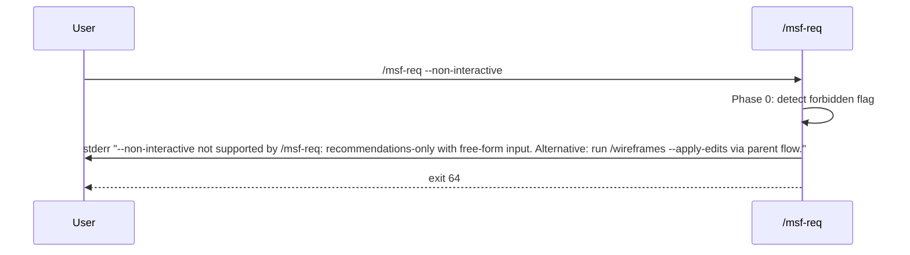

# Non-Interactive Mode for pmos-toolkit Skills — Spec

**Date:** 2026-05-08
**Status:** Ready for Plan
**Tier:** 3 — Feature
**Requirements:** `docs/pmos/features/2026-05-08_non-interactive-mode/01_requirements.md`

---

## 1. Problem Statement

Every pmos-toolkit skill pauses at multiple `AskUserQuestion` checkpoints during a run — ~188 across 23 skills. Users running skills unattended (CI, pipelines, parent-skill orchestration, repeat tasks) cannot do so today, and the platform-adaptation fallback that handles non-Claude environments silently assumes defaults with no audit trail. A cross-cutting `--non-interactive` flag must let skills make best-guess decisions when confidence is high, defer everything else to a structured Open Questions block, and never silently auto-apply destructive operations.

**Primary success metric:** every one of the 23 skills either runs end-to-end with zero `AskUserQuestion` calls firing under `--non-interactive` and surfaces deferred decisions in a machine-parseable `## Open Questions (Non-Interactive Run)` block, OR explicitly refuses the flag via the documented refusal marker (FR-07). At least one skill (`/msf-req`, by current design) is expected to refuse; others may refuse if their authors document a structural reason.

---

## 2. Goals

| # | Goal | Success Metric |
|---|---|---|
| G1 | Cross-skill flag coverage | 23/23 skills are either declared "supported" (zero `AskUserQuestion` events under `--non-interactive`) or "refused" (refusal marker per FR-07 + exit 64). Zero "silently partial" skills. Verified by per-skill bats integration test (FR-02) for supported skills + audit-script exemption check for refused skills. |
| G2 | Deferred decisions are auditable | Every artifact produced under `--non-interactive` contains a `## Open Questions (Non-Interactive Run)` block whose entry count equals frontmatter `**Open Questions:** N`. Verified by FR-03. |
| G3 | Destructive ops never silent | Zero data-loss incidents in 30 days post-launch; every destructive checkpoint has a `<!-- defer-only: destructive -->` adjacent tag. Verified by FR-04 + audit script. |
| G4 | Mode resolution is deterministic | Resolver returns correct `(mode, source)` for all 9 precedence/conflict cases (FR-01). |
| G5 | Pre-flight Recommended-marker audit gates the release | `tools/audit-recommended.sh` exits 0 across all 23 skills before merge; CI workflow blocks PRs that regress markers. Verified by FR-05 + NFR-03. |
| G6 | Subagent propagation is explicit | A parent skill running `--non-interactive` propagates the mode to dispatched child skills via the `[mode: non-interactive]` prompt-prefix marker (FR-06). |
| G7 | Three-state exit contract | Skills exit `0` clean / `2` deferred / `1` runtime error / `64` usage error; downstream callers (CI, parent skills) can branch on the code (NFR-02). |

---

## 3. Non-Goals

- **NOT a YOLO / auto-approve-everything mode** — destructive checkpoints always defer; no `--yes-destructive` tier in v1. Because: silent destructive ops are the canonical failure mode (Aider `#3903`, Cursor YOLO bypass research) and our toolkit's artifacts are shared-team-state.
- **NOT a per-checkpoint allowlist or category tiering** (Cline-model). Single binary flag. Because: the `(Recommended)` convention already encodes per-call confidence uniformly.
- **NOT auto-detect non-TTY** (Cline `-y` model). Explicit activation only. Because: subagent-dispatched runs can have an interactive parent, and silent mode-flips are a known footgun.
- **NOT modifying skills that explicitly forbid the flag** beyond emitting a refusal error. Because: per-skill design constraints (`/msf-req` is recommendations-only with free-form input) cannot be honored partially without producing worse output than refusal.
- **NOT a strict variant** (`--strict`: error-on-uncertainty, gh-CLI model) in v1. Documented as future work in §15. Because: no real CI consumer has requested it yet; defer until demand.
- **NOT telemetry of auto-pick / defer rates** in v1. Documented as future work. Because: the toolkit has no telemetry plumbing today; introducing it is its own design problem.
- **NOT changing the existing prose-style frontmatter convention** (`**Date:**`, `**Status:**`, etc.) to YAML. New fields are added in the same prose style. Because: consistency with the 23 existing skills outweighs the marginal machine-parseability gain.
- **NOT supporting an environment variable** (e.g., `PMOS_NON_INTERACTIVE=1`). Activation is flag + `.pmos/settings.yaml` only. Because: settings.yaml is the durable repo-level config, env vars add a third precedence rung that complicates the resolver, and CI users can pass the flag via a wrapper script with no loss of expressiveness.

---

## 4. Decision Log

| # | Decision | Options Considered | Rationale |
|---|---|---|---|
| D1 | Confidence signal is the existing `(Recommended)` option label suffix | (a) New per-skill scoring rule, (b) Uniform heuristic, (c) Reuse `(Recommended)` convention | (c): every skill already uses this convention; piggybacking avoids inventing a parallel signal that would drift. Code recon confirmed it is pure convention with no schema enforcement — the audit script makes it auditable. |
| D2 | Resolver lives in a new `_shared/non-interactive.md`, inlined per pipeline skill via `<!-- non-interactive-block:start -->` markers | (a) New _shared file inlined, (b) Section E in pipeline-setup.md, (c) Per-skill ad-hoc inline | (a): mirrors the proven `pipeline-setup.md` Section 0 pattern; lint script enforces drift. Section E (b) bloats the setup doc and conflates separate concerns. Per-skill (c) drifts immediately. Architect role. |
| D3 | Subagent propagation via `[mode: non-interactive]` prompt-prefix marker + explicit prose in the dispatch | (a) Prompt-prefix marker, (b) Natural-language argument, (c) Shared scratch file | (a) is the most robust given subagent prompts are free-form text; child's Phase 0 scans for the marker before checking flags/settings. NL-arg (b) depends on LLM faithfulness. Scratch file (c) adds stateful side-channel and cleanup burden. Architect role. |
| D4 | Audit trail is buffered in-memory; flushed to artifact at end-of-skill | (a) In-memory buffer, (b) Sidecar log file, (c) Inline as you go | (a) is atomic and simple; partial buffer can be flushed on skill error per a new `flush_on_exit` pattern. (b) adds I/O and a new directory convention. (c) couples write order to checkpoint order. Architect role. |
| D5 | Downstream skills parse a prior artifact's Open Questions via a shared awk/grep snippet inlined in their Phase 1 | (a) Yes — define parser, (b) No — humans-only handoff, (c) Yes — defer parser to v2 | (a): makes the pipeline-handoff value real. The parser is ~5 lines, lives in `_shared/non-interactive.md`. Architect role. |
| D6 | Frontmatter additions stay prose-style (`**Mode:** non-interactive`, `**Run Outcome:** deferred`, `**Open Questions:** N`) | (a) New fields YAML, prose preserved, (b) Convert all to YAML, (c) Prose-only for new fields | (c): consistency with 23 existing skills outweighs YAML's machine-parseability. Audit script greps prose lines. Designer role. |
| D7 | Open Questions block uses fenced YAML blocks per question (one block per OQ entry) under `## Open Questions (Non-Interactive Run)` | (a) Fenced YAML, (b) Markdown table, (c) Numbered prose | (a): table breaks on multi-line context; YAML round-trips through `yq`; downstream parser is trivial. Designer role. |
| D8 | Open Questions (Non-Interactive Run) is a SEPARATE section, appended after any existing `## Open Questions` section | (a) Separate, (b) Merged with source-tag, (c) Replace existing | (a): "I auto-deferred" and "I asked the human and they said TBD" are different semantics. Separation aids review and parsing. Replace (c) is data-loss. Designer role. |
| D9 | Severity tags reason-derived: `[Blocker]` (destructive defer), `[Should-fix]` (free-form / no-Recommended defer), `[Auto]` (auto-picked, informational) | (a) Reason-derived tags, (b) No tags, (c) Optional opt-in | (a): reviewer can scan for blockers first; mirrors /spec's Phase 6 finding-severity convention. Designer role. |
| D10 | New runtime-status field is `**Run Outcome:**` (clean / deferred / error) — distinct from existing `**Status:**` (doc lifecycle: Draft / Approved / Ready for Plan) | (a) `**Run Outcome:**`, (b) `**Mode Status:**`, (c) Compound the existing Status | (a): "outcome" connotes runtime; "status" stays doc lifecycle. Two-axis cleanly separated. DevOps role. |
| D11 | Big-bang release: all 23 skills + audit script + `_shared/non-interactive.md` + parser snippet + bats tests ship in one batched PR set | (a) Phased rollout, (b) Big-bang, (c) Demand-driven | (b) per user explicit pick (non-recommended at the time). Trade-off: shorter rollout window, no partial-coverage UX confusion, but a single batched merge with high blast radius. Mitigation: audit script is a hard gate — any skill failing audit blocks the release. Soft-warn fallback (D12) covers intermediate dev branches. DevOps role. |
| D12 | Pre-rollout BC: skill without inlined non-interactive block + `--non-interactive` arg → soft warn on stderr + interactive fallback | (a) Soft warn + fallback, (b) Hard error (exit 64), (c) Best-effort silent | (a): humane during dev; fades after big-bang ship. Hard error (b) is too strict for transient dev states. Silent (c) IS the partial-coverage failure we're avoiding. DevOps role. |
| D13 | Conflicting flags (`--interactive --non-interactive` on same call): last-flag-wins (cobra/argparse convention); resolver announces resolved mode on stderr | (a) Last-wins, (b) Error, (c) First-wins | (a) per industry research (Terraform, gh, Aider all do this). Resolver always announces `mode: <m> (source: <s>)` on stderr — improves on gh's silent default. Architect role implicit. (Requirements doc said "error"; this spec overrides — narrower contract creates worse UX during interactive flag-fiddling.) |
| D14 | `tools/audit-recommended.sh` is a bash + awk script mirroring `tools/lint-pipeline-setup-inline.sh`; exit codes 0/1/2 | (a) Bash + awk, (b) Per-skill --selftest, (c) Manual checklist | (a): proven pattern in repo; CI-runnable; gates PRs. DevOps role. |
| D15 | Refusal pattern (for skills that forbid the flag): exact stderr regex `^--non-interactive not supported by /<skill>: <reason>\\. <alternative>` + exit 64 | (a) Defined refusal regex, (b) Free-form per skill, (c) Silent fallback | (a): the requirements doc asserted such a pattern existed (it didn't — code recon flagged this); we define it here. Stable regex enables bats assertions and CI gating. Senior-Analyst gap. |
| D16 | Non-MD primary artifact skills (`/diagram` SVG, `/backlog` items, etc.) write Open Questions to a sidecar `<artifact>.open-questions.md`; chat-only skills (`/mac-health`) emit to stderr at end-of-run | n/a (resolves OQ3 from requirements) | Pragmatic: keeps the format uniform (markdown + fenced YAML) regardless of primary artifact type. Resolves requirements doc OQ3. |

---

## 5. User Personas & Journeys

### 5.1 Power User (primary)

Runs multi-skill pipelines daily (`/requirements → /spec → /plan`); wants the pipeline to flow without per-step gating; tolerates reading an Open Questions block at the end. Sets `default_mode: non-interactive` in `.pmos/settings.yaml` after a few sessions.

### 5.2 CI / Scripted Invoker (primary)

Wires pmos-toolkit into automated workflows (nightly artifact regeneration, post-PR doc updates). Cares about exit codes (0/2/1/64), structured frontmatter (`**Run Outcome:**`), and machine-parseable Open Questions (fenced YAML).

### 5.3 Parent Skill / Subagent Orchestrator

Dispatches a child skill via Claude Code's Task tool or by inlining the skill body. Must propagate mode explicitly via the `[mode: non-interactive]` prompt prefix.

### 5.4 User Journey: power user runs `/requirements --non-interactive`

```mermaid
sequenceDiagram
    participant U as User
    participant S as /requirements skill
    participant R as Resolver
    participant B as OQ Buffer
    participant A as Artifact

    U->>S: /requirements --non-interactive "Build X"
    S->>R: resolve_mode(flag=non-interactive, settings=null, default=interactive)
    R-->>S: (non-interactive, source=flag)
    S->>U: stderr "mode: non-interactive (source: flag)"
    loop each AskUserQuestion call
        S->>S: inspect call shape
        alt has Recommended option AND not destructive
            S->>B: append [Auto] entry
            S->>S: pick Recommended; continue
        else free-form, no-Recommended, OR destructive
            S->>B: append [Blocker]/[Should-fix] entry
            S->>S: pick safe no-op; continue
        end
    end
    S->>A: write 01_requirements.md
    S->>A: append ## Open Questions (Non-Interactive Run) from B
    S->>A: set frontmatter Run Outcome / Open Questions / Mode
    S->>U: exit 0 if B empty of non-Auto entries; 2 if any defer
```

### 5.5 User Journey: parent /execute dispatches child /verify

```mermaid
sequenceDiagram
    participant U as User
    participant E as /execute
    participant V as /verify (subagent)
    participant R as Resolver

    U->>E: /execute --non-interactive
    E->>R: resolve_mode → non-interactive
    Note over E: Phase complete; dispatch /verify
    E->>V: prompt with prefix "[mode: non-interactive]\nVerify phase N"
    V->>V: Phase 0: scan prompt for [mode: ...] marker
    V->>R: resolve_mode(flag=null, settings=null, parent-marker=non-interactive)
    R-->>V: (non-interactive, source=parent-skill-prompt)
    V->>U: stderr "mode: non-interactive (source: parent-skill-prompt)"
    Note over V: runs all phases; merges OQ into parent's buffer
    V-->>E: artifact + OQ entries
    E->>E: merge child OQ into own OQ block
```

### 5.6 Error Journey: refusal



---

## 6. System Design

### 6.1 Architecture Overview

```
┌────────────────────────────────────────────────────────────────────────┐
│  pmos-toolkit skill harness (Claude Code / Codex / Gemini)             │
│                                                                        │
│  ┌──────────────────────────────────────────────────────────────────┐  │
│  │  SKILL.md (e.g. /requirements)                                   │  │
│  │                                                                  │  │
│  │  Phase 0:  <!-- pipeline-setup-block --> (existing, unchanged)   │  │
│  │            <!-- non-interactive-block --> (NEW)                  │──┼──► reads .pmos/settings.yaml
│  │              ↓                                                   │  │
│  │            mode resolver: (flag, settings, parent-marker)        │  │
│  │            → (mode, source)                                      │  │
│  │              ↓                                                   │  │
│  │            announce mode on stderr                               │  │
│  │                                                                  │  │
│  │  Phase 1..N: each AskUserQuestion call wrapped:                  │  │
│  │    if mode == non-interactive:                                   │  │
│  │      classify(call) → auto-pick | defer                          │──┼──► append to in-memory OQ buffer
│  │    else:                                                         │  │
│  │      fire AskUserQuestion as usual                               │  │
│  │                                                                  │  │
│  │  Final phase: write artifact                                     │──┼──► append ## Open Questions block
│  │              set frontmatter (Mode / Run Outcome / Open Q's)     │  │   (or sidecar .open-questions.md)
│  │              exit 0|2|1|64                                       │  │
│  └──────────────────────────────────────────────────────────────────┘  │
│                                                                        │
│  Subagent dispatch (parent → child):                                   │
│    parent prepends "[mode: non-interactive]\n" to child prompt         │
│    child Phase 0 scans for marker before checking flag/settings        │
└────────────────────────────────────────────────────────────────────────┘

┌────────────────────────────────────────────────────────────────────────┐
│  Shared assets (NEW — under plugins/pmos-toolkit/)                     │
│                                                                        │
│  skills/_shared/non-interactive.md    ◄── canonical inlined block      │
│    Section 0:  resolver + classifier + buffer + flush  (verbatim       │
│                copy-paste into each skill's Phase 0; lint-enforced)    │
│    Section A:  refusal regex + exit-64 contract                        │
│    Section B:  parser snippet (downstream skills inline this)          │
│    Section C:  subagent propagation prefix recipe                      │
│                                                                        │
│  tools/audit-recommended.sh           ◄── bash + awk; CI-gated         │
│    asserts every AskUserQuestion call in supported SKILL.md files      │
│    has a (Recommended) marker OR an adjacent <!-- defer-only: ... -->  │
│    exit 0 (clean) / 1 (drift) / 2 (invocation error)                   │
│                                                                        │
│  tools/lint-non-interactive-inline.sh ◄── mirrors lint-pipeline-       │
│    setup-inline.sh; ensures every supported skill has a verbatim       │
│    non-interactive-block matching _shared/non-interactive.md           │
└────────────────────────────────────────────────────────────────────────┘
```

### 6.2 Sequence diagrams

See §5.4 (happy path), §5.5 (subagent propagation), §5.6 (refusal). Additional sequence diagrams below.

#### 6.2.1 Audit script gating a release

```mermaid
sequenceDiagram
    participant Dev as Developer
    participant PR as PR
    participant CI as CI Workflow
    participant A as audit-recommended.sh
    participant L as lint-non-interactive-inline.sh

    Dev->>PR: push branch touching SKILL.md
    PR->>CI: trigger audit-recommended workflow
    CI->>A: run on changed skills
    A->>A: extract AskUserQuestion calls (awk)
    A->>A: assert each has (Recommended) OR <!-- defer-only: ... -->
    alt all pass
        A-->>CI: exit 0
        CI->>L: run lint-non-interactive-inline.sh
        L-->>CI: exit 0
        CI-->>PR: ✓ checks passed
    else any fail
        A-->>CI: exit 1 + stderr report
        CI-->>PR: ✗ checks failed; PR blocked
    end
```

#### 6.2.2 Pre-rollout BC (soft warn + fallback)

```mermaid
sequenceDiagram
    participant U as User
    participant S as skill (pre-rollout)
    U->>S: /skill --non-interactive
    S->>S: Phase 0 detects --non-interactive arg
    S->>S: scan for <!-- non-interactive-block --> marker in own SKILL.md
    alt marker absent (skill not yet rolled out)
        S->>U: stderr "WARNING: --non-interactive not yet supported by /<skill>; falling back to interactive"
        S->>S: continue in interactive mode
        S-->>U: exit 0 if otherwise clean
    else marker present
        S->>S: proceed normally (resolver + classifier)
    end
```

---

## 7. Functional Requirements

### 7.1 Mode Resolution

| ID | Requirement |
|---|---|
| FR-01 | Resolver `resolve_mode(cli_flag, settings_value, parent_marker, default="interactive") -> (mode, source)` returns the highest-precedence value in order: cli_flag > parent_marker > settings_value > default. |
| FR-01.1 | Conflicting flags on the same invocation (`--interactive --non-interactive`): last-flag-wins per cobra/argparse convention; no error. |
| FR-01.2 | Resolver announces the resolved mode on stderr at skill start: `mode: <mode> (source: <source>)`. Always emitted, all modes. |
| FR-01.3 | Unknown values for `default_mode` in settings.yaml (anything other than `interactive` / `non-interactive`): treated as missing; resolver falls through to default with stderr warning `settings: invalid default_mode value '<v>'; ignoring`. |
| FR-01.4 | The `--interactive` flag forces interactive mode regardless of settings; symmetric to `--non-interactive`. |
| FR-01.5 | If `.pmos/settings.yaml` is present but malformed (not parseable as YAML, missing required `version` key): refuse to start; exit 64; stderr `settings.yaml malformed; fix and re-run`. Foundational state must be valid before any skill proceeds. |

### 7.2 Per-Checkpoint Behavior

| ID | Requirement |
|---|---|
| FR-02 | Under `--non-interactive`, supported skills emit zero `AskUserQuestion` events. Verified per-skill. |
| FR-02.1 | Each `AskUserQuestion` call is classified at runtime by inspecting (a) the presence of any option label ending in `(Recommended)`, (b) the presence of a `<!-- defer-only: <reason> -->` HTML comment as the literal previous non-empty line of the SKILL.md source (no blank-line gap allowed; see FR-02.5), (c) whether the call is multiSelect or has zero options. |
| FR-02.2 | Classification rules (in order): if `<!-- defer-only: ... -->` is adjacent (per FR-02.5) → DEFER; else if call is multiSelect with 0 Recommended options → DEFER; else if call has 0 options OR no option ends in `(Recommended)` → DEFER; else → AUTO-PICK the Recommended option. |
| FR-02.3 | A defer-only checkpoint with a Recommended option still defers (reason tag wins over Recommended). |
| FR-02.4 | An auto-picked checkpoint logs an `[Auto]` entry to the OQ buffer; a deferred checkpoint logs `[Blocker]` (reason=destructive) or `[Should-fix]` (reason=free-form / no-recommended / ambiguous-multiselect). |
| FR-02.5 | **Adjacency rule (strict):** the `<!-- defer-only: ... -->` tag is "adjacent" to an `AskUserQuestion` call iff it is the literal **previous non-empty line** in the SKILL.md source (whitespace-only blank lines between tag and call are NOT permitted; the tag must be on line N-1 if the call begins on line N OR the tag is the previous source line ignoring comment-only whitespace, whichever is implementation-simpler — defer to the awk extractor below). |
| FR-02.6 | The runtime classifier and `audit-recommended.sh` MUST extract `AskUserQuestion` call sites and adjacent `defer-only` tags using the **same awk-based extractor**, defined once in `_shared/non-interactive.md` Section A. Both classifier and audit invoke it; drift between runtime and audit is therefore impossible by construction. |

### 7.3 Audit Trail (Open Questions Buffer)

| ID | Requirement |
|---|---|
| FR-03 | Skills maintain an in-memory append-only OQ buffer for the duration of the run; entries are appended at each `AskUserQuestion` interception. |
| FR-03.1 | At end-of-skill (or on caught error before exit), the buffer is flushed to the artifact's `## Open Questions (Non-Interactive Run)` section as fenced YAML blocks per the schema in §11.2. |
| FR-03.2 | If the skill's primary artifact is non-markdown (`/diagram` SVG, `/backlog` item, etc.), the buffer is flushed to a sidecar `<artifact>.open-questions.md` next to the primary artifact. |
| FR-03.3 | If the skill has no persistent artifact (`/mac-health`), the buffer is emitted to stderr at end-of-run as a single block prefixed with `--- OPEN QUESTIONS ---`. |
| FR-03.4 | Frontmatter is updated to include `**Mode:** non-interactive`, `**Run Outcome:** clean | deferred | error`, `**Open Questions:** N` where **N counts only deferred entries (severity `[Blocker]` + `[Should-fix]`); `[Auto]` entries are excluded** per D9. The OQ block heading also surfaces totals: `## Open Questions (Non-Interactive Run) — N deferred, M auto-picked`. |
| FR-03.5 | **Multi-artifact skills** (skills that produce more than one persisted artifact in a run, e.g., `/wireframes`, `/prototype`): write a single dedicated `_open_questions.md` aggregator at the artifact directory root (e.g., `<feature_folder>/wireframes/_open_questions.md`) containing the full OQ block. The skill declares one of its artifacts as the "primary" — that primary artifact gets the frontmatter additions (`**Mode:**`, `**Run Outcome:**`, `**Open Questions:**`) pointing at the aggregator (e.g., `**Open Questions:** 3 — see _open_questions.md`). Non-primary artifacts get no frontmatter additions. |
| FR-03.6 | **OQ id stability across re-runs:** ids are NOT stable across re-runs of the same skill on the same artifact. Each run generates a fresh `OQ-001..NNN` sequence. Reviewers track resolution by `prompt` + `context_anchor`, not by id. The schema in §11.2 documents this explicitly. |

### 7.4 Destructive Operations

| ID | Requirement |
|---|---|
| FR-04 | Every existing checkpoint that gates a destructive op (overwrite, restart-from-scratch, downstream-drift continuation, snapshot rollback, file delete) MUST be tagged with `<!-- defer-only: destructive -->` in its SKILL.md prior to release. |
| FR-04.1 | A destructive-tagged checkpoint always defers under `--non-interactive`, regardless of Recommended marker presence. |
| FR-04.2 | When a destructive checkpoint defers AND the skill cannot proceed without resolution (e.g., overwrite-or-stop), the skill writes nothing, exits 2, and emits stderr: `Refused destructive operation at <checkpoint-id>: <reason>. Re-run with --interactive to resolve.` |
| FR-04.3 | The audit script (FR-05) cross-references the existing defer-only tags against a curated list of destructive keywords (`overwrite`, `restart`, `discard`, `drift`, `delete`, `force`) in the SKILL.md text and warns if a likely-destructive checkpoint lacks the tag. |

### 7.5 Audit Script

| ID | Requirement |
|---|---|
| FR-05 | `tools/audit-recommended.sh <skill-path>...` exits 0 if every `AskUserQuestion` call in each given SKILL.md has either a Recommended option or a `<!-- defer-only: <reason> -->` adjacent tag; exits 1 with line-numbered stderr report otherwise; exits 2 on invocation error (missing file, bad arg). |
| FR-05.1 | The script is callable per-skill or with a glob; runs in <5s on the full skill set. |
| FR-05.2 | A CI workflow at `.github/workflows/audit-recommended.yml` runs the script on every PR that touches `plugins/pmos-toolkit/skills/**/SKILL.md` and blocks merge on non-zero exit. |
| FR-05.3 | The script emits a per-skill summary line: `<skill>: N calls, M Recommended, K defer-only, P unmarked` on stderr (always); zero unmarked is the pass condition. |

### 7.6 Subagent Propagation

| ID | Requirement |
|---|---|
| FR-06 | When a parent skill in non-interactive mode dispatches a child skill (via Task tool or inline invocation), the parent prepends `[mode: non-interactive]\n` as the literal first line of the child's prompt. |
| FR-06.1 | The child's Phase 0, after reading settings.yaml but before exiting Phase 0, scans the original prompt's first 256 bytes for the marker `[mode: <m>]` (regex: `^\[mode: (interactive|non-interactive)\]$` on its own line). If matched, the value enters the resolver as `parent_marker`. |
| FR-06.2 | The parent's OQ buffer is merged with each dispatched child's buffer at the parent's flush time. Id format: parent's own entries use `OQ-NNN`; child entries (when merged into parent) use `OQ-<child-skill-name>-NNN` (e.g., `OQ-verify-001`, `OQ-verify-002`). The schema in §11.2 documents both forms. |
| FR-06.3 | A child invoked WITHOUT a parent marker AND without a flag falls back to interactive mode (no implicit inheritance). |

### 7.7 Refusal Pattern

| ID | Requirement |
|---|---|
| FR-07 | Skills that structurally forbid the flag (e.g., `/msf-req` — recommendations-only with free-form input) declare the refusal at the top of their SKILL.md via a marker `<!-- non-interactive: refused; reason: <reason>; alternative: <alt> -->` and emit on detection: stderr `--non-interactive not supported by /<skill>: <reason>. <alternative>` followed by exit 64. |
| FR-07.1 | The audit script recognizes the refusal marker and exempts the skill from the Recommended-marker requirement. |
| FR-07.2 | A skill cannot declare itself refused for `--interactive` (the symmetric flag); the refusal is one-directional only. |

### 7.8 Pre-rollout Backwards Compatibility

| ID | Requirement |
|---|---|
| FR-08 | A skill without an inlined non-interactive block (intermediate dev branch state) detects the flag in its argument string and emits stderr: `WARNING: --non-interactive not yet supported by /<skill>; falling back to interactive.` Then runs in interactive mode. Exit code reflects the interactive run's outcome. |
| FR-08.1 | After big-bang ship (D11), no skill should be in the FR-08 state on `main`; FR-08 covers transient dev branches only. |

### 7.9 Downstream Open-Questions Parser

| ID | Requirement |
|---|---|
| FR-09 | A 5-line awk/grep parser snippet in `_shared/non-interactive.md` Section B extracts all fenced YAML blocks under `## Open Questions (Non-Interactive Run)` from a given artifact and emits them as a JSON array on stdout. |
| FR-09.1 | Downstream pipeline skills (`/spec`, `/plan`, `/execute`) inline the parser in their Phase 1 input-loading; the parsed OQ list is loaded into context for human-readable surfacing in the next artifact's Phase 1 summary. |
| FR-09.2 | Parser handles missing block (no `## Open Questions (Non-Interactive Run)` heading): emits empty JSON array, exit 0. |

---

## 8. Non-Functional Requirements

| ID | Category | Requirement |
|---|---|---|
| NFR-01 | Performance | Resolver + classifier overhead ≤100ms per skill invocation (one-time, Phase 0); per-checkpoint classifier ≤10ms. Measured by bats time-instrumentation. |
| NFR-02 | Exit-code contract | Skills exit `0` (clean), `2` (deferred — at least one non-Auto OQ entry), `1` (runtime error — exception during skill execution), `64` (usage error — refusal, conflicting irreconcilable args). Per `sysexits.h`; matches Terraform's `-detailed-exitcode` convention. |
| NFR-03 | CI gating | `audit-recommended.sh` and `lint-non-interactive-inline.sh` run on every PR touching `plugins/pmos-toolkit/skills/**/SKILL.md`; both must exit 0 for PR to merge. |
| NFR-04 | Backwards compat | Skills running interactively with no flag and no settings produce byte-identical artifacts to pre-feature behavior (no spurious frontmatter additions). |
| NFR-05 | Drift control | `lint-non-interactive-inline.sh` ensures every supported skill's `<!-- non-interactive-block -->` region matches `_shared/non-interactive.md` Section 0 verbatim; deviation fails CI. |
| NFR-06 | Determinism | Given identical inputs (argument, settings.yaml, repo state), a skill in non-interactive mode produces a byte-identical artifact across runs (modulo timestamps in frontmatter). |
| NFR-07 | Observability | Resolver always emits one stderr line on Phase 0 entry (`mode: <m> (source: <s>)`). End-of-skill emits one stderr summary line: `pmos-toolkit: /<skill> finished — outcome=<outcome>, open_questions=<N>`. |

---

## 9. API Contracts

The "API" here is the in-skill contract: prompt-marker format, settings.yaml schema, command-line flags, exit codes, stderr lines. There is no HTTP API.

### 9.1 Command-line flags

```
--non-interactive       Force non-interactive mode (boolean; no value).
--interactive           Force interactive mode (boolean; no value). Symmetric override.
```

Conflict resolution: last flag wins (FR-01.1).

Skills already accepting other flags (`--feature <slug>`, `--backlog <id>`, etc.) MUST accept these new flags additively; argument parser is per-skill (no shared parser today; see D14 trade-off).

### 9.2 settings.yaml schema additions

```yaml
# .pmos/settings.yaml — full schema after this feature
version: 1
docs_path: docs/pmos/
workstream: <slug-or-null>
current_feature: <YYYY-MM-DD>_<slug>
default_mode: interactive | non-interactive   # NEW. Optional. Default: interactive.
```

Migration: existing settings.yaml files without `default_mode` continue to work; resolver treats missing key as `interactive`. No migration script needed.

### 9.3 Subagent prompt-prefix marker

```
[mode: non-interactive]
<rest of prompt as usual>
```

Marker MUST be the literal first line of the child's prompt; case-sensitive; followed immediately by `\n`. Regex: `^\[mode: (interactive|non-interactive)\]$`.

### 9.4 Refusal marker (in SKILL.md)

```html
<!-- non-interactive: refused; reason: <one-line reason>; alternative: <one-line pointer> -->
```

Placement: anywhere in SKILL.md before the first `AskUserQuestion` call. Audit script greps for this marker to exempt the skill.

### 9.5 Defer-only marker (in SKILL.md)

```html
<!-- defer-only: destructive | free-form | ambiguous -->
```

Placement: within 5 lines above the `AskUserQuestion` invocation it tags. The reason value (after the colon) is one of three controlled strings; audit script validates.

### 9.6 Frontmatter additions (artifacts)

Prose-style, appended to existing frontmatter block:

```markdown
**Mode:** non-interactive
**Run Outcome:** deferred
**Open Questions:** 3
```

Order: after existing `**Status:**` line. Always emitted by skills running under `--non-interactive`; never emitted under interactive (NFR-04).

### 9.7 Open Questions block (artifact body)

Appended after any existing `## Open Questions` section, at end of artifact:

```markdown
## Open Questions (Non-Interactive Run)

<!-- generated by pmos-toolkit non-interactive mode; one fenced YAML block per entry -->

```yaml
id: OQ-001
severity: Blocker
prompt: "Overwrite existing 02_spec.md with downstream 03_plan.md present?"
context_anchor: "#phase-1-intake"
source_line: 142
reason: destructive
options:
  - "overwrite"
  - "snapshot then overwrite"
  - "stop"
suggested: null
resume_hint: "Re-run with --interactive, or delete 03_plan.md and re-run."
```

```yaml
id: OQ-002
severity: Auto
prompt: "Tier confirmation"
context_anchor: "#phase-1-intake"
source_line: 88
reason: auto-picked
options:
  - "Tier 3 (Recommended)"
  - "Tier 2"
suggested: "Tier 3 (Recommended)"
resume_hint: null
```
```

### 9.8 Exit-code contract

| Exit | Meaning | Trigger |
|---|---|---|
| 0 | clean | No `AskUserQuestion` deferred (zero non-Auto entries); skill produced its artifact; no errors. |
| 2 | deferred | At least one OQ entry with severity `[Blocker]` or `[Should-fix]`; artifact may be partial. |
| 1 | runtime error | Exception during execution (e.g., file write failed, subagent crashed); artifact may be incomplete. |
| 64 | usage error | Refusal (FR-07), unrecognized irreconcilable args, or settings.yaml malformed beyond recovery. |

### 9.9 Stderr lines

```
# At Phase 0 (always)
mode: non-interactive (source: flag)

# On settings parse warning
settings: invalid default_mode value 'foo'; ignoring

# On pre-rollout BC fallback (FR-08)
WARNING: --non-interactive not yet supported by /<skill>; falling back to interactive.

# On refusal (FR-07)
--non-interactive not supported by /<skill>: <reason>. <alternative>

# On destructive defer that stops the run (FR-04.2)
Refused destructive operation at <checkpoint-id>: <reason>. Re-run with --interactive to resolve.

# At end-of-skill (always under --non-interactive)
pmos-toolkit: /<skill> finished — outcome=<clean|deferred|error>, open_questions=<N>
```

---

## 10. Database Design

**N/A.** No database changes. Settings are read from `.pmos/settings.yaml` (existing); audit trail is in-memory; sidecar files are markdown. No migration required.

---

## 11. Frontend Design (Artifact Layout)

The "frontend" here is the markdown artifact a user reads. Component hierarchy below describes layout sections.

### 11.1 Component Hierarchy (artifact layout)

```
<artifact>.md
├── (existing frontmatter)
│   ├── **Date:** YYYY-MM-DD
│   ├── **Status:** Draft | Approved | Ready for Plan   (existing; doc-lifecycle)
│   ├── **Tier:** N — <name>                            (existing)
│   ├── **Mode:** non-interactive | interactive         (NEW; only when --non-interactive)
│   ├── **Run Outcome:** clean | deferred | error       (NEW; only when --non-interactive)
│   └── **Open Questions:** N                           (NEW; only when --non-interactive)
├── (existing body — sections 1..K)
├── ## Open Questions  (existing, optional — pre-existing brainstorm OQs)
└── ## Open Questions (Non-Interactive Run)             (NEW; appended last)
    ├── HTML comment marker
    └── fenced YAML blocks, one per OQ entry
```

### 11.2 Open Questions block — entry schema

Each fenced YAML block:

```yaml
id: OQ-001                    # required. Pattern: `OQ-NNN` for own entries, `OQ-<child-skill>-NNN` for entries merged from a dispatched child (e.g. `OQ-verify-001`). Monotonic within run; NOT stable across re-runs (FR-03.6).
severity: Blocker | Should-fix | Auto
prompt: "<verbatim question or its first 200 chars if longer>"
context_anchor: "#<heading-slug>"   # markdown heading anchor where the prompt fired; PRIMARY tracking key for re-run stability
source_line: <int>                  # SKILL.md source line of the AskUserQuestion call's `question:` key (extracted by the shared awk extractor in _shared/non-interactive.md Section A; same extractor used by audit-recommended.sh per FR-02.6). Best-effort across SKILL.md edits.
reason: destructive | free-form | no-recommended | ambiguous-multiselect | auto-picked
options: [<list of option labels, verbatim>]
suggested: <Recommended label> | null  # for [Auto], the picked option; for defer, null
resume_hint: <one-line how-to-resolve> | null
```

### 11.3 State (where state lives)

- **Conversation-scoped (in skill harness):** mode value, OQ buffer, audit-trail state.
- **Repo-persistent (`.pmos/settings.yaml`):** `default_mode` user preference.
- **Artifact-persistent (markdown):** OQ block, frontmatter fields. Survives session boundaries; downstream skills read it.

### 11.4 Interactions (artifact reader)

- Reader scans frontmatter `**Run Outcome:**` for at-a-glance state.
- For `deferred` artifacts, reader jumps to `## Open Questions (Non-Interactive Run)` to triage.
- Reader resolves each OQ by either: editing the artifact in-place (setting `answer:` in the YAML block) and re-running downstream skills, OR re-running the producing skill `--interactive`.

---

## 12. Edge Cases

| # | Scenario | Condition | Expected Behavior |
|---|---|---|---|
| E1 | Both `--interactive` and `--non-interactive` on same call | Conflicting flags | Last-wins per cobra/argparse convention; resolver announces resolved mode. No error. (FR-01.1) |
| E2 | settings.yaml has `default_mode: foo` (invalid) | Settings parse | Warn on stderr, treat as missing; fall through to default `interactive`. (FR-01.3) |
| E3 | settings.yaml missing entirely | First-run | Existing first-run flow per `_shared/pipeline-setup.md` Section A; no `default_mode` is added by first-run flow; resolver defaults to `interactive`. |
| E4 | First-run flow itself fires under `--non-interactive` | Phase 0 setup with no settings | Auto-pick Recommended for all 3 first-run questions; log `[Auto]` to OQ buffer; proceed. (Treats first-run questions as ordinary checkpoints.) |
| E5 | Workstream linked but file missing | settings.workstream points at deleted file | `[Should-fix]` defer with assumption "workstream context unavailable; proceeding without"; no error. |
| E6 | Subagent invoked via Task tool; parent did not propagate | No `[mode: ...]` marker in prompt | Child runs interactive (no implicit inheritance). (FR-06.3) |
| E7 | Generic non-pmos orchestrator agent invokes pmos skill | Marker absent | Same as E6 — interactive default unless `--non-interactive` is in the prompt argument string. |
| E8 | `--feature <slug>` glob returns 2+ matches | Ambiguous folder | Always defers (destructive: picking wrong folder breaks downstream); skill stops with stderr advice; exit 2. |
| E9 | `--feature <slug>` returns 0 matches | Missing folder | Hard error (existing behavior, unchanged); exit 1. |
| E10 | Skill in middle of `/loop` invocation under `--non-interactive` | Recurring runs | Honored each iteration; `/loop` summary surfaces deferred runs as warnings. |
| E11 | (Recommended) marker has been removed since last run / refactor | Skill author edits | Defer that checkpoint; no auto-pick on a non-Recommended option. (FR-02.2) |
| E12 | A defer-only-tagged checkpoint also has a Recommended option | Conflicting tags | Defer wins (FR-02.3); reason tag is authoritative. |
| E13 | Mid-skill error after some checkpoints have logged to buffer | Exception thrown | Flush partial buffer to artifact under heading `## Open Questions (Non-Interactive Run — partial; skill errored)`; set `**Run Outcome:** error`; exit 1. |
| E14 | Artifact is non-markdown (`/diagram` SVG) | Non-MD primary artifact | Buffer flushes to sidecar `<artifact>.open-questions.md`. (FR-03.2) |
| E15 | Skill has no persistent artifact (`/mac-health`) | Chat-only | Buffer emitted to stderr at end-of-run as a single block. (FR-03.3) |
| E16 | Frontmatter additions would conflict with existing prose-frontmatter line | Pre-existing `**Mode:**` line in template | None today; reserved field name. Future: skill author MUST not introduce a colliding frontmatter prose line; audit script reserves `Mode`, `Run Outcome`, `Open Questions` as well-known keys. |
| E17 | Subagent's child prompt has a leading `[mode: ...]` marker AND child's argument also has `--non-interactive` | Both signals present | Resolver: cli_flag wins over parent_marker. (FR-01) |
| E18 | Audit script encounters a SKILL.md with both refusal marker AND `<!-- non-interactive-block -->` | Mutually exclusive | Audit fails with "skill cannot both refuse and support non-interactive mode"; exit 1. |
| E19 | An `AskUserQuestion` call has a multi-line `question:` field | Source-line accuracy | `source_line` records the line of `question:` key; parser tolerates multi-line. |
| E20 | Big-bang release branch lands but a skill's audit fails post-merge | Regression | CI workflow on `main` pushes a tag-block; revert via PR. (Operational, not in-spec.) |

---

## 13. Configuration & Feature Flags

| Variable | Default | Purpose |
|---|---|---|
| `.pmos/settings.yaml :: default_mode` | absent (interpreted as `interactive`) | User preference for repo-level default mode. Resolver checks this if no flag set. |

No environment variables. No feature flags. The flag IS the feature toggle.

---

## 14. Testing & Verification Strategy

### 14.1 Unit / Integration tests (Bats)

Location: `plugins/pmos-toolkit/tests/non-interactive/`. Run via existing test runner (`bats tests/non-interactive/*.bats`).

- **`resolver.bats`** (covers FR-01) — 9 cases:
  1. Flag `--non-interactive` alone → `(non-interactive, flag)`.
  2. Flag `--interactive` alone → `(interactive, flag)`.
  3. Settings `default_mode: non-interactive`, no flag → `(non-interactive, settings:default_mode)`.
  4. Settings `default_mode: non-interactive`, flag `--interactive` → `(interactive, flag)`.
  5. Settings invalid → warn + `(interactive, builtin-default)`.
  6. Both flags `--interactive --non-interactive` → last-wins `(non-interactive, flag)`.
  7. Both flags reversed → `(interactive, flag)`.
  8. Parent marker present, no flag, no settings → `(non-interactive, parent-skill-prompt)`.
  9. Parent marker AND flag → flag wins.

- **`classifier.bats`** (covers FR-02) — 6 cases:
  1. Call with Recommended option, no defer-only tag → AUTO-PICK.
  2. Call with no Recommended option → DEFER (free-form / no-recommended).
  3. Call with Recommended AND `<!-- defer-only: destructive -->` adjacent → DEFER.
  4. multiSelect with 0 Recommended → DEFER.
  5. Call with 0 options (free-form input) → DEFER.
  6. Adjacent tag is >5 lines above → not adjacent; tag ignored.

- **`buffer-flush.bats`** (covers FR-03) — 5 cases:
  1. 3 calls (2 auto, 1 defer) → artifact has block with 3 entries; frontmatter `Open Questions: 1` (counts non-Auto).
  2. 0 calls → no block emitted; no frontmatter additions.
  3. Non-markdown artifact → sidecar `<artifact>.open-questions.md` created.
  4. Chat-only skill → buffer emitted to stderr; no file written.
  5. Mid-skill error → partial buffer flushed under "(partial; errored)" heading; exit 1.

- **`destructive.bats`** (covers FR-04) — 3 cases:
  1. Destructive-tagged checkpoint with Recommended → defers; tag wins.
  2. Destructive defer that blocks run → exit 2 + stderr "Refused destructive operation".
  3. Audit script flags untagged destructive-keyword checkpoint → warn (not fail).

- **`audit-script.bats`** (covers FR-05) — 4 fixtures:
  1. Clean SKILL.md (all calls Recommended OR defer-only-tagged) → exit 0.
  2. SKILL.md with 1 unmarked call → exit 1, stderr names the line.
  3. SKILL.md with malformed defer-only tag (bad reason value) → exit 1.
  4. Refusal-marked SKILL.md → exempt; exit 0.

- **`refusal.bats`** (covers FR-07) — 2 cases:
  1. `/msf-req --non-interactive` → exit 64 + exact stderr regex match.
  2. `/msf-req --interactive` → no refusal (refusal is one-directional, FR-07.2).

- **`parser.bats`** (covers FR-09) — 3 cases:
  1. Artifact with 3 OQ entries → emits JSON array of 3 objects.
  2. Artifact with no OQ block → emits `[]`, exit 0.
  3. Artifact with malformed YAML in a block → emits parsable entries, warns on stderr for malformed.

### 14.2 Per-skill integration tests

Location: `plugins/pmos-toolkit/tests/integration/non-interactive/`. One bats file per supported skill: `requirements.bats`, `spec.bats`, `plan.bats`, `execute.bats`, `verify.bats`, etc.

Each test:
1. Spawns Claude Code in headless mode (`claude -p`) with a fixture argument.
2. Captures the JSON transcript.
3. Asserts: `jq '.[] | select(.tool=="AskUserQuestion") | length' transcript.json == 0`.
4. Asserts: produced artifact contains `**Run Outcome:**` frontmatter line.
5. Asserts: exit code matches expected (0 or 2 depending on fixture).

(Headless `claude -p` is the existing harness used by other pmos-toolkit integration tests; see `tools/lint-pipeline-setup-inline.sh` test invocation for a precedent.)

### 14.3 Manual verification (required for v1 ship)

- **FR-06 subagent propagation:** run `/execute --non-interactive` end-to-end on a tiny seed plan; capture `/verify`'s stderr opening line; assert `(source: parent-skill-prompt)`.
- **FR-08 BC fallback:** check out a branch where one skill (`/wireframes`) lacks the inlined block; invoke with `--non-interactive`; assert WARNING emitted; assert run completes interactively.
- **End-to-end pipeline:** run `/requirements --non-interactive` → `/spec --non-interactive` → `/plan --non-interactive` on a fixture feature; assert each artifact has `**Run Outcome:**`; assert downstream skills list prior-skill OQs in their Phase 1 summary.

### 14.4 Verification commands

```bash
# Run all bats
bats plugins/pmos-toolkit/tests/non-interactive/*.bats
bats plugins/pmos-toolkit/tests/integration/non-interactive/*.bats

# Run audit
bash plugins/pmos-toolkit/tools/audit-recommended.sh plugins/pmos-toolkit/skills/*/SKILL.md

# Run inline-block lint
bash plugins/pmos-toolkit/tools/lint-non-interactive-inline.sh

# CI smoke (requires Claude CLI)
claude -p '/requirements --non-interactive "test fixture"' --dangerously-skip-permissions \
  | tee /tmp/transcript.txt
grep -c 'AskUserQuestion' /tmp/transcript.txt   # expect 0

# Resolver announce check
claude -p '/spec --non-interactive --feature 2026-05-08_non-interactive-mode' 2>&1 \
  | grep '^mode: non-interactive (source: flag)$'
```

### 14.5 Performance verification

`bats tests/non-interactive/perf.bats`:
- Time `time bash -c "<resolver invocation>"`; assert wall-clock <100ms.
- Time per-checkpoint classifier in a 10-checkpoint mock skill; assert per-call <10ms.

---

## 15. Rollout Strategy

### 15.1 Big-bang release (per D11)

All 23 skills + audit script + `_shared/non-interactive.md` + parser snippet + bats tests + CI workflow ship in a single batched PR set on a feature branch (e.g., `feature/non-interactive-mode`). Branch is rebased and squash-merged when the audit script + lint-non-interactive-inline.sh + all bats both pass.

### 15.2 Pre-merge gates (all must be green)

1. `audit-recommended.sh` exits 0 across all 23 SKILL.md files.
2. `lint-non-interactive-inline.sh` exits 0 (every supported skill's `<!-- non-interactive-block -->` matches `_shared/non-interactive.md` Section 0 verbatim).
3. `bats tests/non-interactive/*.bats` exits 0.
4. `bats tests/integration/non-interactive/*.bats` exits 0 for the wave-1 pipeline skills (`/requirements`, `/spec`, `/plan`, `/execute`, `/verify`); the remaining 18 skills require at minimum a smoke test that asserts zero `AskUserQuestion` events on a trivial fixture.
5. Manual verification (§14.3) signed off in PR description.

### 15.2.1 Abort criteria (when to roll back the merge vs. fix-forward)

After big-bang merge, monitor for 7 days. **Rollback (per §15.4)** if any one of:
- ≥3 user-reported "skill overwrote my X" / data-loss incidents within 7 days, OR
- ≥1 reproducible refusal-loop (skill exits 64 on a configuration that previously worked interactively), OR
- Any malformed-artifact regression (frontmatter conflict, OQ block syntax error) breaking a downstream pipeline skill's parser.

**Fix-forward** for: cosmetic stderr wording, missing edge-case in the audit script, individual skill needing a follow-up `<!-- defer-only: ... -->` tag added.

### 15.3 Migration (settings.yaml)

No migration script needed. Existing `.pmos/settings.yaml` files without `default_mode` continue to work; resolver treats missing key as `interactive`. Users opt in by editing the file.

### 15.4 Rollback plan

Single revert of the feature branch's merge commit reverts all 23 skills + new shared assets + audit/lint scripts atomically. Settings.yaml files in user repos that have `default_mode` set continue to work (unknown key is ignored by the existing pipeline-setup reader); no user action required for rollback.

### 15.5 Future work (not in v1)

- **`--strict` flag** (gh-CLI: error-on-uncertainty). Defer until a real CI consumer requests it.
- **Telemetry of auto-pick / defer rates.** Requires toolkit-wide telemetry plumbing; design separately.
- **Tiered destructive flag** (`--yes-destructive`). Revisit if real users hit recurring friction with the always-defer rule.
- **Centralized flag-parser shared utility.** Today each skill parses its own flags; if drift becomes a maintenance burden, design a shared `_shared/argparse.md`.

---

## 16. Research Sources

| Source | Type | Key Takeaway |
|---|---|---|
| `plugins/pmos-toolkit/skills/` (23 skills, code recon Subagent A) | Existing code | ~188 checkpoints; `(Recommended)` is pure prose convention; flag parsing is per-skill, no shared helper; settings.yaml has 4 keys today; non-MD skills (`/diagram`, `/backlog`, `/mac-health`) have varying artifact patterns |
| `plugins/pmos-toolkit/skills/_shared/pipeline-setup.md` | Existing pattern | Section 0 inlining + lint-script enforcement is the proven model; D2 mirrors it for the new `non-interactive.md` |
| `plugins/pmos-toolkit/tools/lint-pipeline-setup-inline.sh` | Existing pattern | Bash + awk + 0/1/2 exit codes; D14 mirrors it for `audit-recommended.sh` |
| `/requirements`, `/spec`, `/plan` SKILL.md frontmatter blocks | Existing convention | Prose-style (`**Date:**`, `**Status:**`); D6 honors this for new fields |
| `/diagram` SKILL.md sidecar JSON pattern | Existing pattern | Non-MD skills already have sidecar precedent; D16 generalizes to `<artifact>.open-questions.md` |
| Code-recon Subagent A: `/msf-req` "forbid flags" pattern | Negative finding | Pattern doesn't exist today; D15 + FR-07 define it |
| Industry research Subagent B: Terraform `TF_INPUT` + `-input=false` | External (https://developer.hashicorp.com/terraform/cli/config/environment-variables) | Precedence chain: flag > env > config; last-flag-wins on conflict; D13 mirrors |
| Industry research Subagent B: gh CLI `GH_PROMPT_DISABLED` (https://github.com/cli/cli/issues/1739) | External | Strict variant (error-on-missing-input); deferred to v15.5 |
| Industry research Subagent B: Conventional Commits + git-interpret-trailers (https://www.conventionalcommits.org / https://git-scm.com/docs/git-interpret-trailers) | External | Trailer schema design; informs §11.2 OQ entry schema |
| Industry research Subagent B: LangGraph `interrupt()` (https://docs.langchain.com/oss/python/langgraph/interrupts) | External | Unanswered question as first-class structured state; informs OQ buffer + flush model |
| Industry research Subagent B: Terraform `plan -detailed-exitcode` (https://developer.hashicorp.com/terraform/cli/commands/plan) | External | `0` no diff, `1` error, `2` diff present; D / NFR-02 mirrors |
| Industry research Subagent B: `sysexits.h` | External | `64` for usage errors; NFR-02 uses for refusal + irreconcilable-args |
| Industry research Subagent B: Aider `--yes-always` + bug `#3903` (https://github.com/Aider-AI/aider/issues/3903) | External (cautionary) | Silent skipped destructive ops are the canonical failure mode; D3 + FR-04 |
| Industry research Subagent B: Cursor YOLO bypass research (https://www.theregister.com/2025/07/21/cursor_ai_safeguards_easily_bypassed/) | External (cautionary) | Denylist-bypass via subshell; reinforces D3 always-defer |
| Industry research Subagent B: Cline auto-approve (https://docs.cline.bot/features/auto-approve) | External | Tiered category model; rejected for v1 (D11 simplicity) |

---

## Review Log

| Loop | Findings | Changes Made |
|------|----------|-------------|
| 1 | F1 OQ id stability across re-runs unspecified; F2 subagent id format inconsistent between §7.6 and §11.2; F3 "5-line adjacency window" arbitrary and not justified; **F4 [Blocker] no FR for multi-artifact skills** (e.g. /wireframes); F5 settings.yaml malformed-entirely behavior unspecified; F6 D11 abort criteria for big-bang absent; F7 source_line consistency between runtime and audit; F8 env-var non-goal not in §3; F9 OQ count semantics ambiguous on `[Auto]` inclusion. | F1 → FR-03.6 ids regenerate per run; track by prompt+anchor. F2 → FR-06.2 + §11.2 schema updated to `OQ(-<child>)?-NNN` pattern. F3 → FR-02.5 strict adjacency (literal previous non-empty line) + FR-02.6 shared awk extractor mandate. **F4 → FR-03.5 multi-artifact aggregator at `_open_questions.md`; primary artifact carries frontmatter pointing at it.** F5 → FR-01.5 refuse-and-exit-64 on malformed settings.yaml. F6 → §15.2.1 abort criteria added. F7 → FR-02.6 + §11.2 schema clarifies extractor and tracking key. F8 → §3 env-var non-goal added. F9 → FR-03.4 + D9 referenced; N counts deferred only; OQ block heading shows "N deferred, M auto-picked". |
| 2 (polish) | N1 G1 phrased "22/23" inconsistent with "every skill either supports or refuses" framing; N2 §1 hardcoded /msf-req as THE refuser; N3 §11.2 schema id field used regex syntax as the example value (confusing). | N1 → G1 reworded to "23/23 either supported or refused". N2 → §1 reframed: at least one skill expected to refuse, others may. N3 → schema example uses concrete `OQ-001` as value, with the regex pattern in the inline comment. |
