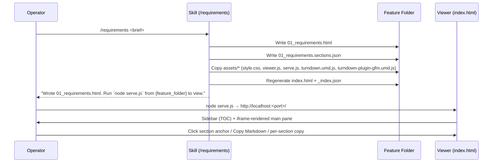
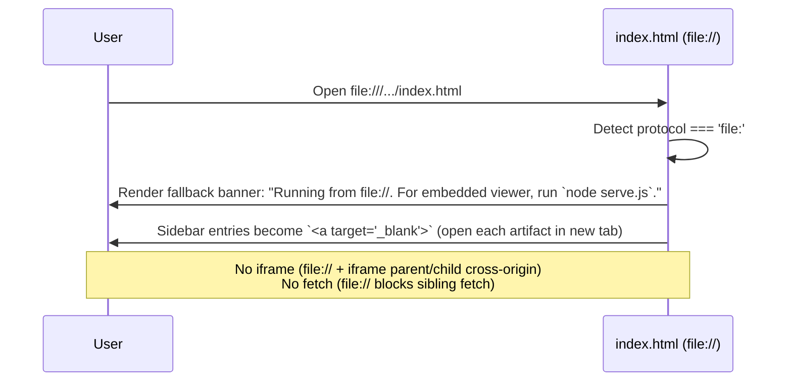
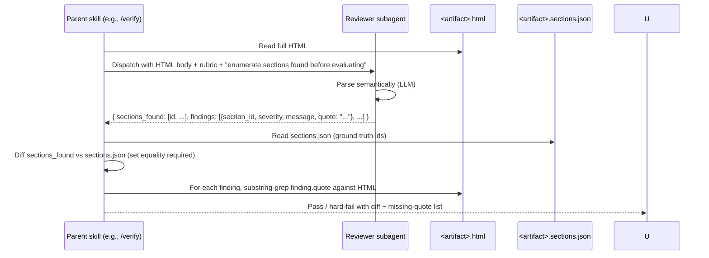

# HTML-native artifact generation across pmos-toolkit pipeline skills — Spec

---

## 1. Problem Statement {#problem-statement}

Every pmos-toolkit pipeline skill that writes into a feature folder (10 skills total: `/requirements`, `/spec`, `/plan`, `/msf-req`, `/msf-wf`, `/simulate-spec`, `/grill`, `/artifact`, `/verify`, `/design-crit`) emits markdown. Markdown can't express the artifacts' intent (diagrams collapse to ASCII, decision trees to bullets, no inline images, no anchored cross-refs); a finished feature folder isn't shareable as a navigable artifact set; and reviewer subagents that "parse markdown by heading regex" silently miss sections. This spec defines how we migrate the pipeline to HTML-native authoring with markdown as a derived export, while shipping an index viewer + serve.js so the folder is zip-and-shareable. **Primary success metric:** a recipient with no pmos-toolkit installed can navigate a finished feature folder end-to-end in under a minute from cold. (Global skills `/changelog` and `/session-log` are out of scope per requirements §Non-Goals.)

---

## 2. Goals {#goals}

| # | Goal | Success Metric |
|---|------|---------------|
| G1 | Finished feature folder is self-contained and navigable | Cold-open recipient navigates folder in <60s via `node serve.js` or `file://` |
| G2 | Skills generate HTML directly, not via markdown→HTML conversion | Zero `pandoc`/`marked`/server-side `turndown` calls in any affected SKILL.md (grep ⇒ 0) |
| G3 | Every feature folder ships with a unified index viewer | Every artifact in folder appears in `index.html` sidebar TOC |
| G4 | Markdown remains available for clipboard/export, derived from HTML | `Copy Markdown` button (toolbar + per-section) round-trips structurally |
| G5 | Reviewer subagents read HTML semantically (LLM-as-parser) | Zero `^##` regex extractors AND zero `jsdom`/DOM-querying in reviewer prompts |
| G6 | Output format is configurable | `.pmos/settings.yaml :: output_format ∈ {html, both}`; per-invocation `--format` flag |
| G7 | Reviewer findings prove they actually located sections | Each reviewer enumerates found sections from `<artifact>.sections.json`; every finding includes a verbatim ≥40-char source quote |

---

## 3. Non-Goals {#non-goals}

- Migrating `/changelog` and `/session-log` — global docs require their own repo-wide viewer concern; revisit later.
- Migrating existing `.md` artifacts in `docs/pmos/features/*` — high risk for low value; old folders stay markdown-native.
- Supporting `output_format: markdown`-only — re-introduces the path explicitly rejected.
- Hosted viewer / web service — viewer is local-only via `serve.js`.
- Adopting an SSG (mdBook, MkDocs, Sphinx, Eleventy, docsify) — see D11.
- Refactoring `/diagram` to add a render-only mode — out of scope; current invocation surface is sufficient via Task tool.
- Redesigning artifact contents — sections, content, tone stay the same; only rendering format changes.
- Cross-artifact search in v1 — see D15.
- **Mobile / narrow-viewport rendering** of the index viewer — desktop-targeted (≥1024px); per-artifact HTML follows standard semantic flow and degrades gracefully on narrow viewports but the viewer chrome is not designed for mobile in v1. (G19)

---

## 4. Decision Log {#decision-log}

Carried from requirements doc (D1, D3–D11) restated here for traceability; D2 reworded; D12–D21 are spec-level.

| # | Decision | Options Considered | Rationale |
|---|----------|-------------------|-----------|
| **D1** | HTML is native primary; markdown is derived export | (a) MD source-of-truth; (b) HTML source-of-truth; (c) dual sources | (b). User rejected (a) — MD can't express intent. (c) violates SSOT. |
| **D2** | `/diagram` invoked as blocking Task subagent. Per-call: 300s timeout, 2 retries (3 attempts × 300s = 15min/diagram budget). All 3 attempts fail → **inline-SVG by skill prompt as last resort** (preserves D2 safety net). Per-`/spec` run cap: 30min wall-clock; if hit, remaining diagrams default to inline-SVG. | (a) Always inline SVG; (b) Always /diagram subagent; (c) Mermaid client-side; (d) Refactor /diagram | (b) primary + inline-SVG last-resort. User picked fail-loud-then-fallback over silent-degradation. Quality ≥ predictability when budget allows. |
| **D3** | Reviewer subagents read HTML semantically — **LLM is the parser**. No `jsdom`, regex, or DOM queries. | (a) jsdom; (b) regex; (c) node-html-parser; (d) LLM wholesale | (d). MD reviewers already pass content wholesale; HTML is more structured than MD. |
| **D4** | Markdown export: client-side turndown at click time (default); pre-rendered `.md` sidecar only when `output_format: both`. | (a) Pre-render always; (b) Client-side; (c) Server endpoint | (b) by default; (a) when `both`; (c) overkill. |
| **D5** | Existing markdown artifacts stay; HTML coexists. Index viewer surfaces orphan `.md` as legacy entries. | (a) Migrate retroactively; (b) Strict no-touch; (c) Hide legacy | (b). Migration high risk for low value. |
| **D6** | Index regeneration: each skill calls the index generator after writing its artifact. | (a) Each skill regen; (b) Standalone /index command; (c) serve.js at request time | (a) for write-time freshness. |
| **D7** | Global docs (`/changelog`, `/session-log`) excluded this iteration. | (a) Migrate + repo viewer; (b) Migrate + global viewer; (c) Skip | (c). Repo-wide viewer is its own design; address feature-folder asymmetry first. |
| **D8** | Settings field `output_format ∈ {html, both}`, default `html`. | (a) `{html, both}`; (b) `{html, markdown, both}`; (c) `artifact_format` | (a). (b) re-introduces rejected path. (c) is a synonym. |
| **D11** | Build viewer ourselves; no SSG. | (a) mdBook/MkDocs; (b) Eleventy/docsify; (c) Build | (c). Every SSG assumes MD source — conflicts with D1. Tocbot (closest minimal lib) only handles intra-doc TOC, not cross-artifact navigation, which is the actual hard part. ~200 LOC vanilla beats a dependency that doesn't fit. |
| **D12** | `<artifact>.sections.json` sidecar + reviewer enumerate-then-evaluate + `/verify` diff hard-fail. Every reviewer finding includes a verbatim ≥40-char source quote that `/verify` substring-greps against the HTML. | (a) Enumerate-only, no sidecar; (b) Sidecar + diff; (c) Detect "no findings" as failure only | (b). Enumeration alone is unverifiable without ground truth; "no findings" detection alone misses hallucinated sections. (b) catches duplicate-heading confusion, hallucinated sections, silent no-findings, AND truncation drift. Folds requirements R3 (HTML structural validation in /verify smoke) into a checkable contract. |
| **D13** | Cross-doc affordance bridges use stable kebab-case anchor IDs + relative-href fragments (`<a href="04_recipient-quickstart.html#step-2">`). Every `<section>` and every `<h2>`/`<h3>` gets an `id` derived from heading text via the existing kebab-anchor rule (collision dedupe with `-2`/`-3`). | (a) `data-bridge` taxonomy; (b) Stable IDs + relative href; (c) No cross-doc bridges | (b). (a) contradicts D3 ("no special attribute taxonomy"). (b) generalizes to all bridges, not one-off. |
| **D14** | `/feature-sdlc` orchestrator artifacts (`00_pipeline.html`, `00_open_questions_index.html`) are in scope. Same authoring contract applies; sidebar groups them under "00 Pipeline". | (a) In scope; (b) Out of scope; (c) `<pre>`-wrap shim | (a). Consistency over carve-out. |
| **D15** | No cross-artifact search in v1. Remove `⌘K` affordance from W01. | (a) Pre-rendered index + modal; (b) No search; (c) Current-doc-only on all envs | (b). file:// fetch restrictions make cross-artifact search a degraded experience; current-doc-only adds chrome that few users would use. Ship without; revisit if asked. |
| **D16** | Quickstart-seen flag scoping: `sessionStorage` (banner re-appears every fresh session). | (a) sessionStorage; (b) localStorage by content-hash; (c) localStorage by URL path | (a). Cold-open from Slack zip always shows quickstart — matches J4 recipient-first-experience intent. localStorage on file:// is per-file-path scoped (broken across cross-share). |
| **D17** | html→md: **turndown 7.2.4 + turndown-plugin-gfm** bundled client-side via UMD. | (a) turndown; (b) node-html-markdown; (c) html-to-md | (a). ~13 KB gzip; UMD on unpkg/jsDelivr/cdnjs; first-class browser distribution; battle-tested on tables/code/lists. Resolves OQ3. |
| **D18** | Pre-rendered TOC + per-folder manifest (`_index.json`) + classic `<script>` tags. **No ES modules. No `fetch()` of sibling HTML on file://.** Main-pane rendering: `<iframe src="<artifact>.html">` (display-only; cross-frame DOM access not required because Copy-Markdown lives inside each artifact's own toolbar, not the chrome). | (a) Vanilla JS DOM walk via fetch; (b) Pre-rendered TOC + manifest; (c) iframe-per-artifact | (b) for sidebar; iframe for main-pane display. (a) breaks on file://. Bookmarkability via location-hash routing in chrome. |
| **D19** | Asset source-of-truth: `${CLAUDE_PLUGIN_ROOT}/skills/_shared/html-authoring/assets/`. Skills resolve at runtime, copy each file into `{feature_folder}/assets/` via `Read`+`Write`. | (a) ${CLAUDE_PLUGIN_ROOT} + Read+Write; (b) base64-inline in SKILL.md; (c) generate from prompt | (a). Mirrors wireframes/prototype precedent. (b) bloats SKILL.md. (c) drift risk. |
| **D20** | Copy Markdown granularity: **both** — global toolbar (full doc) + per-section anchor icon (that section subset). | (a) Both; (b) Full doc only; (c) Per-section only | (a). Matches GitHub/Notion. Cost: small JS footprint to scope per-section subset. |
| **D21** | `_shared/resolve-input.md` is **created** (not extended) as part of this work. Multiple skills already reference it but the file does not exist yet. | (a) Create now; (b) Defer | (a). Skills reference it; we need the format-aware fallback for D5 forward-only migration. |
| **D22** | Chrome-strip responsibility lives in the **parent** that dispatches a reviewer subagent (currently only `/feature-sdlc`), not inside the reviewer skills themselves. The 5 reviewer skills (`/grill`, `/verify`, `/msf-req`, `/msf-wf`, `/simulate-spec`) only document an input-as-subagent contract (FR-51 template) in their Phase 1 prose; they do not run chrome-strip and do not self-validate. /verify's Phase 3 code-diff reviewers are explicitly carved out (FR-50.1) since they consume git diffs not artifact HTML. | (a) Chrome-strip in each reviewer skill; (b) Chrome-strip in the parent only; (c) Chrome-strip in both | (b). (a) was the original FR-50 framing but reality is that 4 of 5 reviewer skills have explicit "No subagents" Platform Adaptation lines and don't dispatch sub-reviewers. /verify is the only skill that dispatches reviewers internally, but those reviewers consume code diffs — chrome-strip doesn't apply. (b) keeps the work at the dispatch site (D14 already brings /feature-sdlc orchestrator into scope) and treats the 5 reviewers as receivers of a contract, not enforcers. Surfaced by /execute T13 plan-defect handoff at commit `151d806`. |

---

## 5. User Personas & Journeys {#user-personas-and-journeys}

### 5.1 Skill author / pipeline operator (primary) {#skill-author-pipeline-operator}

Runs `/feature-sdlc` or invokes individual pipeline skills. Wants HTML output to "just work" — the skill prompt gets shorter (write `<section>` blocks), not longer.

### 5.2 Stakeholder / reader {#stakeholder-reader}

Receives a zipped feature folder via Slack/email. No pmos-toolkit installed. Opens `index.html` in browser (file:// or via serve.js) and navigates artifacts.

### 5.3 Reviewer subagent (LLM) {#reviewer-subagent-llm}

Spawned by `/grill`, `/verify`, `/msf-req`, `/msf-wf`, `/simulate-spec`. Receives HTML wholesale; expected to enumerate sections found before evaluating.

### 5.4 Primary journey: Operator runs the pipeline (Tier 3 fresh folder) {#primary-journey-operator}



### 5.5 Alternate: User opens `index.html` via file:// {#journey-file-fallback}



### 5.6 Alternate: `output_format: both` {#journey-output-format-both}

Skill writes `01_requirements.html` (primary) + `01_requirements.md` (derived sidecar at write time, regenerated on every HTML rewrite). MD is for paste-into-Slack workflows; never edit `.md` directly.

### 5.7 Reviewer subagent reads HTML {#journey-reviewer-reads-html}



### 5.8 Error: `/diagram` subagent stalls {#journey-diagram-stall}

```mermaid
sequenceDiagram
  participant S as /spec
  participant D as /diagram subagent (Task)
  participant FS as Feature Folder
  S->>D: Spawn (description, --theme technical, --out {docs_path}/diagrams/<slug>.svg)
  Note over S,D: Attempt 1 — 300s timeout
  D--xS: timeout
  S->>D: Retry 1 — 300s timeout
  D--xS: timeout
  S->>D: Retry 2 — 300s timeout
  D--xS: error / timeout
  S->>S: Last-resort: inline-SVG via own prompt
  S->>FS: Inline <svg> into <figure>; <figcaption>: "Diagram authored inline (subagent failed after 3 attempts)"
  Note over S: Per-/spec wall-clock cap 30min — if hit, remaining diagrams skip subagent path entirely
```

### 5.9 Error: unsupported `output_format` value {#journey-unsupported-format}

User has `output_format: markdown` in `.pmos/settings.yaml`. Skill reads, sees unsupported value, errors clearly:

```
output_format: 'markdown' is not supported. Use 'html' (default) or 'both'.
```

Exit code 64. Don't silently coerce.

### 5.10 Error: existing `.md` artifact in target folder {#journey-existing-md}

Skill detects `01_requirements.md`, runs pre-write snapshot-commit (existing safety per D5), writes `01_requirements.html` going forward. Old `.md` becomes a stale sidecar. Index viewer surfaces it as `01_requirements.md (legacy markdown)` — clickable, no Copy-Markdown toolbar.

---

## 6. System Design {#system-design}

### 6.1 Architecture overview {#architecture-overview}

```
┌──────────────────────────────────────────────────────────────────────┐
│                       pmos-toolkit plugin                            │
│  ┌──────────────────────────────────────────────────────────────┐    │
│  │ skills/_shared/html-authoring/                               │    │
│  │   ├── README.md           (authoring contract for skill prompts)│ │
│  │   ├── template.html       (base HTML scaffold)               │    │
│  │   ├── conventions.md      (semantic structure rules)         │    │
│  │   └── assets/                                                │    │
│  │        ├── style.css                                         │    │
│  │        ├── viewer.js          (sidebar, copy-md, fallback)   │    │
│  │        ├── serve.js           (zero-deps Node http server)   │    │
│  │        ├── turndown.umd.js    (vendored turndown 7.2.4)      │    │
│  │        └── turndown-plugin-gfm.umd.js                        │    │
│  └──────────────────────────────────────────────────────────────┘    │
│                              │                                       │
│  ┌────────────┬──────────────┴──────────────┬────────────┐           │
│  │/requirements│ /spec  /plan  /msf-req     │ /grill     │           │
│  │  /msf-wf   │ /simulate-spec /artifact    │ /verify    │           │
│  │            │ /design-crit                │            │           │
│  └────────────┴─────────────────────────────┴────────────┘           │
│            │ writes HTML + copies assets                              │
└────────────┼──────────────────────────────────────────────────────────┘
             ▼
┌──────────────────────────────────────────────────────────────────────┐
│  {feature_folder}/                                                   │
│  ├── index.html              (sidebar + main-pane iframe shell)      │
│  ├── _index.json             (manifest: ordered artifact list)       │
│  ├── 00_pipeline.html        (orchestrator)                          │
│  ├── 00_pipeline.sections.json                                       │
│  ├── 01_requirements.html                                            │
│  ├── 01_requirements.sections.json                                   │
│  ├── 02_spec.html / .sections.json                                   │
│  ├── 03_plan.html / .sections.json                                   │
│  ├── msf-findings.html / .sections.json                              │
│  ├── grills/<date>_<slug>.html / .sections.json                      │
│  ├── simulate-spec/<date>-trace.html / .sections.json                │
│  ├── verify/<date>-report.html / .sections.json                      │
│  ├── wireframes/             (already HTML — unchanged structure)    │
│  ├── prototype/              (already HTML — unchanged structure)    │
│  └── assets/                                                         │
│       ├── style.css                                                  │
│       ├── viewer.js                                                  │
│       ├── serve.js                                                   │
│       ├── turndown.umd.js                                            │
│       └── turndown-plugin-gfm.umd.js                                 │
└──────────────────────────────────────────────────────────────────────┘
```

### 6.2 Sequence diagrams {#sequence-diagrams}

(See §5.4–5.8 above — sequence diagrams cover write flow, file:// fallback, reviewer parse, and diagram-stall recovery.)

### 6.3 Skill-to-skill data flow {#skill-to-skill-data-flow}

Write→read pipeline (per the data-flow-trace property):

1. **Write entry point:** Each skill's Phase 5/equivalent calls `Write` to `{feature_folder}/<NN>_<artifact>.html` AND `<NN>_<artifact>.sections.json` AND regenerates `index.html`+`_index.json`.
2. **Storage target:** The feature folder + manifest.
3. **Read entry point:** Downstream skills call `_shared/resolve-input.md` with `phase=<upstream>` → returns `.html` path (preferred) or `.md` path (legacy fallback).
4. **Verified link:** `_shared/resolve-input.md` is being created in this work (per D21). Phase 4 of /plan must include a verification task that asserts every downstream skill's "read upstream" path routes through it (grep for `Read` calls of `01_requirements.*` etc. → must all go through the resolver).

---

## 7. Functional Requirements {#functional-requirements}

### 7.1 HTML authoring contract — `_shared/html-authoring/` {#fr-html-authoring}

| ID | Requirement |
|----|-------------|
| FR-01 | A new directory `plugins/pmos-toolkit/skills/_shared/html-authoring/` exists with: `README.md` (authoring contract), `template.html` (base HTML scaffold), `conventions.md` (semantic structure rules), and `assets/` subdirectory. |
| FR-02 | `template.html` provides `<head>` (title slot, link to `./assets/style.css`, classic `<script src="./assets/viewer.js">`), `<body>` skeleton (`<header>` toolbar, `<main>` content slot, `<footer>` source-info). No ES modules. No external CDN at runtime — all scripts are local-relative. |
| FR-03 | `conventions.md` documents: (a) `<section>` per logical area; (b) `<h1>` for doc title, `<h2>`/`<h3>` for sections/subsections; (c) every `<section>` and every heading carries a stable kebab-case `id` per the anchor-emission rule (lowercase, non-alnum→`-`, collision dedupe `-2`/`-3`); (d) `<figure>` with `<figcaption>` for diagrams; (e) `<dl>` for term/definition lists; (f) standard `<table>` for matrices. NO `data-section` taxonomy, NO mandatory class names beyond what `style.css` provides. |
| FR-03.1 | **Per-skill enforcement.** Each affected skill's authoring section in SKILL.md MUST inline the rule: *"every `<h2>` and `<h3>` carries a stable kebab-case `id`; the skill is responsible for emitting them at write time."* `/verify` smoke (FR-72) hard-fails if any artifact's HTML contains an `<h2>` or `<h3>` without an `id`. (G6) |
| FR-04 | `assets/style.css` is hand-authored, ≤30 KB. NO Tailwind CDN runtime (per Subagent B anti-pattern: 300 KB JIT mutates DOM, breaks reviewer parsing). Style targets vanilla semantic HTML; relies on element selectors + a small set of utility classes. |
| FR-05 | `assets/viewer.js` is a single classic `<script>` (no `import`/`export`). Implements: protocol detection (file:// vs http://), sidebar TOC build from `_index.json`, iframe main-pane router, hash-based deep linking (`#<artifact>/<section-id>`), Copy-Markdown handlers (toolbar full-doc + per-section anchor icon), file:// fallback rendering (sidebar links → `target="_blank"`), legacy-MD shim renderer (per FR-22). Total bundle ≤30 KB minified. |
| FR-05.1 | **No-modules guard.** A pre-push hook (CI step) greps `viewer.js` and any `assets/*.js` for `^(import|export)\b|type=["']module["']` patterns; non-zero matches fail the push. Pattern enforced in `tools/audit-recommended.sh`-style script. (G12) |
| FR-06 | `assets/serve.js` is zero-deps Node `http.createServer`, serves the folder, prints URL. Mirrors the existing `/wireframes` pattern. Includes graceful "port in use → try next" loop. **MIME map (explicit):** `.html→text/html; charset=utf-8`, `.css→text/css; charset=utf-8`, `.js→text/javascript; charset=utf-8`, `.json→application/json; charset=utf-8`, `.svg→image/svg+xml`, `.png/.jpg/.jpeg/.webp→image/*` (per extension), default `text/plain`. (G18) |
| FR-07 | `assets/turndown.umd.js`, `assets/turndown-plugin-gfm.umd.js`, AND `assets/html-to-md.js` are vendored. Licenses preserved. NO runtime CDN fetch. (G15) |

### 7.2 Per-skill rewrites — 10 affected skills + 1 orchestrator {#fr-per-skill-rewrites}

| ID | Requirement |
|----|-------------|
| FR-10 | Each affected skill's "write the document" phase changes from "write markdown to `<NN>_<artifact>.md`" to "write HTML to `<NN>_<artifact>.html`, write `<NN>_<artifact>.sections.json` companion, copy `assets/*` from `${CLAUDE_PLUGIN_ROOT}/skills/_shared/html-authoring/assets/`, regenerate `{feature_folder}/index.html` + `_index.json`". |
| FR-10.1 | **Per-folder relative asset paths.** Each `<artifact>.html` computes its on-disk depth relative to `{feature_folder}/assets/`: root-level artifacts use `./assets/`; subfolder artifacts (`grills/<file>.html`, `verify/<file>.html`, `simulate-spec/<file>.html`) use `../assets/`; deeper paths use `../../assets/`, etc. Skills emit the correct prefix in every `<link>` and `<script>` tag at write time. (G14 — blocker) |
| FR-10.2 | **Atomic write order.** Skill write phase: (1) author HTML in memory; (2) write `<artifact>.html` and `<artifact>.sections.json` via temp-then-rename (both must succeed or neither persists); (3) copy assets idempotently; (4) regenerate `index.html` + `_index.json`. On re-run, the skill detects orphan state (HTML present but sections.json missing or sections.json mtime older than HTML) and re-authors fully. No partial state survives a clean re-invocation. (G3) |
| FR-10.3 | **Asset cache-busting.** Asset references in generated HTML use `?v=<plugin-version>` query-string (e.g., `./assets/style.css?v=2.33.0`). Plugin version is sourced from `${CLAUDE_PLUGIN_ROOT}/.claude-plugin/plugin.json` at write time. Deterministic across re-runs of the same plugin version; differs across plugin versions to invalidate browser cache. (G4) |
| FR-11 | Affected skills (10): `/requirements`, `/spec`, `/plan`, `/msf-req`, `/msf-wf`, `/simulate-spec`, `/grill`, `/artifact`, `/verify`, `/design-crit`. Plus `/feature-sdlc` orchestrator artifacts (`00_pipeline.html`, `00_open_questions_index.html`) per D14. **`/artifact` scope clarification:** the skill's feature-folder output is HTML per this contract; its template store at `~/.pmos/artifacts/templates/<slug>/template.md` retains its existing MD shape (out of scope — it's a template substrate, not a user-facing artifact). |
| FR-12 | When `output_format: both`, skill ALSO writes a derived `<NN>_<artifact>.md` sidecar at write time. Mechanism: skill invokes `Bash('node {feature_folder}/assets/html-to-md.js <artifact>.html > <artifact>.md')`. MD is regenerated on every HTML rewrite; never edit MD directly. |
| FR-12.1 | `assets/html-to-md.js` is a tiny CLI shim (≤100 LOC) vendored alongside `turndown.umd.js`. It reads a path from argv, runs turndown + the GFM plugin (via local `require('./turndown.umd.js')` resolved through a small wrapper that exposes the UMD global to CommonJS), writes MD to stdout. Same library bundle that the browser uses; same MD output. |
| FR-13 | Pre-write snapshot-commit (existing pattern) applies unchanged: if `<NN>_<artifact>.html` exists with uncommitted changes, `git add` + `git commit -m "snapshot: pre-/<skill>-rewrite"` before overwrite. |
| FR-14 | Each skill's `_shared/resolve-input.md` call (or direct `Read` of an upstream `.md`) is replaced with the format-aware resolver call from FR-30. Direct `.md` reads are forbidden post-migration (grep validation). |
| FR-15 | `/wireframes` and `/prototype` already write HTML and are NOT modified by this spec — they retain their existing structure. The new `index.html` viewer at the feature-folder root surfaces them as nested groups via `_index.json` (linking to their existing `wireframes/index.html` and `prototype/index.html`). |

### 7.3 Index viewer + manifest {#fr-index-viewer}

| ID | Requirement |
|----|-------------|
| FR-20 | `{feature_folder}/index.html` is a generated viewer. Layout: left sidebar (TOC) + main pane (iframe rendering selected artifact) + footer (source-info). Sidebar entries grouped by phase: "00 Pipeline", "01 Requirements", "02 Spec", "03 Plan", "MSF Findings", "Grills", "Wireframes", "Prototype", "Simulate-Spec", "Verify". |
| FR-21 | Sidebar nav is built at viewer-load time from `_index.json` (no runtime fetch of artifact bodies). Each entry expanded to second-level nav using `<artifact>.sections.json` (already written next to each artifact). |
| FR-22 | `_index.json` schema (see §9 for canonical shape): ordered list of artifact entries with `path`, `title`, `phase`, `format` (`html`/`md`-legacy), `sections_path`. **Legacy MD entries** (`format: md`) are NOT iframe-loaded; the viewer reads the `.md` file (or, on file://, opens it in a new tab) and renders its source inside a `<pre class="pmos-legacy-md">` block within a synthesized minimal HTML wrapper, with toolbar message "Legacy markdown — not rendered, view source." Per D5 + G11. |
| FR-23 | Main pane renders selected artifact via `<iframe src="<artifact>.html">`. Iframe is sandboxed with `allow-same-origin allow-scripts` (under serve.js). Hash route in URL bar: `index.html#<artifact-slug>/<section-id>`. |
| FR-24 | `Copy Markdown` button has TWO surfaces: (a) global toolbar inside each artifact (top-right): copies the full artifact converted via turndown; (b) anchor-icon adjacent to each `<h2>`/`<h3>` (visible on hover): copies that section's MD subset (subtree from heading to next sibling heading of same level). Per D20. |
| FR-25 | Per-doc toolbar inside each rendered artifact (NOT in the chrome): "Copy Markdown" button + "Copy section link" button (copies `index.html#<artifact>/<section>` to clipboard). |
| FR-25.1 | **Clipboard fallback.** Copy operations attempt `navigator.clipboard.writeText()` first; on TypeError or DOMException (sandboxed iframe / older browser), fall back to `document.execCommand("copy")` with a temporary hidden `<textarea>`. Both paths show a unified "Copied" toast. Promotes E16 to FR. (G13) |
| FR-26 | Quickstart banner (W04) appears on first load per session; `sessionStorage.setItem('pmos.quickstart.seen', '1')` after dismissal. All sessionStorage operations wrapped in `try/catch`; on QuotaExceededError or SecurityError (private mode), banner-state defaults to an in-memory variable (state lost on reload but functional within session). Per D16. (G7) |
| FR-27 | NO search affordance. ⌘K is not bound; W01 wireframe is updated (per D15) to remove the ⌘K stub. |

### 7.4 file:// fallback {#fr-file-fallback}

| ID | Requirement |
|----|-------------|
| FR-40 | `viewer.js` detects `location.protocol === 'file:'` at load. On file://: render fallback banner ("Running from file://. For embedded viewer, run `node serve.js`."), build sidebar with `<a target="_blank">` links (no iframe), disable Copy-Markdown global toolbar (clipboard API restrictions on file:// in some browsers; per-artifact toolbar inside the opened tab still works because it operates on its own document). |
| FR-41 | NO `fetch()` calls of sibling HTML/JSON files in `viewer.js` after protocol detection. `_index.json` is loaded via classic `<script src="./_index.json">` trick (rejected — JSON is not JS) → INSTEAD, `_index.json` is INLINED into `index.html` at generation time as `<script type="application/json" id="pmos-index">{...}</script>`. Same for `<artifact>.sections.json` when needed by the chrome (which it isn't post-FR-21 simplification — sections only consumed by `/verify` reviewers). |
| FR-42 | `<artifact>.html` files are individually viewable in `file://` (each is a self-contained HTML doc with its own `<head>` linking `./assets/style.css` and `./assets/turndown*.umd.js` — relative paths work from sibling). |

### 7.5 Format-aware resolve-input — `_shared/resolve-input.md` {#fr-resolve-input}

| ID | Requirement |
|----|-------------|
| FR-30 | A new file `plugins/pmos-toolkit/skills/_shared/resolve-input.md` is created (per D21). It documents the format-aware artifact resolver pattern that skill prompts inline. |
| FR-31 | Resolver contract: given `(feature_folder, phase_or_label)` → tries `{feature_folder}/<NN>_<phase>.html` → falls back to `{feature_folder}/<NN>_<phase>.md` → errors if neither exists. The `<NN>_` prefix mapping per phase: `requirements=01, spec=02, plan=03`. Other artifacts (msf-findings, grills, simulate-spec, verify) use their existing path conventions. |
| FR-32 | Resolver also handles label-based lookup (e.g., `phase=requirements`, `label="requirements doc"`) and delegates to `_shared/pipeline-setup.md` Section B for ambiguous-feature edge cases. |
| FR-33 | All affected skills (10) update their input-reading phases to call this resolver. Direct `Read` of an upstream `<NN>_<artifact>.md` or `.html` is replaced. |

### 7.6 Reviewer subagent migration {#fr-reviewer-migration}

| ID | Requirement |
|----|-------------|
| FR-50 | The 5 skills `/grill`, `/verify`, `/msf-req`, `/msf-wf`, `/simulate-spec` are themselves the reviewer subagents (per §5.3) — they are spawned by parent orchestrators (currently only `/feature-sdlc`), they do NOT internally dispatch sub-reviewers. **The parent that dispatches them is responsible for chrome-strip**: before invoking a reviewer subagent, the parent runs `${CLAUDE_PLUGIN_ROOT}/skills/_shared/html-authoring/assets/chrome-strip.js <artifact>.html > /tmp/<artifact>-stripped.html` (the canonical helper from T12, ≤80 LOC, balanced-tag tracker per R2 mitigation) and passes the stripped HTML inline to the subagent. The 5 reviewer skills themselves consume their own input artifacts via `_shared/resolve-input.md` (FR-30/33) — when invoked-as-subagent, they receive the chrome-stripped slice as the prompt body and skip the resolver. Each of the 5 skills SHOULD document the input-as-subagent contract in their Phase 1 prose (FR-51 template), but they MUST NOT inline a chrome-strip step in their own SKILL.md — that work belongs to the parent. (G1) |
| FR-50.1 | **Carve-out — /verify Phase 3 code-diff reviewers.** /verify's "Multi-Agent Code Quality Review" (line ~248-302 in current SKILL.md) dispatches reviewer subagents that consume **`git diff` output**, not artifact HTML. Chrome-strip does not apply to that path; FR-50/51/52 cover only the artifact-HTML reviewer path. /verify's existing code-diff review prose is unchanged by this feature. |
| FR-51 | Canonical reviewer prompt template (applies to the 5 reviewer skills' input-as-subagent contract): "Read this HTML content (the document's `<main>` body — chrome already stripped). **First, enumerate every `<section>` id and every `<h2>`/`<h3>` id you can locate** — return as `sections_found: [...]`. Then evaluate against the rubric below. For every finding, return `{section_id, severity, message, quote: "<≥40-char verbatim from source>"}`." Each of the 5 reviewer skills inlines this template into a Phase-1 "Input Contract" section. |
| FR-52 | **The parent skill that dispatched the reviewer subagent** (currently only `/feature-sdlc`) validates the reviewer's return: (a) `sections_found` set-equality with `<artifact>.sections.json` (any miss/extra is hard fail); (b) every `quote` substring-greps against the HTML body (any miss is hard fail); (c) "no findings" return is allowed only if `sections_found` matches AND the rubric explicitly permits it. The 5 reviewer skills MUST NOT self-validate — validation lives in the parent's post-dispatch handler, not in the reviewer's own SKILL.md. |
| FR-53 | Migration ships in a single release (no intermediate state); each affected reviewer's smoke test runs during `/verify` of THIS feature (per Goal G7). |

### 7.7 Diagram subagent contract {#fr-diagram-contract}

| ID | Requirement |
|----|-------------|
| FR-60 | When a skill (`/spec`, `/plan`, etc.) identifies a diagram-worthy moment, it spawns `/diagram` as a blocking Task subagent with: `description=<terse natural-language description>`, `--theme technical`, `--rigor medium`, `--out {docs_path}/diagrams/<slug>.svg`, `--on-failure exit-nonzero`. |
| FR-61 | Per-call timeout: 300s. On timeout/error, parent retries up to 2 more times (3 attempts total = 15min/diagram budget). Per D2. |
| FR-62 | After 3 attempts fail, parent skill inlines an SVG via its own prompt as last resort (per D2). The `<figure>` records the source: `<figcaption>Diagram authored inline (subagent failed after 3 attempts).</figcaption>`. |
| FR-63 | Per-skill-run wall-clock cap: 30 min total subagent time. If hit, remaining diagrams in the run skip the subagent path entirely (go direct to inline-SVG). The cap is announced in chat: "Diagram subagent budget exhausted; remaining diagrams will be inline-authored." |
| FR-64 | On success, parent reads the SVG file, inlines it inside `<figure>`, sets `<figcaption>` to the diagram's terse description. The on-disk SVG at `{docs_path}/diagrams/<slug>.svg` is retained as the source-of-truth (parent skill does NOT delete it). |
| FR-65 | The exact list of "diagram-worthy moments" per skill is documented in each skill's authoring guidance (e.g., `/spec` Phase 5 §6.2 "Sequence diagrams REQUIRED when 3+ components interact — one diagram per flow"). This spec doesn't enumerate them; it defines the contract. |

### 7.8 `<artifact>.sections.json` companion + verify smoke {#fr-sections-companion}

| ID | Requirement |
|----|-------------|
| FR-70 | Every HTML artifact written by an affected skill has a sibling `<artifact>.sections.json` written in the same atomic step. Schema in §9. |
| FR-71 | The skill constructs `sections.json` from the section-tree it just authored — no post-write HTML parsing. Since the skill chose every `<section>` id and every `<h2>`/`<h3>` id when generating the HTML, it already holds the canonical tree; sections.json is a structured serialization of that tree. The IDs in sections.json MUST match the IDs in the HTML (both come from the same source). Each entry: `{id, level, title, parent_id_or_null}`. |
| FR-72 | `/verify` smoke test: for each affected reviewer (5: grill, verify, msf-req, msf-wf, simulate-spec), invoke the reviewer with chrome-stripped input from a real HTML artifact in THIS feature folder (substituting for an actual `/feature-sdlc` dispatch — i.e., the smoke runs the chrome-strip step itself, then calls the reviewer). Assert: (a) reviewer returns ≥1 finding; (b) finding's `section_id` appears in the artifact's `sections.json`; (c) finding's `quote` substring-greps against the HTML. Any fail → hard fail (D12). The /verify code-diff reviewers carved out by FR-50.1 are NOT in scope for this smoke. |
| FR-73 | Hard-fail policy is non-skippable per Anti-pattern #10 in /spec — `/verify` is non-skippable; same principle here. |

### 7.9 Settings + flag {#fr-settings-flag}

| ID | Requirement |
|----|-------------|
| FR-80 | `.pmos/settings.yaml` accepts a new optional field `output_format`. Allowed values: `html`, `both`. Default: `html` when unset. The settings file's `version: 1` schema is unchanged (this is an additive optional field). |
| FR-81 | Per-invocation flag `--format html|both` overrides settings. Last flag wins on conflict (mirrors `--non-interactive`/`--interactive` precedence). |
| FR-82 | Unsupported value (e.g., `output_format: markdown`) → skill prints to stderr `output_format: '<value>' is not supported. Use 'html' (default) or 'both'.` and exits 64. NO silent coercion. |

### 7.10 Cross-doc affordance bridges {#fr-cross-doc-bridges}

| ID | Requirement |
|----|-------------|
| FR-90 | Cross-doc affordances are plain `<a href="<other-artifact>.html#<section-id>">`. Section-id derivation per the kebab-anchor rule (lowercase, non-alnum→`-`, dedupe). Per D13. |
| FR-91 | Skills MUST emit stable IDs on every `<section>` and every `<h2>`/`<h3>` so downstream cross-doc links don't break under renames. ID stability is the contract; id changes when heading changes; broken cross-doc refs are surfaced by FR-92 below. |
| FR-92 | **Cross-doc broken-anchor scan.** `/verify` smoke greps every `<a href="<artifact>.html#<frag>">` across all HTML artifacts in the feature folder; for each, asserts the target's `<artifact>.sections.json` contains an entry with `id == frag`. Any miss is hard fail. Promotes E12 to FR. Verification command added to §14.5. (G10) |

---

## 8. Non-Functional Requirements {#non-functional-requirements}

| ID | Category | Requirement |
|----|----------|-------------|
| NFR-01 | Performance | Viewer first-paint <500ms on a fixture folder with 8 artifacts. Total transferred JS (viewer.js + turndown.umd.js + turndown-plugin-gfm.umd.js) ≤50 KB gzip. |
| NFR-02 | Bundle size | `assets/style.css` ≤30 KB; `assets/viewer.js` ≤30 KB minified. Total `assets/` folder ≤200 KB on disk. |
| NFR-03 | Accessibility | WCAG 2.1 AA on viewer chrome: skip-link, focus management on sidebar→main, semantic landmarks (`<aside>`, `<main>`, `<nav>`), keyboard navigation (tab order). axe-core: zero violations on chrome. |
| NFR-04 | file:// compatibility | Viewer + every individual artifact opens cleanly via `file://` protocol with NO errors in browser console (some functionality degrades gracefully per FR-40, but nothing throws). |
| NFR-05 | Zip-and-share | Recipient with no pmos-toolkit installed unzips folder → opens `index.html` → navigates artifacts. No additional install. (G1 measurement.) |
| NFR-06 | No build step | Skills do not invoke any bundler, transpiler, or post-processor. Assets are vendored and copied. |
| NFR-07 | Deterministic regeneration | Re-running a skill on the same inputs produces byte-identical HTML+sections.json (modulo timestamps in clearly-marked sections). |
| NFR-08 | No CDN runtime fetch | Every script and stylesheet is a local relative path. Zero `https://` references in `<script src>` or `<link href>`. |
| NFR-09 | Plugin-version sync | Both `plugins/pmos-toolkit/.claude-plugin/plugin.json` and `plugins/pmos-toolkit/.codex-plugin/plugin.json` carry identical version strings (existing pre-push hook enforces). This release is a **minor** bump (2.32.0 → 2.33.0). |
| NFR-10 | Existing-folder regression | All pre-existing `01_requirements.md` files in `docs/pmos/features/*` continue to render (raw text in browser is acceptable; the resolve-input fallback path in FR-31 keeps them readable by downstream skills). |

---

## 9. API / Schema Contracts {#api-schema-contracts}

This feature has no HTTP API. The "contracts" are the on-disk file shapes. SQL schema: N/A — no DB changes.

### 9.0 Schema forward-compatibility {#schema-forward-compat}

All on-disk JSON schemas (`_index.json`, `<artifact>.sections.json`, future) carry a `schema_version: <int>`. Readers MUST tolerate `schema_version` greater than they recognize by reading only the fields they understand and ignoring unknown fields. Readers MUST refuse `schema_version` less than 1 with a clear error. Writers MUST never decrement. (G17)

### 9.1 `_index.json` (per feature folder) {#schema-index-json}

**Ordering policy (G5):** `artifacts[]` is ordered by (1) phase rank — `00 Pipeline` → `01 Requirements` → `02 Spec` → `03 Plan` → `MSF Findings` → `Wireframes` → `Prototype` → `Grills` → `Simulate-Spec` → `Verify` → `Legacy`; (2) within phase, by filename ascending (Unicode codepoint order). Generator is responsible for stable order; same inputs → byte-identical `_index.json` (NFR-07).


```json
{
  "schema_version": 1,
  "generated_at": "2026-05-09T13:35:00Z",
  "feature_folder": "docs/pmos/features/2026-05-09_html-artifacts/",
  "artifacts": [
    {
      "id": "00-pipeline",
      "title": "Pipeline status",
      "phase": "00 Pipeline",
      "path": "00_pipeline.html",
      "format": "html",
      "sections_path": "00_pipeline.sections.json"
    },
    {
      "id": "01-requirements",
      "title": "Requirements",
      "phase": "01 Requirements",
      "path": "01_requirements.html",
      "format": "html",
      "sections_path": "01_requirements.sections.json"
    },
    {
      "id": "wireframes-index",
      "title": "Wireframes",
      "phase": "Wireframes",
      "path": "wireframes/index.html",
      "format": "html",
      "sections_path": null,
      "external_index": true
    },
    {
      "id": "01-requirements-legacy",
      "title": "Requirements (legacy markdown)",
      "phase": "Legacy",
      "path": "01_requirements.md",
      "format": "md",
      "sections_path": null
    }
  ]
}
```

Inlined into `index.html` at generation time as `<script type="application/json" id="pmos-index">…</script>` (per FR-41) so the viewer reads it without `fetch()`.

### 9.2 `<artifact>.sections.json` (one per artifact) {#schema-sections-json}

```json
{
  "schema_version": 1,
  "artifact": "01_requirements.html",
  "sections": [
    { "id": "problem-statement", "level": 2, "title": "Problem Statement", "parent_id": null },
    { "id": "goals",             "level": 2, "title": "Goals",            "parent_id": null },
    { "id": "decision-log",      "level": 2, "title": "Decision Log",     "parent_id": null },
    { "id": "decision-d1",       "level": 3, "title": "D1",               "parent_id": "decision-log" }
  ]
}
```

`schema_version` is forward-compat: future fields can be added without breaking existing readers.

### 9.3 Reviewer subagent return contract {#schema-reviewer-return}

```json
{
  "sections_found": ["problem-statement", "goals", "decision-log", "decision-d1"],
  "findings": [
    {
      "section_id": "decision-log",
      "severity": "should-fix",
      "message": "D2 mixes timeout policy and fallback policy; consider splitting.",
      "quote": "On 300s timeout/error, parent retries up to 2 more times (3 attempts total = 15min/diagram budget)."
    }
  ]
}
```

`/verify` smoke validates: `set(sections_found) == set(sections.json.sections[].id)` AND every `quote` substring-greps against the HTML body. Mismatch → hard fail.

### 9.4 `output_format` setting field {#schema-output-format-setting}

```yaml
# .pmos/settings.yaml
version: 1
docs_path: docs/pmos/
workstream: null
current_feature: 2026-05-09_html-artifacts
output_format: html   # NEW. Allowed: html, both. Default when unset: html.
```

Unset → `html`. `markdown` (or any other value) → exit 64 with explicit error.

---

## 10. Database Design {#database-design}

**N/A** — no database changes. All persistence is filesystem-based (HTML/JSON files inside feature folders).

---

## 11. Frontend Design {#frontend-design}

### 11.1 Component hierarchy {#component-hierarchy}

```
index.html (viewer chrome)
├── <header class="pmos-toolbar">
│   ├── feature-folder breadcrumb
│   └── "Open in new tab" link to current artifact
├── <aside class="pmos-sidebar">
│   ├── per-phase group headers
│   └── per-artifact entries (with second-level <h2>/<h3> nav)
├── <main class="pmos-main">
│   └── <iframe class="pmos-artifact-frame" src="<artifact>.html">  (under serve.js)
│       OR <a class="pmos-artifact-link" target="_blank">           (file:// fallback)
└── <footer class="pmos-source-info">
    └── "Generated by pmos-toolkit /<skill> at <ts>"

<artifact>.html (per-artifact, self-contained)
├── <header class="pmos-artifact-toolbar">
│   ├── "Copy Markdown" (full doc) button
│   └── "Copy section link" button (when scrolled to a section)
├── <main class="pmos-artifact-body">
│   ├── <h1>Title</h1>
│   ├── <section id="problem-statement">
│   │   ├── <h2 id="problem-statement"> + anchor-icon (per-section copy MD)
│   │   └── prose / tables / <figure> with <svg> / <dl>
│   ├── <section id="goals">…
│   └── …
└── <footer class="pmos-artifact-footer">
```

### 11.2 State management {#state-management}

- **URL hash:** `index.html#<artifact-id>/<section-id>` — bookmarkable, parsed on load by viewer.js.
- **sessionStorage:** `pmos.quickstart.seen` only (per D16). No other client state.
- **No localStorage. No cookies. No backend.**
- Inside an `<artifact>.html` opened standalone, no client state — toolbar Copy operations are stateless.

### 11.3 UI specifications — viewer chrome {#ui-viewer-chrome}

- **Sidebar:** fixed width 280px, sticky, scroll independently. Per-phase groups collapse-to-summary (chevron). Active artifact (the one currently loaded in the iframe) highlighted. **Second-level section nav:** entries link to `<artifact>.html#<section-id>` and clicks navigate the iframe; the sidebar does NOT highlight which section is currently visible inside the iframe (would require cross-frame DOM access blocked on file://). Acceptable trade-off for file:// compat.
- **Legacy MD entries (G11):** rendered via the FR-22 shim — viewer reads the `.md` file (under serve.js) or opens it in a new tab (file://). Inside the synthesized wrapper, source is wrapped in `<pre class="pmos-legacy-md">`; toolbar shows: "Legacy markdown — not rendered, view source." No Copy-Markdown affordance (it's already MD).
- **Main pane:** iframe sized to fill remaining width; minimum height 100vh. Iframe `border: 0`, `sandbox="allow-same-origin allow-scripts"`.
- **Quickstart banner (W04):** appears on first load per session above sidebar; dismissable; sets `sessionStorage.setItem('pmos.quickstart.seen', '1')`.
- **file:// fallback banner (W02):** replaces iframe with a "links open in new tab" message + `target="_blank"` sidebar links. Banner copy: "Running from file://. For embedded viewer, run `node serve.js` from this folder."
- **Mixed-state (W03):** legacy `.md` entries appear in a "Legacy" group at the bottom; clickable but no toolbar.

### 11.4 UI specifications — per-artifact toolbar {#ui-artifact-toolbar}

- "Copy Markdown" button (top-right): runs turndown on `document.querySelector('main.pmos-artifact-body').outerHTML`, places result in clipboard, shows toast "Copied N sections, M characters".
- Per-`<h2>`/`<h3>` anchor icon (visible on hover): copies `headingElement.parentElement.outerHTML` (its enclosing `<section>`) converted via turndown. Toast: "Copied section: <title>".
- "Copy section link" button: copies `<host-url>/index.html#<artifact>/<section-id>` (or `file://...` equivalent).

### 11.5 Diagrams {#diagrams-ui}

- All diagrams render as inline `<svg>` inside `<figure>` with `<figcaption>` describing the diagram + provenance (`/diagram` subagent vs. inline-fallback). The user-visible appearance is identical regardless of source.
- For Mermaid sequence diagrams in this very spec doc (which is currently markdown — a bootstrap exception per requirements doc): retained as Mermaid fenced blocks in MD. After this feature ships, future runs of `/spec` author HTML directly with inline SVG; this MD stays as historical artifact (per OQ6, deferred to `/complete-dev`).

---

## 12. Edge Cases {#edge-cases}

| # | Scenario | Condition | Expected Behavior |
|---|----------|-----------|-------------------|
| E1 | Empty feature folder | First skill writes the first artifact | `index.html` is generated only after first artifact; no empty viewer. |
| E2 | Node not installed | User runs skill but lacks Node | Skill prints `file://` URL fallback; `serve.js` is bundled but optional. |
| E3 | Browser blocks JS under file:// | User opens `index.html` directly | Fallback mode: `target="_blank"` sidebar links open each artifact in a new tab. |
| E4 | Skill is run before HTML infra ships (this run) | This very requirements + spec doc | Written in markdown — bootstrap. Future runs author HTML. |
| E5 | Existing `.html` and `.md` for same artifact (post-migration partial state) | Mixed-state folder mid-migration | `.html` is canonical; `.md` shown as legacy entry in "Legacy" group. |
| E6 | `--format` flag and settings disagree | Flag wins | Documented; non-controversial. |
| E7 | `output_format: markdown` set by user | Unsupported value | Exit 64 with explicit error message (FR-82). |
| E8 | `/diagram` subagent stalls | 300s timeout × 3 attempts | Inline-SVG by skill prompt (FR-62). `<figcaption>` records source. |
| E9 | `/diagram` budget cap hit (30min/run) | 7+ diagrams in a /spec run | Remaining diagrams skip subagent path entirely, go direct to inline (FR-63). |
| E10 | Reviewer returns missing-quote finding | Finding's `quote` doesn't substring-grep into HTML | Hard fail in `/verify`. Reviewer is re-invoked with explicit reminder of contract; if still failing, halt and surface to user. |
| E11 | Reviewer's `sections_found` doesn't match `sections.json` | Set inequality | Hard fail. Same recovery as E10. |
| E12 | Cross-doc link target heading renamed | `<a href="X.html#old-id">` no longer resolves | `/verify` smoke includes a broken-link scan (grep all `<a href="*.html#*">` across artifacts; assert each fragment exists in the target's `sections.json`). Hard fail. |
| E13 | Wireframes folder already exists with its own `index.html` | `/wireframes` was already run | Feature-folder root `index.html` links to `wireframes/index.html` as `external_index: true` entry. Doesn't try to walk into wireframes. Per FR-15. |
| E14 | turndown fails on malformed HTML | LLM-authored HTML has unclosed tags | turndown is forgiving; worst case the MD output has stray tags. Acceptable. Validate at `/verify` via round-trip smoke. |
| E15 | Settings file missing | New install | `_shared/pipeline-setup.md` Section A first-run setup runs (existing behavior); `output_format` defaults to `html`. |
| E16 | Iframe sandbox blocks Copy clipboard API | Some browsers restrict clipboard in sandboxed iframes | Toolbar uses `document.execCommand('copy')` fallback for older browsers. Tested in Phase 14.3. |
| E17 | Generated SVG too large (>200 KB) | /diagram returns a complex SVG | Inline anyway; viewer.js doesn't load anything per-diagram. Per-artifact HTML may exceed comfortable size — accepted. Optimize SVG (strip whitespace, dedupe defs) at `/diagram` side. |

---

## 13. Configuration & Feature Flags {#configuration-feature-flags}

| Variable | Default | Purpose |
|----------|---------|---------|
| `output_format` (settings.yaml) | `html` | Controls whether MD sidecar is also written. |
| `--format html\|both` (CLI flag) | (settings) | Per-invocation override. |
| `${CLAUDE_PLUGIN_ROOT}` | (Claude Code env var) | Used to resolve `_shared/html-authoring/assets/` source paths at copy time. |

No runtime feature flag for the migration itself — single release per D11/grill Q4.

---

## 14. Testing & Verification Strategy {#testing-verification-strategy}

### 14.1 Unit tests {#unit-tests}

- `tests/scripts/assert_resolve_input.sh`: 4 fixtures (only-md, only-html, both, neither). Asserts return code + selected path for each.
- `tests/scripts/assert_sections_contract.sh`: For each `*.html` in fixture feature folder, verify sibling `*.sections.json` exists, ids unique, every id matches an `<h2 id>` or `<section id>` in HTML.
- `tests/scripts/assert_format_flag.sh`: Invoke each affected skill with `--format html` and `--format both`; assert `.html` always present, `.md` present iff `both`.
- `tests/scripts/assert_unsupported_format.sh`: Invoke with `output_format: markdown` in settings; assert exit code 64 and stderr message.
- `tests/scripts/assert_no_md_to_html.sh`: grep affected SKILL.md files for `pandoc|server-side turndown|marked.parse`; assert zero matches.

### 14.2 Integration tests {#integration-tests}

- **Format-aware resolver round-trip:** Build a fixture folder with mixed legacy `.md` + new `.html`, invoke `/spec` (which calls `/requirements` upstream via resolver), assert it picks `.html`. Delete `.html`, re-run, assert it picks `.md`. Delete both, assert error.
- **Reviewer migration smoke:** For each of the 5 reviewers (grill, verify, msf-req, msf-wf, simulate-spec), invoke on a real HTML artifact from THIS feature folder. Assert: `sections_found` matches `sections.json`; ≥1 finding emitted; every finding's quote substring-greps the HTML.
- **Diagram subagent contract:** Mock-fixture three /diagram behaviors (success, timeout, error). Assert parent retries 2× on timeout/error, then inlines SVG on 3rd failure. Assert per-run cap halts at 30min.

### 14.3 End-to-end tests (Playwright) {#e2e-tests}

- **Viewer under serve.js:** Navigate to `http://localhost:<port>/index.html`. Assert sidebar populated from `_index.json`. Click each artifact entry, assert iframe loads. Click in-doc anchor, assert scroll. Click "Copy Markdown" toolbar, read clipboard, assert structure.
- **Per-section copy:** Hover over `<h2>`, click anchor icon, assert clipboard contains only that section's MD subset.
- **Round-trip:** Take clipboard MD → re-render via turndown's reverse (`marked.parse(md)`) — actually, structurally diff: assert section count, table count, code-block count match between source HTML and turndown→marked→DOM round-trip.
- **file:// fallback:** Open `file:///{abs}/index.html`. Assert fallback banner present. Assert sidebar `<a target="_blank">`. Click an entry, assert new tab opens with the artifact loaded standalone.
- **Quickstart banner:** Fresh session → banner visible. Dismiss → gone. Reload → still gone. New session (close + reopen) → visible again.

### 14.4 Lighthouse / axe-core audits {#audits}

- Lighthouse on served `index.html` with 8-artifact fixture: FCP <500ms, total transferred JS ≤50 KB.
- axe-core on viewer chrome: zero violations.

### 14.5 Verification commands {#verification-commands}

```bash
# Unit
bash tests/scripts/assert_resolve_input.sh
bash tests/scripts/assert_sections_contract.sh tests/fixtures/repos/node/docs/pmos/features/2026-05-09_html-artifacts-fixture/
bash tests/scripts/assert_format_flag.sh
bash tests/scripts/assert_unsupported_format.sh
bash tests/scripts/assert_no_md_to_html.sh plugins/pmos-toolkit/skills/
bash tests/scripts/assert_no_es_modules_in_viewer.sh   # FR-05.1 (G12)
bash tests/scripts/assert_heading_ids.sh tests/fixtures/repos/node/docs/pmos/features/2026-05-09_html-artifacts-fixture/   # FR-03.1 (G6)
bash tests/scripts/assert_cross_doc_anchors.sh tests/fixtures/repos/node/docs/pmos/features/2026-05-09_html-artifacts-fixture/   # FR-92 (G10)

# Plugin manifest sync
bash tools/audit-recommended.sh   # existing
diff <(jq -r .version plugins/pmos-toolkit/.claude-plugin/plugin.json) \
     <(jq -r .version plugins/pmos-toolkit/.codex-plugin/plugin.json)

# Integration / e2e — driven by /verify Phase 6 manual + Playwright
node plugins/pmos-toolkit/skills/_shared/html-authoring/assets/serve.js \
  docs/pmos/features/2026-05-09_html-artifacts/

# Reviewer smoke (run during /verify of THIS feature)
/verify   # the skill's own smoke step asserts FR-72 contract
```

---

## 15. Rollout Strategy {#rollout-strategy}

**Single release** (per D11 / grill Q4). No feature flag gate.

1. Land the spec, plan, then the implementation in a single feature branch (`feat/html-artifacts`).
2. Implementation order (per /plan):
   1. `_shared/html-authoring/` directory + assets (template, conventions, style.css, viewer.js, serve.js, vendored turndown).
   2. `_shared/resolve-input.md` (new file, per D21).
   3. Per-skill rewrites (10 skills + orchestrator) — one PR section per skill.
   4. Reviewer subagent prompt updates (5 skills).
   5. `/diagram` subagent invocation pattern in `/spec`, `/plan` (and any skill that emits diagrams).
   6. Test fixtures + assert scripts.
   7. /verify smoke for FR-72.
3. **Bump version 2.32.0 → 2.33.0** in BOTH `.claude-plugin/plugin.json` and `.codex-plugin/plugin.json` (pre-push hook enforces sync).
4. CHANGELOG entry generated by `/complete-dev`.
5. Rollback strategy: revert the merge commit. Existing `.md` artifacts are untouched (D5), so post-rollback the pipeline degrades back to MD-only without state corruption. New `.html` files in feature folders authored during the broken window stay on disk; user can `rm *.html *.sections.json _index.json index.html assets/` if desired.
6. Post-merge verification: run `/verify` on this very feature folder (which exercises every reviewer, /diagram subagent path, and viewer fallback in real conditions).

---

## 16. Research Sources {#research-sources}

| Source | Type | Key Takeaway |
|--------|------|-------------|
| `plugins/pmos-toolkit/skills/wireframes/SKILL.md` | Existing code | HTML output pattern: `wireframes/<NN>_*.html` + `assets/wireframe.css` + Tailwind CDN. Index at `wireframes/index.html` (Phase 5a, lines 510–526). file:// fallback at line 541. |
| `plugins/pmos-toolkit/skills/prototype/SKILL.md` | Existing code | Per-device `index.<device>.html` + landing `index.html`. `runtime.js` for routing; mock-data inlined as `<script type="application/json">` for file:// compat (Phase 5b line 381). |
| `plugins/pmos-toolkit/skills/diagram/SKILL.md` | Existing code | `/diagram` is standalone (line 12). Output = SVG file at `{docs_path}/diagrams/<slug>.svg` (line 52). Flags: `--theme`, `--rigor`, `--on-failure`, `--source`, `--out`. |
| `plugins/pmos-toolkit/skills/_shared/pipeline-setup.md` | Existing code | Section A first-run setup (lines 34–99). Settings validation: `version` mandatory (line 61). |
| `plugins/pmos-toolkit/skills/{requirements,spec,plan,msf-req,msf-wf,simulate-spec,grill,artifact,verify,design-crit}/SKILL.md` | Existing code | 10 skills targeted by FR-11. Each writes its primary artifact via `Write` to `{feature_folder}/<NN>_<artifact>.md`. Pre-write snapshot-commit pattern present in requirements/spec/plan. |
| `plugins/pmos-toolkit/.claude-plugin/plugin.json` | Existing config | Version 2.32.0. Skills auto-discovered from `./skills/`. |
| https://github.com/mixmark-io/turndown | External | turndown 7.2.4, MIT, ~13 KB gzip UMD, GFM plugin separate. CDN: unpkg, jsDelivr, cdnjs. |
| https://github.com/whatwg/html/issues/8121 | External | file:// + ES modules / fetch — origin "null" blocks cross-file fetch. Confirms FR-41 (no fetch in viewer.js post-protocol-detection). |
| https://barker.codes/blog/javascript-modules-and-the-file-uri-scheme/ | External | Why `<script type="module">` breaks on file://. Confirms FR-05 (classic script tag, no modules). |
| https://www.llamaindex.ai/blog/llm-apis-are-not-complete-document-parsers | External | LLM-as-parser failure modes: silent no-findings, hallucinated sections, duplicate-heading confusion. Source for D12 / FR-72 contract. |
| https://arxiv.org/pdf/2503.13657 | External | Multi-agent LLM failure modes paper. Background for reviewer-quote requirement. |
| https://tscanlin.github.io/tocbot/ | External | Closest minimal lib for TOC; only handles intra-doc. Confirms D11 (build, don't adopt). |
| `~/.pmos/learnings.md ## /spec` | Learning archive | "Subagent contract research must verify producer AND consumer." Applied to FR-72 reviewer contract: validate both ends (sections.json from producer, reviewer's `sections_found` from consumer). |

---

## Review Log {#review-log}

| Loop | Findings | Changes Made |
|------|----------|-------------|
| 0 | Spec drafted from requirements + grill + msf-findings + 2 research subagents. Architect/Designer/DevOps interviews complete; DBA/PD/Senior Analyst silent (see below). | n/a |
| 1 | 2 [Should-fix] + 2 [Nit]: (a) FR-12 derived MD mechanism hand-wavy; (b) viewer secondary-nav active-section tracking unspecified; (c) FR-11 /artifact scope ambiguous re: template store; (d) FR-71 "deterministic walk" wording fuzzy. All 4 disposed Fix as proposed. | FR-12 + new FR-12.1 pin mechanism to `node assets/html-to-md.js`; §11.3 sidebar clarified (no active-section tracking, file:// trade-off); FR-11 appends /artifact template-store carve-out; FR-71 rewritten to "skill constructs from authored tree, no parsing". |

### Silent roles considered {#silent-roles-considered}

- **DBA** — no schema changes; persistence is filesystem-only (HTML/JSON files inside feature folders). Covered by §10.
- **Product Director** — user journeys covered exhaustively in `/msf-req` (msf-findings.md.bak: 11 recommendations) and `/msf-wf` (msf-findings.md: 4 wireframes, 4 journeys, PSYCH scored). No new persona surface introduced by the spec beyond what those passes already validated.
- **Senior Analyst** — FR coverage cross-checked against requirements doc Goals (G1–G6 mapped to FR-01..FR-82) and Success Metrics (each mapped to a §14 verification). No coverage gaps surfaced.

---

## Open Questions {#open-questions}

(Empty at exit. Per /spec exit checklist, Open Questions are forbidden — every requirements-doc OQ has been resolved into the Decision Log or moved to a future skill stage.)

| Source OQ | Resolution |
|-----------|------------|
| OQ3 (html→md tech) | D17: turndown 7.2.4 + GFM plugin, vendored UMD. |
| OQ4 (W5 cross-doc affordance bridges) | D13: stable kebab-case anchor IDs + relative-href fragments. |
| OQ5 (Copy Markdown granularity) | D20: both — global toolbar + per-section anchor icon. |
| OQ6 (re-author this MD doc as HTML) | Deferred to `/complete-dev` per requirements doc. Not blocking spec. |
| OQ7 (orchestrator artifacts in scope?) | D14: in scope. |
| OQ8 (diagram subagent timeout policy) | D2 reworded: 300s × 3 attempts → inline-SVG last resort; 30min/run cap. |
| W3 (quickstart-seen flag scoping) | D16: sessionStorage. |
| W4 (Search ⌘K) | D15: no search in v1; remove ⌘K from W01. |
| /msf-req R3 (HTML structural validation in /verify smoke) | D12 + FR-70/72: `<artifact>.sections.json` + reviewer enumerate-then-evaluate + verify diff hard-fail. |
