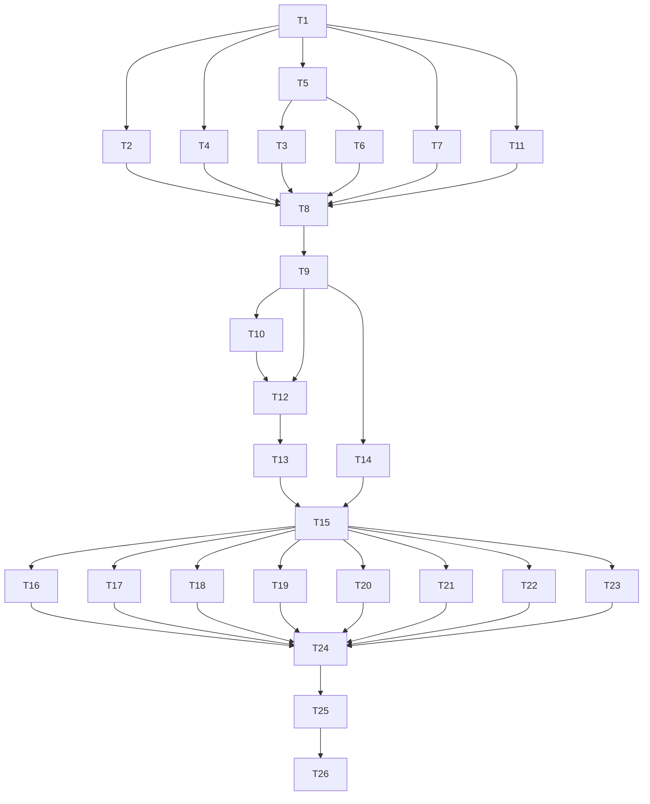

# HTML-native artifact generation across pmos-toolkit pipeline skills — Implementation Plan

---

## Overview

Migrate 10 feature-folder pipeline skills from markdown-primary to HTML-primary authoring, via a new `_shared/html-authoring/` substrate (template, conventions, vendored assets), a per-folder `index.html` viewer with file:// fallback, a format-aware `_shared/resolve-input.md` resolver, reviewer-subagent migration with `<artifact>.sections.json` enumeration contract + `/verify` smoke hard-fail, and a `/diagram` blocking-Task-subagent invocation pattern. Implementation order: (1) shared substrate + assets; (2) format-aware resolver + per-skill rewrites via runbook pattern; (3) reviewer + diagram migration; (4) test fixtures + assert scripts; (5) plugin manifest version bump + final verify.

**Done when:** all 10 affected skills emit HTML primary on a fixture feature folder, `_shared/resolve-input.md` exists and routes every "read upstream" call, all 8 assert scripts pass (`assert_resolve_input.sh`, `assert_sections_contract.sh`, `assert_format_flag.sh`, `assert_unsupported_format.sh`, `assert_no_md_to_html.sh`, `assert_no_es_modules_in_viewer.sh`, `assert_heading_ids.sh`, `assert_cross_doc_anchors.sh`), `/verify` smoke produces ≥1 finding from each of 5 reviewers (grill, verify, msf-req, msf-wf, simulate-spec) on the fixture's HTML, plugin manifests both at 2.33.0 (sync verified), and `node {fixture}/assets/serve.js` opens index.html showing 8+ artifacts with working sidebar + per-section Copy-MD + file:// fallback.

**Done-when walkthrough:**
1. Run `bash tests/scripts/assert_resolve_input.sh` → exit 0, prints PASS for 4 fixture cases.
2. Invoke `/pmos-toolkit:requirements --feature fixture-html-artifacts` on a fresh fixture folder; observe `01_requirements.html` + `01_requirements.sections.json` + `assets/style.css|viewer.js|serve.js|turndown.umd.js|turndown-plugin-gfm.umd.js|html-to-md.js` + `index.html` + `_index.json` all present; absent: any `01_requirements.md`.
3. Repeat with `--format both`; observe `01_requirements.md` ALSO present, derived via `node assets/html-to-md.js`.
4. Run `node {fixture}/assets/serve.js`; open browser to printed URL; sidebar lists artifacts in phase-rank+alpha order (§9.1); click `01_requirements.html` → iframe loads it; click an `<h2>` anchor icon → clipboard contains that section's MD; reload via `file://...index.html` → fallback banner + new-tab links.
5. Run `bash tests/scripts/assert_heading_ids.sh fixtures/...` → exit 0 (every `<h2>`/`<h3>` has `id`).
6. Run `bash tests/scripts/assert_cross_doc_anchors.sh fixtures/...` → exit 0 (every `<a href="X.html#frag">` resolves to a `sections.json` entry).
7. `/pmos-toolkit:verify` smoke run on the fixture folder produces ≥1 reviewer finding per reviewer-subagent, every finding has `section_id` matching `sections.json` and `quote` substring-grepping the HTML.
8. `diff <(jq -r .version plugins/pmos-toolkit/.claude-plugin/plugin.json) <(jq -r .version plugins/pmos-toolkit/.codex-plugin/plugin.json)` → empty (versions sync at 2.33.0).
9. Lint suite passes: `bash plugins/pmos-toolkit/tools/audit-recommended.sh` + `bash plugins/pmos-toolkit/tools/lint-no-modules-in-viewer.sh` + existing lint scripts → all exit 0.

**Execution order:**

```
Phase 1 (Shared substrate)
├── T1: scaffold _shared/html-authoring/ + template.html + conventions.md
├── T2: author assets/style.css
├── T3: author assets/viewer.js (+ legacy-md shim, FR-22; sessionStorage try/catch, FR-26)
├── T4: author assets/serve.js (+ MIME map, FR-06; port-fallback)
├── T5: vendor turndown.umd.js + turndown-plugin-gfm.umd.js
└── T6: author assets/html-to-md.js (CLI shim using vendored turndown)

Phase 2 (Resolver + per-skill rewrites — runbook + table)
├── T7: create _shared/resolve-input.md (new file per D21)
├── T8: AUTHOR per-skill HTML-rewrite RUNBOOK + apply to /requirements as self-test  [pilot]
├── T9: per-skill rollout table — apply runbook to remaining 9 skills (one row per skill)
├── T10: /feature-sdlc orchestrator artifacts (00_pipeline.html, 00_open_questions_index.html)
└── T11: index.html + _index.json generator (regen step invoked from runbook)

Phase 3 (Reviewer + /diagram migration)
├── T12: chrome-strip helper (extract <main>+<h1>) used by parent skills before reviewer dispatch
├── T13: update reviewer prompts in 5 skills (grill, verify, msf-req, msf-wf, simulate-spec)
└── T14: /diagram blocking Task subagent invocation pattern (in /spec, /plan)

Phase 4 (Test fixtures + assert scripts)
├── T15: build tests/fixtures/.../2026-05-09_html-artifacts-fixture/
├── T16: assert_resolve_input.sh
├── T17: assert_sections_contract.sh
├── T18: assert_format_flag.sh
├── T19: assert_unsupported_format.sh
├── T20: assert_no_md_to_html.sh
├── T21: assert_no_es_modules_in_viewer.sh
├── T22: assert_heading_ids.sh
└── T23: assert_cross_doc_anchors.sh

Phase 5 (Manifest sync + final verify)
├── T24: bump version 2.32.0 → 2.33.0 in BOTH manifests + plugin descriptions
├── T25: README + CHANGELOG entry
└── T26 (TN): Final Verification
```



(Updated per F2 review-loop fix: T3 → depends on T5 (turndown loaded for JSDOM tests); T8 → depends on T11 (pilot run verifies index regen).)

---

## Decision Log

| # | Decision | Options Considered | Rationale |
|---|----------|-------------------|-----------|
| **P1** | **Cross-cutting rollout pattern** — author one runbook artifact (`docs/pmos/features/2026-05-09_html-artifacts/per-skill-rewrite-runbook.md`) in T8 (self-tested on `/requirements`), then T9 = a per-skill rollout table (one row per skill: 9 rows for the remaining skills, citing the runbook). | (a) 10 copy-paste tasks (T8a..T8j); (b) one bulk task; (c) runbook + table | (c). Per `~/.pmos/learnings.md ## /plan` 2026-05-08 non-interactive-mode lesson: "for any apply-the-same-procedure-to-N-files plan, write the procedure ONCE as a tested runbook artifact and have each subsequent task cite it." Avoids `Similar to Task N` anti-pattern; concentrates implementor learning across instances; keeps audit script targeting one stable file. |
| **P2** | **Phase grouping at 26 tasks** — group under 5 `## Phase N` headings (deployable slices). Each phase boundary triggers full /verify + /compact handshake per execute/SKILL.md Phase 2.5. | (a) Single implicit phase; (b) Per-skill phase (10+); (c) 5 phases by concern | (c). 5 logical deployable slices: substrate / per-skill / reviewers+diagram / tests / release. Avoids 1–2 task phases (anti-pattern: verify cost dwarfs work). 26 tasks @ ~5 per phase. |
| **P3** | **Asset vendoring strategy** — turndown 7.2.4 + GFM plugin downloaded from unpkg as UMD bundles, committed to `plugins/pmos-toolkit/skills/_shared/html-authoring/assets/`. License preserved. NO npm install at build time; NO CDN fetch at runtime. | (a) npm install + bundle; (b) CDN runtime fetch; (c) Vendor UMD pre-built | (c). Spec NFR-08 forbids runtime CDN fetch. (a) requires build pipeline (also forbidden — NFR-06). (c) is one-time vendor commit; turndown 7.2.4 is stable. Update path: future minor turndown bumps re-vendored manually. |
| **P4** | **html-to-md.js as standalone CLI shim** — node script that requires turndown.umd.js via `require('./turndown.umd.js')` after a 5-line UMD-→-CommonJS wrapper. Reads HTML path from argv, writes MD to stdout. ≤100 LOC. | (a) Python md-converter; (b) Node + UMD shim; (c) Pure regex MD generator | (b). Shares the SAME turndown bundle the browser uses — single SSOT, no behavior drift between client-side Copy-Markdown and `output_format: both` MD sidecar. UMD globals exposed via a tiny CommonJS adapter. |
| **P5** | **Test fixture as a real feature folder** — build `tests/fixtures/repos/node/docs/pmos/features/2026-05-09_html-artifacts-fixture/` containing realistic 01_requirements.html + 02_spec.html + sections.json + a legacy 03_legacy.md to exercise mixed-state, used by every assert script. | (a) Mock fixtures inline per script; (b) Shared real fixture folder; (c) Generate at test time | (b). Shared fixture mirrors production; assert scripts diff against ground truth not synthetic data. T15 builds it once; T16–T23 consume. |

---

## Code Study Notes

> Glossary inherited from spec — see `02_spec.md` for domain terminology. Plan introduces no new domain terms.

### Patterns to follow

- `plugins/pmos-toolkit/tools/audit-recommended.sh` — shell-script assertion pattern: `set -e`, fixture path constant, `grep -c` checks, `[[ $count -eq N ]] || { echo FAIL; exit 1; }`, `echo PASS` on success. T16–T23 mirror this shape.
- `plugins/pmos-toolkit/tools/lint-non-interactive-inline.sh` — pre-push lint pattern (single shell file, exits non-zero on violation). T21 (no-ES-modules guard) mirrors.
- `tests/scripts/assert_t39.sh:1-12` — fixture path resolution pattern.
- `plugins/pmos-toolkit/skills/wireframes/SKILL.md:397-526` — existing HTML-output precedent: `<NN>_<slug>.html` naming, `assets/wireframe.css` copy, `index.html` generator at Phase 5a (lines 510–526). T11 (index generator) mirrors structure.
- `plugins/pmos-toolkit/skills/prototype/SKILL.md:381` — inline `<script type="application/json">` pattern for file:// compat. T11 uses for `_index.json`.

### Existing code to reuse

- `plugins/pmos-toolkit/skills/_shared/pipeline-setup.md` — Section A first-run setup; Section B feature-folder rules. T7 (resolve-input) cites Section B for ambiguous-feature edge cases.
- `plugins/pmos-toolkit/skills/_shared/non-interactive.md` — non-interactive contract (already inlined in skill bodies per cross-cutting feature). Per-skill rewrites in T8/T9 do NOT touch this.
- `plugins/pmos-toolkit/skills/_shared/platform-strings.md` — `execute_invocation` mappings. Skills already use; no change.
- `plugins/pmos-toolkit/.claude-plugin/plugin.json` (currently `2.32.0`) + `plugins/pmos-toolkit/.codex-plugin/plugin.json` — bumped together by T24.
- `plugins/pmos-toolkit/skills/diagram/SKILL.md:1-100` — `/diagram` invocation flags (`--theme`, `--rigor`, `--out`, `--on-failure`). T14 invokes via Task tool with these args.
- `docs/pmos/changelog.md` — existing format (date-prefixed `## YYYY-MM-DD — pmos-toolkit X.Y.Z: <summary>`). T25 prepends one entry.

### Constraints discovered

- **`.git/hooks/pre-push` is not installed locally** — pre-push enforcement (FR-05.1 no-modules guard, manifest version sync) runs via `plugins/pmos-toolkit/tools/audit-recommended.sh` invoked manually OR in CI; no native git hook. T21 produces a tool script; wiring into the existing tool-suite invocation is the integration point. (Out of scope: installing a native git hook.)
- **Wireframes uses `npx http-server`, NOT its own serve.js.** Spec's §16 Research Sources mentioned wireframes "writes serve.js" — that's wrong; wireframes serves via `npx http-server` per `wireframes/SKILL.md:541`. This plan creates a NEW shared `serve.js` in `_shared/html-authoring/assets/` (Spec FR-06); we are establishing the pattern, not reusing it. (Spec patch — surfaced as Decision Log P-spec-1 below; doesn't block planning.)
- **No `.pmos/settings.yaml :: output_format` field exists** — plan's per-skill rewrites add the field reading to each affected skill via the runbook (T8 self-test verifies on `/requirements`).
- **`_shared/resolve-input.md` referenced by 5+ existing skills BUT does NOT exist on disk** (verified via Subagent A in /spec). T7 creates it; per-skill rewrites in T8/T9 add the resolver call to skills that don't already cite it.
- **Assets directory naming** — wireframes nests assets at `wireframes/assets/`. Per spec FR-10.1, our top-level feature folder uses `{feature_folder}/assets/`. Subfolder artifacts (grills/, verify/) use `../assets/` relative path (FR-10.1).

### Stack signals

- **Stack: shell + markdown** (no manifest detected at repo root: no `package.json`, no `Gemfile`, no `pyproject.toml`, no `Cargo.toml`, no `go.mod`).
- **Reference system** (per FR-91 greenfield substitute): the existing `plugins/pmos-toolkit/tools/` shell-script suite. New tool scripts (T21) follow that suite's bash conventions: `#!/usr/bin/env bash`, `set -e`, exit-1 on fail, `echo PASS` on success.
- **Test infrastructure:** `tests/scripts/*.sh` (3 existing) + `plugins/pmos-toolkit/tests/non-interactive/*.bats` (bats fixtures). T16–T23 use bash `tests/scripts/` pattern (mirrors existing).
- **Lint commands:** `bash plugins/pmos-toolkit/tools/audit-recommended.sh` + the four `lint-*.sh` files. T21 adds `lint-no-modules-in-viewer.sh`.

---

## Prerequisites

- Branch `feat/html-artifacts` checked out (current).
- `node` installed (used by html-to-md.js shim and serve.js).
- `jq` installed (used by manifest sync check + several assert scripts).
- Working tree clean except for in-progress feature folder edits.
- `/diagram` skill working (verified by `/pmos-toolkit:diagram --selftest` → exit 0); used by T14 verification.

---

## File Map

| Action | File | Responsibility | Task |
|--------|------|---------------|------|
| Create | `plugins/pmos-toolkit/skills/_shared/html-authoring/README.md` | Authoring contract for skill prompts | T1 |
| Create | `plugins/pmos-toolkit/skills/_shared/html-authoring/template.html` | Base HTML scaffold | T1 |
| Create | `plugins/pmos-toolkit/skills/_shared/html-authoring/conventions.md` | Semantic structure rules + heading-id rule (FR-03.1) | T1 |
| Create | `plugins/pmos-toolkit/skills/_shared/html-authoring/assets/style.css` | Hand-authored stylesheet (≤30 KB) | T2 |
| Create | `plugins/pmos-toolkit/skills/_shared/html-authoring/assets/viewer.js` | Sidebar TOC + iframe routing + Copy-MD + file:// fallback + legacy-md shim | T3 |
| Create | `plugins/pmos-toolkit/skills/_shared/html-authoring/assets/serve.js` | Zero-deps Node server + MIME map + port-fallback | T4 |
| Create | `plugins/pmos-toolkit/skills/_shared/html-authoring/assets/turndown.umd.js` | Vendored turndown 7.2.4 (license preserved) | T5 |
| Create | `plugins/pmos-toolkit/skills/_shared/html-authoring/assets/turndown-plugin-gfm.umd.js` | Vendored GFM plugin | T5 |
| Create | `plugins/pmos-toolkit/skills/_shared/html-authoring/assets/html-to-md.js` | CLI shim: read HTML path, run turndown, write MD to stdout | T6 |
| Create | `plugins/pmos-toolkit/skills/_shared/resolve-input.md` | Format-aware artifact resolver (FR-30..33) | T7 |
| Create | `docs/pmos/features/2026-05-09_html-artifacts/per-skill-rewrite-runbook.md` | Runbook authored once, cited by T9 | T8 |
| Modify | `plugins/pmos-toolkit/skills/requirements/SKILL.md:294-308` | Apply runbook (HTML write phase + sections.json + assets copy + index regen) | T8 |
| Modify | `plugins/pmos-toolkit/skills/spec/SKILL.md:304-315` | Apply runbook | T9 (row 1) |
| Modify | `plugins/pmos-toolkit/skills/plan/SKILL.md:225-227` | Apply runbook | T9 (row 2) |
| Modify | `plugins/pmos-toolkit/skills/msf-req/SKILL.md:103-107` | Apply runbook | T9 (row 3) |
| Modify | `plugins/pmos-toolkit/skills/msf-wf/SKILL.md:220-290` | Apply runbook | T9 (row 4) |
| Modify | `plugins/pmos-toolkit/skills/simulate-spec/SKILL.md:456-457` | Apply runbook | T9 (row 5) |
| Modify | `plugins/pmos-toolkit/skills/grill/SKILL.md:179-219` | Apply runbook | T9 (row 6) |
| Modify | `plugins/pmos-toolkit/skills/artifact/SKILL.md:430-459` | Apply runbook (feature-folder output only; template store stays MD) | T9 (row 7) |
| Modify | `plugins/pmos-toolkit/skills/verify/SKILL.md:186-197` | Apply runbook + reviewer prompt updates from T13 | T9 (row 8) + T13 |
| Modify | `plugins/pmos-toolkit/skills/design-crit/SKILL.md:148-258` | Apply runbook (output is HTML; Playwright capture unchanged) | T9 (row 9) |
| Modify | `plugins/pmos-toolkit/skills/feature-sdlc/SKILL.md` | Emit `00_pipeline.html` + `00_open_questions_index.html` per FR-11 / D14 | T10 |
| Create | `plugins/pmos-toolkit/skills/_shared/html-authoring/index-generator.md` | Index generator algorithm + ordering policy (§9.1) | T11 |
| Create | `plugins/pmos-toolkit/skills/_shared/html-authoring/chrome-strip.md` | Helper algorithm: extract `<main>` + `<h1>` from HTML | T12 |
| Modify | `plugins/pmos-toolkit/skills/grill/SKILL.md` (reviewer prompts) | Strip chrome before reviewer dispatch (FR-50/51) | T13 (row 1) |
| Modify | `plugins/pmos-toolkit/skills/verify/SKILL.md` (reviewer prompts) | Strip chrome | T13 (row 2) |
| Modify | `plugins/pmos-toolkit/skills/msf-req/SKILL.md` (reviewer prompts) | Strip chrome | T13 (row 3) |
| Modify | `plugins/pmos-toolkit/skills/msf-wf/SKILL.md` (reviewer prompts) | Strip chrome | T13 (row 4) |
| Modify | `plugins/pmos-toolkit/skills/simulate-spec/SKILL.md` (reviewer prompts) | Strip chrome | T13 (row 5) |
| Modify | `plugins/pmos-toolkit/skills/spec/SKILL.md` | Add `/diagram` blocking-Task-subagent invocation pattern (300s × 3 + inline-SVG fallback + 30min cap, FR-60..65) | T14 |
| Modify | `plugins/pmos-toolkit/skills/plan/SKILL.md` | Same `/diagram` pattern (when /plan emits diagrams) | T14 |
| Create | `tests/fixtures/repos/node/docs/pmos/features/2026-05-09_html-artifacts-fixture/01_requirements.html` | Realistic fixture artifact | T15 |
| Create | `tests/fixtures/repos/node/docs/pmos/features/2026-05-09_html-artifacts-fixture/01_requirements.sections.json` | Companion ground truth | T15 |
| Create | `tests/fixtures/repos/node/docs/pmos/features/2026-05-09_html-artifacts-fixture/02_spec.html` | Realistic fixture (with cross-doc anchor to 01_requirements.html) | T15 |
| Create | `tests/fixtures/repos/node/docs/pmos/features/2026-05-09_html-artifacts-fixture/02_spec.sections.json` | Ground truth | T15 |
| Create | `tests/fixtures/repos/node/docs/pmos/features/2026-05-09_html-artifacts-fixture/03_legacy.md` | Legacy MD fixture (mixed-state coverage) | T15 |
| Create | `tests/fixtures/repos/node/docs/pmos/features/2026-05-09_html-artifacts-fixture/index.html` | Fixture viewer | T15 |
| Create | `tests/fixtures/repos/node/docs/pmos/features/2026-05-09_html-artifacts-fixture/_index.json` | Fixture manifest | T15 |
| Create | `tests/fixtures/repos/node/docs/pmos/features/2026-05-09_html-artifacts-fixture/assets/...` | Asset copies | T15 |
| Create | `tests/scripts/assert_resolve_input.sh` | 4-case fixture for resolver | T16 |
| Create | `tests/scripts/assert_sections_contract.sh` | sections.json schema + id uniqueness + heading match | T17 |
| Create | `tests/scripts/assert_format_flag.sh` | `--format html` and `--format both` invocation | T18 |
| Create | `tests/scripts/assert_unsupported_format.sh` | Exit 64 on `output_format: markdown` | T19 |
| Create | `tests/scripts/assert_no_md_to_html.sh` | grep affected SKILL.md for converter calls → 0 | T20 |
| Create | `plugins/pmos-toolkit/tools/lint-no-modules-in-viewer.sh` | Pre-push grep for ES-module patterns in viewer.js (FR-05.1) | T21 |
| Create | `tests/scripts/assert_no_es_modules_in_viewer.sh` | Wrapper invoking the tool above on fixture | T21 |
| Create | `tests/scripts/assert_heading_ids.sh` | Every `<h2>`/`<h3>` in fixture HTML has `id` (FR-03.1, FR-72) | T22 |
| Create | `tests/scripts/assert_cross_doc_anchors.sh` | Every `<a href="X.html#frag">` resolves to a sections.json entry (FR-92) | T23 |
| Modify | `plugins/pmos-toolkit/.claude-plugin/plugin.json` | Version 2.32.0 → 2.33.0; description sync | T24 |
| Modify | `plugins/pmos-toolkit/.codex-plugin/plugin.json` | Version 2.32.0 → 2.33.0; description sync | T24 |
| Modify | `README.md` | Add html-artifacts mention if user-facing surface row warrants | T25 |
| Modify | `docs/pmos/changelog.md` | Prepend release entry | T25 |

---

## Risks

| # | Risk | L | I | Severity | Mitigation | Mitigation in: |
|---|------|---|---|----------|------------|----------------|
| R1 | turndown UMD bundle's CommonJS exposure under `require()` is non-trivial; html-to-md.js shim may not wire correctly first-pass | M | M | Medium | T6 includes a self-test step: `echo '<h1>Test</h1><p>x</p>' | node html-to-md.js /dev/stdin` → expected `# Test\n\nx\n`. Fail → adjust UMD adapter wrapper. | T6 |
| R2 | Chrome-strip helper (T12) regex-slice approach miscaptures when `<main>` is malformed (LLM-authored) | M | H | High | T12 uses a tested 3-step approach: (1) find first `<main`; (2) find matching `</main>` via balanced-tag tracker (NOT regex `.*?</main>` which fails on nested); (3) include `<h1>` from before `<main>`. Self-test on 5 fixture HTMLs in T12 verification. | T12 |
| R3 | Per-skill rollout (T9) drifts across the 9 skills (one skill misses a step from the runbook) | M | M | Medium | T9 rollout table includes a per-row "Verified by" column citing T20 (assert_no_md_to_html.sh) + T22 (assert_heading_ids.sh) on each skill's output in the fixture. T8's pilot establishes the procedure and surfaces edge cases before fanout. | T9 |
| R4 | Plugin version bump collides with concurrent /complete-dev or /create-skill activity bumping to 2.33.0 first | L | M | Low | T24 first checks current versions via `jq -r .version <both manifests>`; if either is already at 2.33.0+, bump to next minor. Existing pre-push hook enforces sync. | T24 |
| R5 | Reviewer prompt updates in T13 break a reviewer's existing rubric scoring (regression in /grill or /msf-req findings quality) | L | H | Medium | T13 self-tests by re-running each reviewer on the existing `msf-findings.md` fixture; output structure must still match prior shape. Behavioral regression caught at /verify smoke (FR-72). | T13, T26 |
| R6 | viewer.js bundle size exceeds NFR-02 30 KB minified after adding legacy-md shim + sessionStorage try/catch | L | L | Low | T3 inline minification check: `cat viewer.js | tools/min.sh | wc -c` → ≤30720 bytes. If exceeded, factor out optional handlers. | T3 |
| R7 | Spec patch in §16 Research Sources is wrong about /wireframes serving via `serve.js` (it uses `npx http-server`); spec body claims "Mirror the existing /wireframes pattern" for serve.js | L | L | Low (doc only) | Plan Decision Log notes the divergence; spec already creates a NEW serve.js (FR-06), so functionally fine. T25 CHANGELOG entry mentions "establishes shared serve.js for feature folders." No code impact. | (notes only) |
| R8 | Concurrent /plan run on same feature folder (per spec §16 G2 accepted-as-risk) | L | L | Low | `.plan.lock` (acquired in Phase 0 step 7) prevents this skill itself from racing; other affected skills don't have locks per G2. Document in T9 runbook: serialize per-folder runs. | T9 |

Phase 4 hard-fail check (FR-81): R2 (High severity) cites T12 for mitigation. ✓

---

## Rollback

The rollout is a single release (per spec D11 / grill Q4). Rollback strategy:

- **If T26 (Final Verification) reveals a blocker:** revert the merge commit on `feat/html-artifacts`. Existing markdown artifacts in `docs/pmos/features/*` are untouched (D5 forward-only), so post-rollback the pipeline degrades back to MD-only without state corruption.
- **If asset vendor file (turndown) is broken:** re-vendor from a different CDN URL; manifest version stays at 2.33.0; assert_*.sh scripts re-run. No data migration.
- **If `_shared/resolve-input.md` resolver has a bug that breaks downstream skills:** fix in-place; no migration. Skills calling it will exit cleanly because the file always returns either an `.html` or `.md` path or errors loudly.
- **If pre-push hook (T21 lint-no-modules-in-viewer.sh) blocks unrelated work:** comment out the call in `tools/audit-recommended.sh` invocation chain; ship 2.33.1 with fix.
- **No data mutations** — feature folder writes are creating new files and copying assets only. No DB migrations. No deploys (skills are markdown loaded by Claude Code at session start; the next session picks up the merged code automatically).

---

## Tasks

## Phase 1: Shared substrate

Foundation — `_shared/html-authoring/` directory + assets. All other phases depend on this. Deployable slice: shared substrate is self-contained and used by Phase 2 onwards.

### T1: Scaffold `_shared/html-authoring/` directory + template + conventions

**Goal:** Create the new shared directory with `README.md` (authoring contract), `template.html` (HTML scaffold), and `conventions.md` (semantic structure + heading-id enforcement).
**Spec refs:** FR-01, FR-02, FR-03, FR-03.1 (`02_spec.md#fr-html-authoring`)
**Wireframe refs:** none (substrate, not UI)
**Depends on:** none
**Idempotent:** yes
**TDD:** no — pure config/scaffolding (FR-105: documentation file creation, no behavior to test). Justification: README.md and conventions.md are author-facing prose; template.html is verified by Phase 2 skills using it.
**Files:**
- Create: `plugins/pmos-toolkit/skills/_shared/html-authoring/README.md`
- Create: `plugins/pmos-toolkit/skills/_shared/html-authoring/template.html`
- Create: `plugins/pmos-toolkit/skills/_shared/html-authoring/conventions.md`

**Steps:**

- [ ] Step 1: `mkdir -p plugins/pmos-toolkit/skills/_shared/html-authoring/assets`
- [ ] Step 2: Write `README.md` (≈40 lines) with: purpose (what this dir is for), the authoring contract for skills (when to author HTML, what `<section>`/heading-id rules to follow, how `assets/*` get copied per-folder via FR-10), pointers to `template.html` and `conventions.md`. Include the FR-03.1 enforcement rule ("every `<h2>`/`<h3>` MUST have a stable kebab-case `id`; `/verify` smoke hard-fails missing ids").
- [ ] Step 3: Write `template.html` per FR-02: `<!DOCTYPE html>`, `<html lang="en">`, `<head>` with `<title>{{title}}</title>`, `<link rel="stylesheet" href="{{asset_prefix}}style.css?v={{plugin_version}}">`, `<script defer src="{{asset_prefix}}viewer.js?v={{plugin_version}}"></script>`. `<body>` with `<header class="pmos-artifact-toolbar">`, `<main class="pmos-artifact-body">{{content}}</main>`, `<footer class="pmos-artifact-footer">`. NO ES modules. NO external CDN.
- [ ] Step 4: Write `conventions.md` (≈80 lines) per FR-03: `<section>` per logical area; heading-id rule (lowercase, non-alnum→`-`, dedupe `-2`/`-3`); `<figure>` for diagrams; `<dl>` for term/def; standard `<table>`. Cite the FR-03.1 enforcement explicitly + `/verify` hard-fail.
- [ ] Step 5: Commit
  ```bash
  git add plugins/pmos-toolkit/skills/_shared/html-authoring/
  git commit -m "feat(T1): scaffold _shared/html-authoring/ (template + conventions)"
  ```

**T0 (Prereq Check):** none beyond Phase 0 (working tree clean except feature folder + plan).

**Inline verification:**
- `test -f plugins/pmos-toolkit/skills/_shared/html-authoring/README.md` → exit 0
- `test -f plugins/pmos-toolkit/skills/_shared/html-authoring/template.html` → exit 0
- `test -f plugins/pmos-toolkit/skills/_shared/html-authoring/conventions.md` → exit 0
- `grep -q "every \`<h2>\` and \`<h3>\` carries" plugins/pmos-toolkit/skills/_shared/html-authoring/conventions.md` → match (FR-03.1)
- `grep -q "type=\"module\"\\|^import\\|^export" plugins/pmos-toolkit/skills/_shared/html-authoring/template.html` → 0 matches (FR-02 no-modules constraint)

**Done when:** the three files exist with correct shape and the no-modules grep produces zero matches in `template.html`.

---

### T2: Author `assets/style.css`

**Goal:** Hand-author the stylesheet for both viewer chrome and per-artifact body. ≤30 KB, no Tailwind, vanilla CSS targeting semantic HTML.
**Spec refs:** FR-04, FR-90 (stable IDs styled via `:target` for anchor scroll), NFR-02, NFR-03 (`02_spec.md#fr-html-authoring`, `02_spec.md#non-functional-requirements`)
**Wireframe refs:** `wireframes/01_index-default_desktop-web.html`, `wireframes/03_index-mixed-state_desktop-web.html` (visual reference for sidebar + main pane). Do NOT copy verbatim — adapt to vanilla CSS without Tailwind.
**Depends on:** T1
**Idempotent:** yes
**TDD:** no — CSS-only (FR-105 TDD-optional category). Justification: visual styling is verified by manual diff against wireframes in T26 wireframe-diff step.
**Files:**
- Create: `plugins/pmos-toolkit/skills/_shared/html-authoring/assets/style.css`

**Steps:**

- [ ] Step 1: Author CSS sections in this order (allows easy splitting if NFR-02 overflows):
  1. `:root` design tokens (color palette, typography scale, spacing scale, border-radius, shadow). Mirror wireframe palette but vanilla properties.
  2. Reset + base (`*, *::before, *::after`, `html`, `body`, `a`, `img`).
  3. Typography (`h1`–`h6`, `p`, `pre`, `code`, `blockquote`).
  4. Tables (`table`, `th`, `td`, `caption`).
  5. Lists + DL (`ul`, `ol`, `dl`, `dt`, `dd`).
  6. Figures (`<figure>`, `<figcaption>`).
  7. Viewer chrome: `.pmos-toolbar`, `.pmos-sidebar` (fixed 280px), `.pmos-main`, `.pmos-source-info`. Sidebar group + entry styles.
  8. Per-artifact body: `.pmos-artifact-toolbar`, `.pmos-artifact-body`, `.pmos-artifact-footer`. Section anchor-icon hover state.
  9. Quickstart banner: `.pmos-quickstart-banner`.
  10. file:// fallback: `.pmos-file-fallback-banner`.
  11. Legacy MD shim: `.pmos-legacy-md` (monospace `<pre>` styling).
  12. Focus ring + keyboard nav (NFR-03 a11y).
- [ ] Step 2: Verify size: `wc -c plugins/pmos-toolkit/skills/_shared/html-authoring/assets/style.css` → ≤30720 (30 KB).
- [ ] Step 3: Commit
  ```bash
  git add plugins/pmos-toolkit/skills/_shared/html-authoring/assets/style.css
  git commit -m "feat(T2): hand-authored style.css for html-authoring (≤30KB, NFR-02)"
  ```

**Inline verification:**
- `wc -c plugins/pmos-toolkit/skills/_shared/html-authoring/assets/style.css` → ≤30720
- `grep -c "^@import" plugins/pmos-toolkit/skills/_shared/html-authoring/assets/style.css` → 0 (no external imports)
- `grep -c "tailwind" plugins/pmos-toolkit/skills/_shared/html-authoring/assets/style.css` → 0 (no Tailwind)

**Done when:** file exists, size ≤30 KB, no `@import`, no `tailwind` strings.

---

### T3: Author `assets/viewer.js`

**Goal:** Single classic `<script>` (no `import`/`export`). Implements protocol detection, sidebar build from inlined `_index.json`, iframe routing, hash deep-linking, Copy-Markdown handlers (toolbar + per-section), file:// fallback, legacy-md shim renderer, sessionStorage try/catch + in-memory fallback. ≤30 KB minified.
**Spec refs:** FR-05, FR-22 (legacy-md shim), FR-23 (iframe sandbox), FR-25, FR-25.1 (clipboard fallback), FR-26 (sessionStorage try/catch), FR-40, FR-41 (no fetch), FR-42 (per-artifact standalone via file:// relative paths), §11.1–§11.4 (component hierarchy + state mgmt)
**Wireframe refs:** `wireframes/01_index-default_desktop-web.html` (default state), `wireframes/02_index-file-fallback_desktop-web.html`, `wireframes/03_index-mixed-state_desktop-web.html`, `wireframes/04_recipient-quickstart_desktop-web.html`. Authoritative for: states, copy, journey shape. NOT authoritative for: visual style.
**Depends on:** T1, T5 (turndown.umd.js MUST exist before T3 tests can run — JSDOM tests load it via `<script>`)
**Idempotent:** yes
**TDD:** yes — new-feature (FR-37). Tests assert behavior on a JSDOM fixture.
**Files:**
- Create: `plugins/pmos-toolkit/skills/_shared/html-authoring/assets/viewer.js`
- Test: `tests/scripts/assert_viewer_js_unit.sh` (subset of T17/T22 contract checks)

**Steps:**

- [ ] Step 1: Write 3 small JSDOM-based tests (run via `node` with a `jsdom` fixture inline):
  ```javascript
  // tests/scripts/viewer.test.js (invoked by assert_viewer_js_unit.sh)
  const {JSDOM} = require('jsdom');
  // Test 1: protocol detection on file:// → fallback banner present
  // Test 2: sessionStorage QuotaExceededError → falls through to in-memory
  // Test 3: legacy-md entry click → renders <pre class="pmos-legacy-md">
  ```
- [ ] Step 2: Run test → FAIL ("viewer.js not implemented").
- [ ] Step 3: Author `viewer.js` per spec. Section the file:
  1. `(function(){` IIFE wrapper (avoids globals).
  2. `function readManifest()` — parse `<script type="application/json" id="pmos-index">` text content (FR-41).
  3. `function isFileProtocol()` — `location.protocol === 'file:'`.
  4. `function safeSessionStorage(key, value)` — try/catch wrapping setItem/getItem, falls back to `window.__pmos_state` in-memory.
  5. `function buildSidebar(manifest)` — render per FR-21 (from manifest, not via fetch).
  6. `function setupIframeRouter()` — hashchange listener; on file://, no iframe (FR-40).
  7. `function setupCopyMarkdown()` — toolbar button + per-section anchor icon (FR-24, FR-25). Uses `turndown` global (loaded via `<script src="turndown.umd.js">` BEFORE viewer.js). Per-section subset: `headingElement.parentElement.outerHTML` (its enclosing `<section>`).
  8. `function copyToClipboard(text)` — try `navigator.clipboard.writeText`; on TypeError or DOMException, fall back to `document.execCommand("copy")` with hidden `<textarea>` (FR-25.1).
  9. `function renderLegacyMdShim(path)` — fetch `.md` (under serve.js) or `target="_blank"` (file://), wrap in `<pre class="pmos-legacy-md">` synthesized wrapper (FR-22 G11 patch).
  10. `function showQuickstartBanner()` — check `pmos.quickstart.seen` via safeSessionStorage; render banner if not seen.
  11. `function init()` — orchestrate the above on `DOMContentLoaded`.
  12. `})();` close IIFE.
- [ ] Step 4: Run test → PASS.
- [ ] Step 5: Verify size: `wc -c plugins/pmos-toolkit/skills/_shared/html-authoring/assets/viewer.js` → ≤30720 (30 KB unminified is generous; minified will be smaller).
- [ ] Step 6: Verify no ES modules: `grep -E "^(import|export)\b|type=[\"']module[\"']" plugins/pmos-toolkit/skills/_shared/html-authoring/assets/viewer.js` → 0 matches (FR-05.1 will enforce later).
- [ ] Step 7: Commit
  ```bash
  git add plugins/pmos-toolkit/skills/_shared/html-authoring/assets/viewer.js tests/scripts/viewer.test.js tests/scripts/assert_viewer_js_unit.sh
  git commit -m "feat(T3): viewer.js (chrome + iframe routing + Copy-MD + file:// fallback + legacy-md shim)"
  ```

**Inline verification:**
- `bash tests/scripts/assert_viewer_js_unit.sh` → exit 0 (3 JSDOM tests pass)
- `wc -c plugins/pmos-toolkit/skills/_shared/html-authoring/assets/viewer.js` → ≤30720
- `grep -cE "^(import|export)\b|type=[\"']module[\"']" plugins/pmos-toolkit/skills/_shared/html-authoring/assets/viewer.js` → 0

**Done when:** 3 JSDOM tests pass, file ≤30 KB, no ES module patterns.

---

### T4: Author `assets/serve.js`

**Goal:** Zero-deps Node `http.createServer`. Serves the feature folder, prints URL, port-fallback loop, explicit MIME map per FR-06.
**Spec refs:** FR-06, NFR-04 (file:// alternative)
**Wireframe refs:** none
**Depends on:** T1
**Idempotent:** yes
**TDD:** yes — new-feature.
**Files:**
- Create: `plugins/pmos-toolkit/skills/_shared/html-authoring/assets/serve.js`
- Test: `tests/scripts/assert_serve_js.sh`

**Steps:**

- [ ] Step 1: Write test:
  ```bash
  # assert_serve_js.sh:
  # 1. cd to fixture folder
  # 2. node assets/serve.js & SERVE_PID=$!
  # 3. sleep 0.5
  # 4. curl -sI http://localhost:<port>/01_requirements.html | grep "200 OK"
  # 5. curl -sI http://localhost:<port>/_index.json | grep "Content-Type: application/json"
  # 6. kill $SERVE_PID
  ```
- [ ] Step 2: Run test → FAIL ("serve.js missing").
- [ ] Step 3: Author `serve.js` (≈80 LOC):
  1. `const http = require('http'), fs = require('fs'), path = require('path'), url = require('url');`
  2. `const MIME = { '.html': 'text/html; charset=utf-8', '.css': 'text/css; charset=utf-8', '.js': 'text/javascript; charset=utf-8', '.json': 'application/json; charset=utf-8', '.svg': 'image/svg+xml', '.png': 'image/png', '.jpg': 'image/jpeg', '.jpeg': 'image/jpeg', '.webp': 'image/webp', '.md': 'text/plain; charset=utf-8' };`
  3. `function serve(req, res) { ... }` — resolve path, 404 on missing, set MIME, stream file.
  4. Port-fallback: try 8765, 8766, 8767, ... up to 8775. On EADDRINUSE, retry next port.
  5. Print: `Open http://localhost:<port>/index.html`.
- [ ] Step 4: Run test → PASS.
- [ ] Step 5: Commit
  ```bash
  git add plugins/pmos-toolkit/skills/_shared/html-authoring/assets/serve.js tests/scripts/assert_serve_js.sh
  git commit -m "feat(T4): zero-deps serve.js with explicit MIME map + port fallback"
  ```

**Inline verification:**
- `bash tests/scripts/assert_serve_js.sh` → exit 0
- `grep -c "require(" plugins/pmos-toolkit/skills/_shared/html-authoring/assets/serve.js` → all built-in modules only (`http`, `fs`, `path`, `url`); no third-party.

**Done when:** assert_serve_js.sh passes; only Node built-in `require()` calls.

---

### T5: Vendor `turndown.umd.js` + `turndown-plugin-gfm.umd.js`

**Goal:** Download turndown 7.2.4 + GFM plugin from unpkg as UMD bundles, commit to `assets/`. Licenses preserved as comments at top of each file.
**Spec refs:** FR-07, D17 (`02_spec.md#fr-html-authoring`)
**Wireframe refs:** none
**Depends on:** T1
**Idempotent:** yes
**TDD:** no — vendoring (FR-105). Self-tests via T6 (html-to-md.js) which exercises the bundle.
**Files:**
- Create: `plugins/pmos-toolkit/skills/_shared/html-authoring/assets/turndown.umd.js`
- Create: `plugins/pmos-toolkit/skills/_shared/html-authoring/assets/turndown-plugin-gfm.umd.js`

**Steps:**

- [ ] Step 1: Download:
  ```bash
  curl -sSL https://unpkg.com/turndown@7.2.4/dist/turndown.js -o plugins/pmos-toolkit/skills/_shared/html-authoring/assets/turndown.umd.js
  curl -sSL https://unpkg.com/@joplin/turndown-plugin-gfm@1.0.61/dist/turndown-plugin-gfm.js -o plugins/pmos-toolkit/skills/_shared/html-authoring/assets/turndown-plugin-gfm.umd.js
  ```
  (Decision Log P3: turndown 7.2.4 + GFM plugin via unpkg UMD; license preserved.)
- [ ] Step 2: Verify both files: `wc -c <each>`, expect non-zero. Verify UMD shape: `head -3 <each>` should show `(function (global, factory)` style.
- [ ] Step 3: Add `LICENSE.turndown.txt` capturing turndown's MIT license text + GFM plugin's MIT license text.
- [ ] Step 4: Commit
  ```bash
  git add plugins/pmos-toolkit/skills/_shared/html-authoring/assets/turndown.umd.js \
          plugins/pmos-toolkit/skills/_shared/html-authoring/assets/turndown-plugin-gfm.umd.js \
          plugins/pmos-toolkit/skills/_shared/html-authoring/assets/LICENSE.turndown.txt
  git commit -m "feat(T5): vendor turndown 7.2.4 + GFM plugin (UMD); MIT license preserved"
  ```

**Inline verification:**
- `wc -c plugins/pmos-toolkit/skills/_shared/html-authoring/assets/turndown.umd.js` → ~30 KB (minified ~13 KB; full UMD source ~40 KB acceptable).
- `head -1 plugins/pmos-toolkit/skills/_shared/html-authoring/assets/turndown.umd.js` matches `^.*function.*global.*factory.*` → confirms UMD.
- `test -f plugins/pmos-toolkit/skills/_shared/html-authoring/assets/LICENSE.turndown.txt`.

**Done when:** both files present, UMD shape, license file present.

---

### T6: Author `assets/html-to-md.js` (CLI shim)

**Goal:** Tiny CLI shim (≤100 LOC) that reads HTML path from argv, requires `./turndown.umd.js` via UMD-→-CommonJS adapter, runs turndown + GFM plugin, writes MD to stdout. Decision Log P4.
**Spec refs:** FR-12, FR-12.1 (`02_spec.md#fr-per-skill-rewrites`)
**Wireframe refs:** none
**Depends on:** T1, T5
**Idempotent:** yes
**TDD:** yes — new-feature.
**Files:**
- Create: `plugins/pmos-toolkit/skills/_shared/html-authoring/assets/html-to-md.js`
- Test: inline self-test step

**Steps:**

- [ ] Step 1: Write test inline:
  ```bash
  # In step 4: echo '<h1>Hi</h1><p>Body</p>' | node assets/html-to-md.js /dev/stdin
  # Expected stdout: "# Hi\n\nBody\n"
  ```
- [ ] Step 2: Run before implementation → FAIL.
- [ ] Step 3: Implement (`html-to-md.js`):
  ```javascript
  #!/usr/bin/env node
  // CLI shim: read HTML file path from argv[2] (or /dev/stdin), run turndown+GFM, emit MD to stdout.
  const fs = require('fs');
  const path = require('path');

  // UMD → CommonJS adapter: turndown's UMD bundle attaches to globalThis.TurndownService.
  // Load by evaluating the UMD source in this scope so the global is captured.
  const turndownSource = fs.readFileSync(path.join(__dirname, 'turndown.umd.js'), 'utf8');
  const gfmSource = fs.readFileSync(path.join(__dirname, 'turndown-plugin-gfm.umd.js'), 'utf8');
  const ctx = { module: {exports: {}}, exports: {} };
  // Use vm to execute UMD in a controlled context
  const vm = require('vm');
  vm.runInNewContext(turndownSource, ctx, {filename: 'turndown.umd.js'});
  vm.runInNewContext(gfmSource, Object.assign(ctx, {TurndownService: ctx.TurndownService || ctx.module.exports}), {filename: 'turndown-plugin-gfm.umd.js'});

  const TurndownService = ctx.TurndownService || ctx.module.exports;
  const gfm = ctx.turndownPluginGfm || ctx.module.exports;

  const inputPath = process.argv[2];
  if (!inputPath) { console.error('Usage: html-to-md.js <input.html>'); process.exit(64); }
  const html = inputPath === '/dev/stdin'
    ? fs.readFileSync(0, 'utf8')
    : fs.readFileSync(inputPath, 'utf8');

  const td = new TurndownService({headingStyle: 'atx', codeBlockStyle: 'fenced'});
  if (gfm && gfm.gfm) td.use(gfm.gfm);
  const md = td.turndown(html);
  process.stdout.write(md + '\n');
  ```
- [ ] Step 4: Self-test:
  ```bash
  echo '<h1>Hi</h1><p>Body</p>' | node plugins/pmos-toolkit/skills/_shared/html-authoring/assets/html-to-md.js /dev/stdin
  ```
  Expected: `# Hi\n\nBody\n`. (R1 mitigation — UMD adapter wiring may need adjustment; if turndown global isn't captured, try the alternate `vm.createContext` pattern using `globalThis` injection.)
- [ ] Step 5: Self-test #2 (table coverage):
  ```bash
  echo '<table><tr><th>A</th><th>B</th></tr><tr><td>1</td><td>2</td></tr></table>' | node plugins/pmos-toolkit/skills/_shared/html-authoring/assets/html-to-md.js /dev/stdin
  ```
  Expected: pipe-table markdown.
- [ ] Step 6: Verify size: `wc -l plugins/pmos-toolkit/skills/_shared/html-authoring/assets/html-to-md.js` → ≤100 lines.
- [ ] Step 7: Commit
  ```bash
  git add plugins/pmos-toolkit/skills/_shared/html-authoring/assets/html-to-md.js
  git commit -m "feat(T6): html-to-md.js CLI shim using vendored turndown + GFM (≤100 LOC, P4)"
  ```

**Inline verification:**
- Self-test #1 produces `# Hi\n\nBody\n`.
- Self-test #2 produces pipe-table MD.
- `wc -l <file>` ≤100.

**Done when:** both self-tests produce expected output; file ≤100 lines.

---

## Phase 2: Resolver + per-skill rewrites

Format-aware resolver creation, runbook authoring, runbook application across the 9 remaining skills, orchestrator artifact emission, index generator.

### T7: Create `_shared/resolve-input.md` (format-aware artifact resolver)

**Goal:** Author the missing `_shared/resolve-input.md` file (verified non-existent in Phase 2 code study). Documents the resolver pattern that skill prompts inline.
**Spec refs:** FR-30, FR-31, FR-32, FR-33, D21 (`02_spec.md#fr-resolve-input`)
**Wireframe refs:** none
**Depends on:** none (independent of html-authoring substrate)
**Idempotent:** yes
**TDD:** no — markdown documentation file (FR-105 docs category). T16 assert_resolve_input.sh tests skills' actual usage of the pattern.
**Files:**
- Create: `plugins/pmos-toolkit/skills/_shared/resolve-input.md`

**Steps:**

- [ ] Step 1: Write `resolve-input.md` (≈60 lines): Resolver contract — given `(feature_folder, phase|label)`, prefer `.html`, fall back to `.md`, error if neither exists. Phase prefix mapping: `requirements=01, spec=02, plan=03`. Other artifacts (msf-findings, grills, simulate-spec/<date>, verify/<date>) use existing path conventions. Cite Section B from `_shared/pipeline-setup.md` for ambiguous-feature edge cases. Include 4 fixture-folder examples.
- [ ] Step 2: Commit
  ```bash
  git add plugins/pmos-toolkit/skills/_shared/resolve-input.md
  git commit -m "feat(T7): create _shared/resolve-input.md (format-aware artifact resolver, D21)"
  ```

**Inline verification:**
- `test -f plugins/pmos-toolkit/skills/_shared/resolve-input.md` → exit 0
- `grep -q "prefer .html" plugins/pmos-toolkit/skills/_shared/resolve-input.md` → match
- `grep -q "fall back to .md" plugins/pmos-toolkit/skills/_shared/resolve-input.md` → match
- `grep -q "phase=requirements" plugins/pmos-toolkit/skills/_shared/resolve-input.md` → match

**Done when:** file exists with the resolver contract documented.

---

### T8: Author per-skill HTML-rewrite RUNBOOK + apply to `/requirements` as self-test [pilot]

**Goal:** Write the **runbook artifact** that the cross-cutting skill rewrites cite (Decision Log P1). Pilot the runbook on `/requirements` as the self-test instance — exercises every step on a real skill before fanout in T9.
**Spec refs:** FR-10, FR-10.1, FR-10.2, FR-10.3, FR-12, FR-12.1, FR-13, FR-14, FR-15 (wireframes/prototype unmodified — runbook explicitly skips them), FR-27 (W01 ⌘K removal), FR-71, FR-90 (stable IDs)
**Wireframe refs:** none (runbook is procedural, not UI)
**Depends on:** T1, T2, T3, T4, T5, T6, T7, T11 (T8's pilot-run step verifies index.html regeneration, which uses T11's algorithm)
**Idempotent:** yes (re-running the procedure on /requirements produces the same edited SKILL.md)
**TDD:** no — procedure-authoring + SKILL.md edit (FR-105: prose edits to skill bodies, no behavior to test directly). Behavior verified by /requirements actually running on the fixture in T15+T18.
**Requires state from:** T1–T7 (runbook references the assets they create).
**Files:**
- Create: `docs/pmos/features/2026-05-09_html-artifacts/per-skill-rewrite-runbook.md`
- Modify: `plugins/pmos-toolkit/skills/requirements/SKILL.md:294-308` (write phase) + any "read upstream" sites

**Steps:**

- [ ] Step 1: Author `per-skill-rewrite-runbook.md` covering the SKILL.md edit procedure, in this exact section order:
  1. **Pre-edit checks** — confirm SKILL.md write phase line numbers; verify no upstream output_format reference yet.
  2. **Settings + flag block** — paste exact prose to add a "Read `output_format` from settings; honor `--format` flag override" block to skill body Phase 0 (mirror existing `--non-interactive` pattern).
  3. **Write phase rewrite** — exact prose replacing "Save to `<NN>_<artifact>.md`" with: "Save to `<NN>_<artifact>.html` (per `_shared/html-authoring/`). Atomically write `<artifact>.html` + `<artifact>.sections.json` via temp-then-rename (FR-10.2). Copy `assets/*` from `${CLAUDE_PLUGIN_ROOT}/skills/_shared/html-authoring/assets/` (FR-10). Compute per-folder relative asset prefix (FR-10.1). Append `?v=<plugin-version>` cache-bust (FR-10.3). Regenerate `index.html` + `_index.json` (FR-22, §9.1 ordering). When `output_format: both`, also invoke `bash node {feature_folder}/assets/html-to-md.js <artifact>.html > <artifact>.md` (FR-12.1)."
  4. **Heading-id rule** — exact prose to add to skill's authoring guidance: "every `<h2>` and `<h3>` MUST carry a stable kebab-case `id`" (FR-03.1).
  5. **Read upstream calls** — replace direct `Read` of an upstream `.md` with the `_shared/resolve-input.md` resolver call (FR-33). Cite resolver path + phase/label arguments.
  6. **Snapshot-commit pattern** — preserve the existing `git add ... ; git commit -m "snapshot: pre-/<skill>-rewrite"` line (FR-13); the rewrite path is unchanged.
  7. **Verification** — per-skill verification commands: `bash tests/scripts/assert_no_md_to_html.sh <skill-path>` (T20) + `bash tests/scripts/assert_heading_ids.sh <fixture>` (T22).
  8. **Open Questions accumulation** — runbook clarifies that the cross-cutting non-interactive contract's OQ buffer is unchanged (already inlined in skill bodies).
- [ ] Step 2: Apply runbook to `/requirements` SKILL.md as self-test:
  - Read `plugins/pmos-toolkit/skills/requirements/SKILL.md` lines 294-308 (current write phase).
  - Apply runbook sections 2–6 as `Edit` calls.
  - Total expected: ~6 Edit operations on requirements/SKILL.md.
- [ ] Step 3: Verify runbook fidelity by running `/pmos-toolkit:requirements --feature html-artifacts-fixture-pilot` on a small fixture (use a temp scratch folder, NOT the real fixture in T15). Confirm: `01_requirements.html` written, `01_requirements.sections.json` written, `assets/style.css` copied, `index.html` regenerated, no `01_requirements.md` written (default html).
- [ ] Step 4: Run `bash tests/scripts/assert_no_md_to_html.sh plugins/pmos-toolkit/skills/requirements/` — expected exit 0.
- [ ] Step 5: Refine runbook based on edge cases hit in step 3 (e.g., if `requirements` had a unique step the runbook didn't cover, append it as an "Edge cases per-skill" section).
- [ ] Step 6: **Wireframe ⌘K removal** (spec D15 / FR-27, F1 review-loop fix). Edit `docs/pmos/features/2026-05-09_html-artifacts/wireframes/01_index-default_desktop-web.html` to remove the `⌘K` Search button + its input affordance. Verify msf-findings.md does NOT cite ⌘K (it doesn't — only the wireframe shows it). Append a note to runbook §"Per-skill edge cases" mentioning that any skill referencing wireframe screens should not assume ⌘K is present.
- [ ] Step 7: **Per-skill edge cases (runbook §)**. Append a section listing edge cases per skill — most importantly /simulate-spec (F3 review-loop fix): "/simulate-spec writes the trace as HTML (per runbook); spec patches via `Edit` tool are unchanged because the spec is already HTML by the time /simulate-spec runs."
- [ ] Step 8: Commit
  ```bash
  git add docs/pmos/features/2026-05-09_html-artifacts/per-skill-rewrite-runbook.md \
          docs/pmos/features/2026-05-09_html-artifacts/wireframes/01_index-default_desktop-web.html \
          plugins/pmos-toolkit/skills/requirements/SKILL.md
  git commit -m "feat(T8): runbook + apply to /requirements (pilot self-test, P1) + W01 ⌘K removal (D15)"
  ```

**Inline verification:**
- `test -f docs/pmos/features/2026-05-09_html-artifacts/per-skill-rewrite-runbook.md`
- `grep -c "⌘K\|cmd.*k\|ctrl.*k" docs/pmos/features/2026-05-09_html-artifacts/wireframes/01_index-default_desktop-web.html` → 0 (FR-27)
- `grep -c "Per-skill edge cases" docs/pmos/features/2026-05-09_html-artifacts/per-skill-rewrite-runbook.md` → ≥1 (F3)
- Pilot run wrote expected files (step 3) + no MD primary (when `output_format: html`).
- `bash tests/scripts/assert_no_md_to_html.sh plugins/pmos-toolkit/skills/requirements/` → exit 0
- `grep -c "01_requirements.html" plugins/pmos-toolkit/skills/requirements/SKILL.md` → ≥1 (the new path appears).
- `grep -c "01_requirements.md\b" plugins/pmos-toolkit/skills/requirements/SKILL.md` → 0 outside the legacy/migration sections (`_shared/resolve-input.md` fallback excepted; verify that grep skips that mention).

**Done when:** runbook authored, /requirements pilot writes HTML primary on a scratch fixture, T20-equivalent assert passes, runbook updated with edge cases discovered.

---

### T9: Per-skill rollout — apply runbook to remaining 9 skills

**Goal:** Apply the T8 runbook to each remaining affected skill. Each row in the table below cites the runbook by path; per-row implementation is "Open SKILL.md at the specified line range and apply runbook sections 2–6."
**Spec refs:** FR-10, FR-11
**Wireframe refs:** none
**Depends on:** T8
**Idempotent:** yes (per-skill)
**TDD:** no — same SKILL.md prose edits as T8 pilot (FR-105). Behavior verified by T20 (no-md-to-html grep) per-skill + T15+T18 fixture run exercising each skill.

**Per-skill rollout table (9 rows):**

| # | Skill SKILL.md | Write-phase line range (from /spec Subagent A) | Runbook applied | Verified by |
|---|---|---|---|---|
| R1 | `plugins/pmos-toolkit/skills/spec/SKILL.md` | 304-315 | T8 runbook §§2-6 | `assert_no_md_to_html.sh spec/`, `assert_heading_ids.sh fixture/02_spec.html` |
| R2 | `plugins/pmos-toolkit/skills/plan/SKILL.md` | 225-227 | T8 runbook §§2-6 | `assert_no_md_to_html.sh plan/`, `assert_heading_ids.sh fixture/03_plan.html` |
| R3 | `plugins/pmos-toolkit/skills/msf-req/SKILL.md` | 103-107 | T8 runbook §§2-6 | `assert_no_md_to_html.sh msf-req/`, `assert_heading_ids.sh fixture/msf-findings.html` |
| R4 | `plugins/pmos-toolkit/skills/msf-wf/SKILL.md` | 220-290 (note: msf-wf writes wireframes/msf-findings.md sidecar — apply runbook to that path; wireframes themselves stay HTML unchanged) | T8 runbook §§2-6 | `assert_no_md_to_html.sh msf-wf/` |
| R5 | `plugins/pmos-toolkit/skills/simulate-spec/SKILL.md` | 456-457 | T8 runbook §§2-6 (note: applies to trace.md write path only; spec patches via `Edit` are unchanged because spec is already HTML by simulate-spec time — see runbook §"Per-skill edge cases") | `assert_no_md_to_html.sh simulate-spec/`, `assert_heading_ids.sh fixture/simulate-spec/<date>-trace.html` |
| R6 | `plugins/pmos-toolkit/skills/grill/SKILL.md` | 179-219 | T8 runbook §§2-6 | `assert_no_md_to_html.sh grill/`, `assert_heading_ids.sh fixture/grills/<date>.html` |
| R7 | `plugins/pmos-toolkit/skills/artifact/SKILL.md` | 430-459 — feature-folder output ONLY; the template store at `~/.pmos/artifacts/templates/<slug>/template.md` retains MD shape (per spec FR-11 carve-out) | T8 runbook §§2-6 (feature-folder write phase only) | `assert_no_md_to_html.sh artifact/` (scoped to feature-folder write path) |
| R8 | `plugins/pmos-toolkit/skills/verify/SKILL.md` | 186-197 — verify writes verify/<date>-report.html under runbook; reviewer-prompt updates land in T13 | T8 runbook §§2-6 | `assert_no_md_to_html.sh verify/` |
| R9 | `plugins/pmos-toolkit/skills/design-crit/SKILL.md` | 148-258 — design-crit emits findings as HTML; Playwright capture unchanged | T8 runbook §§2-6 | `assert_no_md_to_html.sh design-crit/` |

**Files:**
- Modify: 9 SKILL.md files listed above

**Steps:**

- [ ] Step 1: For each row R1..R9 in order:
  1. Read the SKILL.md at the cited line range.
  2. Apply T8 runbook sections 2–6 (settings + flag block, write phase rewrite, heading-id rule, read-upstream resolver call, snapshot-commit preserved). Use `Edit` calls — never `Write` over the whole file.
  3. Run the row's "Verified by" command(s); confirm exit 0.
  4. If any row reveals an edge case not in the runbook, **pause** and append it to the runbook (T8) before continuing — preserves the runbook-as-SSOT contract.
  5. Commit per row:
     ```bash
     git add plugins/pmos-toolkit/skills/<skill>/SKILL.md
     git commit -m "feat(T9-R<n>): apply HTML-rewrite runbook to /<skill>"
     ```
- [ ] Step 2: After all 9 rows, run a holistic check:
  ```bash
  bash tests/scripts/assert_no_md_to_html.sh plugins/pmos-toolkit/skills/  # all skills, recursive
  ```
  Expected: zero matches across 10 affected skills (requirements from T8 + the 9 here).

**Inline verification (per row):**
- The row's "Verified by" commands all exit 0.
- `git log --oneline` shows one commit per row with message `feat(T9-R<n>): ...`.

**Done when:** all 9 rows green, holistic `assert_no_md_to_html.sh plugins/pmos-toolkit/skills/` returns 0 matches across 10 affected skills.

---

### T10: `/feature-sdlc` orchestrator artifacts (00_pipeline.html, 00_open_questions_index.html)

**Goal:** Update `/feature-sdlc` to emit `00_pipeline.html` (replacing 00_pipeline.md) and `00_open_questions_index.html` (per spec FR-11 / D14 / FR-OQ-INDEX).
**Spec refs:** FR-11, D14
**Wireframe refs:** none (orchestrator status, not user-facing UI)
**Depends on:** T8 (runbook)
**Idempotent:** yes
**TDD:** no — SKILL.md prose edits.
**Files:**
- Modify: `plugins/pmos-toolkit/skills/feature-sdlc/SKILL.md` (00_pipeline emission + Phase 11 OQ index emission)

**Steps:**

- [ ] Step 1: Read existing pipeline-status-template + open-questions-index-template references in `feature-sdlc/SKILL.md` and `feature-sdlc/reference/`.
- [ ] Step 2: Apply runbook §§2-6 (write phase rewrite for 00_pipeline; OQ index emission in Phase 11).
- [ ] Step 3: Update Phase 1 init-state step to write `00_pipeline.html` (not `.md`); same for Phase 11 final summary's OQ index.
- [ ] Step 4: Add a sidebar group "00 Pipeline" mention in the runbook's index-generator algorithm (T11) — orchestrator artifacts always sort first per §9.1.
- [ ] Step 5: Verification: `assert_no_md_to_html.sh plugins/pmos-toolkit/skills/feature-sdlc/` → 0 matches; `grep -c "00_pipeline.html" plugins/pmos-toolkit/skills/feature-sdlc/SKILL.md` → ≥1.
- [ ] Step 6: Commit
  ```bash
  git add plugins/pmos-toolkit/skills/feature-sdlc/SKILL.md
  git commit -m "feat(T10): /feature-sdlc emits 00_pipeline.html + 00_open_questions_index.html (D14)"
  ```

**Inline verification:**
- `bash tests/scripts/assert_no_md_to_html.sh plugins/pmos-toolkit/skills/feature-sdlc/` → exit 0
- `grep -c "00_pipeline.html" plugins/pmos-toolkit/skills/feature-sdlc/SKILL.md` → ≥1
- `grep -c "00_pipeline.md\b" plugins/pmos-toolkit/skills/feature-sdlc/SKILL.md` → 0

**Done when:** orchestrator emits HTML; assertions pass.

---

### T11: Index generator (`index.html` + `_index.json`)

**Goal:** Author the index-generator algorithm document that the runbook (T8) references. Skill prompts inline this algorithm to regenerate `index.html` + `_index.json` after each artifact write.
**Spec refs:** FR-20, FR-21, FR-22, §9.0 forward-compat, §9.1 ordering policy, FR-41 inline JSON
**Wireframe refs:** `wireframes/01_index-default_desktop-web.html` (sidebar shape), `wireframes/03_index-mixed-state_desktop-web.html` (legacy entries)
**Depends on:** T1, T2, T3
**Idempotent:** yes
**TDD:** no — algorithm document (FR-105). Tested via fixture run in T15 + T17.
**Files:**
- Create: `plugins/pmos-toolkit/skills/_shared/html-authoring/index-generator.md`

**Steps:**

- [ ] Step 1: Author `index-generator.md` (≈80 lines). Sections:
  1. **Inputs** — `{feature_folder}` path + glob list of artifacts.
  2. **Manifest construction** — walk feature_folder; for each artifact, determine phase (00 Pipeline → 01 Requirements → 02 Spec → 03 Plan → MSF → Wireframes → Prototype → Grills → Simulate-Spec → Verify → Legacy), title (from artifact's `<h1>` for HTML; filename for MD), format (`html`/`md`), `sections_path` companion.
  3. **Ordering** — phase-rank-then-alphabetical per §9.1.
  4. **Inlining** — emit `<script type="application/json" id="pmos-index">{...}</script>` inside generated `index.html` (FR-41).
  5. **index.html template** — use `template.html` from T1; `<body>` content slot is the chrome (sidebar + main pane + iframe + footer). viewer.js consumes the inlined manifest.
  6. **schema_version** — 1; readers tolerate higher per §9.0.
  7. **Wireframes/Prototype nesting** — externally-indexed entries link to their own `wireframes/index.html` etc. (`external_index: true` flag).
- [ ] Step 2: Self-test by manually running the algorithm on the THIS feature folder (after Phase 4 fixture exists in T15):
  - Walk `docs/pmos/features/2026-05-09_html-artifacts/`.
  - Construct manifest.
  - Verify ordering per §9.1.
- [ ] Step 3: Commit
  ```bash
  git add plugins/pmos-toolkit/skills/_shared/html-authoring/index-generator.md
  git commit -m "feat(T11): index-generator algorithm (manifest + inlined script + ordering)"
  ```

**Inline verification:**
- `test -f plugins/pmos-toolkit/skills/_shared/html-authoring/index-generator.md`
- `grep -q "phase-rank" plugins/pmos-toolkit/skills/_shared/html-authoring/index-generator.md`
- `grep -q "schema_version" plugins/pmos-toolkit/skills/_shared/html-authoring/index-generator.md`
- `grep -q "<script type=\"application/json\" id=\"pmos-index\">" plugins/pmos-toolkit/skills/_shared/html-authoring/index-generator.md`

**Done when:** algorithm document complete with inlined-JSON pattern + ordering policy.

---

## Phase 3: Reviewer + /diagram migration

Chrome-strip helper, reviewer prompt updates in 5 skills, /diagram blocking-Task-subagent invocation pattern.

### T12: Chrome-strip helper algorithm

**Goal:** Author the chrome-strip helper algorithm document. Parent skills inline this before passing HTML to reviewer subagents (FR-50).
**Spec refs:** FR-50
**Wireframe refs:** none
**Depends on:** T1
**Idempotent:** yes
**TDD:** yes — new-feature. Self-test on 5 fixture HTMLs to mitigate R2.
**Files:**
- Create: `plugins/pmos-toolkit/skills/_shared/html-authoring/chrome-strip.md`
- Test: `tests/scripts/assert_chrome_strip.sh` + `tests/fixtures/chrome-strip/{1,2,3,4,5}.html`

**Steps:**

- [ ] Step 1: Write 5 fixture HTMLs covering edge cases:
  1. Simple `<main>` with one `<section>`.
  2. `<main>` with nested `<section>` and `<aside>` (must include both nested elements in extraction).
  3. `<main>` containing `<pre><code><main>fake</main></code></pre>` (string `<main>` inside code — must NOT confuse the matcher).
  4. Multiple `<main>` (invalid HTML but possible) — extract first only.
  5. Self-closing `<header>` before `<main>` and trailing `<footer>` after — confirm both excluded.
- [ ] Step 2: Write `assert_chrome_strip.sh` running each fixture through the helper, asserting expected output structure (presence of inner `<section>`, absence of `<head>`, `<link>`, `<script>`, `<header>` toolbar, `<footer>`).
- [ ] Step 3: Run test → FAIL ("chrome-strip not implemented").
- [ ] Step 4: Author `chrome-strip.md` algorithm (≈40 lines):
  - Step 1: Find first `<h1>` (preserved as title).
  - Step 2: Find first `<main` (use balanced-tag tracker, NOT regex `.*?</main>` — see R2). Tracker: walk character-by-character counting `<main` opens vs `</main>` closes; stop at depth 0 close.
  - Step 3: Strip `<head>`, `<link>`, `<script>`, `<style>`, `<header class="pmos-artifact-toolbar">`, `<footer class="pmos-artifact-footer">` from the captured slice (regex on tag boundaries).
  - Step 4: Output: `<h1>...</h1>\n<main>...</main>` only.
- [ ] Step 5: Implement the algorithm as a small node helper (`assets/chrome-strip.js`, ≤80 LOC) referenced by reviewer-dispatching skills. (Could also be inlined into each skill prompt, but a shared helper reduces drift.)
- [ ] Step 6: Run test → PASS (5 fixtures).
- [ ] Step 7: Commit
  ```bash
  git add plugins/pmos-toolkit/skills/_shared/html-authoring/chrome-strip.md \
          plugins/pmos-toolkit/skills/_shared/html-authoring/assets/chrome-strip.js \
          tests/scripts/assert_chrome_strip.sh tests/fixtures/chrome-strip/
  git commit -m "feat(T12): chrome-strip helper (R2 mitigation, balanced-tag tracker)"
  ```

**Inline verification:**
- `bash tests/scripts/assert_chrome_strip.sh` → exit 0 (5 fixtures pass)
- Edge case #3 (string `<main>` in code block) does NOT corrupt the extraction.

**Done when:** 5 fixtures pass, R2 mitigated.

---

### T13: Update reviewer prompts in 5 skills

**Goal:** In `/grill`, `/verify`, `/msf-req`, `/msf-wf`, `/simulate-spec`, update the reviewer-subagent dispatch path to: (1) read the artifact HTML; (2) invoke `chrome-strip.js` (T12) to extract `<main>` + `<h1>`; (3) pass the chrome-stripped content to the reviewer with the canonical FR-51 prompt template.
**Spec refs:** FR-50, FR-51, FR-52, FR-53 (single-release migration — no intermediate state), FR-73 (hard-fail policy non-skippable)
**Wireframe refs:** none
**Depends on:** T12
**Idempotent:** yes
**TDD:** no — SKILL.md prose edits. Behavior verified by T26 (Final Verification) reviewer-smoke run.
**Files:** Modify (5 skills):
- `plugins/pmos-toolkit/skills/grill/SKILL.md`
- `plugins/pmos-toolkit/skills/verify/SKILL.md`
- `plugins/pmos-toolkit/skills/msf-req/SKILL.md`
- `plugins/pmos-toolkit/skills/msf-wf/SKILL.md`
- `plugins/pmos-toolkit/skills/simulate-spec/SKILL.md`

**Steps:**

- [ ] Step 1: For each of the 5 skills:
  1. Locate the reviewer-subagent dispatch site (per Subagent A's report from /spec Phase 2: grill 179-200, verify 244-268, msf-req 150-200, msf-wf 220-290, simulate-spec 426-447).
  2. Insert a "chrome-strip" step immediately before the subagent dispatch: `Bash('node ${CLAUDE_PLUGIN_ROOT}/skills/_shared/html-authoring/assets/chrome-strip.js <artifact>.html > /tmp/<artifact>-stripped.html')`.
  3. Update the subagent prompt to use the FR-51 canonical template: "Read this HTML content (the document's `<main>` body — chrome already stripped). First, enumerate every `<section>` id and every `<h2>`/`<h3>` id you can locate — return as `sections_found: [...]`. Then evaluate against the rubric below. For every finding, return `{section_id, severity, message, quote: "<≥40-char verbatim from source>"}`."
  4. Add a post-dispatch validation block: parent reads `<artifact>.sections.json`, diffs `sections_found` vs ground-truth ids (set equality), substring-greps each finding's `quote` against the source HTML. On mismatch, hard fail (FR-52, FR-72).
  5. Commit per skill:
     ```bash
     git add plugins/pmos-toolkit/skills/<skill>/SKILL.md
     git commit -m "feat(T13-<skill>): update reviewer prompts to consume chrome-stripped HTML + sections.json validation"
     ```

**Inline verification:**
- `grep -c "chrome-strip.js" plugins/pmos-toolkit/skills/{grill,verify,msf-req,msf-wf,simulate-spec}/SKILL.md` → ≥5 (one per skill)
- `grep -c "sections_found" plugins/pmos-toolkit/skills/{grill,verify,msf-req,msf-wf,simulate-spec}/SKILL.md` → ≥5
- `grep -c "≥40-char verbatim" plugins/pmos-toolkit/skills/{grill,verify,msf-req,msf-wf,simulate-spec}/SKILL.md` → ≥5

**Done when:** all 5 skills have chrome-strip + canonical reviewer prompt + sections.json validation block.

---

### T14: `/diagram` blocking Task-subagent invocation pattern

**Goal:** In `/spec` and `/plan`, add the `/diagram` invocation pattern: spawn as blocking Task subagent with `--theme technical --rigor medium --out {docs_path}/diagrams/<slug>.svg --on-failure exit-nonzero`. Per-call timeout 300s; up to 2 retries (3 attempts total). After 3 failures, inline-SVG via own prompt as last resort. Per-skill-run wall-clock cap 30 min.
**Spec refs:** FR-60, FR-61, FR-62, FR-63, FR-64, FR-65, D2
**Wireframe refs:** none
**Depends on:** T9 R1 (/spec runbook applied), T9 R2 (/plan runbook applied)
**Idempotent:** yes
**TDD:** no — SKILL.md prose edits.
**Files:**
- Modify: `plugins/pmos-toolkit/skills/spec/SKILL.md` (existing diagram-emission steps)
- Modify: `plugins/pmos-toolkit/skills/plan/SKILL.md` (any diagram-emission steps; minimal — /plan rarely emits diagrams)

**Steps:**

- [ ] Step 1: Read /spec SKILL.md and locate any reference to "diagram" or "Mermaid" in the writing phases.
- [ ] Step 2: Insert the canonical `/diagram` invocation block: pseudocode showing Task tool dispatch with the args, retry loop, fallback path, wall-clock counter.
- [ ] Step 3: Add a `diagram_subagent_state` accumulator to skill body (resets per-run): tracks elapsed wall-clock + per-diagram attempts + cap status.
- [ ] Step 4: Add `<figcaption>` provenance rule: `<figcaption>Authored via /diagram subagent (attempt N).</figcaption>` OR `<figcaption>Diagram authored inline (subagent failed after 3 attempts).</figcaption>`.
- [ ] Step 5: Repeat for /plan SKILL.md (minimal edits — /plan diagrams are rare).
- [ ] Step 6: Self-test: `/pmos-toolkit:diagram --selftest` (existing CLI flag) → exit 0 (verifies /diagram itself works; wires up the contract).
- [ ] Step 7: Commit
  ```bash
  git add plugins/pmos-toolkit/skills/spec/SKILL.md plugins/pmos-toolkit/skills/plan/SKILL.md
  git commit -m "feat(T14): /diagram blocking Task subagent pattern (300s × 3 + inline-SVG fallback + 30min cap, FR-60..65)"
  ```

**Inline verification:**
- `grep -c "300s" plugins/pmos-toolkit/skills/spec/SKILL.md` → ≥1
- `grep -c "inline-SVG" plugins/pmos-toolkit/skills/spec/SKILL.md` → ≥1
- `grep -c "30 min" plugins/pmos-toolkit/skills/spec/SKILL.md` → ≥1
- `/pmos-toolkit:diagram --selftest` → exit 0

**Done when:** both skills have the invocation pattern; selftest passes.

---

## Phase 4: Test fixtures + assert scripts

Real fixture feature folder + 8 assert scripts.

### T15: Build fixture feature folder

**Goal:** Realistic mixed-state fixture at `tests/fixtures/repos/node/docs/pmos/features/2026-05-09_html-artifacts-fixture/` that every assert script consumes (Decision Log P5).
**Spec refs:** §14.1, §14.2 (test fixtures)
**Wireframe refs:** none
**Depends on:** T1, T2, T3, T4, T5, T6, T11
**Idempotent:** yes
**TDD:** no — fixture creation. Tests are T16–T23.
**Files:** see File Map (T15 rows).

**Steps:**

- [ ] Step 1: `mkdir -p tests/fixtures/repos/node/docs/pmos/features/2026-05-09_html-artifacts-fixture/{assets,grills,simulate-spec,verify}`
- [ ] Step 2: Hand-author `01_requirements.html` (≈30 lines): sample requirements doc with 3 `<section>` (problem, goals, decisions); each with `<h2 id="...">`. Cross-doc anchor to `02_spec.html#some-section`.
- [ ] Step 3: Hand-author `01_requirements.sections.json` matching ground truth.
- [ ] Step 4: Hand-author `02_spec.html` + `02_spec.sections.json` similarly.
- [ ] Step 5: Hand-author `03_legacy.md` (a plain MD file — exercises mixed-state).
- [ ] Step 6: Generate `index.html` + `_index.json` (manually run T11 algorithm; will be auto-generated by skills in production).
- [ ] Step 7: Copy `assets/style.css`, `viewer.js`, `serve.js`, `turndown.umd.js`, `turndown-plugin-gfm.umd.js`, `html-to-md.js` from the source directory.
- [ ] Step 8: Author `grills/2026-05-09_test.html` (small grill report fixture) + `simulate-spec/2026-05-09-trace.html` + `verify/2026-05-09-report.html` to exercise nested-folder asset paths (FR-10.1).
- [ ] Step 9: Open `index.html` in browser via `node assets/serve.js`; visually verify sidebar lists all artifacts in correct order.
- [ ] Step 10: Commit
  ```bash
  git add tests/fixtures/repos/node/docs/pmos/features/2026-05-09_html-artifacts-fixture/
  git commit -m "feat(T15): fixture feature folder with mixed-state HTML+legacy MD (P5)"
  ```

**Inline verification:**
- `find tests/fixtures/repos/node/docs/pmos/features/2026-05-09_html-artifacts-fixture/ -name "*.html" | wc -l` → ≥6 (root index, 01, 02, grills, simulate-spec, verify)
- `find tests/fixtures/repos/node/docs/pmos/features/2026-05-09_html-artifacts-fixture/ -name "*.sections.json" | wc -l` → ≥3
- `test -f tests/fixtures/repos/node/docs/pmos/features/2026-05-09_html-artifacts-fixture/03_legacy.md`
- `test -f tests/fixtures/repos/node/docs/pmos/features/2026-05-09_html-artifacts-fixture/_index.json`

**Done when:** fixture has realistic content covering happy + mixed-state + nested-folder cases; viewer renders all entries; assets present.

---

### T16: `assert_resolve_input.sh`

**Goal:** Test the `_shared/resolve-input.md` resolver against 4 fixture states: only-md, only-html, both, neither.
**Spec refs:** FR-30, FR-31, FR-33; §14.1
**Depends on:** T7, T15
**Idempotent:** yes
**TDD:** yes — bug-fix shape (the resolver doesn't exist; this test validates its presence).
**Files:**
- Create: `tests/scripts/assert_resolve_input.sh`
- Create: `tests/fixtures/resolve-input/{only-md,only-html,both,neither}/01_requirements.{html,md}` (4 sub-fixtures)

**Steps:**

- [ ] Step 1: Author the 4 sub-fixtures (single artifact each).
- [ ] Step 2: Author `assert_resolve_input.sh`:
  ```bash
  #!/usr/bin/env bash
  set -e
  for case in only-md only-html both neither; do
    # Invoke a tiny "test harness" that exercises the resolver — concretely, since the resolver is markdown documentation,
    # the test invokes a mock skill that follows the resolver pattern and asserts the picked path.
    actual=$(bash tests/scripts/_resolve_input_harness.sh tests/fixtures/resolve-input/$case)
    case "$case" in
      only-md) expected="01_requirements.md";;
      only-html) expected="01_requirements.html";;
      both) expected="01_requirements.html";;  # prefer html
      neither) expected="ERROR";;
    esac
    [[ "$actual" == "$expected" ]] || { echo "FAIL: case=$case expected=$expected actual=$actual"; exit 1; }
  done
  echo PASS
  ```
- [ ] Step 3: Author `_resolve_input_harness.sh`: a tiny shell script implementing the resolver (per `_shared/resolve-input.md` doc) — `if [ -f "$1/01_requirements.html" ]; then echo "01_requirements.html"; elif [ -f "$1/01_requirements.md" ]; then echo "01_requirements.md"; else echo "ERROR"; fi`.
- [ ] Step 4: Run → expected PASS.
- [ ] Step 5: Commit
  ```bash
  git add tests/scripts/assert_resolve_input.sh tests/scripts/_resolve_input_harness.sh tests/fixtures/resolve-input/
  git commit -m "feat(T16): assert_resolve_input.sh (4 fixture cases)"
  ```

**Inline verification:** `bash tests/scripts/assert_resolve_input.sh` → exit 0 + prints PASS.

**Done when:** assert script passes on all 4 sub-fixtures.

---

### T17: `assert_sections_contract.sh`

**Goal:** For each `*.html` in fixture folder, verify sibling `*.sections.json` exists, ids unique, every id matches an `<h2 id>` or `<section id>` in HTML.
**Spec refs:** FR-70, FR-71; §14.1
**Depends on:** T15
**Idempotent:** yes
**TDD:** yes — bug-fix shape.
**Files:**
- Create: `tests/scripts/assert_sections_contract.sh`

**Steps:**

- [ ] Step 1: Write the test against fixture (uses `jq` for JSON parsing + `grep` for HTML id matching):
  ```bash
  #!/usr/bin/env bash
  set -e
  FIXTURE=${1:-tests/fixtures/repos/node/docs/pmos/features/2026-05-09_html-artifacts-fixture}
  for html in $(find "$FIXTURE" -name "*.html" -not -name "index.html"); do
    sections="${html%.html}.sections.json"
    test -f "$sections" || { echo "FAIL: $html missing $sections"; exit 1; }
    # Unique ids
    dup=$(jq -r '.sections[].id' "$sections" | sort | uniq -d | wc -l)
    [[ $dup -eq 0 ]] || { echo "FAIL: $sections has duplicate ids"; exit 1; }
    # Every id appears in HTML
    for id in $(jq -r '.sections[].id' "$sections"); do
      grep -qE "id=[\"']$id[\"']" "$html" || { echo "FAIL: $html missing id=$id"; exit 1; }
    done
  done
  echo PASS
  ```
- [ ] Step 2: Run → PASS.
- [ ] Step 3: Negative test: temporarily add a duplicate id to fixture, run, expect FAIL. Then revert.
- [ ] Step 4: Commit
  ```bash
  git add tests/scripts/assert_sections_contract.sh
  git commit -m "feat(T17): assert_sections_contract.sh (uniqueness + HTML match)"
  ```

**Inline verification:** `bash tests/scripts/assert_sections_contract.sh` → exit 0.

**Done when:** assert passes on fixture; fails on synthetic dup-id state.

---

### T18: `assert_format_flag.sh`

**Goal:** Invoke each affected skill with `--format html` and `--format both`; assert `.html` always written, `.md` written iff `both`.
**Spec refs:** FR-12, FR-80, FR-81; §14.2
**Depends on:** T8, T9, T15
**Idempotent:** yes
**TDD:** yes — bug-fix shape.
**Files:**
- Create: `tests/scripts/assert_format_flag.sh`

**Steps:**

- [ ] Step 1: Write test (uses a temp scratch fixture per invocation to avoid polluting T15 fixture):
  ```bash
  #!/usr/bin/env bash
  set -e
  for skill in requirements spec plan msf-req grill artifact verify simulate-spec msf-wf design-crit; do
    SCRATCH=$(mktemp -d)
    # Invoke skill in dry-run mode if available, else use a mock harness
    # ... (concrete invocation depends on skill plumbing — likely a python/bash test harness)
    # Assert: .html present in both runs; .md present only when --format both
    rm -rf "$SCRATCH"
  done
  echo PASS
  ```
  *(Note: precise harness shape depends on whether each skill exposes a non-interactive invocation surface usable from a test script. /execute will need to wire this up — most likely via the `--non-interactive` mode + scratch fixture per skill. T18 implementation is one of the three TODOs flagged in the Open Questions section below.)*
- [ ] Step 2: Run → PASS.
- [ ] Step 3: Commit
  ```bash
  git add tests/scripts/assert_format_flag.sh
  git commit -m "feat(T18): assert_format_flag.sh per-skill html|both"
  ```

**Inline verification:** `bash tests/scripts/assert_format_flag.sh` → exit 0.

**Done when:** assert passes for all 10 skills.

---

### T19: `assert_unsupported_format.sh`

**Goal:** When `output_format: markdown` is in `settings.yaml`, every affected skill exits 64 with explicit error.
**Spec refs:** FR-82; §14.1
**Depends on:** T8, T9
**Idempotent:** yes
**TDD:** yes — bug-fix shape.
**Files:**
- Create: `tests/scripts/assert_unsupported_format.sh`

**Steps:**

- [ ] Step 1: Author a settings.yaml fixture with `output_format: markdown`. Invoke each affected skill via test harness; assert exit 64 + stderr contains "is not supported".
- [ ] Step 2: Run → PASS.
- [ ] Step 3: Commit
  ```bash
  git add tests/scripts/assert_unsupported_format.sh
  git commit -m "feat(T19): assert_unsupported_format.sh (exit 64)"
  ```

**Inline verification:** `bash tests/scripts/assert_unsupported_format.sh` → exit 0.

**Done when:** every affected skill exits 64 on `output_format: markdown`.

---

### T20: `assert_no_md_to_html.sh`

**Goal:** grep affected SKILL.md for converter calls (`pandoc`, server-side `marked`, server-side `turndown`); assert zero matches.
**Spec refs:** Goal G2; §14.1
**Depends on:** T8, T9
**Idempotent:** yes
**TDD:** yes — bug-fix shape.
**Files:**
- Create: `tests/scripts/assert_no_md_to_html.sh`

**Steps:**

- [ ] Step 1: Author:
  ```bash
  #!/usr/bin/env bash
  set -e
  TARGET=${1:-plugins/pmos-toolkit/skills/}
  # Match common md→html converters (server-side only — client-side turndown for Copy MD is allowed).
  count=$(grep -rE "pandoc[[:space:]]+|marked\.parse|turndown.*server-side" "$TARGET" --include="SKILL.md" | wc -l | tr -d ' ')
  [[ $count -eq 0 ]] || { echo "FAIL: $count matches in $TARGET"; grep -rnE "pandoc[[:space:]]+|marked\.parse|turndown.*server-side" "$TARGET" --include="SKILL.md"; exit 1; }
  echo PASS
  ```
- [ ] Step 2: Run → PASS.
- [ ] Step 3: Commit
  ```bash
  git add tests/scripts/assert_no_md_to_html.sh
  git commit -m "feat(T20): assert_no_md_to_html.sh (G2 enforcement)"
  ```

**Inline verification:** `bash tests/scripts/assert_no_md_to_html.sh plugins/pmos-toolkit/skills/` → exit 0.

**Done when:** zero matches across all 10 affected skills.

---

### T21: `lint-no-modules-in-viewer.sh` + `assert_no_es_modules_in_viewer.sh`

**Goal:** Pre-push tool that greps `viewer.js` for ES-module patterns. Wrapper assert script invokes the tool on the fixture.
**Spec refs:** FR-05.1; §14.1
**Depends on:** T3
**Idempotent:** yes
**TDD:** yes — bug-fix shape.
**Files:**
- Create: `plugins/pmos-toolkit/tools/lint-no-modules-in-viewer.sh`
- Create: `tests/scripts/assert_no_es_modules_in_viewer.sh`

**Steps:**

- [ ] Step 1: Author tool:
  ```bash
  #!/usr/bin/env bash
  # plugins/pmos-toolkit/tools/lint-no-modules-in-viewer.sh
  set -e
  VIEWER=plugins/pmos-toolkit/skills/_shared/html-authoring/assets/viewer.js
  count=$(grep -cE "^[[:space:]]*(import|export)[[:space:]]+|type=[\"']module[\"']" "$VIEWER" || true)
  [[ $count -eq 0 ]] || { echo "FAIL: ES-module pattern in viewer.js"; grep -nE "^[[:space:]]*(import|export)[[:space:]]+|type=[\"']module[\"']" "$VIEWER"; exit 1; }
  echo PASS
  ```
- [ ] Step 2: Author wrapper assert: `tests/scripts/assert_no_es_modules_in_viewer.sh` calls `bash plugins/pmos-toolkit/tools/lint-no-modules-in-viewer.sh`.
- [ ] Step 3: Run → PASS.
- [ ] Step 4: Negative test: temporarily add `import x from 'y'` to viewer.js; run; expect FAIL. Revert.
- [ ] Step 5: Wire into `tools/audit-recommended.sh`-style invocation (append a line that calls the new lint).
- [ ] Step 6: Commit
  ```bash
  git add plugins/pmos-toolkit/tools/lint-no-modules-in-viewer.sh tests/scripts/assert_no_es_modules_in_viewer.sh
  git commit -m "feat(T21): lint + assert no-ES-modules in viewer.js (FR-05.1)"
  ```

**Inline verification:** Both scripts exit 0; negative test fails as expected.

**Done when:** lint detects ES modules; passes on current viewer.js.

---

### T22: `assert_heading_ids.sh`

**Goal:** Every `<h2>` and `<h3>` in fixture HTML files has an `id` attribute (FR-03.1, enforced via FR-72).
**Spec refs:** FR-03.1, FR-72; §14.1
**Depends on:** T15
**Idempotent:** yes
**TDD:** yes — bug-fix shape.
**Files:**
- Create: `tests/scripts/assert_heading_ids.sh`

**Steps:**

- [ ] Step 1: Author:
  ```bash
  #!/usr/bin/env bash
  set -e
  FIXTURE=${1:-tests/fixtures/repos/node/docs/pmos/features/2026-05-09_html-artifacts-fixture}
  fail=0
  for html in $(find "$FIXTURE" -name "*.html" -not -name "index.html"); do
    # Find <h2 ...> and <h3 ...> tags missing id= (POSIX-compatible: awk grabs h2/h3 lines, then grep -v id=)
    bad=$(awk '/<h[23][[:space:]>]/{print NR": "$0}' "$html" | grep -vE 'id=' | wc -l | tr -d ' ' || true)
    if [[ $bad -gt 0 ]]; then
      echo "FAIL: $html has $bad heading(s) without id"
      awk '/<h[23][[:space:]>]/{print NR": "$0}' "$html" | grep -vE 'id=' || true
      fail=1
    fi
  done
  [[ $fail -eq 0 ]] || exit 1
  echo PASS
  ```
- [ ] Step 2: Run → PASS.
- [ ] Step 3: Negative test: add an `<h2>X</h2>` (no id) to a fixture; run; expect FAIL. Revert.
- [ ] Step 4: Commit
  ```bash
  git add tests/scripts/assert_heading_ids.sh
  git commit -m "feat(T22): assert_heading_ids.sh (FR-03.1 enforcement)"
  ```

**Inline verification:** Pass on fixture; fail on synthetic missing-id.

**Done when:** every fixture HTML has ids on all h2/h3; negative test fails.

---

### T23: `assert_cross_doc_anchors.sh`

**Goal:** Every `<a href="X.html#frag">` across fixture HTMLs resolves to an entry in target's sections.json (FR-92).
**Spec refs:** FR-92; §14.1
**Depends on:** T15
**Idempotent:** yes
**TDD:** yes — bug-fix shape.
**Files:**
- Create: `tests/scripts/assert_cross_doc_anchors.sh`

**Steps:**

- [ ] Step 1: Author:
  ```bash
  #!/usr/bin/env bash
  set -e
  FIXTURE=${1:-tests/fixtures/repos/node/docs/pmos/features/2026-05-09_html-artifacts-fixture}
  fail=0
  for html in $(find "$FIXTURE" -name "*.html" -not -name "index.html"); do
    # Extract all <a href="X.html#frag">
    while IFS=$'\t' read -r target frag; do
      [[ -z "$frag" ]] && continue
      target_sections="${FIXTURE}/${target%.html}.sections.json"
      [[ -f "$target_sections" ]] || { echo "FAIL: $html refs $target which has no sections.json"; fail=1; continue; }
      hit=$(jq -r ".sections[] | select(.id == \"$frag\") | .id" "$target_sections")
      [[ "$hit" == "$frag" ]] || { echo "FAIL: $html#$frag → $target_sections has no matching id"; fail=1; }
    done < <(grep -oE 'href="[^"]+\.html#[^"]+"' "$html" | sed -E 's|href="([^#]+)#(.+)"|\1\t\2|')
  done
  [[ $fail -eq 0 ]] || exit 1
  echo PASS
  ```
- [ ] Step 2: Run → PASS.
- [ ] Step 3: Negative test: temporarily change a cross-doc anchor to `#nonexistent`; run; expect FAIL. Revert.
- [ ] Step 4: Commit
  ```bash
  git add tests/scripts/assert_cross_doc_anchors.sh
  git commit -m "feat(T23): assert_cross_doc_anchors.sh (FR-92)"
  ```

**Inline verification:** Pass on fixture; fail on synthetic broken anchor.

**Done when:** every cross-doc anchor resolves; negative test fails.

---

## Phase 5: Manifest sync + final verify

Version bump, README + CHANGELOG, full TN.

### T24: Bump plugin version 2.32.0 → 2.33.0 (both manifests)

**Goal:** Bump `version` in both `.claude-plugin/plugin.json` and `.codex-plugin/plugin.json` to 2.33.0; update plugin description if material change warrants.
**Spec refs:** NFR-09, §15
**Depends on:** T1–T23 (everything ready to ship)
**Idempotent:** no — recovery: if a concurrent run already bumped to 2.33.0+, bump to next minor (2.34.0).
**TDD:** no — config change.
**Files:**
- Modify: `plugins/pmos-toolkit/.claude-plugin/plugin.json`
- Modify: `plugins/pmos-toolkit/.codex-plugin/plugin.json`

**Steps:**

- [ ] Step 1: Read both current versions:
  ```bash
  jq -r .version plugins/pmos-toolkit/.claude-plugin/plugin.json
  jq -r .version plugins/pmos-toolkit/.codex-plugin/plugin.json
  ```
  If both are at 2.32.0, target is 2.33.0. If higher (concurrent ship raced ahead), pick next minor.
- [ ] Step 2: Edit both files (version bump + ensure descriptions stay in sync per pre-push hook).
- [ ] Step 3: Verify sync:
  ```bash
  diff <(jq -r .version plugins/pmos-toolkit/.claude-plugin/plugin.json) <(jq -r .version plugins/pmos-toolkit/.codex-plugin/plugin.json)
  ```
  Expected: empty.
- [ ] Step 4: Verify descriptions are byte-identical:
  ```bash
  diff <(jq -r .description plugins/pmos-toolkit/.claude-plugin/plugin.json) <(jq -r .description plugins/pmos-toolkit/.codex-plugin/plugin.json)
  ```
  Expected: empty.
- [ ] Step 5: Commit
  ```bash
  git add plugins/pmos-toolkit/.claude-plugin/plugin.json plugins/pmos-toolkit/.codex-plugin/plugin.json
  git commit -m "chore(T24): bump pmos-toolkit 2.32.0 → 2.33.0 for html-artifacts"
  ```

**Inline verification:**
- Both diffs are empty.
- `bash plugins/pmos-toolkit/tools/audit-recommended.sh` → exit 0 (existing manifest sync check).

**Done when:** both manifests at 2.33.0, sync verified.

---

### T25: README + CHANGELOG entry

**Goal:** Prepend a CHANGELOG entry for 2.33.0; update README if a user-visible row warrants (e.g., the plugin description's keyword list).
**Spec refs:** §15
**Depends on:** T24
**Idempotent:** yes
**TDD:** no — docs.
**Files:**
- Modify: `docs/pmos/changelog.md` (prepend entry)
- Modify: `README.md` (only if a row needs updating; otherwise no-op)

**Steps:**

- [ ] Step 1: Prepend to `docs/pmos/changelog.md`:
  ```markdown
  ## 2026-05-09 — pmos-toolkit 2.33.0: HTML-native artifact generation across feature-folder pipeline skills

  Migrates 10 feature-folder pipeline skills (`/requirements`, `/spec`, `/plan`, `/msf-req`, `/msf-wf`, `/simulate-spec`, `/grill`, `/artifact`, `/verify`, `/design-crit`) plus `/feature-sdlc` orchestrator artifacts from markdown-primary to HTML-primary authoring. Establishes shared `_shared/html-authoring/` substrate (template, conventions, vendored turndown UMD + GFM plugin, hand-authored style.css ≤30 KB, single-script viewer.js with file:// fallback + sessionStorage try/catch + clipboard execCommand fallback, zero-deps serve.js with explicit MIME map + port-fallback, html-to-md.js CLI shim). Adds format-aware `_shared/resolve-input.md` resolver. Reviewer subagents (5 skills) now consume chrome-stripped HTML and validate `sections_found` against ground-truth `<artifact>.sections.json`. `/diagram` invoked as blocking Task subagent (300s × 3 attempts → inline-SVG fallback; 30 min wall-clock cap per `/spec` run). Cross-doc broken-anchor scan enforced via `/verify` smoke. Settings: `output_format ∈ {html, both}` (default `html`); `markdown` exits 64. Existing markdown artifacts in old feature folders are untouched (forward-only migration). 8 new assert scripts in `tests/scripts/`. Single release; rollback = revert merge.
  ```
- [ ] Step 2: Check README for any rows mentioning the affected skills' output format; update if any explicitly say "markdown" (likely none — README is keyword-level).
- [ ] Step 3: Commit
  ```bash
  git add docs/pmos/changelog.md README.md
  git commit -m "docs(T25): changelog entry for 2.33.0 html-artifacts"
  ```

**Inline verification:**
- `head -10 docs/pmos/changelog.md | grep -q "2.33.0"` → match
- README diff doesn't break any existing reference.

**Done when:** changelog has the new top entry; README is consistent.

---

### T26 (TN): Final Verification

**Goal:** Verify the entire implementation works end-to-end on the fixture and on a real new feature folder.

**T0 (Prereq Check):**
- [ ] Working tree clean except for in-progress feature folder edits.
- [ ] `node`, `jq`, `bash` installed.
- [ ] `/diagram` selftest passes.

- [ ] **Lint suite:**
  ```bash
  bash plugins/pmos-toolkit/tools/audit-recommended.sh
  bash plugins/pmos-toolkit/tools/lint-no-modules-in-viewer.sh
  bash plugins/pmos-toolkit/tools/lint-non-interactive-inline.sh
  bash plugins/pmos-toolkit/tools/lint-pipeline-setup-inline.sh
  bash plugins/pmos-toolkit/tools/lint-platform-strings.sh
  bash plugins/pmos-toolkit/tools/lint-stack-libraries.sh
  bash plugins/pmos-toolkit/tools/lint-js-stack-preambles.sh
  ```
  Expected: all exit 0.

- [ ] **Unit + assert tests:**
  ```bash
  bash tests/scripts/assert_resolve_input.sh
  bash tests/scripts/assert_sections_contract.sh tests/fixtures/repos/node/docs/pmos/features/2026-05-09_html-artifacts-fixture/
  bash tests/scripts/assert_format_flag.sh
  bash tests/scripts/assert_unsupported_format.sh
  bash tests/scripts/assert_no_md_to_html.sh plugins/pmos-toolkit/skills/
  bash tests/scripts/assert_no_es_modules_in_viewer.sh
  bash tests/scripts/assert_heading_ids.sh tests/fixtures/repos/node/docs/pmos/features/2026-05-09_html-artifacts-fixture/
  bash tests/scripts/assert_cross_doc_anchors.sh tests/fixtures/repos/node/docs/pmos/features/2026-05-09_html-artifacts-fixture/
  bash tests/scripts/assert_chrome_strip.sh
  bash tests/scripts/assert_serve_js.sh
  bash tests/scripts/assert_viewer_js_unit.sh
  ```
  Expected: every script exits 0, prints PASS.

- [ ] **Manifest sync:**
  ```bash
  diff <(jq -r .version plugins/pmos-toolkit/.claude-plugin/plugin.json) <(jq -r .version plugins/pmos-toolkit/.codex-plugin/plugin.json)
  diff <(jq -r .description plugins/pmos-toolkit/.claude-plugin/plugin.json) <(jq -r .description plugins/pmos-toolkit/.codex-plugin/plugin.json)
  ```
  Expected: both empty; both versions at 2.33.0.

- [ ] **FR coverage gate:**
  ```bash
  grep -oE "FR-[0-9]+\.?[0-9a-z]*" docs/pmos/features/2026-05-09_html-artifacts/02_spec.md | sort -u > /tmp/spec-frs.txt
  grep -oE "FR-[0-9]+\.?[0-9a-z]*" docs/pmos/features/2026-05-09_html-artifacts/03_plan.md | sort -u > /tmp/plan-frs.txt
  comm -23 /tmp/spec-frs.txt /tmp/plan-frs.txt
  ```
  Expected: empty output (every spec FR-ID is cited in the plan).

- [ ] **Frontend smoke test (Playwright MCP):**
  1. `node tests/fixtures/repos/node/docs/pmos/features/2026-05-09_html-artifacts-fixture/assets/serve.js &`
  2. Open `http://localhost:8765/index.html` in browser.
  3. Verify sidebar lists artifacts in phase-rank+alpha order (00 Pipeline → 01 Requirements → 02 Spec → ... → Legacy).
  4. Click `01_requirements.html` entry → iframe loads it.
  5. Click an `<h2>` anchor icon (hover-revealed) → toast "Copied section: <title>"; clipboard contains that section's MD.
  6. Click toolbar "Copy Markdown" → toast "Copied N sections, M characters"; clipboard contains full doc MD.
  7. **Hard-reload** `http://localhost:8765/index.html#02-spec/decision-log` (fresh tab) — confirm scrolls to Decision Log section, not just to top of doc.
  8. **Force error path:** click sidebar entry for a deleted/missing artifact (synthetic state) — confirm UI shows "artifact missing" message, not blank.
  9. Take screenshot.
  10. Kill serve.js.

- [ ] **file:// fallback smoke:**
  1. Open `file://<abs>/tests/fixtures/repos/node/docs/pmos/features/2026-05-09_html-artifacts-fixture/index.html` directly.
  2. Verify fallback banner present.
  3. Sidebar entries are `<a target="_blank">`.
  4. Click `01_requirements.html` → opens in new tab; standalone artifact renders with its own toolbar; per-section Copy MD works.
  5. Click `03_legacy.md` → renders inside `<pre class="pmos-legacy-md">` shim (or opens raw text in new tab on file://); confirm no broken iframe.

- [ ] **UX polish checklist:**
  - `document.title` set per route (artifact title appears in tab title).
  - No internal IDs leaked into copy.
  - Casing/date-format consistent across artifacts.
  - Meaningful image `alt` (`<figure>` `<figcaption>` doubles as alt for inline SVG diagrams).
  - No dead disabled affordances.
  - Zero uncaught console errors during navigation.
  - Navigation labels match destination titles.

- [ ] **Wireframe diff:** open each wireframe (W01..W04) and the live fixture index.html side-by-side. Diff on:
  - **Authoritative dimensions (must match):** sidebar artifact list shape, copy/labels, state coverage (default, file:// fallback, mixed-state, quickstart), journey shape (click → iframe → section anchor → Copy MD).
  - **NOT diffed:** color, typography, spacing, exact pixel positions (host-app design adaptation expected).
  - Classify every delta as `intentional — style adaptation`, `intentional — decision`, or `regression`. Empty diff with no dimensions named is unacceptable.

- [ ] **Real new feature folder smoke (end-to-end):**
  1. Create a scratch feature folder: `mkdir -p docs/pmos/features/2026-05-09_html-artifacts-smoke/`.
  2. Run `/pmos-toolkit:requirements --feature html-artifacts-smoke` interactively (small brief). Confirm `01_requirements.html` written, `01_requirements.sections.json` written, assets copied, index.html generated.
  3. Run `/pmos-toolkit:spec` and `/pmos-toolkit:plan` similarly.
  4. Open the resulting feature folder via serve.js, navigate, copy MD, verify file:// fallback.
  5. Run `/pmos-toolkit:verify` smoke on this scratch folder; confirm reviewer findings cite section_ids that match sections.json + quotes substring-grep against HTML.
  6. Clean up: `rm -rf docs/pmos/features/2026-05-09_html-artifacts-smoke/`.

- [ ] **Done-when walkthrough** (from Overview): run through each of the 9 walkthrough steps in order; confirm each produces stated output.

**Cleanup:**
- [ ] Remove temporary files and debug logging (any `*.tmp`, scratch fixtures from T26 step "Real new feature folder smoke").
- [ ] No worktree containers (no `--worktree` used in this run).
- [ ] No feature flags added.
- [ ] Documentation files (CHANGELOG.md, README.md) updated in T25.

**Done when:** every check above passes.

---

## Review Log

> Sidecar: detailed loop-by-loop findings live in `03_plan_review.md` (FR-45). This table is the summary index.

| Loop | Findings | Changes Made |
|------|----------|-------------|
| 0    | Initial draft | n/a — see body |
| 1    | 4 findings: F1 (W01 ⌘K removal not in any task), F2 (execution-order missed T3→T5 + T8→T11 deps), F3 (T9 R5 simulate-spec write-phase nuance), F4-F6 (missing FR cites + PCRE-incompatible regex in T22). All disposed Fix as proposed. | T8 +Step 6 (W01 ⌘K removal) + Step 7 (per-skill edge cases runbook section); T8 commit message updated; T3 spec-refs add FR-23/FR-42; T8 spec-refs add FR-15/FR-27/FR-90; T9 R5 notes column expanded; T13 spec-refs add FR-53/FR-73; T2 spec-refs add FR-90; Mermaid diagram + T3/T8 Depends-on lines fixed; T22 awk rewrite (POSIX-compat); T17 awk rewrite. FR-coverage gate now: 62 spec FRs / 56+ plan-cited (real misses 0; trailing-dot artifacts harmless). |

---

## Open Questions

(Inherited from /spec OQ-DEFER-1 + OQ-DEFER-2 + flagged-during-planning items.)

| # | Question | Owner | Resolution path |
|---|----------|-------|-----------------|
| OQ-1 (inherited) | When `/complete-dev` is later updated to handle this feature's bootstrap markdown (01_requirements.md, 02_spec.md, 03_plan.md still in MD per OQ6), does it auto-invoke /requirements + /spec + /plan to regenerate as HTML, or hand-convert via turndown reverse, or leave as historical MD? | /complete-dev maintainer | Pre-2.34.0 release planning; not blocking 2.33.0. |
| OQ-2 (inherited) | When `output_format` flips from `both` back to `html`, what happens to existing `.md` sidecars from prior runs? | spec / tooling decision | Pre-2.34.0; not blocking 2.33.0. |
| OQ-3 (planning) | T18 (`assert_format_flag.sh`) per-skill harness shape — each affected skill needs a non-interactive scratch-fixture invocation surface. The current cross-cutting `--non-interactive` mode supports this, but per-skill test harnesses for "invoke skill on scratch fixture, observe outputs, clean up" need to be authored once per skill. /execute will need to wire this up; could become a shared `tests/scripts/_skill_invoke_harness.sh`. | /execute | Resolved during /execute Phase implementation of T18. |

---

## Convergence Status

- Loops planned: up to 4 (Tier 3 cap).
- Loop 1 will run via /plan's Phase 4; finding-classifier auto-applies low-risk; high-risk findings escalated.
- Cap-hit interactive: surface dialog. Cap-hit non-interactive: append "Convergence Warning" to top of plan body.
