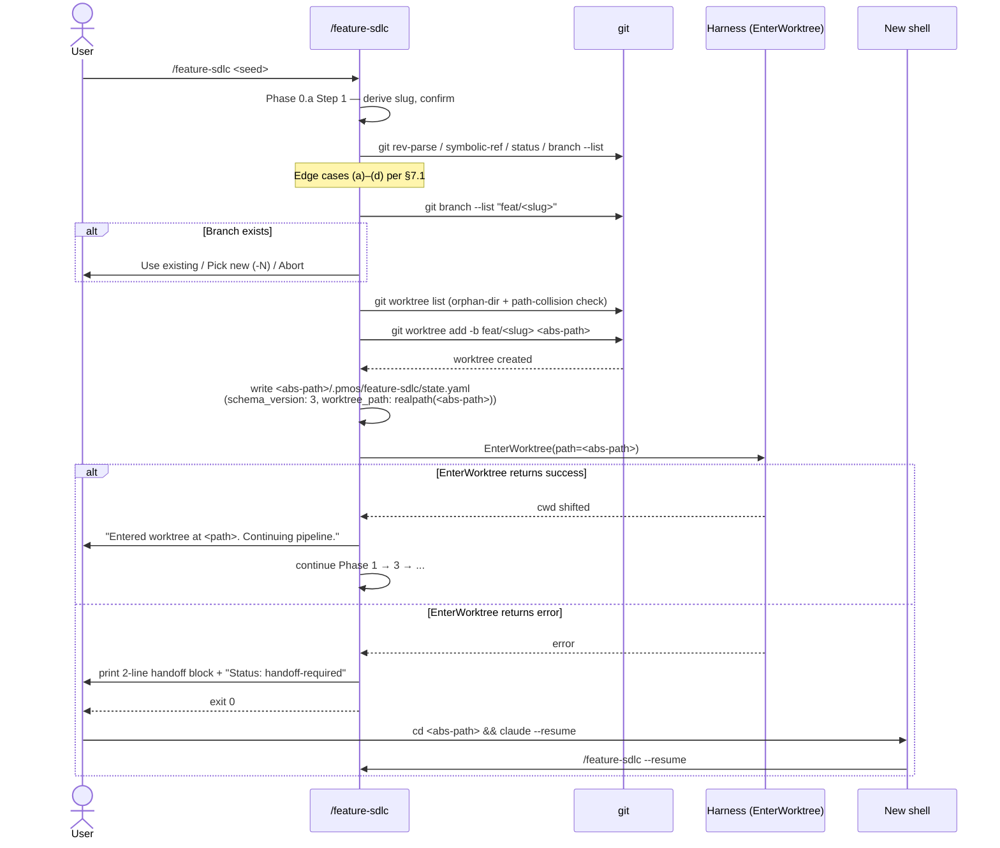
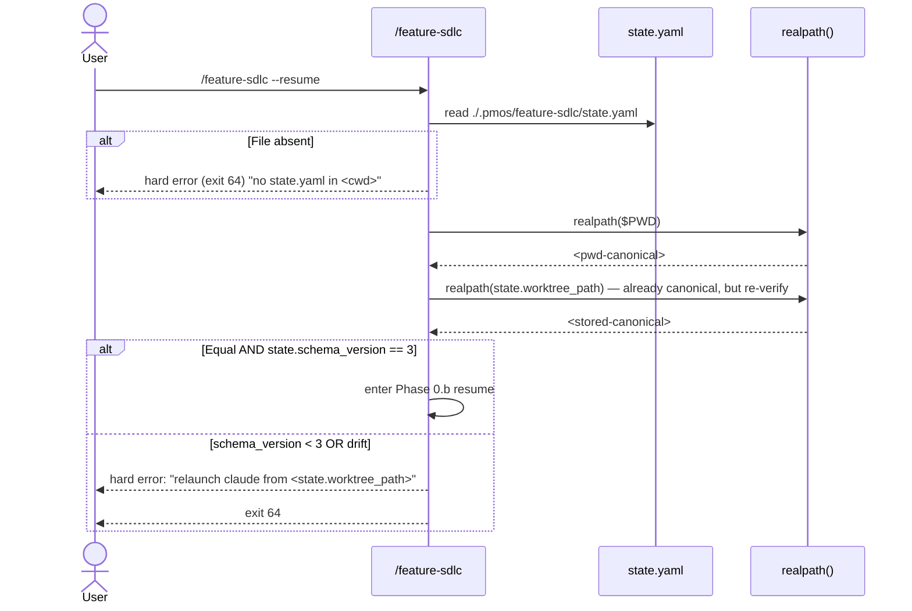

# /feature-sdlc worktree + resume rework — Spec

---

## 1. Problem Statement {#problem-statement}

`/feature-sdlc` (v2.34.0) creates a git worktree via raw `git worktree add` but never shifts the harness session root into it. The result is silent drift: subagents and tool calls resolve relative paths against the launch directory, not the Bash `cwd`; `state.yaml` written under the worktree is unreachable from a `/compact`-resumed session that re-roots in main; and `.pmos/feature-sdlc/state.yaml` is currently *tracked in git*, so every new worktree inherits the previously-shipped feature's state.

This spec defines the worktree + resume rework that (a) uses `EnterWorktree` to shift the harness root in-session, (b) falls back to a literal copy-paste handoff when EnterWorktree errors, (c) detects drift on every entry via `realpath()` comparison, (d) untrack+gitignores the state file, (e) extends `/complete-dev` Phase 4 to remove the worktree on successful merge, and (f) adds a `/feature-sdlc list` subcommand for in-flight discovery.

Primary success metric: `/feature-sdlc --resume` lands on the correct phase 100% of the time when launched from inside the feature's worktree, after `/compact` or in a brand-new session.

---

## 2. Goals {#goals}

| # | Goal | Success Metric |
|---|------|---------------|
| G1 | `/feature-sdlc --resume` works after `/compact` or in a brand-new session, no flags | 100% of test runs land on the correct phase when launched from inside the worktree (manual: 3-phase pipeline × 2 features × `/compact` + relaunch) |
| G2 | 2–3 concurrent features can be in flight without collision | 3 terminal tabs × 3 worktrees × 3 distinct features run through `/spec` with zero state collision |
| G3 | Subagents inherit the correct worktree cwd | Spike-style: dispatched subagent's `git rev-parse --show-toplevel` matches `state.worktree_path` in 100% of trials |
| G4 | Stale state from prior features no longer leaks into new pipelines | `git ls-files .pmos/feature-sdlc/` is empty after this ships; new worktrees show no `state.yaml` until `/feature-sdlc` writes one |
| G5 | `/complete-dev` removes the worktree + branch on successful merge | After `/complete-dev`, `git worktree list` has no entry for the feature; `git branch --list feat/<slug>` is empty |

---

## 3. Non-Goals {#non-goals}

- **NOT** introducing symlinks from main repo to worktree state — symlinks cannot resolve N parallel worktrees.
- **NOT** adding a `--worktree <path>` flag on `--resume` — canonical path is `cd <worktree> && claude --resume`.
- **NOT** building cross-repo discovery (global `~/.pmos/feature-sdlc/index.yaml`) — adds concurrency, GC, lifecycle complexity for a niche need.
- **NOT** migrating already-running pre-rework pipelines in flight — they finish under old rules; pre-rework state files are detected and refused at runtime.
- **NOT** auto-stashing or auto-discarding uncommitted worktree edits during `/complete-dev` cleanup — refusing on dirty is the safe default.
- **NOT** ensuring `EnterWorktree`'s cwd shift survives `/compact` — the user accepted "relaunch in worktree" as a one-time effort; resumed sessions launch from the worktree, so cwd is correct from t=0.

---

## 4. Decision Log {#decision-log}

Carries D1–D15 from `01_requirements.md` verbatim (rationale + options preserved). Spec adds three implementation-level decisions:

| # | Decision | Options Considered | Rationale |
|---|----------|-------------------|-----------|
| D1–D15 | (See `01_requirements.md` §Design Decisions) | (preserved) | (preserved) |
| D16 | Schema bump v2 → v3 is **pure marker** — no new fields. v2 → v3 auto-migration sets `schema_version: 3` only; the `worktree_path` field already exists in v2. The new contract is *runtime* (realpath drift check). | (a) Add `worktree_canonical: true` boolean, (b) Pure marker bump, (c) Skip the bump and rely on drift check alone | (b) is minimal and defensible — the only new invariant is runtime-checked, not stored. Skipping the bump (option c) loses the cohort signal `/feature-sdlc list` needs to mark legacy worktrees. |
| D17 | `worktree_path` is canonicalized via `realpath` at **write time** (initial init, every status-transition update). Reads compare `realpath(pwd)` to the stored value via byte equality (already canonical). | (a) Canonicalize on read only, (b) Canonicalize on write only, (c) Canonicalize on both | (b) avoids per-read system calls and keeps the file deterministic. Once-canonical-always-canonical: macOS `/tmp` → `/private/tmp` is observed at write time and never drifts back. |
| D18 | `/feature-sdlc list` is implemented inline in `SKILL.md` Phase 0 dispatch (not a separate skill). Trigger: argument string matches `^list(\s|$)`. Output: chat-only Markdown table; no on-disk artifact. | (a) Separate `/feature-sdlc-list` skill, (b) Inline subcommand, (c) Generated `<feature_folder>/_index.md` | (b) avoids a second skill manifest entry; the logic is ~30 lines of bash + state.yaml reads. (c) is rejected per D7 (chat-only). |

---

## 5. User Personas & Journeys {#user-personas--journeys}

### 5.1 Persona — Pipeline-driving repo owner {#persona--pipeline-driving-repo-owner}

A developer running `/feature-sdlc` end-to-end on their own machine, typically against pmos-toolkit itself or an adjacent project. Comfortable with `git worktree`, terminal tabs, and `/compact`. Wants 2–3 features in flight without ceremony, and zero silent drift.

### 5.2 Primary Journey: single feature, `EnterWorktree` succeeds {#primary-journey-single-feature-enterworktree-succeeds}

(See `01_requirements.md` §Primary Journey.) The session entered via `claude` from main repo proceeds in-place after `EnterWorktree` shifts the root. After `/compact` the user runs `claude --resume` from a new shell launched inside the worktree (`cd <worktree> && claude --resume`); `/feature-sdlc --resume` reads `./.pmos/feature-sdlc/state.yaml` and lands on the right phase. `/complete-dev` cleans the worktree on success.

### 5.3 Handoff Journey: `EnterWorktree` errors {#handoff-journey-enterworktree-errors}

(See `01_requirements.md` §Alternate Journey — handoff path.) Skill prints the literal copy-paste 2-line block + `Status: handoff-required`, exits 0.

### 5.4 Parallel Journey: 2–3 concurrent features {#parallel-journey-23-concurrent-features}

(See `01_requirements.md` §Alternate Journey — parallel features.) Tab-per-worktree, no shared state.

### 5.5 Discovery Journey: `/feature-sdlc list` {#discovery-journey-feature-sdlc-list}

(See `01_requirements.md` §Discovery Journey.) Emits a Markdown table with one row per worktree carrying `feat/*` branches × per-worktree state.yaml.

### 5.6 Sequence Diagrams {#sequence-diagrams}

#### 5.6.1 Worktree creation + try-then-handoff (Phase 0.a)



#### 5.6.2 Drift check on `/feature-sdlc --resume`



#### 5.6.3 `/complete-dev` Phase 4 — ExitWorktree-then-remove

```mermaid
sequenceDiagram
    actor U as User
    participant CD as /complete-dev
    participant G as git
    participant H as Harness (ExitWorktree)

    Note over CD: Phase 3 merged feat/<slug> → main
    CD->>U: "Worktree at <path> can be removed. Remove? (Recommended) / Keep / Cancel"
    U->>CD: Remove
    CD->>G: git status --porcelain <worktree>/ (excl. .pmos/feature-sdlc/)
    alt Dirty (untracked or modified tracked)
        alt --force-cleanup passed
            CD->>G: git worktree remove --force <path>
        else
            CD-->>U: surface raw git error; refuse
            CD-->>U: stop (manual cleanup required)
        end
    else Clean
        CD->>H: ExitWorktree(action=keep)
        alt success (original-session case)
            H-->>CD: cwd back at <root-main>
        else no-op (resumed-session case)
            H-->>CD: returns "not entered by this session"
            CD->>U: print "cd <root-main-path>" fallback instruction
        end
        CD->>G: git worktree remove <path>
        G-->>CD: removed
        CD->>G: git branch -D feat/<slug>
    end
```

---

## 6. System Design {#system-design}

### 6.1 Architecture Overview {#architecture-overview}

The rework is entirely within `/feature-sdlc` (Phase 0.a, 0.b, 1) and `/complete-dev` (Phase 4). No new services, no new infrastructure. The harness primitives `EnterWorktree` and `ExitWorktree` are existing tools. State storage remains the same path; only the *contract* changes (canonical at write time, drift-checked on entry).

```
┌─────────────────────────────────────────────────────────────┐
│                    User session (claude)                     │
│                                                              │
│  ┌──────────────┐    EnterWorktree(path)    ┌─────────────┐ │
│  │ /feature-sdlc├──────────────────────────►│ Harness     │ │
│  │ Phase 0.a    │◄──────────────────────────┤ (cwd shift) │ │
│  └──────┬───────┘                            └─────────────┘ │
│         │                                                    │
│         │ git worktree add -b feat/<slug> <abs>             │
│         ▼                                                    │
│  ┌──────────────────────────────────────────────────────┐   │
│  │  <worktree>/.pmos/feature-sdlc/state.yaml            │   │
│  │  (schema_version: 3, worktree_path: realpath, ...)   │   │
│  └──────────────────────────────────────────────────────┘   │
│         │                                                    │
│         ▼  (subagents inherit shifted cwd)                   │
│  ┌──────────────┐  ┌──────────────┐  ┌──────────────┐       │
│  │ /requirements │ │ /spec        │ │ /plan ...    │       │
│  └──────────────┘  └──────────────┘  └──────────────┘       │
└─────────────────────────────────────────────────────────────┘

After /complete-dev Phase 4:
   ExitWorktree(action=keep)  → original-session cwd shift
   git worktree remove <path> → worktree gone, branch deleted
```

**Component boundaries:**
- `/feature-sdlc` Phase 0.a — worktree add + state init + EnterWorktree attempt + handoff fallback.
- `/feature-sdlc` Phase 0.b — resume entry + drift check + schema-version check.
- `/feature-sdlc` Phase 0 dispatch — `list` subcommand short-circuit.
- `/complete-dev` Phase 4 — extended cleanup with ExitWorktree-then-remove.
- `_shared/canonical-path.md` (NEW) — one-line `realpath` invocation contract reused by both skills.

### 6.2 State storage {#state-storage}

`<worktree>/.pmos/feature-sdlc/state.yaml` (per-worktree only). `.pmos/feature-sdlc/` is gitignored. The directory is created via `mkdir -p` on first write; its parent `.pmos/` already exists per repo convention.

---

## 7. Functional Requirements {#functional-requirements}

### 7.1 Worktree creation + entry (Phase 0.a) {#worktree-creation--entry-phase-0a}

| ID | Requirement |
|----|-------------|
| FR-W01 | `/feature-sdlc <seed>` (no `--no-worktree`, no `--resume`) MUST: derive slug → run unified pre-flight (FR-PA01) → `git worktree add -b feat/<slug> <abs-path>` → write `state.yaml` (FR-S02) → call `EnterWorktree(path=<abs-path>)`. The state.yaml write MUST occur **before** `EnterWorktree` so the file exists in the worktree if EnterWorktree errors. |
| FR-W02 | On `EnterWorktree` returning error of any kind, `/feature-sdlc` MUST emit, in this order: (a) the literal handoff block (FR-W04), (b) one blank line, (c) the standalone chat line `Status: handoff-required` (no surrounding text — grep-able by wrapper scripts). Then exit with code 0. |
| FR-W03 | On `EnterWorktree` returning success, `/feature-sdlc` MUST print `Entered worktree at <path> on branch feat/<slug>. Continuing pipeline.` and proceed to Phase 1. |
| FR-W04 | The handoff block is plain text emitted to chat — no Markdown formatting, no HTML, no code fence. Byte-for-byte content (literal newlines, four-space indents on the two command lines): <pre>Worktree created at \<abs-worktree-path\>.\nState initialized at \<worktree\>/.pmos/feature-sdlc/state.yaml.\n\nTo continue the pipeline, run these two commands in a new terminal:\n\n    cd \<abs-worktree-path\>\n    claude --resume\n\nThen call /feature-sdlc --resume in the new session.</pre> The `<pre>` tags above are spec-rendering artifacts only; the emitted text contains no tags. Substitute `<abs-worktree-path>` (canonical realpath) in both occurrences — no other interpolation. |
| FR-W05 | When `--no-worktree` is passed, `/feature-sdlc` MUST skip Phase 0.a entirely: no `git worktree add`, no `EnterWorktree`, no drift check. State path is `./.pmos/feature-sdlc/state.yaml` in the launch cwd; `state.worktree_path: null`, `state.branch: null`. |

### 7.2 Phase 0.a unified pre-flight {#phase-0a-unified-pre-flight}

| ID | Requirement |
|----|-------------|
| FR-PA01 | Before `git worktree add`, the skill MUST check: (1) cwd is a git repo (`git rev-parse --is-inside-work-tree`); (2) HEAD is not detached (`git symbolic-ref -q HEAD`); (3) working tree is clean (`git status --porcelain` empty); (4) candidate worktree path `<repo-parent>/<repo-name>-<slug>/` does not exist as a directory; (5) `feat/<slug>` branch does not exist (`git branch --list "feat/<slug>"`); (6) the slug is not already registered in `git worktree list` under any path. |
| FR-PA02 | On (1)–(3) failure: abort with the precise git error and the suggested fix per `01_requirements.md` §Empty States table (e.g., `dirty tree — commit/stash or pass --no-worktree`). |
| FR-PA03 | On (4) OR (5) OR (6) collision: emit a single `AskUserQuestion` with options **Use existing branch / worktree (Recommended)** / **Pick new slug (-2 suffix)** / **Abort**. "Use existing" enters Phase 0.b resume mode if state.yaml is present in the existing worktree path; otherwise initializes state.yaml fresh on top of the existing branch with `state.notes` annotated `"reused-existing-branch:<reason>"`. "Pick new slug" appends `-2`, `-3`, ... to the slug and re-runs the pre-flight (idempotent). |
| FR-PA04 | Orphan-dir handling: if (4) fires (path exists) but (6) does not (path not in `git worktree list`), the dialog wording MUST include `(orphan worktree dir detected — git no longer tracks it)` so the user knows manual cleanup may be needed before "Use existing" can succeed. |

### 7.3 Resume entry + drift check (Phase 0.b) {#resume-entry--drift-check-phase-0b}

| ID | Requirement |
|----|-------------|
| FR-R01 | `/feature-sdlc --resume` (no other args) MUST: read `./.pmos/feature-sdlc/state.yaml` from cwd; on absence emit `--resume specified but no .pmos/feature-sdlc/state.yaml found in <cwd>. Either cd to the right worktree or omit --resume.` and exit 64. |
| FR-R02 | On state.yaml present, the skill MUST run the drift check **before any other validation**: compute `realpath($PWD)` and compare byte-equal to `state.worktree_path` (already canonical per FR-S03). On mismatch: emit `pre-flight check failed: realpath(pwd) [<actual>] != realpath(state.worktree_path) [<expected>]. Relaunch claude from <expected> and try again.` and exit 64. |
| FR-R03 | When `--no-worktree` is passed AND `state.worktree_path` is `null`, the drift check is bypassed (the field is intentionally null in `--no-worktree` mode). |
| FR-R04 | On `state.schema_version > 3` (a state file from a newer skill): abort with `state file from newer /feature-sdlc version (vN); upgrade pmos-toolkit and retry`. |
| FR-R05 | On `state.schema_version < 3`: if drift check passed (the v2 file is in the right worktree), auto-migrate by setting `schema_version: 3` and emit chat line `migration: state.schema vN → v3 (cohort-marker bump only; no field changes)`. If drift check failed, the FR-R02 error already fired and migration never happens. |
| FR-R06 | Status table (presentational) prints to chat after drift + schema checks pass. Resume cursor advances to the first phase whose status is in `{paused, failed, pending, in_progress}`. |
| FR-R07 | Phase 0.a (worktree creation) and Phase 1 (state init) MUST be skipped on resume. |

### 7.4 State file (schema v3) {#state-file-schema-v3}

| ID | Requirement |
|----|-------------|
| FR-S01 | `state.yaml` schema v3 is **purely additive** over v2: no new fields, no removals, no renames. The only delta is the cohort marker `schema_version: 3` and the runtime invariant that `worktree_path` is realpath-canonical at write time. |
| FR-S02 | On initial write (Phase 1), `worktree_path` MUST be set to `realpath(<abs-worktree-path>)`. On `--no-worktree`, set `worktree_path: null` and `branch: null`. |
| FR-S03 | On every status-transition write that touches `worktree_path`, the value MUST be re-canonicalized via `realpath`. (In practice no other write path mutates this field; the canonicalization rule is mostly a no-op invariant.) |
| FR-S04 | Auto-migration v2 → v3: set `schema_version: 3`. No other changes. v1 → v3 chains through the existing v1 → v2 migration in `state-schema.md` first, then v2 → v3. |
| FR-S05 | Atomic writes: existing temp+rename + reaper contract from v2 (`reference/state-schema.md` §Atomicity D31, NFR-08) is preserved verbatim. |

### 7.5 Gitignore migration {#gitignore-migration}

| ID | Requirement |
|----|-------------|
| FR-G01 | The repo's `.gitignore` MUST add `.pmos/feature-sdlc/` (trailing slash; directory match) above the existing `.pmos/current-feature` line for adjacency. |
| FR-G02 | The currently-tracked `.pmos/feature-sdlc/state.yaml` MUST be removed from tracking via `git rm --cached .pmos/feature-sdlc/state.yaml` in the same commit as the `.gitignore` change. The file remains on disk; the worktree continues to work. |
| FR-G03 | After ship, `git ls-files .pmos/feature-sdlc/` MUST return empty. Verify in `/verify` Phase. |

### 7.6 `/feature-sdlc list` subcommand {#feature-sdlc-list-subcommand}

| ID | Requirement |
|----|-------------|
| FR-L01 | When `/feature-sdlc list` is invoked (argument string matches `^list(\s|$)`), the skill MUST short-circuit at Phase 0 dispatch: skip pipeline-setup, skip Phase 0.a, skip Phase 0.b, run the list logic, emit the table, exit 0. |
| FR-L02 | List logic: run `git worktree list --porcelain` in the current repo root; **filter to entries whose branch matches `feat/*`** (the main checkout and any non-feature branch worktrees are excluded); for each remaining worktree entry, attempt to read `<worktree>/.pmos/feature-sdlc/state.yaml`; tabulate. |
| FR-L03 | Output is a single Markdown table emitted to chat. Columns: `Slug | Branch | Phase | Last updated | Worktree`. Rows ordered by `state.last_updated` descending; ties are broken by `slug` alphabetical ascending; worktrees with no state.yaml sort last (also slug-alphabetical among themselves). |
| FR-L04 | Worktrees whose `state.schema_version < 3` MUST appear with `(legacy v1/v2)` appended to the Phase column (not Slug — keeps Slug greppable). |
| FR-L05 | Worktrees with no `state.yaml` MUST appear with `Phase = (no state)` — no crash. |
| FR-L06 | If `git worktree list` errors (cwd is not a git repo), surface the raw git error and exit 64. |
| FR-L07 | If the result set is empty, emit the helpful note `No in-flight features. Start one with /feature-sdlc <seed>.` (no table). |
| FR-L08 | Stale-detection (`state.last_updated` older than N days) is **out of scope for this rework** — Open Question OQ#1 from `01_requirements.md` is closed as deferred. The list emits raw timestamps; humans judge staleness. |

### 7.7 `/complete-dev` Phase 4 cleanup {#complete-dev-phase-4-cleanup}

| ID | Requirement |
|----|-------------|
| FR-CD01 | After Phase 3 merge succeeds AND user picks "Remove worktree" at the existing Phase 4 gate, `/complete-dev` MUST: (1) compute dirty status excluding `.pmos/feature-sdlc/` (FR-CD03); (2) on dirty + no `--force-cleanup`, refuse and surface the raw git error; (3) on clean, call `ExitWorktree(action=keep)`; (4) on ExitWorktree no-op, print `cd <root-main-path>` fallback instruction; (5) call `git worktree remove <path>` (no `--force`); (6) call `git branch -D feat/<slug>`. |
| FR-CD02 | `--force-cleanup` flag (new): when present, replaces the dirty-refusal in step (2) with `git worktree remove --force <path>` proceeding regardless of dirty state. The flag MUST be enumerated in the `argument-hint` frontmatter. |
| FR-CD03 | Dirty-status check: query the worktree's tracked + untracked status, **excluding the entire `.pmos/feature-sdlc/` subtree** (state.yaml is gitignored but exists on disk and would otherwise count as untracked). Non-empty result set = dirty. The exact git invocation (porcelain flags, pathspec syntax, or two-step `git ls-files --others --exclude-standard` + `git diff --name-only`) is left to /plan to pin against the installed git version; the contract is the exclusion + the boolean result. |
| FR-CD04 | The "ExitWorktree no-op" condition is detected by ExitWorktree's documented "Must not already be in a worktree" / "Must have entered the worktree this session" return contract. The skill MUST treat any non-success return from ExitWorktree as no-op (do not abort), then print the fallback `cd` instruction and proceed to `git worktree remove`. |
| FR-CD05 | The fallback `cd` instruction MUST read exactly: `Worktree removed. After this session ends, run: cd <root-main-path>` where `<root-main-path>` is the first entry of `git worktree list` (the main checkout). |
| FR-CD06 | When the merge target is the current cwd (Phase 2 detected `--no-worktree` or non-worktree session), Phase 4 MUST be skipped entirely with chat line `Phase 4 skipped: not in a worktree.` |

### 7.8 Shared canonical-path helper {#shared-canonical-path-helper}

| ID | Requirement |
|----|-------------|
| FR-SH01 | A new `_shared/canonical-path.md` reference MUST document the contract: "All worktree paths in pmos-toolkit pipeline state files are stored as `realpath()` output. Use `realpath -- "$path"` (or `python3 -c 'import os,sys; print(os.path.realpath(sys.argv[1]))' "$path"` on systems without `realpath`). Compare via byte equality." Both `/feature-sdlc` and `/complete-dev` cite this file. |

---

## 8. Non-Functional Requirements {#non-functional-requirements}

| ID | Category | Requirement |
|----|----------|-------------|
| NFR-01 | Architecture purity | No symlinks created from main repo to worktree state, ever. `grep -rn "ln -s" plugins/pmos-toolkit/skills/{feature-sdlc,complete-dev}/` returns empty after ship. |
| NFR-02 | Atomicity | State.yaml writes preserve the existing v2 temp+rename + reaper contract (`state-schema.md` §Atomicity D31, NFR-08). No orphan `.tmp` files. |
| NFR-03 | Backwards compatibility | v2 state files in active worktrees auto-migrate to v3 on read (FR-S04). v2 files in the main repo (legacy committed artifact) trigger the drift refusal (FR-R02), not migration. |
| NFR-04 | Determinism | The handoff message is byte-identical across runs given the same `<abs-worktree-path>`. No timestamps, no PIDs, no hostnames in the block (FR-W04). |
| NFR-05 | Wrapper compatibility | `/loop`, `/schedule`, and other process wrappers see exit code 0 on the handoff path (FR-W02). The `Status: handoff-required` line is the only signal to the human reader. |
| NFR-06 | Observability | Every skill entry that runs the drift check MUST log to chat the line `drift check: realpath(pwd)=<a> realpath(state.worktree_path)=<b> result=<pass\|fail>` before any further action. Helps debug user reports of unexpected refusals. |
| NFR-07 | Idempotency | `/feature-sdlc list` is a pure read; running it 100 times in a row produces identical output (modulo `last_updated` timestamps). No on-disk side effects. |

---

## 9. API Contracts {#api-contracts}

This rework introduces no HTTP/RPC APIs. The "contracts" are tool invocations and exit semantics.

### 9.1 `EnterWorktree(path=<abs-path>)` invocation {#enterworktree-invocation}

**Caller:** `/feature-sdlc` Phase 0.a.

**Args:** `path` = realpath-canonical absolute path to the just-created worktree directory.

**Success return:** harness returns success → cwd is shifted; skill continues.

**Error return:** any non-success → skill enters handoff path (FR-W02). The skill MUST NOT inspect the error message to differentiate retry-able from terminal failures; all errors handed off identically (per D2 — try-then-handoff).

### 9.2 `ExitWorktree(action=keep)` invocation {#exitworktree-invocation}

**Caller:** `/complete-dev` Phase 4.

**Args:** `action: "keep"` — preserves the worktree directory contents on disk; the harness only restores cwd to the parent session's root.

**Success return:** cwd restored to the launch directory of the enclosing `claude` invocation.

**No-op return:** harness signals "not entered by this session" or equivalent → skill prints fallback `cd` instruction (FR-CD05) and continues to `git worktree remove`. Treated as success-equivalent.

### 9.3 Exit codes {#exit-codes}

| Code | Skill | Meaning |
|------|-------|---------|
| 0 | `/feature-sdlc` | Pipeline running, handoff required, or pause clean |
| 0 | `/feature-sdlc list` | List emitted (even when empty) |
| 0 | `/complete-dev` | All phases passed |
| 64 | `/feature-sdlc --resume` | Drift check failed, schema too new, or no state.yaml in cwd |
| 64 | `/feature-sdlc list` | cwd not a git repo |
| 64 | `/feature-sdlc` | Worktree pre-flight failure (dirty tree, detached HEAD, not-a-repo) — surfaces git error |
| nonzero (passthrough) | `/complete-dev` Phase 4 | `git worktree remove` refused on dirty (no `--force-cleanup`); raw git exit code surfaced |

---

## 10. Database Design {#database-design}

No database changes. The single state file is `state.yaml`; its schema is documented in `feature-sdlc/reference/state-schema.md` and updated in this rework.

### 10.1 `state-schema.md` v3 delta {#state-schemamd-v3-delta}

Append a new section to `state-schema.md`:

```markdown
## Schema v3 (added 2026-05-10)

v3 is a **pure cohort-marker bump** over v2 — no field additions, no removals, no renames. The only behavioral change is a runtime invariant: `worktree_path` is `realpath()`-canonical at write time, and `/feature-sdlc` performs a drift check (`realpath($PWD) == state.worktree_path`) on every entry that loads the state file.

### What's new in v3

- Nothing structural. `schema_version: 3` is the cohort marker.

### v2 → v3 auto-migration block (1 step, idempotent)

Performed on read whenever `state.schema_version < 3` AND the drift check has passed:

1. Set `schema_version: 3`. Emit chat log line: `migration: state.schema v2 → v3 (cohort-marker bump only; no field changes)`.

If the drift check fails (the v2 file is not in the worktree it claims), `/feature-sdlc --resume` aborts with the relaunch instruction; migration is not attempted.

### `worktree_path` canonicalization (new in v3)

`worktree_path` is written as `realpath(<abs-worktree-path>)` on initial state.yaml init (`/feature-sdlc` Phase 1) and on every status-transition update that touches the field. Reads compare via byte equality against `realpath($PWD)`. Rationale: macOS canonicalizes `/tmp` → `/private/tmp`; string equality without realpath would false-fire on every macOS run.
```

---

## 11. Frontend Design {#frontend-design}

No frontend changes. This is a backend orchestrator skill rework. Chat-only output is plain Markdown; the resume status table and the `/feature-sdlc list` table are emitted via standard Markdown table syntax (per `_shared/interactive-prompts.md`).

---

## 12. Edge Cases {#edge-cases}

| # | Scenario | Condition | Expected Behavior |
|---|----------|-----------|-------------------|
| E1 | `--resume` with no state.yaml in cwd | User in wrong directory | Hard error per FR-R01, exit 64 |
| E2 | `--resume` with drift (cwd ≠ state.worktree_path) | Resumed session re-rooted in main; or user `cd`'d elsewhere | Hard error per FR-R02, exit 64 |
| E3 | `--resume` with `schema_version > 3` | State file from newer skill | Abort per FR-R04 |
| E4 | `--resume` with `schema_version < 3` AND drift OK | v2 file in correct worktree | Auto-migrate to v3 (FR-R05) |
| E5 | `--resume` with `schema_version < 3` AND drift fail | v2 legacy committed file in main | Drift error fires first; migration never runs |
| E6 | `/feature-sdlc list` in non-git cwd | git worktree list errors | Surface raw git error, exit 64 (FR-L06) |
| E7 | `/feature-sdlc list` empty result | No `feat/*` worktrees | Helpful note, no table (FR-L07) |
| E8 | `/feature-sdlc list` worktree with no state.yaml | User ran `--no-worktree` or deleted state | Row with `Phase = (no state)` (FR-L05) |
| E9 | `/feature-sdlc list` worktree manually moved | Path in `git worktree list` no longer exists | Row emitted with `Phase = (worktree path missing)` (FR-L05 extended); no crash |
| E10 | `/feature-sdlc list` with v1/v2 state | Legacy in-flight pipeline | Row with `(legacy v1/v2)` Phase suffix (FR-L04) |
| E11 | Phase 0.a branch collision | `feat/<slug>` exists | Use existing / Pick new (-N) / Abort dialog (FR-PA03) |
| E12 | Phase 0.a path collision (orphan worktree) | Path exists but not in `git worktree list` | Dialog includes orphan-warning text (FR-PA04) |
| E13 | Phase 0.a worktree-list collision | `git worktree list` already has `feat/<slug>` registered | Use-existing → enters resume; otherwise abort or pick-new (FR-PA03) |
| E14 | EnterWorktree fails because session is already in a worktree | User re-entered claude from inside a worktree, then ran `/feature-sdlc` | Handoff path fires per D2/D11; exit 0 (FR-W02) |
| E15 | `/complete-dev` Phase 4 dirty tree, no `--force-cleanup` | Untracked or modified tracked files in worktree (excluding `.pmos/feature-sdlc/`) | Refuse with raw git error per FR-CD01 step 2 |
| E16 | `/complete-dev` Phase 4 in resumed-from-worktree session | ExitWorktree returns no-op | Print fallback cd instruction (FR-CD05); proceed with worktree remove (FR-CD04) |
| E17 | `/complete-dev` Phase 4 with `--no-worktree`-mode pipeline | No worktree to clean | Skip Phase 4 entirely (FR-CD06) |
| E18 | Handoff printed but user runs `/feature-sdlc <fresh seed>` instead of `--resume` in new session | User forgot the resume step | Existing state.yaml triggers Phase 0.b detection naturally; surfaces resume-or-start-over dialog per existing skill behavior (no new code) |
| E19 | Concurrent writes to two different worktrees' state.yaml | 2 sessions running 2 features | No collision possible per D3 (per-worktree state); each session's atomic temp+rename only touches its own file |
| E20 | `state.yaml` lock-step with handoff: EnterWorktree errors AFTER state.yaml was written | New session resumes correctly because state.yaml is in the worktree | FR-W01 ordering guarantees this — state write before EnterWorktree call |

---

## 13. Configuration & Feature Flags {#configuration--feature-flags}

| Variable / flag | Default | Purpose |
|-----------------|---------|---------|
| `--no-worktree` (existing) | (off) | Bypass Phase 0.a entirely; state in cwd; no drift check (FR-W05, FR-R03) |
| `--force-cleanup` (new, `/complete-dev`) | (off) | In Phase 4, replace dirty-refusal with `git worktree remove --force` (FR-CD02) |
| `--resume` (existing) | (off) | Resume entry; activates FR-R01 through FR-R07 |
| `list` subcommand (new) | n/a | First positional arg `list` short-circuits to the discovery table (FR-L01) |

No environment variables. No feature flags in `.pmos/settings.yaml` — this rework is unconditional once shipped.

---

## 14. Testing & Verification Strategy {#testing--verification-strategy}

### 14.1 Unit-style shell tests {#unit-style-shell-tests}

Add to `plugins/pmos-toolkit/tools/test-feature-sdlc-worktree.sh` (new):

```bash
#!/usr/bin/env bash
# Verify drift check + canonicalization invariants. Run from any pmos-toolkit checkout.
set -euo pipefail

# Test 1: realpath canonicalization on macOS /tmp
ACTUAL="$(realpath /tmp)"
[ "$ACTUAL" = "/private/tmp" ] || { echo "FAIL: macOS canonicalization changed"; exit 1; }

# Test 2: drift check passes on byte-equal canonical paths
P1="$(realpath /tmp)"; P2="$(realpath /tmp)"
[ "$P1" = "$P2" ] || { echo "FAIL: idempotent realpath"; exit 1; }

# Test 3: drift check fails on different paths
P1="$(realpath /tmp)"; P2="$(realpath "$HOME")"
[ "$P1" != "$P2" ] || { echo "FAIL: distinct paths"; exit 1; }

echo "OK: canonical-path invariants hold"
```

### 14.2 Integration tests (manual, scripted) {#integration-tests-manual-scripted}

Add to `plugins/pmos-toolkit/tools/verify-feature-sdlc-worktree.sh` (new) — scripted manual verifications keyed off `git worktree` operations:

1. **FR-W01 happy path:** Create temp repo, run a stub `/feature-sdlc` invocation that exercises Phase 0.a only (no real pipeline), assert `git worktree list` has one entry and `<wt>/.pmos/feature-sdlc/state.yaml` exists with `schema_version: 3`.
2. **FR-W02 handoff:** Stub EnterWorktree to return error; assert handoff block emitted with exact 5-line shape, `Status: handoff-required` chat line present, exit 0.
3. **FR-D01 drift pass:** stub state with `worktree_path=$(realpath /tmp/foo)`, cd to `/tmp/foo` (which symlinks to `/private/tmp/foo`); assert pass.
4. **FR-D02 drift fail:** stub state with `worktree_path=/private/tmp/foo`, cd to `/private/tmp/bar`; assert hard-error + exit 64.
5. **FR-G01:** assert `.gitignore` contains `.pmos/feature-sdlc/` and `git ls-files .pmos/feature-sdlc/` is empty.
6. **FR-L01–L07:** create 3 worktrees (one v3, one v1/v2, one bare); run `/feature-sdlc list`; assert 3-row table with correct markers.
7. **FR-CD01 + FR-CD04:** run a full mini-pipeline through `/complete-dev` Phase 4 in original session; assert ExitWorktree called, `git worktree list` decremented, branch deleted.
8. **FR-CD02:** leave an untracked file in worktree; assert `/complete-dev` (no flag) refuses with raw git error; assert `/complete-dev --force-cleanup` removes anyway.

### 14.3 End-to-end dogfood {#end-to-end-dogfood}

The current pipeline (this very feature, `feature-sdlc-worktree-resume`) IS the end-to-end test. Successful `/complete-dev` of this feature will exercise FR-CD01 through FR-CD06 against the production code.

A second dogfood test: after this feature ships, kick off two parallel small features (Tier-1 fix + Tier-2 enhancement) in separate tabs, take both through `/spec`, `/compact` between, and verify zero collision.

### 14.4 `/verify` Phase coverage gates {#verify-phase-coverage-gates}

The standing `/verify` skill MUST be invoked with this spec at the spec path. Coverage gates:

- Every FR-W*, FR-PA*, FR-R*, FR-S*, FR-G*, FR-L*, FR-CD*, FR-SH* row MUST have a verification step in §14.1 or §14.2 OR a `/verify` interactive QA step.
- The `/verify` reviewer subagent (for spec quality) MUST quote at least one passage from each major section (§7.1–§7.8).

### 14.5 Exact verification commands {#exact-verification-commands}

```bash
# After ship, from the main checkout:
git ls-files .pmos/feature-sdlc/
# Expected: empty

cat .gitignore | grep -F ".pmos/feature-sdlc/"
# Expected: .pmos/feature-sdlc/

bash plugins/pmos-toolkit/tools/test-feature-sdlc-worktree.sh
# Expected: OK: canonical-path invariants hold

# Per integration test:
bash plugins/pmos-toolkit/tools/verify-feature-sdlc-worktree.sh
# Expected: all 8 cases PASS

# Per dogfood:
# (Run this very feature through /complete-dev; observe FR-CD01..06 fire.)
git worktree list
# Expected: only the main checkout entry; no feat/feature-sdlc-worktree-resume entry

git branch --list "feat/feature-sdlc-worktree-resume"
# Expected: empty
```

---

## 15. Rollout Strategy {#rollout-strategy}

### 15.1 Migration order {#migration-order}

1. **Single commit on this feature's branch:** `.gitignore` edit + `git rm --cached .pmos/feature-sdlc/state.yaml`. The state.yaml on disk in this very worktree continues to function (existing-on-disk file under a now-untracked path).
2. **Parallel commits:** edit `feature-sdlc/SKILL.md` Phase 0.a, 0.b, Phase 1; add `feature-sdlc/reference/state-schema.md` v3 section; add `_shared/canonical-path.md`; edit `complete-dev/SKILL.md` Phase 4; bump argument-hint and description fields.
3. **Tooling:** add `tools/test-feature-sdlc-worktree.sh` and `tools/verify-feature-sdlc-worktree.sh`.
4. **Manifest version bump:** both `plugins/pmos-toolkit/.claude-plugin/plugin.json` and `plugins/pmos-toolkit/.codex-plugin/plugin.json` bump together (per repo invariant). Minor version bump (new feature: list subcommand, schema v3, --force-cleanup flag).

### 15.2 Backwards compatibility {#backwards-compatibility}

- v2 state files in active worktrees: auto-migrate on read (FR-S04).
- v2 state files in the main repo (committed legacy artifact): drift check refuses; user finishes the legacy pipeline under the old skill version OR deletes the orphan and starts fresh.
- Existing `--no-worktree` users: behavior preserved; new drift check explicitly bypassed (FR-R03).

### 15.3 Rollback plan {#rollback-plan}

If a critical regression is discovered post-release: `git revert` the single feature commit (rework is contained to the listed files); re-publish the prior version. No DB or external state to undo. Users on the bumped version will continue to function (the rework is additive over v2).

### 15.4 Graceful degradation {#graceful-degradation}

- If `realpath` is unavailable (rare on POSIX systems): fall back to the python3 one-liner per FR-SH01. If neither is available: skill aborts at first drift check with a clear `realpath unavailable; install coreutils or python3` error. No silent string-equality fallback.
- If `git worktree list` is unavailable (very old git): `/feature-sdlc list` errors with an actionable upgrade message. Other paths don't depend on `--porcelain` (they run plain `git worktree add` / `remove`, available since git 2.5).

---

## 16. Research Sources {#research-sources}

| Source | Type | Key Takeaway |
|--------|------|-------------|
| `01_requirements.md` (this feature) | Internal | 15 design decisions D1–D15 + 5 user journeys + 5 success metrics; foundation for this spec. |
| `grills/2026-05-10_01_requirements.md` | Internal | 6 grill questions; Q1–Q5 closed inline (added D11–D14); Q6 closed by D15. OQ#3 + #4 closed implicitly. |
| `feature-sdlc/SKILL.md` v2.34.0 | Existing code | Source of Phase 0.a edge-case dialog (a)–(d), Phase 0.b resume protocol, status-transition write contract. This rework extends each. |
| `feature-sdlc/reference/state-schema.md` v2 | Existing code | Schema v2 atomicity (D31, NFR-08) and v1→v2 migration block — both preserved by FR-S05. v3 section appends here. |
| `complete-dev/SKILL.md` v2.34.0 | Existing code | Phase 4 already has a Remove/Keep/Cancel gate and runs `git worktree remove <path>` (no --force). FR-CD01 extends with ExitWorktree-then-remove and dirty-aware refusal. |
| `_shared/interactive-prompts.md` | Existing code | Markdown table fallback when `AskUserQuestion` unavailable; `/feature-sdlc list` reuses this convention. |
| Pre-pipeline empirical spike (this session, 2026-05-10) | Live test | Confirmed: subagents inherit EnterWorktree-shifted cwd; macOS `/tmp` → `/private/tmp` canonicalization; ExitWorktree refuses externally-created worktrees. |

---

## 17. Silent Roles Considered {#silent-roles-considered}

```text
Silent roles considered:
- Principal Architect — decisions D1–D18 fully cover system shape; data-flow trace property does not fire (this feature has no write→read pipeline).
- Database Administrator — no DB changes; only state.yaml schema, covered by §10.
- Principal Designer — no frontend changes; chat-only output covered by §11 reference to _shared/interactive-prompts.md.
- Product Director — 5 user journeys + 5 success metrics in 01_requirements.md; no gap.
- DevOps Engineer — no deploy-time changes beyond /complete-dev's existing Phase 15 push/tag flow; rollout strategy covered by §15.
- Senior Analyst — FR coverage cross-checked against requirements goals G1–G5: G1↔FR-R*, G2↔FR-W*+FR-PA*+D3, G3↔FR-W03+spike record, G4↔FR-G*, G5↔FR-CD*. Every goal traces to ≥1 FR.
```

---

## 18. Review Log {#review-log}

| Loop | Findings | Changes Made |
|------|----------|-------------|
| 1 | F1 [Should-fix] FR-L02 missing `feat/*` branch filter; F2 [Nit] FR-W04 ambiguous re plain-text vs markup; F3 [Nit] FR-L03 no tie-break rule; F4 [Should-fix] `Status: handoff-required` line ambiguous re placement; F5 [Nit] FR-CD03 over-pinned a specific git pathspec syntax. | All 5 dispositioned **Fix as proposed**. FR-L02 now filters `feat/*`; FR-L03 ties broken by slug-alpha; FR-W02 separates the status line; FR-W04 clarifies plain-text emission; FR-CD03 specifies intent over syntax. |
| 2 (Phase 7 fresh-eyes pass) | No Blocker/Should-fix findings. Conciseness, engineer-readability, and cross-section coherence (§6 ↔ §7 ↔ §10) all pass. | None. |
| 6.5 (folded simulate-spec) | Skipped per user — design surface already heavily adversarial-tested by /grill (Q1–Q6, 5 closed OQs) and §12 (E1–E20 edge cases). No formal simulate-spec apply-loop run. `state.yaml.phases.spec.folded_phase_failures` remains empty. | None. |
