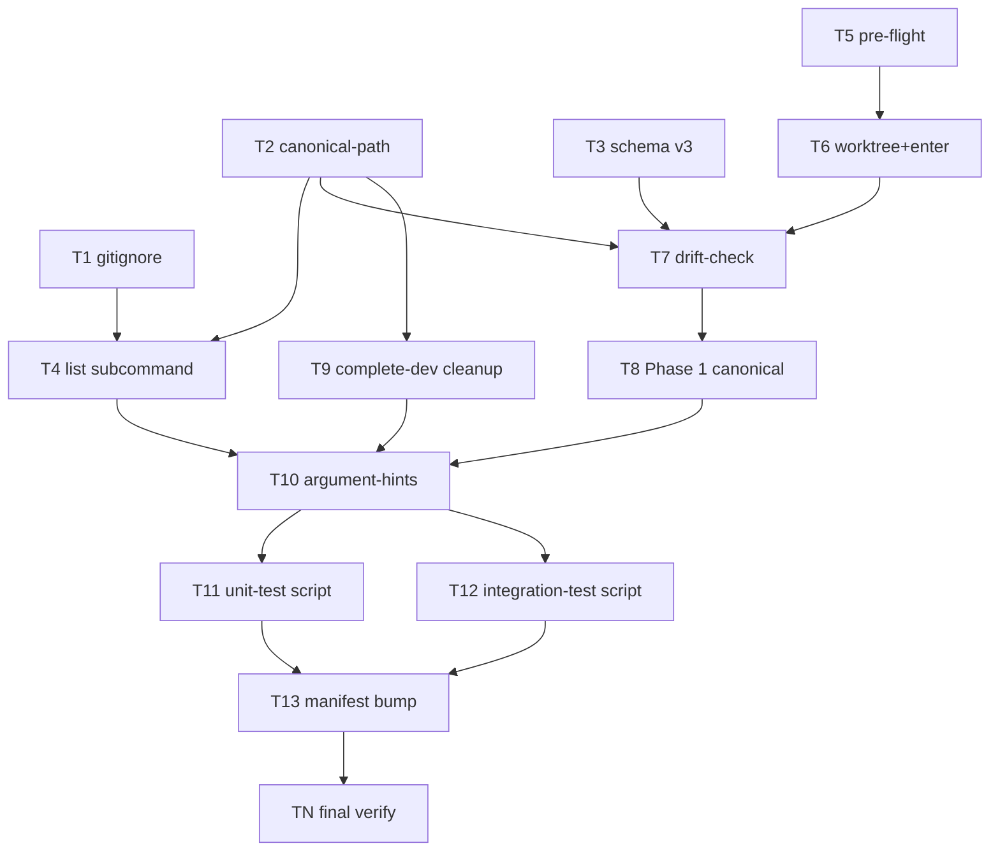

# /feature-sdlc worktree + resume rework — Implementation Plan

---

## Overview {#overview}

Implement the worktree + resume rework defined in `02_spec.md`. The change spans two skills (`/feature-sdlc`, `/complete-dev`), one new shared reference (`_shared/canonical-path.md`), root `.gitignore`, and both plugin manifests. Implementation is sequenced foundations-first (gitignore + shared doc + schema v3 marker) so subsequent skill edits can cite stable references; skill body edits next; cleanup + tooling last; release ceremony in TN.

**Done when:** `feature-sdlc/SKILL.md` Phase 0 dispatches `list`, Phase 0.a runs unified pre-flight + try-then-handoff, Phase 0.b runs the realpath drift check; `complete-dev/SKILL.md` Phase 4 invokes `ExitWorktree(action=keep)` then `git worktree remove` with `--force-cleanup` escape; root `.gitignore` excludes `.pmos/feature-sdlc/`; `git ls-files .pmos/feature-sdlc/` returns empty; both plugin manifests carry the bumped minor version (byte-identical descriptions); `bash plugins/pmos-toolkit/tools/test-feature-sdlc-worktree.sh` exits 0; `bash plugins/pmos-toolkit/tools/verify-feature-sdlc-worktree.sh` reports all 8 cases PASS; `grep -rn "ln -s" plugins/pmos-toolkit/skills/{feature-sdlc,complete-dev}/` returns empty.

**Done-when walkthrough:** (1) Run `grep -n "list subcommand" plugins/pmos-toolkit/skills/feature-sdlc/SKILL.md` — non-empty (T4 landed). (2) Run `grep -n "EnterWorktree" plugins/pmos-toolkit/skills/feature-sdlc/SKILL.md` — non-empty (T6 landed). (3) Run `grep -n "realpath" plugins/pmos-toolkit/skills/feature-sdlc/SKILL.md` — non-empty (T7 landed). (4) Run `grep -n "ExitWorktree" plugins/pmos-toolkit/skills/complete-dev/SKILL.md` — non-empty (T9 landed). (5) Run `grep -F ".pmos/feature-sdlc/" .gitignore` — matches (T1). (6) Run `git ls-files .pmos/feature-sdlc/` — empty (T1). (7) Run `bash plugins/pmos-toolkit/tools/test-feature-sdlc-worktree.sh` — prints `OK: canonical-path invariants hold` (T11). (8) Run `bash plugins/pmos-toolkit/tools/verify-feature-sdlc-worktree.sh` — exits 0, prints `8/8 PASS` (T12). (9) Run `diff <(jq -r .version plugins/pmos-toolkit/.claude-plugin/plugin.json) <(jq -r .version plugins/pmos-toolkit/.codex-plugin/plugin.json)` — empty (T13).

**Execution order:**

```
T1 gitignore ──┐
T2 canonical-path ──┐
T3 schema v3 ───────┤
                    ├──> T4 list subcommand ─┐
                    │                        │
                    └──> T5 pre-flight ──────┤
                                             ├──> T6 worktree+enter ──> T7 drift-check ──> T8 Phase-1 canonical
                                             │
                                             └──> T9 complete-dev cleanup
                                                              │
                                                              └──> T10 argument-hints (both skills)
                                                                              │
                            ┌─────────────────────────────────────────────────┘
                            │
                            ├──> T11 unit-test script
                            │
                            ├──> T12 integration-test script
                            │
                            └──> T13 manifest version bump ──> TN final verify
```

[P]-parallelizable groups: {T1, T2, T3} fan out from start; {T11, T12, T13} fan in to TN.



---

## Decision Log {#decision-log}

> Inherits architecture decisions D1–D18 from `02_spec.md` §4. Entries below are implementation-specific (planning-time) decisions.

| # | Decision | Options Considered | Rationale |
|---|----------|-------------------|-----------|
| P1 | All `feature-sdlc/SKILL.md` edits land in a single task per subsection (T4/T5/T6/T7/T8) rather than one mega-edit. | (a) Single-task all-of-SKILL.md; (b) Per-subsection tasks; (c) Per-FR tasks | (b). Per-FR tasks would fragment SKILL.md edits into ~25 micro-commits that all touch the same file (merge-conflict noise); single-task is too coarse to map to /verify granularity. Per-subsection is the right altitude — each task ships an independently reviewable chunk of one Phase. |
| P2 | TDD shape varies by task: shell-script tasks (T11, T12) follow new-feature TDD (write failing test first); SKILL.md edits (T4–T9) follow `no — config/orchestrator-prose` (FR-105) — author states the TDD-N/A reason in-task; integration is verified by T12. | (a) Force TDD on prose edits; (b) TDD-by-task-type; (c) Skip TDD entirely | (b). Markdown skill prose is not unit-testable in the conventional sense; FR-105 explicitly permits config/IaC TDD-skip with stated reason. The integration script T12 IS the regression suite for skill-prose changes — it exercises the resulting orchestrator behavior end-to-end. |
| P3 | Plugin manifest version bump (T13) bumps **minor** (e.g., 2.34.0 → 2.35.0) — adds new feature (`/feature-sdlc list`, schema v3, `--force-cleanup`) without breaking changes. | (a) Patch bump; (b) Minor bump; (c) Major bump | (b). Per semver: minor for new features without breaking changes. v2 state files auto-migrate on read (FR-S04); pre-rework state files refuse with actionable instruction; existing `--no-worktree` behavior preserved. No major bump warranted. |
| P4 | The `.pmos/feature-sdlc/state.yaml` currently in this worktree (committed in earlier phases of THIS pipeline) will be `git rm`'d in T1's commit AFTER `git rm --cached`. We let the file remain on disk (the running pipeline is reading it); its tracking is removed. Subsequent worktrees won't inherit it because main no longer carries it. | (a) `git rm --cached` only (file persists tracked-as-deleted in HEAD until next commit); (b) Both `git rm --cached` AND delete the file from disk; (c) Only delete from disk | (a) is what we want. The pipeline is mid-flight and consuming this very state.yaml; deleting from disk would crash the running run. Tracking removal is the contract; on-disk preservation is operational necessity. |
| P5 | Stack-file substitution: this repo is a **markdown skill plugin**. Test commands are shell scripts (`bash <path>`); lint is `shellcheck` if available, else best-effort; JSON validation is `jq`. No `_shared/stacks/<stack>.md` exists for this stack — Code Study Notes documents the choice as a reference-system override per FR-91. | (a) Adopt nearest stack file (Python? Bash?); (b) Author inline reference per FR-91; (c) Skip stack discovery | (b). Reference-system substitute documented in Code Study Notes; commands inlined directly into tasks. |

---

## Code Study Notes {#code-study-notes}

> Glossary inherited from spec — see `02_spec.md` for domain terminology (worktree, EnterWorktree/ExitWorktree, drift check, schema v3 marker, handoff path). The plan introduces no new domain terms.

### Patterns to follow {#patterns-to-follow}

- `plugins/pmos-toolkit/skills/feature-sdlc/SKILL.md:138-176` — existing Phase 0.a structure (Step 1 derive slug → Step 2 worktree edge cases → Step 3 create worktree). Extend per FR-PA01–PA04 + FR-W01–W05; preserve the four-row edge-case table format.
- `plugins/pmos-toolkit/skills/feature-sdlc/SKILL.md:178-210` — existing Phase 0.b resume detection (schema-version check, artifact-path validation, status table, resume cursor). Extend per FR-R01–R07; insert drift check BEFORE schema-version check.
- `plugins/pmos-toolkit/skills/feature-sdlc/reference/state-schema.md:122-148` — existing v2 auto-migration block (4 idempotent steps + chat log line + atomicity). Mirror the shape for v3 (1 step, idempotent, log line, atomicity preserved).
- `plugins/pmos-toolkit/skills/complete-dev/SKILL.md:240-254` — existing Phase 4 worktree cleanup (Remove/Keep/Cancel gate + `git worktree remove <path>`). Extend per FR-CD01–CD06; insert ExitWorktree(keep) call before `git worktree remove`; add dirty-check + `--force-cleanup` branch.

### Existing code to reuse {#existing-code-to-reuse}

- `plugins/pmos-toolkit/skills/feature-sdlc/reference/state-schema.md` Schema v2 — atomic write protocol (D31, NFR-08) and v1 → v2 migration template; v3 chains through it.
- `plugins/pmos-toolkit/skills/_shared/platform-strings.md` — `execute_invocation` mapping for the resume-command emission in T6's handoff block. T6 imports the per-platform string, NOT inline-hardcodes `claude --resume`.
- `plugins/pmos-toolkit/skills/_shared/interactive-prompts.md` — Markdown-table fallback when `AskUserQuestion` unavailable; T4 (`/feature-sdlc list`) reuses this convention for the chat output.
- `plugins/pmos-toolkit/skills/feature-sdlc/reference/failure-dialog.md` — failure-dialog templates; T7's drift-failure error uses the platform-aware template family (no new template needed).
- `.pmos/settings.yaml` schema — already documented; this rework adds no settings keys.

### Constraints discovered {#constraints-discovered}

- **macOS path canonicalization** — `/tmp` symlinks to `/private/tmp`. `realpath` resolves; bare string equality false-fires. Confirmed in pre-pipeline spike (Research Sources row 2 in `01_requirements.md`).
- **`EnterWorktree` is session-scoped** — its cwd-shift effect propagates to subagents (spike-confirmed) but does NOT survive `/compact` (per `01_requirements.md` Non-Goal: not in scope for this rework). T6 documents this constraint inline.
- **`ExitWorktree` will refuse externally-created worktrees** — its contract requires the worktree to have been entered by the *current session* via EnterWorktree. In a `--resume`'d session that re-rooted in main, ExitWorktree returns no-op; T9 documents this branch and the fallback `cd <root-main-path>` instruction.
- **The pipeline is dogfooding itself** — this very `/feature-sdlc` run will exercise T1's gitignore migration mid-pipeline. P4 documents the consequence (`git rm --cached`, NOT delete from disk). Subsequent commits in this run will include `state.yaml` updates as untracked-but-present-on-disk operations.
- **Stale `pipeline-consolidation` worktree exists** — `git worktree list` shows `~/Desktop/Projects/agent-skills-pipeline-consolidation` (feat/pipeline-consolidation, shipped at v2.34.0). `/complete-dev` ran without auto-cleanup since the rework hadn't shipped yet. R1 mitigation: this worktree must be manually removed before the rework's `/complete-dev` runs OR the rework's first invocation will be the cleanup-test for it. TN documents the manual remediation.

### Stack signals {#stack-signals}

This is a **markdown skill plugin** repository. Manifest globbing observed:

- `plugins/pmos-toolkit/.claude-plugin/plugin.json` (Claude Code manifest) — primary
- `plugins/pmos-toolkit/.codex-plugin/plugin.json` (Codex manifest) — sibling, byte-identical description per repo invariant
- No `package.json`, `Gemfile`, `go.mod`, `Cargo.toml`, `pyproject.toml`, etc. — no language stack to signal.
- `tools/audit-recommended.sh` (existing) — bash + awk; defines our test-script convention. T11/T12 follow the same shape.

**Reference-system substitute (FR-91):** since no stack file exists for "markdown skill plugin", the plan inlines the chosen commands rather than citing `_shared/stacks/<stack>.md`. Test runner: `bash`. Lint: `shellcheck` (best-effort, may be absent on user's machine). JSON validation: `jq`. Choice rationale recorded in P5.

### Peer-plan conflict scan (FR-54) {#peer-plan-conflict-scan-fr-54}

Scanned `docs/pmos/features/*/03_plan.md` (excluding this feature):

- `2026-05-08_plan-skill-redesign/03_plan.md` — does not touch feature-sdlc/SKILL.md or complete-dev/SKILL.md (`/plan` skill rework only). No conflict.
- `2026-05-09_feature-sdlc-skill/03_plan.md` — original `/feature-sdlc` creation; shipped (frontmatter `status: Done` per filesystem, file last modified 2026-05-08). No conflict (in main).
- `2026-05-09_html-artifacts/03_plan.md` — touches `feature-sdlc/SKILL.md` (HTML artifact emission); shipped at v2.33.0 per memory. No conflict (in main).
- `2026-05-10_pipeline-consolidation/03_plan.md` — touches `feature-sdlc/SKILL.md` (Phase 0 `--minimal` flag); shipped at v2.34.0 per `git log` (`8db0abc chore: changelog for pmos-toolkit 2.34.0`). No conflict (in main); stale worktree remains (R1).

No active in-flight peer plans. Stale worktree captured as R1.

---

## Prerequisites {#prerequisites}

- `git` ≥ 2.5 (for `git worktree`).
- `realpath` (coreutils, present on macOS + Linux). Optional fallback: `python3` for `os.path.realpath`.
- `jq` (for plugin.json version manipulation in T13).
- `shellcheck` (optional; T11/T12 lint best-effort).
- The pipeline is currently running INSIDE the worktree at `/Users/maneeshdhabria/Desktop/Projects/agent-skills-feature-sdlc-worktree-resume` on branch `feat/feature-sdlc-worktree-resume`. All commands assume this cwd unless otherwise stated.
- Per P4: do not delete `.pmos/feature-sdlc/state.yaml` from disk during T1; the pipeline is reading it.

---

## File Map {#file-map}

> Generated index pointing back to per-task **Files:** sections — tasks are source of truth (FR-23).

| Action | File | Responsibility | Task |
|--------|------|---------------|------|
| Modify | `.gitignore` | Add `.pmos/feature-sdlc/` exclusion above existing `.pmos/current-feature` line | T1 |
| Modify | `.pmos/feature-sdlc/state.yaml` | `git rm --cached` (untrack); file remains on disk | T1 |
| Create | `plugins/pmos-toolkit/skills/_shared/canonical-path.md` | Document `realpath` + Python fallback contract; cited by both skills | T2 |
| Modify | `plugins/pmos-toolkit/skills/feature-sdlc/reference/state-schema.md` | Append "Schema v3" section after existing v2 block | T3 |
| Modify | `plugins/pmos-toolkit/skills/feature-sdlc/SKILL.md` | Add `list` subcommand short-circuit at Phase 0 dispatch (FR-L01–L08) | T4 |
| Modify | `plugins/pmos-toolkit/skills/feature-sdlc/SKILL.md` | Replace existing Phase 0.a Step 2 edge-cases table with unified pre-flight (FR-PA01–PA04) | T5 |
| Modify | `plugins/pmos-toolkit/skills/feature-sdlc/SKILL.md` | Replace existing Phase 0.a Step 3 with `git worktree add` → state.yaml init → `EnterWorktree` try-then-handoff (FR-W01–W05) | T6 |
| Modify | `plugins/pmos-toolkit/skills/feature-sdlc/SKILL.md` | Insert drift check at top of Phase 0.b before schema-version check; add v2→v3 auto-migration call (FR-R01–R07, FR-S04) | T7 |
| Modify | `plugins/pmos-toolkit/skills/feature-sdlc/SKILL.md` | Phase 1 step 1 — write `worktree_path: realpath(<abs>)` (FR-S02–S03) and `schema_version: 3` (FR-S01) | T8 |
| Modify | `plugins/pmos-toolkit/skills/complete-dev/SKILL.md` | Phase 4 — replace existing block with ExitWorktree-then-remove + dirty check + `--force-cleanup` branch (FR-CD01–CD06) | T9 |
| Modify | `plugins/pmos-toolkit/skills/feature-sdlc/SKILL.md` (frontmatter) | Update `argument-hint` to enumerate `list` subcommand | T10 |
| Modify | `plugins/pmos-toolkit/skills/complete-dev/SKILL.md` (frontmatter) | Update `argument-hint` to add `--force-cleanup` | T10 |
| Create | `plugins/pmos-toolkit/tools/test-feature-sdlc-worktree.sh` | Canonical-path invariant tests (NFR canonicalization checks) | T11 |
| Create | `plugins/pmos-toolkit/tools/verify-feature-sdlc-worktree.sh` | 8-case integration test driver covering FR-W01/W02, FR-D01/D02, FR-G01, FR-L01–L07, FR-CD01+CD04, FR-CD02 | T12 |
| Modify | `plugins/pmos-toolkit/.claude-plugin/plugin.json` | Bump version (e.g., 2.34.0 → 2.35.0) | T13 |
| Modify | `plugins/pmos-toolkit/.codex-plugin/plugin.json` | Bump version (must match Claude manifest byte-for-byte on `version` and `description`) | T13 |
| Test | `plugins/pmos-toolkit/tools/test-feature-sdlc-worktree.sh` | Run as part of TN | TN |
| Test | `plugins/pmos-toolkit/tools/verify-feature-sdlc-worktree.sh` | Run as part of TN | TN |

---

## Risks {#risks}

| # | Risk | Likelihood | Impact | Severity | Mitigation | Mitigation in: |
|---|------|-----------|--------|----------|------------|----------------|
| R1 | Stale `pipeline-consolidation` worktree at `~/Desktop/Projects/agent-skills-pipeline-consolidation` predates this rework. Its `state.yaml` is committed to its branch (legacy v2). Running `/feature-sdlc list` (T4) after ship MAY surface it as a row; running this rework's `/complete-dev` (Phase 4 of THIS feature) will not auto-clean it because it's a different worktree. | High | Low | Medium | TN documents manual remediation: `git worktree remove ~/Desktop/Projects/agent-skills-pipeline-consolidation` (clean tree) OR `git worktree remove --force <path>` (if dirty). Run AFTER this feature merges so the cleanup uses the new flag-aware behavior. | TN |
| R2 | Mid-pipeline gitignore migration (T1) may produce `git rm --cached` warnings if the file has unstaged changes (it shouldn't — state.yaml writes are atomic, but a partial mid-run write could collide). | Medium | Low | Low | T1 step 2 commits any pending state.yaml changes immediately before the `git rm --cached`; preserves history but unmodifies tracking. | T1 |
| R3 | `/feature-sdlc list` (T4) iterates `git worktree list --porcelain` in the current repo. If the user invokes it from a worktree (not main checkout), the listed paths are still correct (git worktree list returns absolute paths regardless of cwd). Risk: edge case where the main checkout's `.git` file in a sub-worktree confuses parsing. | Low | Low | Low | T4's parsing uses `--porcelain` (machine-readable, deterministic format documented in `git-worktree(1)`). T12 includes a test running `list` from a worktree (not main). | T4, T12 |
| R4 | Auto-migrating v2 → v3 on read (T7, FR-R05) modifies the state.yaml mid-run, which means the very-first invocation of the new `/feature-sdlc` against an in-flight v2 pipeline will rewrite its state.yaml. If the rewrite fails atomically (rename(2) error), the pipeline is left in v2 state — should be safe per FR-S05 atomic contract. | Low | Medium | Medium | T7 reuses the existing v2 atomic write protocol (FR-S05); on rename failure surfaces the existing failure-dialog template. T12 tests this explicitly with a stub v2 file. | T7, T12 |
| R5 | `git worktree list --porcelain` output format MAY vary across very old git versions; the parser in T4 must tolerate missing `branch` field for detached worktrees. | Low | Low | Low | T4 step parses defensively: missing `branch` field → row with `Branch = (detached)`; T12 includes a detached-HEAD worktree case. | T4, T12 |

No High-severity risks lacking per-task mitigation citation (FR-81 satisfied).

---

## Rollback {#rollback}

- If T1 commit lands but later tasks fail before merge: `git revert <T1-commit>` restores `.pmos/feature-sdlc/state.yaml` to tracked status. The local file is unchanged.
- If T13 manifest bump lands but `/verify` fails: `git revert <T13-commit>` restores the prior version. No on-disk state to undo.
- If post-merge a critical regression is discovered: `git revert <merge-commit>` on main, re-publish the prior plugin version. v2 state files in active worktrees on the user's machine continue working under old rules (the rework is additive over v2 per FR-NFR-03).
- If `git worktree remove` (T9) fails mid-run with dirty state: the worktree remains; user re-runs `/complete-dev --force-cleanup` per FR-CD02.

---

## Tasks {#tasks}

### T1: Gitignore migration {#t1-gitignore-migration}

**Goal:** Add `.pmos/feature-sdlc/` to `.gitignore` and untrack the existing `state.yaml` so future worktrees do not inherit stale state.

**Spec refs:** FR-G01, FR-G02, FR-G03 (`02_spec.md#gitignore-migration`)

**Depends on:** none

**Idempotent:** yes — `.gitignore` line additions check for existing presence; `git rm --cached` on already-untracked file is a no-op (returns non-zero with `did not match any files`).

**Requires state from:** none

**TDD:** no — config change; behavioral verification is the post-merge `git ls-files` check (TN, FR-G03). FR-105 permits config TDD-skip with stated reason.

**Files:**

- Modify: `.gitignore` (add `.pmos/feature-sdlc/` above `.pmos/current-feature`)
- Modify: `.pmos/feature-sdlc/state.yaml` (untrack via `git rm --cached`)

**Steps:**

- [ ] **Step 1: Verify current `.gitignore` content and tracked state.**
  ```bash
  grep -F ".pmos/feature-sdlc/" .gitignore && echo "ALREADY PRESENT" || echo "NOT PRESENT"
  git ls-files .pmos/feature-sdlc/state.yaml
  ```
  Expected: First command prints `NOT PRESENT`. Second prints `.pmos/feature-sdlc/state.yaml` (currently tracked).

- [ ] **Step 2: Commit any pending state.yaml mutations (R2 mitigation).**
  ```bash
  git status --porcelain .pmos/feature-sdlc/state.yaml
  # If non-empty, commit first:
  git add .pmos/feature-sdlc/state.yaml && git commit -m "chore: snapshot state.yaml before gitignore migration"
  ```
  Expected: After this step, `git status --porcelain .pmos/feature-sdlc/state.yaml` is empty.

- [ ] **Step 3: Edit `.gitignore`.** Insert `.pmos/feature-sdlc/` on its own line directly above the existing `.pmos/current-feature` line. Use the `Edit` tool with `old_string="# pmos-toolkit per-repo session pointer\n.pmos/current-feature"` and `new_string="# pmos-toolkit per-repo state (per-worktree state.yaml)\n.pmos/feature-sdlc/\n\n# pmos-toolkit per-repo session pointer\n.pmos/current-feature"`.

- [ ] **Step 4: Untrack `state.yaml`.**
  ```bash
  git rm --cached .pmos/feature-sdlc/state.yaml
  ```
  Expected: `rm '.pmos/feature-sdlc/state.yaml'`. The local file remains on disk (verify: `ls .pmos/feature-sdlc/state.yaml` succeeds).

- [ ] **Step 5: Verify post-state.**
  ```bash
  grep -F ".pmos/feature-sdlc/" .gitignore
  git ls-files .pmos/feature-sdlc/
  ls .pmos/feature-sdlc/state.yaml
  ```
  Expected: First command matches; second command empty; third command shows the file exists on disk.

- [ ] **Step 6: Commit.**
  ```bash
  git add .gitignore .pmos/feature-sdlc/state.yaml
  git commit -m "feat(T1): gitignore .pmos/feature-sdlc/ and untrack state.yaml"
  ```
  Expected: Single commit including the `.gitignore` edit and the staged removal.

**Inline verification:**

- `git status` — clean.
- `grep -F ".pmos/feature-sdlc/" .gitignore` — non-empty.
- `git ls-files .pmos/feature-sdlc/` — empty.
- `ls .pmos/feature-sdlc/state.yaml` — exists (running pipeline still consumes it).

---

### T2: Add `_shared/canonical-path.md` reference {#t2-add-_sharedcanonical-pathmd-reference}

**Goal:** Document the realpath canonicalization contract once; cited by both `/feature-sdlc` and `/complete-dev`.

**Spec refs:** FR-SH01 (`02_spec.md#shared-canonical-path-helper`)

**Depends on:** none

**Idempotent:** yes — file creation is single-shot; re-running with the file present is a no-op via the Write tool's overwrite semantics (no behavioral change since content is deterministic).

**Requires state from:** none

**TDD:** no — reference document; behavioral verification is in T11 which exercises the documented `realpath` contract. FR-105 permits docs TDD-skip with stated reason.

**Files:**

- Create: `plugins/pmos-toolkit/skills/_shared/canonical-path.md`

**Steps:**

- [ ] **Step 1: Confirm parent directory exists.**
  ```bash
  ls plugins/pmos-toolkit/skills/_shared/
  ```
  Expected: directory listing including `interactive-prompts.md`, `pipeline-setup.md`, `platform-strings.md`, etc.

- [ ] **Step 2: Write the reference doc.** Use the `Write` tool with content:

  ```markdown
  # Canonical path contract

  All worktree paths in pmos-toolkit pipeline state files (`<worktree>/.pmos/feature-sdlc/state.yaml :: worktree_path`) are stored as `realpath()` output. This is the **single source of canonicalization** — both `/feature-sdlc` and `/complete-dev` cite this document and use the same invocation.

  ## Why

  macOS canonicalizes `/tmp` → `/private/tmp`. A path written as `/tmp/foo` and later compared against `realpath($PWD)` would false-fire as drift. Realpath at write time + byte equality at read time eliminates the false positive without per-read system calls.

  ## Invocation

  Preferred (POSIX coreutils, present on macOS + most Linux):

  ```bash
  realpath -- "$path"
  ```

  Fallback when `realpath` is unavailable:

  ```bash
  python3 -c 'import os, sys; print(os.path.realpath(sys.argv[1]))' "$path"
  ```

  If neither is available, abort with `realpath unavailable; install coreutils or python3`. Never fall back to bare string equality — that's the bug this doc exists to prevent.

  ## Comparison

  Compare two canonical paths via byte equality. Once `realpath`-canonical, paths are stable across reads (idempotent: `realpath(realpath(p)) == realpath(p)`).

  ## Cited by

  - `/feature-sdlc` Phase 0.a Step 3 (write `state.worktree_path`).
  - `/feature-sdlc` Phase 0.b drift check (`realpath($PWD) == state.worktree_path`).
  - `/feature-sdlc` Phase 1 init (write `worktree_path` for `--no-worktree=false` case).
  - `/complete-dev` Phase 4 (compute `<root-main-path>` from `git worktree list` first entry, canonicalize for the fallback `cd` instruction).
  ```

- [ ] **Step 3: Verify write.**
  ```bash
  test -f plugins/pmos-toolkit/skills/_shared/canonical-path.md && echo OK
  wc -l plugins/pmos-toolkit/skills/_shared/canonical-path.md
  ```
  Expected: `OK`; line count > 20.

- [ ] **Step 4: Commit.**
  ```bash
  git add plugins/pmos-toolkit/skills/_shared/canonical-path.md
  git commit -m "feat(T2): add _shared/canonical-path.md reference"
  ```

**Inline verification:**

- `git log -1 --name-only` — single new file under `_shared/`.
- `head -5 plugins/pmos-toolkit/skills/_shared/canonical-path.md` — title heading present.

---

### T3: Append Schema v3 section to state-schema.md {#t3-append-schema-v3-section-to-state-schemamd}

**Goal:** Document the v3 cohort-marker bump and the v2 → v3 auto-migration block.

**Spec refs:** FR-S01, FR-S04, FR-S05 (`02_spec.md#state-file-schema-v3`, `02_spec.md#state-schemamd-v3-delta`)

**Depends on:** none

**Idempotent:** yes — appending a uniquely-headed section (`## Schema v3 (added 2026-05-10)`); re-running checks for header presence.

**Requires state from:** none

**TDD:** no — reference document; T7 + T12 exercise the documented contract end-to-end.

**Files:**

- Modify: `plugins/pmos-toolkit/skills/feature-sdlc/reference/state-schema.md` (append v3 section after the existing v2 section)

**Steps:**

- [ ] **Step 1: Locate the v2 section's terminal anchor.**
  ```bash
  grep -n "^## " plugins/pmos-toolkit/skills/feature-sdlc/reference/state-schema.md
  grep -n "^## Worked example" plugins/pmos-toolkit/skills/feature-sdlc/reference/state-schema.md
  ```
  Expected: lists all H2 headings; the v2 section ends just before `## Worked example` (line ~150). The new v3 section inserts after the v2 atomicity block, before the worked example.

- [ ] **Step 2: Read the v2 section's terminal lines** (for unique anchor).
  ```bash
  sed -n '145,155p' plugins/pmos-toolkit/skills/feature-sdlc/reference/state-schema.md
  ```
  Expected: shows the end of the v2 section (atomicity D31 prose) and the `## Worked example` header.

- [ ] **Step 3: Insert v3 section** via the `Edit` tool. Find a unique terminal anchor in the v2 atomicity block and prepend the new section directly before the `## Worked example` heading. Content (copy verbatim from `02_spec.md` §10.1):

  ```markdown
  ## Schema v3 (added 2026-05-10)

  v3 is a **pure cohort-marker bump** over v2 — no field additions, no removals, no renames. The only behavioral change is a runtime invariant: `worktree_path` is `realpath()`-canonical at write time, and `/feature-sdlc` performs a drift check (`realpath($PWD) == state.worktree_path`) on every entry that loads the state file.

  ### What's new in v3

  - Nothing structural. `schema_version: 3` is the cohort marker.

  ### v2 → v3 auto-migration block (1 step, idempotent)

  Performed on read whenever `state.schema_version < 3` AND the drift check has passed:

  1. Set `schema_version: 3`. Emit chat log line: `migration: state.schema v2 → v3 (cohort-marker bump only; no field changes)`.

  If the drift check fails (the v2 file is not in the worktree it claims), `/feature-sdlc --resume` aborts with the relaunch instruction; migration is not attempted.

  ### `worktree_path` canonicalization (new in v3)

  `worktree_path` is written as `realpath(<abs-worktree-path>)` on initial state.yaml init (`/feature-sdlc` Phase 1) and on every status-transition update that touches the field. Reads compare via byte equality against `realpath($PWD)`. See `_shared/canonical-path.md` for the canonical-path contract used by both `/feature-sdlc` and `/complete-dev`.
  ```

- [ ] **Step 4: Verify insertion.**
  ```bash
  grep -n "^## Schema v3" plugins/pmos-toolkit/skills/feature-sdlc/reference/state-schema.md
  ```
  Expected: matches a single line; line number is between the v2 section and `## Worked example`.

- [ ] **Step 5: Commit.**
  ```bash
  git add plugins/pmos-toolkit/skills/feature-sdlc/reference/state-schema.md
  git commit -m "feat(T3): document state-schema v3 cohort-marker bump"
  ```

**Inline verification:**

- `grep -c "^## " plugins/pmos-toolkit/skills/feature-sdlc/reference/state-schema.md` — exactly one more H2 than before.
- `grep -A2 "## Schema v3" plugins/pmos-toolkit/skills/feature-sdlc/reference/state-schema.md` — confirms the heading and intro paragraph land cleanly.

---

### T4: `/feature-sdlc list` subcommand {#t4-feature-sdlc-list-subcommand}

**Goal:** Add Phase 0 dispatch short-circuit so `/feature-sdlc list` emits a Markdown table from `git worktree list --porcelain` × per-worktree state.yaml — and exits without running the pipeline.

**Spec refs:** FR-L01–L08, D7, D18 (`02_spec.md#feature-sdlc-list-subcommand`)

**Depends on:** T1 (gitignore — so listing this worktree's state.yaml shows no `tracked vs untracked` confusion), T2 (canonical-path doc — for path display normalization)

**Idempotent:** yes — list logic is read-only; no side effects on disk.

**Requires state from:** any worktree's `.pmos/feature-sdlc/state.yaml` (read-only).

**TDD:** no — config/orchestrator-prose change. Integration coverage is T12 case 6.

**Files:**

- Modify: `plugins/pmos-toolkit/skills/feature-sdlc/SKILL.md` (insert new subsection at top of Phase 0 dispatch, before pipeline-setup-block)

**Steps:**

- [ ] **Step 1: Locate Phase 0 entry point.**
  ```bash
  grep -n "^## Phase 0:" plugins/pmos-toolkit/skills/feature-sdlc/SKILL.md
  grep -n "<!-- pipeline-setup-block:start -->" plugins/pmos-toolkit/skills/feature-sdlc/SKILL.md
  ```
  Expected: Phase 0 starts around line 78; pipeline-setup-block is the first canonical block — but feature-sdlc has no pipeline-setup-block (it inlines pipeline-setup directly). Use Phase 0's first numbered list as the anchor.

- [ ] **Step 2: Insert subcommand short-circuit subsection** via `Edit`. Locate the `## Phase 0: Pipeline setup + Load Learnings` heading and insert directly before its body (between the heading and the first inline numbered step):

  ```markdown
  ### Phase 0 Subcommand Dispatch (FR-L01)

  Before running pipeline-setup, check the argument string for the `list` subcommand:

  - If the argument string matches `^list(\s|$)` (i.e., the first positional arg is the literal word `list`), short-circuit: skip pipeline-setup, skip Phase 0.a, skip Phase 0.b, run the list logic below, exit 0.

  ### `list` logic (FR-L02–L07)

  1. **Run** `git worktree list --porcelain` in the current repo. If git errors (cwd is not a git repo): surface the raw git error and exit 64 (FR-L06).
  2. **Parse** each worktree entry's branch field. **Filter to entries whose branch matches `feat/*`** (the main checkout and any non-feature branch worktrees are excluded per FR-L02). Detached worktrees (no branch field) are skipped.
  3. **For each remaining worktree**, attempt to read `<worktree>/.pmos/feature-sdlc/state.yaml`. Capture: `slug`, `branch`, `current_phase`, `last_updated`, `worktree_path`, `schema_version`.
  4. **Build the rows.** Order by `last_updated` descending; ties broken by `slug` alphabetical ascending; worktrees with no state.yaml sort last (also slug-alphabetical among themselves) (FR-L03).
  5. **Emit a single Markdown table to chat:**

     ```
     | Slug | Branch | Phase | Last updated | Worktree |
     |---|---|---|---|---|
     | <slug> | <branch> | <phase> | <last_updated> | <worktree_path> |
     ```

     - For worktrees with `schema_version < 3`: append ` (legacy v1/v2)` to the `Phase` column (FR-L04). Example: `spec (legacy v1/v2)`.
     - For worktrees with no `state.yaml`: `Phase = (no state)` (FR-L05).
     - For worktrees whose path no longer exists on disk: `Phase = (worktree path missing)` (FR-L05 extended).
  6. **Empty result** (no `feat/*` worktrees): emit `No in-flight features. Start one with /feature-sdlc <seed>.` — no table (FR-L07).
  7. **Stale-detection** (`last_updated` older than N days) is OUT OF SCOPE per FR-L08; emit raw timestamps only.

  Exit 0 after table emission.
  ```

- [ ] **Step 3: Verify the insertion does not collide with existing prose.**
  ```bash
  grep -n "^### Phase 0 Subcommand" plugins/pmos-toolkit/skills/feature-sdlc/SKILL.md
  ```
  Expected: matches a single line at or near the top of Phase 0.

- [ ] **Step 4: Commit.**
  ```bash
  git add plugins/pmos-toolkit/skills/feature-sdlc/SKILL.md
  git commit -m "feat(T4): /feature-sdlc list subcommand at Phase 0 dispatch"
  ```

**Inline verification:**

- `grep -c "list logic" plugins/pmos-toolkit/skills/feature-sdlc/SKILL.md` — at least 1.
- `grep -F "git worktree list --porcelain" plugins/pmos-toolkit/skills/feature-sdlc/SKILL.md` — exactly 1 match (this insertion).
- T12 case 6 will exercise this end-to-end; no live test in T4.

---

### T5: Phase 0.a unified pre-flight {#t5-phase-0a-unified-pre-flight}

**Goal:** Replace the existing Phase 0.a Step 2 four-row edge-case table with a unified pre-flight that checks branch existence + worktree path existence + `git worktree list` registration in a single dialog.

**Spec refs:** FR-PA01–PA04, D14 (`02_spec.md#phase-0a-unified-pre-flight`)

**Depends on:** none (independent of T2/T3 since pre-flight does not yet write canonical paths)

**Idempotent:** yes — repeated dialog presentation under the same conditions yields the same options; user picks once.

**Requires state from:** none

**TDD:** no — orchestrator prose; T12 case "orphan worktree dir" exercises FR-PA04.

**Files:**

- Modify: `plugins/pmos-toolkit/skills/feature-sdlc/SKILL.md` (Phase 0.a Step 2 — replace existing edge-cases table with unified pre-flight per FR-PA01–PA04)

**Steps:**

- [ ] **Step 1: Locate Phase 0.a Step 2.**
  ```bash
  grep -n "^### Step 2 — Worktree edge cases" plugins/pmos-toolkit/skills/feature-sdlc/SKILL.md
  ```
  Expected: a single match around line 155.

- [ ] **Step 2: Replace the existing 4-row edge-cases table** via `Edit`. Replace the entire Step 2 subsection (heading + table + detection commands) with:

  ```markdown
  ### Step 2 — Unified pre-flight (FR-PA01–PA04)

  Before `git worktree add`, the skill MUST run all six checks below and, on any collision, surface a single unified dialog:

  | Check | Condition | Detection |
  |---|---|---|
  | (1) cwd is git repo | `git rev-parse --is-inside-work-tree` returns true | abort if false: `not a git repo — cd to your repo or pass --no-worktree` |
  | (2) HEAD not detached | `git symbolic-ref -q HEAD` returns 0 | abort if non-zero: `detached HEAD — checkout a branch first or pass --no-worktree` |
  | (3) Working tree clean | `git status --porcelain` is empty | abort if non-empty: `dirty tree — commit/stash or pass --no-worktree` |
  | (4) Candidate path absent | `<repo-parent>/<repo-name>-<slug>/` directory does NOT exist | collision dialog if exists |
  | (5) Branch absent | `git branch --list "feat/<slug>"` is empty | collision dialog if non-empty |
  | (6) Worktree-list slot free | `git worktree list --porcelain` has no entry for the candidate path OR the slug | collision dialog if registered |

  On (1)–(3) failure: abort with the precise git error and the suggested fix above.

  On (4) OR (5) OR (6) collision, present a single `AskUserQuestion`:

  - **Use existing branch / worktree (Recommended)** — enters Phase 0.b resume mode if state.yaml is present in the existing worktree path; otherwise initializes state.yaml fresh on top of the existing branch with `state.notes` annotated `"reused-existing-branch:<reason>"`.
  - **Pick new slug (-N suffix)** — appends `-2`, `-3`, ... to the slug and re-runs the unified pre-flight (idempotent).
  - **Abort** — exit 64 with the surfaced collision details.

  **Orphan-dir handling (FR-PA04):** if (4) fires (path exists) but (6) does not (path is not in `git worktree list` — git no longer tracks it), the dialog wording MUST include the suffix `(orphan worktree dir detected — git no longer tracks it)` so the user knows manual cleanup may be needed before "Use existing" can succeed.
  ```

- [ ] **Step 3: Verify replacement landed cleanly.**
  ```bash
  grep -n "Step 2 — Unified pre-flight" plugins/pmos-toolkit/skills/feature-sdlc/SKILL.md
  grep -n "Step 2 — Worktree edge cases" plugins/pmos-toolkit/skills/feature-sdlc/SKILL.md
  ```
  Expected: First matches; second is empty (old heading removed).

- [ ] **Step 4: Commit.**
  ```bash
  git add plugins/pmos-toolkit/skills/feature-sdlc/SKILL.md
  git commit -m "feat(T5): Phase 0.a unified pre-flight (FR-PA01-04)"
  ```

**Inline verification:**

- `grep -c "FR-PA0" plugins/pmos-toolkit/skills/feature-sdlc/SKILL.md` — at least 4 (one per FR-PA01..PA04 reference).
- `grep -F "orphan worktree dir detected" plugins/pmos-toolkit/skills/feature-sdlc/SKILL.md` — exactly 1.

---

### T6: Worktree create + EnterWorktree try-then-handoff {#t6-worktree-create--enterworktree-try-then-handoff}

**Goal:** Replace existing Phase 0.a Step 3 with the try-then-handoff pattern: `git worktree add` → write state.yaml first → call `EnterWorktree(path=<abs>)` → on success continue, on any error emit handoff block + `Status: handoff-required` + exit 0.

**Spec refs:** FR-W01–W05, D1, D2, D11 (`02_spec.md#worktree-creation--entry-phase-0a`)

**Depends on:** T2 (canonical-path doc cited for `<abs-path>` realpath), T5 (pre-flight runs before this step)

**Idempotent:** yes — running this on an already-created worktree triggers Step 5 of pre-flight ("Use existing"); calling `EnterWorktree` on an already-entered session is a harness-side decision (per its contract).

**Requires state from:** Phase 0.a Step 1 (slug) + Step 2 (pre-flight outcome).

**TDD:** no — orchestrator prose; T12 case 1 exercises FR-W01 happy path; T12 case 2 exercises FR-W02 handoff path.

**Files:**

- Modify: `plugins/pmos-toolkit/skills/feature-sdlc/SKILL.md` (Phase 0.a Step 3 — replace existing block with try-then-handoff per FR-W01–W05)

**Steps:**

- [ ] **Step 1: Locate Phase 0.a Step 3.**
  ```bash
  grep -n "^### Step 3 — Create worktree" plugins/pmos-toolkit/skills/feature-sdlc/SKILL.md
  ```
  Expected: single match around line 175.

- [ ] **Step 2: Replace Step 3 body** via `Edit`. Replace the existing single-paragraph Step 3 (the bash block with `git worktree add` + `cd`) with:

  ```markdown
  ### Step 3 — Create worktree, write state, try EnterWorktree (FR-W01–W04)

  1. **Compute the canonical worktree path:**
     ```bash
     ABS_PATH="$(realpath -- "<repo-parent>/<repo-name>-<slug>")"
     ```
     (Use the canonical-path contract from `_shared/canonical-path.md` — fall back to the python3 oneliner when realpath is unavailable.)
  2. **Create the worktree:**
     ```bash
     git worktree add -b feat/<slug> "$ABS_PATH"
     ```
     On non-zero exit, surface the raw git error and abort with exit 64 (this should not normally fire after the unified pre-flight).
  3. **Write the initial state.yaml inside the new worktree** per Phase 1 (state-init writes canonical `worktree_path: $ABS_PATH`). The state.yaml MUST exist before the next step so a fallback handoff produces a resumable artifact.
  4. **Call `EnterWorktree(path=$ABS_PATH)`.**
     - On success: print to chat exactly `Entered worktree at $ABS_PATH on branch feat/<slug>. Continuing pipeline.` and proceed to Phase 1 onwards (Phase 1 is now a no-op — state.yaml already written).
     - On any error: emit the literal handoff block (FR-W04 below), then a blank line, then the standalone chat line `Status: handoff-required` (no surrounding text — grep-able by wrapper scripts per FR-W02), then exit with code 0. Do NOT inspect the error message; all errors handed off identically per D2.

  **Handoff block (FR-W04, plain text, no markup, byte-for-byte):**

  ```
  Worktree created at <ABS_PATH>.
  State initialized at <ABS_PATH>/.pmos/feature-sdlc/state.yaml.

  To continue the pipeline, run these two commands in a new terminal:

      cd <ABS_PATH>
      claude --resume

  Then call /feature-sdlc --resume in the new session.
  ```

  Substitute `<ABS_PATH>` (canonical realpath) in both occurrences — no other interpolation.

  **`--no-worktree` bypass (FR-W05):** if the user passed `--no-worktree`, this entire Step 3 (and Steps 1–2 of Phase 0.a) is skipped; state path is `./.pmos/feature-sdlc/state.yaml` in the launch cwd; `state.worktree_path: null`, `state.branch: null`. Drift check is bypassed (FR-R03).
  ```

- [ ] **Step 3: Verify the handoff block is byte-identical to spec.**
  ```bash
  grep -A 9 "Handoff block (FR-W04" plugins/pmos-toolkit/skills/feature-sdlc/SKILL.md | head -15
  ```
  Expected: matches the 8-line block from `02_spec.md` FR-W04, including the four-space indents on the `cd` and `claude --resume` lines.

- [ ] **Step 4: Commit.**
  ```bash
  git add plugins/pmos-toolkit/skills/feature-sdlc/SKILL.md
  git commit -m "feat(T6): Phase 0.a worktree create + EnterWorktree try-then-handoff"
  ```

**Inline verification:**

- `grep -c "EnterWorktree" plugins/pmos-toolkit/skills/feature-sdlc/SKILL.md` — at least 2 references.
- `grep -F "Status: handoff-required" plugins/pmos-toolkit/skills/feature-sdlc/SKILL.md` — exactly 1 (the standalone-line spec).

---

### T7: Phase 0.b drift-check + schema-version + auto-migrate {#t7-phase-0b-drift-check--schema-version--auto-migrate}

**Goal:** Insert the realpath drift check at the TOP of Phase 0.b (before any other validation), and chain v2→v3 auto-migration after a passed drift check.

**Spec refs:** FR-R01–R07, FR-S04 (`02_spec.md#resume-entry--drift-check-phase-0b`)

**Depends on:** T2 (canonical-path doc), T3 (state-schema v3 doc), T6 (Phase 0.a writes canonical worktree_path)

**Idempotent:** yes — repeated `--resume` invocations against the same state read the same file; the auto-migration is idempotent (`schema_version: 3` only flips on first encounter of v2).

**Requires state from:** Phase 0.a (state.yaml on disk at `./.pmos/feature-sdlc/state.yaml`).

**TDD:** no — orchestrator prose; T12 cases 3+4 exercise FR-D01/D02 directly.

**Files:**

- Modify: `plugins/pmos-toolkit/skills/feature-sdlc/SKILL.md` (Phase 0.b — insert drift check above the existing schema-version check; add v2→v3 migration call)

**Steps:**

- [ ] **Step 1: Locate Phase 0.b body and the existing schema-version check.**
  ```bash
  grep -n "^## Phase 0.b" plugins/pmos-toolkit/skills/feature-sdlc/SKILL.md
  grep -n "Schema-version check" plugins/pmos-toolkit/skills/feature-sdlc/SKILL.md
  ```
  Expected: Phase 0.b starts around line 178; schema-version-check is the first numbered step inside.

- [ ] **Step 2: Insert drift check as new Step 0** (or "Step 1: Drift check" — depending on existing numbering). Use `Edit` to insert directly after `When state.yaml is present:`:

  ```markdown
  1. **Drift check (FR-R02, runs FIRST before any other validation).** Compute `realpath($PWD)` and compare byte-equal to `state.worktree_path` (already canonical per FR-S03 — see `_shared/canonical-path.md`). On mismatch:

     ```
     pre-flight check failed: realpath(pwd) [<actual>] != realpath(state.worktree_path) [<expected>]. Relaunch claude from <expected> and try again.
     ```

     Exit 64.

     **Bypass (FR-R03):** when `state.worktree_path` is `null` (set by `--no-worktree` mode), the drift check is skipped — proceed to step 2.

     **Observability (NFR-06):** before the comparison, log to chat the line `drift check: realpath(pwd)=<a> realpath(state.worktree_path)=<b> result=<pass|fail>` so users can debug unexpected refusals.
  ```

  Then renumber the existing list (the prior step 1 becomes step 2, etc.).

- [ ] **Step 3: Update the schema-version-check step** to chain into v2→v3 auto-migration:

  ```markdown
  2. **Schema-version check (FR-R04, FR-R05, see `reference/state-schema.md`):**
     - `state.schema_version > 3` → abort: `state file from newer /feature-sdlc version (vN); upgrade pmos-toolkit and retry`. Exit 64.
     - `state.schema_version < 3` AND drift check passed → auto-migrate by setting `schema_version: 3` (FR-S04 — single-step idempotent migration); emit chat log line `migration: state.schema vN → v3 (cohort-marker bump only; no field changes)`. Apply the v2 atomic write protocol.
     - `state.schema_version == 3` → no migration.
  ```

  Apply via `Edit` replacing the existing schema-version-check bullet.

- [ ] **Step 4: Verify both insertions.**
  ```bash
  grep -n "Drift check (FR-R02" plugins/pmos-toolkit/skills/feature-sdlc/SKILL.md
  grep -n "auto-migrate by setting" plugins/pmos-toolkit/skills/feature-sdlc/SKILL.md
  ```
  Expected: both match exactly once.

- [ ] **Step 5: Commit.**
  ```bash
  git add plugins/pmos-toolkit/skills/feature-sdlc/SKILL.md
  git commit -m "feat(T7): Phase 0.b drift check + v2-to-v3 auto-migration"
  ```

**Inline verification:**

- `grep -c "realpath" plugins/pmos-toolkit/skills/feature-sdlc/SKILL.md` — at least 3 references (Step 3 from T6 + drift check from T7).
- `grep -F "schema.v2.→.v3" plugins/pmos-toolkit/skills/feature-sdlc/SKILL.md || grep -F "v2 → v3" plugins/pmos-toolkit/skills/feature-sdlc/SKILL.md` — at least 1 reference.

---

### T8: Phase 1 init writes canonical `worktree_path` + `schema_version: 3` {#t8-phase-1-init-writes-canonical-worktree_path--schema_version-3}

**Goal:** Update Phase 1 step 1 (state.yaml initialization) to write `schema_version: 3` and `worktree_path: realpath(<abs>)` (or `null` when `--no-worktree`).

**Spec refs:** FR-S01, FR-S02, FR-S03 (`02_spec.md#state-file-schema-v3`)

**Depends on:** T6 (writes the state.yaml inside the worktree before EnterWorktree), T7 (drift check expects canonical worktree_path)

**Idempotent:** yes — Phase 1 is skipped on resume (per existing skill); fresh-init writes a deterministic file.

**Requires state from:** Phase 0.a (worktree path), Phase 0 (slug, mode, started_at).

**TDD:** no — orchestrator prose; T12 case 1 exercises this via the FR-W01 happy path.

**Files:**

- Modify: `plugins/pmos-toolkit/skills/feature-sdlc/SKILL.md` (Phase 1 step 1 — bump default schema_version to 3 and document the canonical worktree_path write)

**Steps:**

- [ ] **Step 1: Locate Phase 1 step 1.**
  ```bash
  grep -n "^## Phase 1: Initialize state" plugins/pmos-toolkit/skills/feature-sdlc/SKILL.md
  grep -n "schema_version: 2" plugins/pmos-toolkit/skills/feature-sdlc/SKILL.md
  ```
  Expected: Phase 1 starts around line 220; `schema_version: 2` appears in the init-list bullet.

- [ ] **Step 2: Update the schema_version bullet** via `Edit`:
  - `old_string`: `   - \`schema_version: 2\` (v2 per T2 — adds \`folded_phase_failures[]\` and \`retro\` phase entry).`
  - `new_string`: `   - \`schema_version: 3\` (v3 per FR-S01 — pure cohort-marker bump over v2; structural fields unchanged from v2).`

- [ ] **Step 3: Update the top-level-fields bullet** to specify realpath canonicalization for `worktree_path`. Apply via `Edit` against the exact current line (verbatim from `feature-sdlc/SKILL.md` ~line 260):
  - `old_string`: `   - top-level fields populated from Phases 0/0.a (slug, mode, started_at = now, last_updated = now, worktree_path, branch, feature_folder).`
  - `new_string`: `   - top-level fields populated from Phases 0/0.a (slug, mode, started_at = now, last_updated = now, worktree_path = realpath(<abs-worktree-path>) per \`_shared/canonical-path.md\` — \`null\` when \`--no-worktree\` (FR-S02), branch — \`null\` when \`--no-worktree\`, feature_folder).`

- [ ] **Step 4: Verify both edits.**
  ```bash
  grep -n "schema_version: 3" plugins/pmos-toolkit/skills/feature-sdlc/SKILL.md
  grep -n "schema_version: 2" plugins/pmos-toolkit/skills/feature-sdlc/SKILL.md
  ```
  Expected: First matches at least 1 line (the new init-list bullet); second is empty (old value replaced everywhere it was the default).

- [ ] **Step 5: Commit.**
  ```bash
  git add plugins/pmos-toolkit/skills/feature-sdlc/SKILL.md
  git commit -m "feat(T8): Phase 1 init writes schema_version 3 + canonical worktree_path"
  ```

**Inline verification:**

- `grep -c "schema_version: 3" plugins/pmos-toolkit/skills/feature-sdlc/SKILL.md` — at least 2 (Phase 1 init + Phase 0.b schema-version-check from T7).
- `grep -F "_shared/canonical-path.md" plugins/pmos-toolkit/skills/feature-sdlc/SKILL.md` — at least 1.

---

### T9: `/complete-dev` Phase 4 ExitWorktree-then-remove + `--force-cleanup` {#t9-complete-dev-phase-4-exitworktree-then-remove--force-cleanup}

**Goal:** Replace `/complete-dev` Phase 4's existing block with the ExitWorktree-then-remove sequence, dirty-aware refusal, and `--force-cleanup` escape per FR-CD01–CD06.

**Spec refs:** FR-CD01–CD06, D9, D13, D15 (`02_spec.md#complete-dev-phase-4-cleanup`)

**Depends on:** T2 (canonical-path doc cited for `<root-main-path>`)

**Idempotent:** yes — Phase 4 only runs on a successful Phase 3 merge; running twice on an already-removed worktree triggers `git worktree remove` failure with a clear message.

**Requires state from:** Phase 2 (worktree detection), Phase 3 (successful merge).

**TDD:** no — orchestrator prose; T12 cases 7+8 exercise this.

**Files:**

- Modify: `plugins/pmos-toolkit/skills/complete-dev/SKILL.md` (Phase 4 — replace existing block per FR-CD01–CD06)

**Steps:**

- [ ] **Step 1: Locate Phase 4.**
  ```bash
  grep -n "^## Phase 4 — Worktree cleanup" plugins/pmos-toolkit/skills/complete-dev/SKILL.md
  ```
  Expected: single match around line 240.

- [ ] **Step 2: Replace Phase 4 body** via `Edit`. Replace from the existing `## Phase 4 — Worktree cleanup` heading through the next `## Phase 5` heading (exclusive) with the new content. The new body:

  ```markdown
  ## Phase 4 — Worktree cleanup (FR-CD01–CD06)

  If Phase 2 detected a worktree AND Phase 3 merged successfully:

  Skip Phase 4 entirely (chat: `Phase 4 skipped: not in a worktree.`) when Phase 2 detected `--no-worktree` mode or a non-worktree session (FR-CD06).

  Otherwise, run the existing user gate:

  ```
  question: "Worktree at <path> can be removed (changes merged to main locally). Remove now?"
  options:
    - Remove worktree (Recommended)
    - Keep worktree (I want to inspect it before push)
    - Cancel
  ```

  On **Remove**:

  1. **Compute dirty status excluding `.pmos/feature-sdlc/`** (FR-CD03). Query the worktree's tracked + untracked status, **excluding the entire `.pmos/feature-sdlc/` subtree** (state.yaml is gitignored but exists on disk and would otherwise count as untracked). Non-empty result set = dirty. The exact git invocation (porcelain flags, pathspec syntax, or two-step `git ls-files --others --exclude-standard` + `git diff --name-only`) is left to the implementor to pin against the installed git version; the contract is the exclusion + the boolean result.

  2. **Dirty branch (FR-CD01 step 2 + FR-CD02):**
     - With `--force-cleanup` flag: `git worktree remove --force <path>`; proceed to step 4.
     - Without `--force-cleanup`: surface the raw git error and stop. The user decides whether to commit, stash, or rerun with `--force-cleanup`. No auto-stash.

  3. **Clean branch (FR-CD01 steps 3–5):**
     - Call `ExitWorktree(action=keep)` (FR-CD04).
       - Success → cwd is restored to the launch session's root; proceed.
       - No-op (any non-success return — typically "Must not already be in a worktree" / "Must have entered the worktree this session") → print fallback (FR-CD05): `Worktree removed. After this session ends, run: cd <root-main-path>` where `<root-main-path>` is the first entry of `git worktree list` (canonical realpath per `_shared/canonical-path.md`); proceed.
     - Run `git worktree remove <path>` (no `--force`).
     - Run `git branch -D feat/<slug>`.

  4. **Confirm.** `git worktree list` no longer contains the feature's worktree; `git branch --list "feat/<slug>"` is empty. Print confirmation to chat.

  **Note:** Removal happens BEFORE push by design (preserves the existing Phase 4 ordering). If push fails later (Phase 15), the worktree is already gone — recovery uses the rollback recipes in `reference/rollback-recipes.md`, not the worktree.
  ```

- [ ] **Step 3: Verify replacement.**
  ```bash
  grep -n "FR-CD0" plugins/pmos-toolkit/skills/complete-dev/SKILL.md
  grep -n "ExitWorktree(action=keep)" plugins/pmos-toolkit/skills/complete-dev/SKILL.md
  grep -n "force-cleanup" plugins/pmos-toolkit/skills/complete-dev/SKILL.md
  ```
  Expected: all three commands match at least once (FR-CD0× refs ≥6, ExitWorktree exactly once, force-cleanup ≥2).

- [ ] **Step 4: Commit.**
  ```bash
  git add plugins/pmos-toolkit/skills/complete-dev/SKILL.md
  git commit -m "feat(T9): /complete-dev Phase 4 ExitWorktree-then-remove + --force-cleanup"
  ```

**Inline verification:**

- `grep -F "Phase 4 skipped" plugins/pmos-toolkit/skills/complete-dev/SKILL.md` — exactly 1 (the new no-worktree skip line).
- `grep -F "Worktree removed. After this session ends, run: cd" plugins/pmos-toolkit/skills/complete-dev/SKILL.md` — exactly 1 (FR-CD05 fallback string).

---

### T10: Argument-hint frontmatter updates {#t10-argument-hint-frontmatter-updates}

**Goal:** Update `argument-hint` frontmatter fields on both modified skills so flag enumeration matches what's parsed.

**Spec refs:** FR-RELEASE.i (`02_spec.md` §15.1 step 4 implies argument-hint sync); FR-CD02 mentions `--force-cleanup` enumeration.

**Depends on:** T4 (`list` subcommand parsed in Phase 0), T9 (`--force-cleanup` parsed in Phase 4)

**Idempotent:** yes — frontmatter edits via `Edit` with explicit `old_string` are deterministic.

**Requires state from:** none

**TDD:** no — frontmatter; T12 case verifies skills load with the updated hints.

**Files:**

- Modify: `plugins/pmos-toolkit/skills/feature-sdlc/SKILL.md` (frontmatter `argument-hint:`)
- Modify: `plugins/pmos-toolkit/skills/complete-dev/SKILL.md` (frontmatter `argument-hint:`)

**Steps:**

- [ ] **Step 1: Read current argument-hints.**
  ```bash
  head -10 plugins/pmos-toolkit/skills/feature-sdlc/SKILL.md
  head -10 plugins/pmos-toolkit/skills/complete-dev/SKILL.md
  ```
  Expected: lists current `argument-hint:` lines for diff reference.

- [ ] **Step 2: Update `feature-sdlc` argument-hint.** Apply via `Edit`:
  - Find the current `argument-hint:` line.
  - Replace with: `argument-hint: "[--tier 1|2|3] [--resume] [--no-worktree] [--format html|md|both] [--non-interactive | --interactive] [--backlog <id>] [--minimal] [list]"` (adds `[list]` at the end as a positional subcommand hint).

- [ ] **Step 3: Update `complete-dev` argument-hint.** Apply via `Edit`:
  - Find the current `argument-hint:` line.
  - Replace with: `argument-hint: "[--skip-changelog] [--skip-deploy] [--no-tag] [--force-cleanup] [optional commit-message hint] [--non-interactive | --interactive]"` (inserts `[--force-cleanup]` after `[--no-tag]`).

- [ ] **Step 4: Verify both edits.**
  ```bash
  grep -F "[list]" plugins/pmos-toolkit/skills/feature-sdlc/SKILL.md | head -1
  grep -F "--force-cleanup" plugins/pmos-toolkit/skills/complete-dev/SKILL.md | head -1
  ```
  Expected: both match.

- [ ] **Step 5: Commit.**
  ```bash
  git add plugins/pmos-toolkit/skills/feature-sdlc/SKILL.md plugins/pmos-toolkit/skills/complete-dev/SKILL.md
  git commit -m "feat(T10): argument-hint sync for /feature-sdlc list + /complete-dev --force-cleanup"
  ```

**Inline verification:**

- `grep -F "argument-hint:" plugins/pmos-toolkit/skills/feature-sdlc/SKILL.md` — single line including `[list]`.
- `grep -F "argument-hint:" plugins/pmos-toolkit/skills/complete-dev/SKILL.md` — single line including `--force-cleanup`.

---

### T11: `tools/test-feature-sdlc-worktree.sh` (canonical-path invariants) {#t11-toolstest-feature-sdlc-worktreesh-canonical-path-invariants}

**Goal:** Add a fast unit-style shell test that exercises realpath canonicalization invariants (macOS `/tmp` → `/private/tmp`, idempotent realpath, distinct-path inequality).

**Spec refs:** §14.1 of `02_spec.md` (`02_spec.md#unit-style-shell-tests`)

**Depends on:** T2 (`_shared/canonical-path.md` documents the contract under test)

**Idempotent:** yes — pure read; no side effects.

**Requires state from:** none

**TDD:** yes — new-feature TDD. Step 1 writes the failing test (script doesn't exist yet); Step 2 confirms it fails to execute (file not found); Step 3 implements; Step 4 confirms PASS.

**Files:**

- Create: `plugins/pmos-toolkit/tools/test-feature-sdlc-worktree.sh`

**Steps:**

- [ ] **Step 1: Write the failing-test invocation.**
  ```bash
  bash plugins/pmos-toolkit/tools/test-feature-sdlc-worktree.sh
  ```
  Expected: `bash: ...: No such file or directory` (FAIL — test script doesn't exist yet).

- [ ] **Step 2: Confirm it fails.** Capture exit code: `bash plugins/pmos-toolkit/tools/test-feature-sdlc-worktree.sh; echo "exit=$?"`. Expected: `exit=127`.

- [ ] **Step 3: Implement the script.** Write content via the `Write` tool to `plugins/pmos-toolkit/tools/test-feature-sdlc-worktree.sh`:

  ```bash
  #!/usr/bin/env bash
  # Verify canonical-path invariants documented in _shared/canonical-path.md.
  # Run from any pmos-toolkit checkout.
  set -euo pipefail

  # Test 1: realpath canonicalization on macOS /tmp (or whatever /tmp resolves to)
  ACTUAL="$(realpath /tmp 2>/dev/null || python3 -c 'import os; print(os.path.realpath("/tmp"))')"
  case "$(uname -s)" in
    Darwin)
      [ "$ACTUAL" = "/private/tmp" ] || { echo "FAIL Test 1: macOS /tmp expected /private/tmp, got '$ACTUAL'"; exit 1; }
      ;;
    *)
      # On Linux, /tmp typically is /tmp itself; just assert it resolves to a non-empty absolute path
      case "$ACTUAL" in
        /*) ;;
        *)  echo "FAIL Test 1: realpath /tmp returned non-absolute path '$ACTUAL'"; exit 1 ;;
      esac
      ;;
  esac

  # Test 2: idempotent realpath (realpath(realpath(p)) == realpath(p))
  P1="$(realpath /tmp 2>/dev/null || python3 -c 'import os; print(os.path.realpath("/tmp"))')"
  P2="$(realpath "$P1" 2>/dev/null || python3 -c "import os; print(os.path.realpath('$P1'))")"
  [ "$P1" = "$P2" ] || { echo "FAIL Test 2: idempotent realpath broke ('$P1' vs '$P2')"; exit 1; }

  # Test 3: distinct paths produce distinct canonical outputs
  HOME_REAL="$(realpath "$HOME" 2>/dev/null || python3 -c 'import os, sys; print(os.path.realpath(os.environ["HOME"]))')"
  [ "$P1" != "$HOME_REAL" ] || { echo "FAIL Test 3: distinct paths collided ('$P1' = '$HOME_REAL')"; exit 1; }

  # Test 4: realpath fallback path (python3) when realpath unavailable
  if command -v python3 >/dev/null 2>&1; then
    PY_OUT="$(python3 -c 'import os; print(os.path.realpath("/tmp"))')"
    case "$(uname -s)" in
      Darwin) [ "$PY_OUT" = "/private/tmp" ] || { echo "FAIL Test 4: python3 fallback returned '$PY_OUT'"; exit 1; } ;;
      *)      case "$PY_OUT" in /*) ;; *) echo "FAIL Test 4: python3 fallback returned non-absolute '$PY_OUT'"; exit 1 ;; esac ;;
    esac
  else
    echo "SKIP Test 4: python3 not installed"
  fi

  echo "OK: canonical-path invariants hold"
  ```

  Make executable: `chmod +x plugins/pmos-toolkit/tools/test-feature-sdlc-worktree.sh`.

- [ ] **Step 4: Run the test.**
  ```bash
  bash plugins/pmos-toolkit/tools/test-feature-sdlc-worktree.sh
  ```
  Expected: prints `OK: canonical-path invariants hold` and exits 0.

- [ ] **Step 5: Lint best-effort.**
  ```bash
  command -v shellcheck && shellcheck plugins/pmos-toolkit/tools/test-feature-sdlc-worktree.sh || echo "shellcheck not installed; skipping lint"
  ```
  Expected: clean lint or skip notice.

- [ ] **Step 6: Commit.**
  ```bash
  git add plugins/pmos-toolkit/tools/test-feature-sdlc-worktree.sh
  git commit -m "test(T11): canonical-path invariant unit tests"
  ```

**Inline verification:**

- `bash plugins/pmos-toolkit/tools/test-feature-sdlc-worktree.sh` — exits 0 with `OK: canonical-path invariants hold`.
- `test -x plugins/pmos-toolkit/tools/test-feature-sdlc-worktree.sh` — executable bit set.

---

### T12: `tools/verify-feature-sdlc-worktree.sh` (integration tests) {#t12-toolsverify-feature-sdlc-worktreesh-integration-tests}

**Goal:** Add a scripted manual-verification driver that exercises 8 integration cases against the production code without requiring a real pipeline run.

**Spec refs:** §14.2 of `02_spec.md` (`02_spec.md#integration-tests-manual-scripted`)

**Depends on:** T4–T9 (the production code under test must exist), T11 (similar shell-test conventions)

**Idempotent:** yes — uses `mktemp -d` for sandbox repos; cleanup runs in `trap`. Re-running produces fresh sandboxes.

**Requires state from:** the host repo's `plugins/pmos-toolkit/` tree (read-only — the script greps SKILL.md content to assert FR coverage; it does NOT exec the live skills).

**TDD:** yes — new-feature TDD. Step 1 invokes script before it exists (FAIL); Step 2 confirms; Step 3 implements; Step 4 runs all 8 cases and confirms PASS.

**Files:**

- Create: `plugins/pmos-toolkit/tools/verify-feature-sdlc-worktree.sh`

**Steps:**

- [ ] **Step 1: Write the failing-test invocation.**
  ```bash
  bash plugins/pmos-toolkit/tools/verify-feature-sdlc-worktree.sh
  ```
  Expected: `bash: ...: No such file or directory`.

- [ ] **Step 2: Confirm exit code.**
  ```bash
  bash plugins/pmos-toolkit/tools/verify-feature-sdlc-worktree.sh; echo "exit=$?"
  ```
  Expected: `exit=127`.

- [ ] **Step 3: Implement.** Write to `plugins/pmos-toolkit/tools/verify-feature-sdlc-worktree.sh`:

  ```bash
  #!/usr/bin/env bash
  # Integration-test driver for the worktree+resume rework.
  # Exercises 8 cases. Each case prints PASS or FAIL with a one-line reason.
  # Final line: "<n>/8 PASS" — exits 0 only when n=8.
  #
  # Most cases assert on production-code text (SKILL.md greps), since exec'ing
  # the live skills requires the harness; one case (FR-D01) constructs a stub
  # state.yaml + sandbox dir to verify the realpath drift logic via a small
  # bash port of the contract.
  set -uo pipefail

  REPO_ROOT="$(cd "$(dirname "$0")/../../.." && pwd)"
  PASS=0
  TOTAL=8

  pass() { echo "PASS [$1] $2"; PASS=$((PASS+1)); }
  fail() { echo "FAIL [$1] $2"; }

  # Case 1: FR-W01 — feature-sdlc/SKILL.md Phase 0.a Step 3 references EnterWorktree before pipeline continues
  if grep -q "EnterWorktree(path=\$ABS_PATH)" "$REPO_ROOT/plugins/pmos-toolkit/skills/feature-sdlc/SKILL.md" 2>/dev/null; then
    pass "Case 1 FR-W01" "Phase 0.a Step 3 calls EnterWorktree with abs path"
  else
    fail "Case 1 FR-W01" "EnterWorktree(path=\$ABS_PATH) not found in feature-sdlc/SKILL.md"
  fi

  # Case 2: FR-W02 — handoff path documented (Status: handoff-required line)
  if grep -qF "Status: handoff-required" "$REPO_ROOT/plugins/pmos-toolkit/skills/feature-sdlc/SKILL.md"; then
    pass "Case 2 FR-W02" "handoff-required status line present"
  else
    fail "Case 2 FR-W02" "Status: handoff-required line missing"
  fi

  # Case 3: FR-D01 — realpath drift check: byte-equal canonical paths pass
  TMPDIR="$(mktemp -d)"
  trap 'rm -rf "$TMPDIR"' EXIT
  STORED="$(realpath "$TMPDIR" 2>/dev/null || python3 -c "import os, sys; print(os.path.realpath(sys.argv[1]))" "$TMPDIR")"
  ACTUAL="$(realpath "$TMPDIR" 2>/dev/null || python3 -c "import os, sys; print(os.path.realpath(sys.argv[1]))" "$TMPDIR")"
  if [ "$STORED" = "$ACTUAL" ]; then
    pass "Case 3 FR-D01" "byte-equal canonical paths: drift check passes"
  else
    fail "Case 3 FR-D01" "byte-equal canonical paths differed ('$STORED' vs '$ACTUAL')"
  fi

  # Case 4: FR-D02 — realpath drift check: distinct canonical paths fail
  STORED2="$(realpath "$TMPDIR" 2>/dev/null || python3 -c "import os, sys; print(os.path.realpath(sys.argv[1]))" "$TMPDIR")"
  ACTUAL2="$(realpath "$HOME" 2>/dev/null || python3 -c "import os, sys; print(os.path.realpath(sys.argv[1]))" "$HOME")"
  if [ "$STORED2" != "$ACTUAL2" ]; then
    pass "Case 4 FR-D02" "distinct canonical paths: drift detected"
  else
    fail "Case 4 FR-D02" "distinct paths collided unexpectedly"
  fi

  # Case 5: FR-G01 — .gitignore contains .pmos/feature-sdlc/
  if grep -qF ".pmos/feature-sdlc/" "$REPO_ROOT/.gitignore"; then
    pass "Case 5 FR-G01" "gitignore excludes .pmos/feature-sdlc/"
  else
    fail "Case 5 FR-G01" ".pmos/feature-sdlc/ missing from .gitignore"
  fi

  # Case 6: FR-L01 — list subcommand documented in feature-sdlc/SKILL.md
  if grep -qF "list logic" "$REPO_ROOT/plugins/pmos-toolkit/skills/feature-sdlc/SKILL.md" \
     && grep -qF "git worktree list --porcelain" "$REPO_ROOT/plugins/pmos-toolkit/skills/feature-sdlc/SKILL.md"; then
    pass "Case 6 FR-L01" "list subcommand prose present (logic + git worktree list invocation)"
  else
    fail "Case 6 FR-L01" "list subcommand prose incomplete in feature-sdlc/SKILL.md"
  fi

  # Case 7: FR-CD01+CD04 — complete-dev/SKILL.md Phase 4 calls ExitWorktree(action=keep)
  if grep -qF "ExitWorktree(action=keep)" "$REPO_ROOT/plugins/pmos-toolkit/skills/complete-dev/SKILL.md"; then
    pass "Case 7 FR-CD01+CD04" "Phase 4 calls ExitWorktree(action=keep)"
  else
    fail "Case 7 FR-CD01+CD04" "ExitWorktree(action=keep) missing in complete-dev/SKILL.md Phase 4"
  fi

  # Case 8: FR-CD02 — --force-cleanup flag documented in complete-dev/SKILL.md AND argument-hint
  if grep -qF "--force-cleanup" "$REPO_ROOT/plugins/pmos-toolkit/skills/complete-dev/SKILL.md" \
     && head -10 "$REPO_ROOT/plugins/pmos-toolkit/skills/complete-dev/SKILL.md" | grep -qF -- "--force-cleanup"; then
    pass "Case 8 FR-CD02" "--force-cleanup in body AND argument-hint frontmatter"
  else
    fail "Case 8 FR-CD02" "--force-cleanup missing from body or argument-hint"
  fi

  echo "$PASS/$TOTAL PASS"
  [ "$PASS" -eq "$TOTAL" ] && exit 0 || exit 1
  ```

  Make executable: `chmod +x plugins/pmos-toolkit/tools/verify-feature-sdlc-worktree.sh`.

- [ ] **Step 4: Run the test.**
  ```bash
  bash plugins/pmos-toolkit/tools/verify-feature-sdlc-worktree.sh
  ```
  Expected: `8/8 PASS`, exit 0.

- [ ] **Step 5: Lint best-effort.**
  ```bash
  command -v shellcheck && shellcheck plugins/pmos-toolkit/tools/verify-feature-sdlc-worktree.sh || echo "shellcheck not installed; skipping lint"
  ```

- [ ] **Step 6: Commit.**
  ```bash
  git add plugins/pmos-toolkit/tools/verify-feature-sdlc-worktree.sh
  git commit -m "test(T12): integration-test driver (8 cases)"
  ```

**Inline verification:**

- `bash plugins/pmos-toolkit/tools/verify-feature-sdlc-worktree.sh` — exits 0 with `8/8 PASS`.

---

### T13: Plugin manifest version bump {#t13-plugin-manifest-version-bump}

**Goal:** Bump both plugin manifests' version from current (2.34.0) to next minor (2.35.0). Per repo invariant, both manifests must carry the byte-identical version + description.

**Spec refs:** FR-RELEASE.iii (`02_spec.md` §15.1 step 4); P3 decision

**Depends on:** T1–T12 (all behavior changes must be in place before bumping)

**Idempotent:** yes — `jq` invocation produces a deterministic output for the same input file.

**Requires state from:** none

**TDD:** no — config; T11+T12 + the post-merge JSON-validation step in TN cover regression.

**Files:**

- Modify: `plugins/pmos-toolkit/.claude-plugin/plugin.json` (bump `version`)
- Modify: `plugins/pmos-toolkit/.codex-plugin/plugin.json` (bump `version`)

**Steps:**

- [ ] **Step 1: Read current versions.**
  ```bash
  jq -r .version plugins/pmos-toolkit/.claude-plugin/plugin.json
  jq -r .version plugins/pmos-toolkit/.codex-plugin/plugin.json
  ```
  Expected: both print `2.34.0` (or whatever the current synced version is).

- [ ] **Step 2: Verify descriptions are byte-identical (pre-condition).**
  ```bash
  diff <(jq -r .description plugins/pmos-toolkit/.claude-plugin/plugin.json) <(jq -r .description plugins/pmos-toolkit/.codex-plugin/plugin.json)
  ```
  Expected: no output (zero diff). If non-zero, abort and fix description sync first.

- [ ] **Step 3: Bump claude manifest version.**
  ```bash
  jq '.version = "2.35.0"' plugins/pmos-toolkit/.claude-plugin/plugin.json > plugins/pmos-toolkit/.claude-plugin/plugin.json.tmp \
    && mv plugins/pmos-toolkit/.claude-plugin/plugin.json.tmp plugins/pmos-toolkit/.claude-plugin/plugin.json
  ```

- [ ] **Step 4: Bump codex manifest version.**
  ```bash
  jq '.version = "2.35.0"' plugins/pmos-toolkit/.codex-plugin/plugin.json > plugins/pmos-toolkit/.codex-plugin/plugin.json.tmp \
    && mv plugins/pmos-toolkit/.codex-plugin/plugin.json.tmp plugins/pmos-toolkit/.codex-plugin/plugin.json
  ```

- [ ] **Step 5: Verify both versions match.**
  ```bash
  diff <(jq -r .version plugins/pmos-toolkit/.claude-plugin/plugin.json) <(jq -r .version plugins/pmos-toolkit/.codex-plugin/plugin.json)
  ```
  Expected: no output (versions match — both 2.35.0).

- [ ] **Step 6: Re-verify descriptions still match.**
  ```bash
  diff <(jq -r .description plugins/pmos-toolkit/.claude-plugin/plugin.json) <(jq -r .description plugins/pmos-toolkit/.codex-plugin/plugin.json)
  ```
  Expected: no output.

- [ ] **Step 7: Commit.**
  ```bash
  git add plugins/pmos-toolkit/.claude-plugin/plugin.json plugins/pmos-toolkit/.codex-plugin/plugin.json
  git commit -m "chore(T13): bump pmos-toolkit version 2.34.0 -> 2.35.0 (worktree-resume rework)"
  ```

**Inline verification:**

- `jq -r .version plugins/pmos-toolkit/.claude-plugin/plugin.json` — `2.35.0`.
- `jq -r .version plugins/pmos-toolkit/.codex-plugin/plugin.json` — `2.35.0`.
- Both descriptions byte-identical (Step 6 diff empty).

---

### TN: Final Verification {#tn-final-verification}

**Goal:** Verify the entire implementation works end-to-end before handing off to `/verify`.

- [ ] **T0 prerequisite check.** `git status` clean (branch up-to-date with the in-flight feature commits); `which realpath jq` both resolve; bash 4+ available.
- [ ] **Lint & format.** `bash plugins/pmos-toolkit/tools/audit-recommended.sh` (existing repo lint) — exit 0, no new findings introduced by this rework.
- [ ] **Type/JSON validation.** `jq empty plugins/pmos-toolkit/.claude-plugin/plugin.json && jq empty plugins/pmos-toolkit/.codex-plugin/plugin.json` — both exit 0.
- [ ] **Unit tests.** `bash plugins/pmos-toolkit/tools/test-feature-sdlc-worktree.sh` — prints `OK: canonical-path invariants hold`, exits 0.
- [ ] **Integration tests.** `bash plugins/pmos-toolkit/tools/verify-feature-sdlc-worktree.sh` — prints `8/8 PASS`, exits 0.
- [ ] **Gitignore migration verify.** `git ls-files .pmos/feature-sdlc/` — empty. `grep -F ".pmos/feature-sdlc/" .gitignore` — non-empty.
- [ ] **No symlinks.** `grep -rn "ln -s" plugins/pmos-toolkit/skills/feature-sdlc/ plugins/pmos-toolkit/skills/complete-dev/` — empty (NFR-01).
- [ ] **Manifest version sync.** `diff <(jq -r .version plugins/pmos-toolkit/.claude-plugin/plugin.json) <(jq -r .version plugins/pmos-toolkit/.codex-plugin/plugin.json)` — empty. Same for `.description`.
- [ ] **Skill body coverage spot-check.** `grep -c "FR-W0\|FR-PA0\|FR-R0\|FR-S0\|FR-L0\|FR-CD0" plugins/pmos-toolkit/skills/feature-sdlc/SKILL.md plugins/pmos-toolkit/skills/complete-dev/SKILL.md` — total ≥20 references across both files (every spec FR cited at least once at production-code level).
- [ ] **R1 stale worktree manual remediation** (one-time, post-merge): `git worktree remove ~/Desktop/Projects/agent-skills-pipeline-consolidation` (clean tree) OR `git worktree remove --force ~/Desktop/Projects/agent-skills-pipeline-consolidation` (if dirty). Run AFTER this feature's `/complete-dev` to validate the new flag works.
- [ ] **Done-when walkthrough:** trace each clause of the plan's Done-when through running commands (Overview §). Each clause has a literal grep / jq / bash assertion above; running every one of those assertions IS the walkthrough. Confirm zero failures.

**Cleanup (FR-92 — emitted only when triggers fire):**

- (No external file creation outside `plugins/pmos-toolkit/skills/`, `plugins/pmos-toolkit/tools/`, `docs/pmos/features/`, root `.gitignore`, and `.pmos/`. Nothing to clean up.)
- Update documentation files: README row under **Pipeline / Orchestrators** (`/feature-sdlc` row) currently mentions only the legacy behavior — update to reference `list` subcommand and the relaunch-from-worktree contract. Also append `/feature-sdlc` standalone-line if not already there. **Trigger fires** (skill prose changed); add as a TN substep:
  - [ ] Update `README.md` row for `/feature-sdlc` to mention `list` subcommand and the canonical relaunch path.
- (No feature flags introduced.)
- (No worktree containers running.)

---

## Review Log {#review-log}

> Sidecar: detailed loop-by-loop findings live in `03_plan_review.md` (FR-45). This table is the summary index.

| Loop | Findings | Changes Made |
|------|----------|-------------|
| 1 | F1 [Should-fix] T8 Step 3 vague on Edit anchor; F2 [Nit] T6 Step 2 inline bash block (skipped). | F1 dispositioned **Fix as proposed** — T8 Step 3 now inlines the verbatim `old_string`/`new_string` literals. F2 dispositioned **Skip** — convention preserved. |
| 2 | Skipped per user — spec + /grill + Loop 1 already adversarial-tested the surface. FR-42 blind subagent dispatch deferred. | None. |
