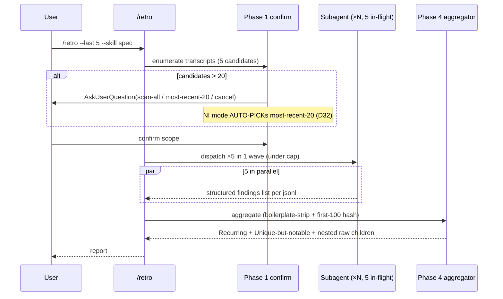

# Pipeline Consolidation — Spec

---

## 1. Problem Statement {#problem-statement}

The toolkit author runs `/feature-sdlc` daily and feels three compounding sources of friction: (a) **gate fatigue** — Tier-3 features today confront 7 soft gates the user must individually decline, with tier-mandatoriness encoded as a Recommended-default rather than a contract, so a silently-skipped MSF run is indistinguishable from a deliberate one; (b) **slug collision** — `/msf-req` and `/msf-wf` both write `msf-findings.md`, so any Tier-3 run that legitimately needs both deterministically overwrites; (c) **`--non-interactive` divergence** in OQ emission across child skills, blocking automation. Separately, `/retro` only sees the current session, so structural skill problems (recurring across 5+ sessions) hide behind single-session noise.

Primary success metric: a Tier-3 `/feature-sdlc` run prompts the user at exactly **4** soft gates (down from 7), every Tier-3 requirements/wireframes/spec run produces slug-distinct MSF artifacts, the `lint-non-interactive-inline.sh` PASS-set covers every pipeline skill that supports the flag, and `/retro --last N --skill <s>` produces a frequency-weighted aggregated report from N parallel transcript scans.

---

## 2. Goals {#goals}

| # | Goal | Success Metric |
|---|------|----------------|
| G1 | Fold `/msf-req` as a phase inside `/requirements` (Tier 3 default-on, Tier 1/2 soft) | Every Tier-3 `01_requirements.md` written under this feature's commit-onward carries an MSF block or links to `msf-req-findings.md` without a separate gate; verified by fixture run at §14.1 |
| G2 | Fold `/msf-wf` as a phase inside `/wireframes` (same matrix) | Every Tier-3 wireframes run produces wireframe HTML AND `msf-wf-findings/<wireframe-id>.md` per wireframe in a single invocation |
| G3 | Fold `/simulate-spec` as a phase inside `/spec` (same matrix) | Every Tier-3 `02_spec.md` carries simulate-spec-derived patches/decisions from a folded run; commits match `spec: auto-apply simulate-spec patch P<n>` |
| G4 | Fix MSF slug clash via `<skill-name-slug>-findings.<ext>` convention | `ls <feature_folder>` shows distinctly-named artifacts; zero filename collisions in fixture |
| G5 | `/feature-sdlc` removes Phase 4.a (msf-req gate) and Phase 6 (simulate-spec gate); adds Phase 13 `/retro` gate | Tier-3 dry-run prompts at exactly 4 soft gates (creativity, wireframes, prototype, retro) |
| G6 | **Preserve canonical-block invariant** across pipeline skills edited by this feature | `tools/lint-non-interactive-inline.sh` continues to PASS after every SKILL.md edit; pre-push hook block on regression |
| G7 | `/feature-sdlc` ends with explicit `/retro` gate (Skip recommended) | Every `/feature-sdlc` run emits a final-phase decision row in `00_pipeline.html` reflecting the user's retro choice |
| G8 | `/retro` accepts `--last N`, `--days N`, `--since YYYY-MM-DD`, `--project current\|all`, `--skill <name>` with subagent-per-transcript dispatch | `/retro --last 5 --skill spec` produces a two-tier report (Recurring patterns + Unique-but-notable) from 5 parallel scans |
| G9 | Folded-phase failures surface visibly to the user (M1+D17) | Mock-crash fixture: chat output contains `WARNING: <folded-skill> crashed (advisory per D11)` at point-of-failure AND in Phase-11 final summary |

**G6 reframed (vs Loop-1):** the W6 audit (§14.0 of this spec) revealed all 27 currently-supported skills already inline the canonical block byte-identically. G6 therefore changes from "execute rollout to 12-14 skills" to "preserve invariant across this feature's edits."

---

## 3. Non-Goals {#non-goals}

- **NOT retiring** standalone `/msf-req`, `/msf-wf`, `/simulate-spec` slash commands — backwards-compat for ad-hoc invocation against legacy/external docs is mandatory (D1).
- **NOT cross-referencing** `/retro` findings against the current skill body — explicit user scope-out at the orchestrator gate (D9).
- **NOT changing** the pipeline order beyond removing redundant gates — the requirements → spec → plan → execute → verify → complete-dev sequence is load-bearing (Non-Goal #3 in `01_requirements.md`).
- **NOT re-authoring** the canonical non-interactive contract — `_shared/non-interactive.md` is the source of truth from html-artifacts; this feature inlines it byte-identically.
- **NOT introducing** a new artifact format or HTML substrate — folded phases reuse `_shared/html-authoring/`.
- **NOT supporting** in-place migration of pre-existing `msf-findings.md` artifacts in past feature folders — read-only fallback in `/verify` covers backwards-compat.
- **NOT auto-squashing** auto-apply commits at any point — D24 below pins per-finding commits with no squash; users wanting clean history use the documented `git log --invert-grep` recipe.
- **NOT computing** dependency graphs of folded-phase findings beyond pairwise line-range overlap — D26 keeps the `Depends-on:` annotation simple and user-visible rather than building a structured solver.

---

## 4. Decision Log {#decision-log}

D1–D18 are carried forward from `01_requirements.md` (post-Loop-2, post-grill). D19–D27 are spec-level decisions resolving the 7 OQs, 4 grill gaps (G-A through G-D), and 3 Must items from /msf-req.

### Carried forward from requirements (D1–D18)

| # | Summary | Source |
|---|---------|--------|
| D1 | Keep standalone `/msf-req`, `/msf-wf`, `/simulate-spec` AND fold as phases | req §Decisions D1 |
| D2 | Tier-keyed default-on (Tier 3 default-on, Tier 1/2 soft gate) | req §Decisions D2 (Loop-2 reworded) |
| D3 | Slug naming `<skill-name-slug>-findings.<ext>` | req §Decisions D3 |
| D4 | Read-only fallback to legacy `msf-findings.md` in /verify | req §Decisions D4 |
| D5 | --non-interactive canonical inlined byte-identical via lint | req §Decisions D5 |
| D6 | /retro folded as final Phase 13, Recommended=Skip | req §Decisions D6 |
| D7 | Subagent-per-transcript dispatch | req §Decisions D7 |
| D8 | Cross-project retro via `--project all` opt-in | req §Decisions D8 |
| D9 | NOT cross-referencing retro findings against current skill body | req §Decisions D9 |
| D10 | Aggregation hash `(skill, severity, first-100-chars-boilerplate-stripped)`; raw findings as nested sub-list | req §Decisions D10 (Loop-2 refined) |
| D11 | Folded-phase failure semantics: always advisory; pipeline halts only on hard-phase failure | req §Decisions D11 |
| D12 | Tier parsed by child skills via `^\*\*Tier:\*\* ([0-9]+)` against doc's first 20 lines | req §Decisions D12 |
| D13 | `--skip-folded-msf` escape hatch on `/requirements` | req §Decisions D13 |
| D14 | Auto-apply ≥80 confidence + inline disposition for sub-threshold; NI Recommended=Defer | req §Decisions D14 (Loop-2 refined) |
| D15 | `--skip-folded-sim-spec` escape hatch on `/spec`, mirroring D13 | req §Decisions D15 (added in grill Loop-2) |
| D16 | Per-finding git commits with last-good rollback on crash | req §Decisions D16 (added in grill Loop-2) |
| D17 | Folded-phase failure surfacing: distinct Phase-11 subsection + chat; `state.yaml.phases.<parent>.folded_phase_failures[]` structured record | req §Decisions D17 (added in grill Loop-2) |
| D18 | Multi-session retro hard cap N=20 + 5-in-flight; confirmation prompt above 20 candidates | req §Decisions D18 (added in grill Loop-2) |

### New — pinned at /spec (D19–D27)

| # | Decision | Options Considered | Rationale |
|---|----------|---------------------|-----------|
| D19 | **OQ-1 resolved:** folded simulate-spec scenario floor at Tier 3 = same as standalone (no fixed minimum; honors existing `/simulate-spec` scenario-budget) | (a) Fixed floor 28 (b) Tier-keyed floor (c) Match standalone | (c) — the standalone path is the reference contract; folded path is the same logic with a different entry point. Pinning a separate floor invites drift |
| D20 | **OQ-2 resolved:** OQ aggregator format — orchestrator's `00_open_questions_index.html` reads child MD aggregators directly via `_shared/html-authoring/` MD-rendering substrate; no sidecar HTML version required | (a) Sidecar HTML version (b) MD-only with html-authoring rendering (c) Both | (b) — `_shared/html-authoring/` already renders MD-in-HTML for feature-folder artifacts (per html-artifacts v2.33.0); duplicating to HTML doubles maintenance |
| D21 | **OQ-3 resolved:** `/retro` multi-session subagent partial failure → ship partial-report-with-notice; do not block | (a) Block on any failure (b) Partial report with notice (c) Tier-keyed | (b) — multi-session retro is reflective work; partial signal is more useful than no signal. The notice (`scanned-failed: 1 of 5`) lets the user judge whether to re-run |
| D22 | **OQ-4 resolved:** `--project all` mtime threshold default = no filter; explicit `--since` for that | (a) 90-day default (b) No filter (c) Settings-controlled | (b) — explicit `--since` matches user intent; default-filter would silently drop projects the user expects to see. Settings-controlled is over-design for one toggle |
| D23 | **OQ-5 resolved:** Tier-2 skip-logging behavior — log to `state.yaml.phases.<parent>.notes` when running under `/feature-sdlc`; ephemeral if standalone | (a) Always log (b) Pipeline-only log (c) Never log | (b) — orchestrator owns the audit trail; standalone runs have no orchestrator state to log into |
| D24 | **OQ-6 resolved:** D14 auto-apply confidence threshold tunability — `.pmos/settings.yaml :: msf_auto_apply_threshold_by_tier: {1: 95, 2: 90, 3: 80}` defaults; CLI override `--msf-auto-apply-threshold N` | (a) Hard-coded ≥80 (b) Tier-keyed default + CLI override (c) Always per-skill flag | (b) — settings carry the tier-default (Tier 1 conservative ≥95, Tier 3 permissive ≥80); CLI flag overrides for one-off runs. Aligns with workstream-local config pattern from html-artifacts |
| D25 | **OQ-7 resolved:** `--skip-folded-msf` flag naming = split per parent → `--skip-folded-msf` on `/requirements`, `--skip-folded-msf-wf` on `/wireframes`, `--skip-folded-sim-spec` on `/spec` | (a) Single CSV (b) Split per parent (c) Hierarchical | (b) — each flag belongs to the parent skill that hosts the folded phase; argument-hint stays per-skill; no risk of accidentally skipping all three. Matches D15 naming for sim-spec |
| D26 | **M3 resolved:** dependency-aware reverts use simple recipe + `Depends-on: F<m>, F<n>` line in commit body, computed from git-diff line-range intersection at apply-time | (a) Simple recipe + Depends-on body line (b) Documentation-only (c) Structured state.yaml graph | (a) — low-cost annotation; user-visible; auditable. Structured graph is over-engineered for the actual frequency of revert |
| D27 | **M2 resolved:** resume granularity inside a folded phase = coarse-grained orchestrator + per-finding-commit-message-based idempotency inside the folded phase | (a) Coarse + commit-as-state idempotency (b) Fine-grained state.yaml.phases.<x>.folded_phase_progress (c) Coarse with full re-apply | (a) — commits ARE the state; no schema delta needed for per-finding progress. Folded phase on entry runs `git log --grep="auto-apply <folded-skill> finding F"` to detect already-applied; resumes from next un-applied finding |
| D28 | **M3+S1 resolved:** commit strategy = per-finding commits during folded phase, no squash; `/complete-dev` release-notes documents `git log --invert-grep="auto-apply"` recipe | (a) Per-finding no squash (b) Squash at phase-end (c) Per-finding + autosquash at /complete-dev | (a) — preserves M3 revert granularity AND D27 commits-as-state semantics. Trade noise for safety; recipe gives users an opt-in clean view |
| D29 | **S2 resolved:** `--minimal` flag on `/feature-sdlc` AUTO-PICKs Skip on all 4 soft gates (creativity, wireframes, prototype, retro) regardless of tier | (a) New flag (b) Default-On at Tier 1 (c) No flag | (a) — flag is opt-in (user explicitly requests minimal); does NOT auto-set at Tier 1 because the user might still want some soft gates (e.g., retro for a tricky bug fix). Logged to `state.yaml.notes` |
| D30 | **S3 resolved:** Resume Status panel collapses status table + folded_phase_failures + OQ index into one chat-block on `--resume` | (a) Three separate prints (b) Single combined panel (c) Tier-keyed | (b) — single panel reduces re-orientation latency; sections clearly delimited within the panel |
| D31 | **S5+G-A resolved:** state.yaml writes use write-temp-then-rename **within state.yaml's parent directory** (POSIX-atomic on same filesystem). Implementation: `open <state.yaml>.tmp.<pid>`, `fsync`, `rename` to `state.yaml`. `folded_phase_failures[]` and `started_at` fields added; schema bumps `1 → 2` with auto-migration on read | (a) write-temp-then-rename in parent dir (b) FS-level lock (c) Append-only log | (a) — POSIX rename(2) is atomic when src and dest are on the same filesystem; placing the temp file in the same directory guarantees this. Matches existing /feature-sdlc Phase 2 protocol; no new lock infrastructure |
| D32 | **G-B resolved:** D18 confirmation prompt under `--non-interactive` AUTO-PICKs `most-recent-20`; lint passes | (a) Recommended=most-recent-20 + AUTO-PICK (b) Defer all (c) Auto-scan-all | (a) — most-recent-20 is the safe default; matches the user-stated intent of D18 cap; explicit `--scan-all` flag overrides for power users |
| D33 | **G-C resolved:** `/execute`'s commit-cadence handles pre-existing auto-apply commits as ordinary git history; `/execute` commits its TDD-task commits on top with no awareness of upstream auto-apply commits | (a) Coexist transparently (b) Squash auto-apply before /execute starts (c) Refuse to start with auto-apply commits unflushed | (a) — auto-apply commits are durable, attributable, and behave like any other doc-edit commit. /execute's commit cadence (one TDD task = one commit) is unchanged |
| D34 | **G-D resolved:** Phase-11 final-summary template adds a "Folded-phase failures" section above the OQ index when any failure recorded; format `[<phase>] <folded-skill> crashed: <error_excerpt> (ts: <ts>)` | (a) Distinct subsection above OQ index (b) Inline with OQs (c) Sidecar file | (a) — distinct subsection per D17; visible-by-default; zero rows when no failures |
| D35 | **M1 resolved:** in-line failure surface = chat-emit at the moment `state.yaml.phases.<parent>.folded_phase_failures[]` is appended; format identical to Phase-11 row | (a) Chat-emit at append-time (b) Phase-11-only (already in D17) (c) End-of-folded-phase only | (a) — without point-of-failure surface, Tier-3 user could drive 7 more phases blind. Chat-emit is one structured line; cheap to implement |

---

## 5. User Personas & Journeys {#user-personas-and-journeys}

### 5.1 Persona — Toolkit author/maintainer (single-user) {#toolkit-author-maintainer}

Same person, two operational hats: (a) skill-author shipping a feature via the pipeline daily, (b) toolkit-owner diagnosing recurring skill problems via retro. Workstream context: pmos-toolkit at v2.33.0 (just shipped html-artifacts); 27 supported skills; daily-pipeline cadence.

**Persona-collapse rationale:** this is a single-user toolkit; the two operational hats belong to the same person, so MSF analysis (per `msf-req-findings.md` §Persona × Scenarios) walks 4 scenarios across 1 persona rather than splitting personas. Pattern previously surfaced in `~/.pmos/learnings.md` under `## /msf-wf` — for single-user personal tools, scenarios remain a useful axis but personas collapse to one.

### 5.2 User Journey — J1 Primary Tier-3 /feature-sdlc end-to-end {#journey-tier-3-end-to-end}

```mermaid
sequenceDiagram
  participant U as User
  participant FSdlc as /feature-sdlc
  participant Req as /requirements
  participant MSFreq as /msf-req (folded)
  participant Wf as /wireframes
  participant MSFwf as /msf-wf (folded)
  participant Spec as /spec
  participant Sim as /simulate-spec (folded)
  participant Down as /plan→/execute→/verify→/complete-dev
  participant Retro as /retro
  U->>FSdlc: /feature-sdlc <idea>
  FSdlc->>FSdlc: slug+worktree+state.yaml
  FSdlc->>Req: dispatch (Tier 3)
  Req->>Req: Phase 1..5 (research, brainstorm, write, review)
  Req->>MSFreq: Phase 5.5 folded (default-on)
  MSFreq->>MSFreq: detect tier=3; auto-apply ≥80 findings (per-finding commits)
  MSFreq-->>Req: findings sub-threshold inline-dispositioned
  Req-->>FSdlc: 01_requirements.md ready
  FSdlc->>FSdlc: gates: grill / creativity / wireframes
  FSdlc->>Wf: dispatch
  Wf->>MSFwf: per-wireframe folded (default-on)
  MSFwf-->>Wf: msf-wf-findings/<id>.md per wireframe
  FSdlc->>FSdlc: gate: prototype
  FSdlc->>Spec: dispatch
  Spec->>Sim: folded (default-on)
  Sim-->>Spec: scenario patches applied (per-patch commits)
  Spec-->>FSdlc: 02_spec.md Ready for Plan
  FSdlc->>Down: dispatch sequence
  FSdlc->>FSdlc: Phase 13 retro gate
  FSdlc->>Retro: opt-in
  FSdlc-->>U: Phase 11 final summary (status + folded-phase-failures + OQs)
```

### 5.3 Alternate Journey — J2 Tier-1 bug fix {#journey-tier-1-bug-fix}

Same orchestrator path but: folded-MSF gates appear as soft `AskUserQuestion` Recommended=Skip; `--minimal` flag (D29) AUTO-PICKs Skip across all 5 soft gates if passed; `--skip-folded-msf*` flags are no-ops (folded phases default-off at Tier 1 anyway).

### 5.4 Alternate Journey — J3 Multi-session /retro standalone {#journey-multi-session-retro}



### 5.5 Alternate Journey — J4 Resume after /compact mid-pipeline {#journey-resume-after-compact}

```mermaid
sequenceDiagram
  participant U as User
  participant Compact as /compact
  participant FSdlc as /feature-sdlc --resume
  participant Phase as paused folded phase
  U->>Compact: invoke
  U->>FSdlc: --resume
  FSdlc->>FSdlc: read state.yaml; auto-migrate v1→v2 if needed
  FSdlc->>U: Resume Status panel (status + folded_phase_failures + OQs in one block)
  FSdlc->>Phase: re-dispatch the paused folded phase (coarse)
  Phase->>Phase: git log --grep="auto-apply <skill> finding F" → detect applied set
  Phase->>Phase: resume from next un-applied finding
  Phase-->>FSdlc: phase complete
```

### 5.6 Error Journeys {#error-journeys}

- **Folded MSF crash at Tier 3 (M1+D35):** chat-emit at point-of-failure: `WARNING: msf-req crashed (advisory continue per D11): <error_excerpt>`. Pipeline continues. Phase-11 surfaces in §"Folded-phase failures."
- **Subagent failure during multi-session retro (D21):** mark scanned-failed in report; continue with remaining; report notes `scanned-failed: <count> of <total>`.
- **Slug-clash legacy artifact present (D4):** new write goes to slug-distinct path; legacy preserved on disk; /verify fallback reads with soft warning.
- **`--non-interactive` defer-only checkpoint:** child writes OQ entry; orchestrator aggregates into `00_open_questions_index.html`; pipeline does not block.
- **State.yaml schema mismatch (FR-SCHEMA / D31):** schema_version > current → abort; schema_version < current → auto-migrate with chat log line.

---

## 6. System Design {#system-design}

### 6.1 Architecture Overview {#architecture-overview}

This is a meta-feature on the pmos-toolkit codebase. The "system" is the set of SKILL.md files, shared substrate documents, lint scripts, and state-schema docs. No services, no databases, no APIs.

**Component graph** (files that change in this feature):

```
plugins/pmos-toolkit/
├── .claude-plugin/plugin.json       (version bump)
├── .codex-plugin/plugin.json        (version bump — must match)
├── skills/
│   ├── _shared/
│   │   ├── msf-heuristics.md            (read-only; reused)
│   │   ├── non-interactive.md           (read-only; canonical source)
│   │   └── pipeline-setup.md            (read-only; reused)
│   ├── feature-sdlc/
│   │   ├── SKILL.md                 (Phase 4.a/6 removed; Phase 13 added; --minimal flag; D30 Resume Status panel; D34 Phase-11 template)
│   │   └── reference/
│   │       ├── state-schema.md      (schema bump v1→v2; folded_phase_failures[])
│   │       ├── pipeline-status-template.md (Folded-phase failures subsection)
│   │       └── compact-checkpoint.md (Resume Status panel template)
│   ├── requirements/SKILL.md        (Phase 5.5 folded /msf-req; --skip-folded-msf)
│   ├── wireframes/SKILL.md          (folded /msf-wf phase; --skip-folded-msf-wf)
│   ├── spec/SKILL.md                (folded /simulate-spec phase; --skip-folded-sim-spec)
│   ├── retro/SKILL.md               (--last/--days/--since/--project/--skill; subagent-per-transcript dispatch; D18 cap; D21 partial-failure)
│   ├── verify/SKILL.md              (legacy slug fallback; affirmative folded-phase-completion signal — N6 nice-fold)
│   └── complete-dev/SKILL.md        (release-notes recipe for git log --invert-grep)
└── tools/
    ├── lint-non-interactive-inline.sh  (no change; verify still PASS)
    └── audit-recommended.sh            (no change)
```

### 6.2 Sequence Diagrams {#sequence-diagrams}

Three flows owned by this spec; each has its own diagram in §5. (a) Tier-3 happy path → §5.2; (b) multi-session retro → §5.4; (c) resume-after-compact → §5.5. Failure path is annotated within each.

---

## 7. Functional Requirements {#functional-requirements}

### 7.1 W1 — Fold /msf-req into /requirements {#fr-w1-fold-msf-req}

| ID | Requirement |
|----|-------------|
| FR-01 | `/requirements` SKILL.md adds Phase 5.5 (folded MSF-req) AFTER Phase 5 review-loops complete and the doc is committed |
| FR-02 | At Tier 3, Phase 5.5 runs default-on (no `AskUserQuestion`); at Tier 2, soft gate Recommended=Run; at Tier 1, soft gate Recommended=Skip (D2) |
| FR-03 | `--skip-folded-msf` flag on `/requirements` bypasses Phase 5.5 even at Tier 3; logged to `state.yaml.phases.requirements.notes` when running under `/feature-sdlc` (D13/D23) |
| FR-04 | Phase 5.5 calls into `_shared/msf-heuristics.md` shared logic; standalone `/msf-req` calls into the same shared logic — no behavior divergence |
| FR-05 | High-confidence findings (≥ tier-default per D24, settings-overridable, CLI-overridable) auto-apply to `01_requirements.md` via per-finding commits (D16/D27) |
| FR-06 | Sub-threshold findings get inline `AskUserQuestion` for Fix/Modify/Skip/Defer; in `--non-interactive` Recommended=Defer; classifier AUTO-PICKs Defer; FR-03 of the canonical block emits to OQ artifact (D14) |
| FR-07 | Output written to `<feature_folder>/msf-req-findings.md` (D3); never to `msf-findings.md` |

### 7.2 W2 — Fold /msf-wf into /wireframes {#fr-w2-fold-msf-wf}

| ID | Requirement |
|----|-------------|
| FR-08 | `/wireframes` SKILL.md adds a folded MSF-wf phase iterating per wireframe AFTER all wireframes are generated and committed |
| FR-09 | Tier-keyed gate matrix identical to FR-02 |
| FR-10 | `--skip-folded-msf-wf` flag bypasses; logged to `state.yaml.phases.wireframes.notes` (D25) |
| FR-11 | Output written to `<feature_folder>/msf-wf-findings/<wireframe-id>.md` (D3 directory variant); never to `msf-findings.md` |
| FR-12 | Auto-apply / inline-disposition / per-finding-commit semantics identical to FR-05/FR-06 (commit prefix: `wireframes: auto-apply msf-wf finding F<n>`) |

### 7.3 W3 — Fold /simulate-spec into /spec {#fr-w3-fold-simulate-spec}

| ID | Requirement |
|----|-------------|
| FR-13 | `/spec` SKILL.md adds a folded simulate-spec phase BETWEEN review-loops and "Ready for Plan" handoff |
| FR-14 | Scenario floor at Tier 3 = same as standalone `/simulate-spec` (D19); no separate floor |
| FR-15 | Tier-keyed gate matrix identical to FR-02 |
| FR-16 | `--skip-folded-sim-spec` flag bypasses (D15); logged to `state.yaml.phases.spec.notes` |
| FR-17 | Patches surfaced by simulate-spec apply to `02_spec.md` inline as per-finding commits (commit prefix: `spec: auto-apply simulate-spec patch P<n>`) |
| FR-18 | Auto-apply / inline-disposition semantics identical to FR-05/FR-06 |

### 7.4 W4 — Slug clash fix {#fr-w4-slug-clash}

| ID | Requirement |
|----|-------------|
| FR-19 | Naming convention `<skill-name-slug>-findings.<ext>` for single-doc artifacts; `<skill-name-slug>-findings/` for per-wireframe directory artifacts (D3) |
| FR-20 | `/verify` reads new slug primarily; falls back to legacy `msf-findings.md` with soft warning logged to chat: `legacy slug detected at <path>; new writes use <new-slug>` (D4) |
| FR-21 | New writes ALWAYS use new slug; never write to `msf-findings.md` going forward |
| FR-22 | One-pass migration script NOT required — pre-existing artifacts are read-only deliverables |

### 7.5 W5 — Update /feature-sdlc {#fr-w5-update-feature-sdlc}

| ID | Requirement |
|----|-------------|
| FR-23 | `/feature-sdlc/SKILL.md` removes Phase 4.a (msf-req gate) — `/msf-req` runs inside `/requirements` only |
| FR-24 | `/feature-sdlc/SKILL.md` removes Phase 6 (simulate-spec gate) — `/simulate-spec` runs inside `/spec` only |
| FR-25 | `/feature-sdlc/SKILL.md` adds Phase 13 (retro gate) — soft, Recommended=Skip; AskUserQuestion shape per W7 (D6) |
| FR-26 | `state.yaml.phases[]` schema gains a `retro` entry; auto-migration v1→v2 populates as `pending` (D31) |
| FR-27 | Anti-pattern #4 (`Auto-running optional stages without the gate`) updated to remove now-folded skills and add `/retro` |
| FR-28 | `--minimal` flag added to `/feature-sdlc` argument-hint and Phase 0 parser; AUTO-PICKs Skip on all 4 soft gates (creativity, wireframes, prototype, retro); logged to `state.yaml.notes` (D29) |
| FR-29 | Phase 11 final-summary template adds "Folded-phase failures" subsection above the OQ index when `state.yaml.phases.<parent>.folded_phase_failures[]` is non-empty for any phase (D17/D34) |
| FR-30 | Phase 0.b resume detection consumes the new schema; Resume Status panel format per D30 — single chat-block with three sections: Status table / Folded-phase failures / Open Questions index |

### 7.6 W6 — Preserve canonical-block invariant {#fr-w6-preserve-invariant}

| ID | Requirement |
|----|-------------|
| FR-31 | Every **supported** SKILL.md edit (any SKILL.md without the `<!-- non-interactive: refused; ` marker) landing in this feature MUST keep the inlined `<!-- non-interactive-block -->` byte-identical to `_shared/non-interactive.md` (D5). Refusal-marker skills (today: only `/msf-req`) are excluded from byte-identity by definition; FR-33 governs them |
| FR-32 | `tools/lint-non-interactive-inline.sh` is a pre-push hook gate; any divergence in any of the 27 supported skills is a hard-block on push |
| FR-33 | `/msf-req` SKILL.md `<!-- non-interactive: refused; ... -->` marker is preserved as-is — standalone path correctly refuses NI; folded path inherits parent's NI mode via FR-06.1 parent-marker (no marker change required for folded path) |

### 7.7 W7 — Fold /retro into /feature-sdlc {#fr-w7-fold-retro}

| ID | Requirement |
|----|-------------|
| FR-34 | New Phase 13 in `/feature-sdlc/SKILL.md` after `/complete-dev`; AskUserQuestion shape: `Run /retro to capture session learnings before exiting?` options Skip (Recommended) / Run / Defer |
| FR-35 | On Run: dispatch `/pmos-toolkit:retro` with `[mode: <current-mode>]\n` prefix; capture artifact path into `state.yaml.phases.retro.artifact_path` |
| FR-36 | On Defer: log to `state.yaml.open_questions_log[]` and surface in Phase 11 final summary |
| FR-37 | Standalone `/retro` retained — same CLI surface |

### 7.8 W8 — Multi-session /retro enhancement {#fr-w8-retro-multi-session}

| ID | Requirement |
|----|-------------|
| FR-38 | `/retro` accepts `--last N`, `--days N`, `--since YYYY-MM-DD`, `--project current\|all`, `--skill <name>` |
| FR-39 | Multi-session selectors validated mutually-exclusive among `--last/--days/--since`; conflicts → exit 64 with usage hint |
| FR-40 | Phase 1 enumerates candidate transcripts: rows `(date, size, skill-invocation-count, project-slug)`; user confirms scope |
| FR-41 | If candidate count > 20: AskUserQuestion (scan-all / most-recent-20 / cancel); under `--non-interactive`, AUTO-PICK most-recent-20 (D18/D32) |
| FR-42 | Phase 2 dispatches one subagent per transcript, batched 5-in-flight (D18) |
| FR-43 | Each subagent extracts `(skill-invocation, ±N surrounding turns)` slices; returns structured findings list per existing /retro output schema |
| FR-44 | Subagent failure: mark scanned-failed in report; continue remaining; final report notes `scanned-failed: <count> of <total>` (D21) |
| FR-45 | Aggregation: hash `(skill, severity, first-100-chars-of-finding-with-boilerplate-stripped)`; boilerplate-strip removes prefixes `The /<skill> skill`, `The skill`, leading articles `A `/`An `/`The `; emit constituent raw findings as nested sub-list under each aggregated row (D10) |
| FR-46 | Phase 5 output: two-tier report (Recurring patterns ≥2 sessions sorted by frequency × severity; Unique-but-notable single-session) |
| FR-47 | Each aggregated finding carries `seen across <session-dates>` annotation |
| FR-48 | `--project all` iterates `~/.claude-personal/projects/*/`; no mtime filter by default; explicit `--since` for filtering (D8/D22) |
| FR-49 | Per-wave progress emit (Nice-fold from N4): `Wave <i>/<total>: <complete>/<in-flight> subagents complete (T+<sec>s)` |

### 7.9 Cross-cutting: Folded-phase failure surfacing {#fr-folded-phase-failures}

| ID | Requirement |
|----|-------------|
| FR-50 | When a folded phase crashes (uncaught exception, timeout, exit-code != 0), the parent skill captures `{folded_skill, error_excerpt, ts}` into `state.yaml.phases.<parent>.folded_phase_failures[]` (D17/D31) |
| FR-51 | Append-time chat-emit: `WARNING: <folded-skill> crashed (advisory continue per D11): <error_excerpt>` (M1/D35) |
| FR-52 | Phase-11 final summary (in `/feature-sdlc`) emits "Folded-phase failures" subsection above the OQ index; format `[<phase>] <folded-skill> crashed: <error_excerpt> (ts: <ts>)`; one row per failure (D17/D34) |
| FR-53 | `--resume` re-emits the failure subsection in the Resume Status panel (D30) |

### 7.10 Cross-cutting: Commit-as-state contract {#fr-commits-as-state}

| ID | Requirement |
|----|-------------|
| FR-54 | Each auto-applied finding emits a discrete commit on the feature branch with subject `<parent>: auto-apply <folded-skill> finding F<n> (confidence <pct>)` |
| FR-55 | Commit body includes optional `Depends-on: F<m>, F<n>` line listing prior finding-IDs whose edits overlap line-ranges, computed from git-diff intersection at apply-time (M3/D26) |
| FR-56 | On crash mid-batch, last-good HEAD (the commit just before the crash) remains intact; resume re-enters the folded phase (D27) |
| FR-57 | Resume idempotency: folded phase reads `git log --grep="auto-apply <folded-skill> finding F" --since=<state.yaml.phases.<parent>.started_at>` to detect already-applied findings; skips them; resumes from next un-applied (D27). `started_at` is set when the phase first transitions pending→in_progress (per §10.1 schema v2) |
| FR-58 | No squash at any point in this feature; squashing is a user-driven post-pipeline action via documented `git rebase --autosquash` recipe (D28) |

### 7.11 Cross-cutting: --non-interactive contract {#fr-non-interactive}

| ID | Requirement |
|----|-------------|
| FR-59 | Every SKILL.md edit MUST preserve byte-identical canonical block (FR-31/D5) |
| FR-60 | All new `AskUserQuestion` call-sites added by this feature have a (Recommended) option (or are tagged `<!-- defer-only: ... -->`) so the classifier can AUTO-PICK or DEFER cleanly (FR-02 of canonical block) |
| FR-61 | D14 sub-threshold inline `AskUserQuestion` carries Recommended=Defer (D14 Loop-2 refinement) |
| FR-62 | D18 confirmation prompt carries Recommended=most-recent-20 in NI (D32) |
| FR-63 | D29 `--minimal` flag is shorthand for AUTO-PICK Skip across soft gates regardless of mode |

---

## 8. Non-Functional Requirements {#non-functional-requirements}

| ID | Category | Requirement |
|----|----------|-------------|
| NFR-01 | Observability | Folded-phase events emit one structured chat line per template `[<phase>] <event>: <detail>`; events: `start`, `apply F<n>`, `defer F<n>`, `failure`, `complete` |
| NFR-02 | Performance | Multi-session retro 20 transcripts in 5-in-flight waves: end-to-end < 90s wall on warm-cache; per-transcript scan ≤ 25s |
| NFR-03 | Resilience | state.yaml writes are POSIX-atomic via write-temp-then-rename (D31); SIGKILL during write leaves last-good state.yaml unchanged |
| NFR-04 | Backwards-compat | All standalone slash commands retained (D1); legacy `msf-findings.md` artifacts read-fallback in /verify (D4); state.yaml schema auto-migrates v1→v2 on read (FR-SCHEMA) |
| NFR-05 | Traceability | Every auto-apply commit attributable to one finding by message convention; review log entries cite finding-ID |
| NFR-06 | Determinism | Aggregation hash boilerplate-strip rules are pure-text deterministic; no LLM call inside the dedup function |
| NFR-07 | Audit trail | `--skip-folded-*` flag use logged to `state.yaml.phases.<parent>.notes` when running under `/feature-sdlc` (D13/D15/D23) |

---

## 9. API Contracts {#api-contracts}

**N/A** — no service APIs introduced. Slash-command argument-hints and `AskUserQuestion` shapes are the user-facing "contracts"; specified in §11 (Frontend Design) and FR-tables in §7.

---

## 10. State Schema & Commit Contract {#state-schema-commit-contract}

(Substituting for the standard "Database Design" section — this feature has no DB; state lives in YAML + git history.)

### 10.1 state.yaml schema delta — v1 → v2 {#state-schema-delta}

**v1 (current):**
```yaml
schema_version: 1
phases:
  - id: <phase-id>
    hardness: <hard|soft>
    status: <pending|in_progress|completed|skipped|failed|paused>
    artifact_path: <path|null>
    notes: <string|null>
```

**v2 (this feature):**
```yaml
schema_version: 2
phases:
  - id: <phase-id>
    hardness: <hard|soft>
    status: <pending|in_progress|completed|skipped|failed|paused>
    artifact_path: <path|null>
    notes: <string|null>
    started_at: <ISO-8601|null>      # NEW — populated when status flips pending→in_progress; null until then
    folded_phase_failures: []        # NEW — appended on folded-phase crash; default []
                                     # entries: {folded_skill: <name>, error_excerpt: <≤200char>, ts: <ISO-8601>}
```

**Auto-migration v1→v2 (idempotent):**
1. Set `schema_version: 2`
2. For each entry in `phases[]`: ensure `folded_phase_failures: []` and `started_at: null` if missing
3. Append `{id: retro, hardness: soft, status: pending, artifact_path: null, notes: null, started_at: null, folded_phase_failures: []}` to `phases[]` if no entry with `id: retro` exists; insertion position = after `complete-dev` entry
4. Emit chat log line: `migration: state.schema v1 → v2 (added: phases.<*>.folded_phase_failures, phases.<*>.started_at, phases.retro)`

`started_at` is consumed by FR-57 idempotency check (`git log --since=<phases.<parent>.started_at>`).

### 10.2 Commit-message contract {#commit-message-contract}

**Subject (required):**
```
<parent>: auto-apply <folded-skill> finding F<n> (confidence <pct>)
```

Where:
- `<parent>` ∈ `{requirements, wireframes, spec}`
- `<folded-skill>` ∈ `{msf-req, msf-wf, simulate-spec}` (sim-spec uses `patch P<n>` instead of `finding F<n>`)
- `<n>` is the finding-index assigned by the folded phase
- `<pct>` is the confidence threshold percentage (≥ tier-default per D24)

**Body (optional but recommended):**
```
Depends-on: F<m>, F<n>
```

When the finding's edit overlaps line-ranges with prior findings in the same folded-phase run. Computed at apply-time via `git diff` intersection of edit-regions.

**Re-detection on resume:**
```bash
git log --grep="auto-apply <folded-skill> finding F" --since=<phase-start-time>
```

Used by FR-57 idempotency check.

### 10.3 .pmos/settings.yaml additions {#settings-additions}

```yaml
msf_auto_apply_threshold_by_tier:
  1: 95   # Tier 1 conservative
  2: 90
  3: 80   # Tier 3 permissive (default per D14)
```

CLI override: `--msf-auto-apply-threshold N` on `/requirements` and `/wireframes` (D24).

---

## 11. Frontend Design — CLI surface {#frontend-design-cli}

(Substituting for the standard "Frontend Design" section.)

### 11.1 New flags catalog {#flags-catalog}

| Flag | Skill | Purpose | Source decision |
|------|-------|---------|-----------------|
| `--skip-folded-msf` | `/requirements` | Bypass folded MSF-req at any tier | D13 |
| `--skip-folded-msf-wf` | `/wireframes` | Bypass folded MSF-wf at any tier | D25 |
| `--skip-folded-sim-spec` | `/spec` | Bypass folded simulate-spec at any tier | D15 |
| `--minimal` | `/feature-sdlc` | AUTO-PICK Skip on all 5 soft gates | D29 |
| `--last N` | `/retro` | Scan most-recent N transcripts | W8 |
| `--days N` | `/retro` | Scan transcripts within last N days | W8 |
| `--since YYYY-MM-DD` | `/retro` | Scan transcripts since date | W8 |
| `--project current\|all` | `/retro` | Project scope | W8/D8 |
| `--skill <name>` | `/retro` | Filter findings to one skill | W8 |
| `--scan-all` | `/retro` | Override D18 cap; opt-in unbounded scan | D18 |
| `--msf-auto-apply-threshold N` | `/requirements`, `/wireframes` | Override tier-default threshold | D24 |

All argument-hints in `plugin.json` updated per FR-RELEASE.i.

### 11.2 Resume Status panel (D30) {#resume-status-panel}

On `/feature-sdlc --resume`, emit one chat block:

```
=== Resume Status — <slug> ===

Pipeline status:
| Phase            | Status     | Artifact                              |
|------------------|------------|---------------------------------------|
...

Folded-phase failures (N):                  ← omitted if N=0
  [requirements] msf-req crashed: <excerpt> (ts: 2026-05-10T01:23Z)
  [spec] simulate-spec crashed: <excerpt> (ts: 2026-05-10T02:15Z)

Open Questions (M):                         ← omitted if M=0 (or summarized)
  see <feature_folder>/00_open_questions_index.html

Resume cursor: Phase <id> (<status>)
=============================
```

### 11.3 Phase-11 final summary template (D34) {#phase-11-template}

```
=== Pipeline Complete — <slug> ===

<existing status table>

Folded-phase failures (N):                  ← omitted if N=0; otherwise above OQ index
  ...same format as Resume Status panel...

Open Questions index:                       ← link to 00_open_questions_index.html

Branch / tag info from /complete-dev:
  ...
==============================
```

---

## 12. Edge Cases {#edge-cases-spec}

| # | Scenario | Condition | Expected Behavior |
|---|----------|-----------|-------------------|
| E1 | No msf-req-findings.md at /verify time on a Tier-3 feature | folded MSF-req failed silently OR was skipped at Tier-1/2 OR `--skip-folded-msf` was passed | /verify checks tier from 02_spec.md frontmatter; reads `state.yaml.phases.requirements.folded_phase_failures[]` + `notes`; at Tier 3 → warn loudly but advisory; at Tier 1/2 → advisory only. Blocking only if state.yaml shows neither documented skip nor recorded failure for the missing artifact (FR-20) |
| E2 | --last 0 / --days 0 | edge value | error with usage hint, exit 64 |
| E3 | --since with future date | invalid | error with usage hint, exit 64 |
| E4 | --project all on machine with 1 project | trivial case | works; single subagent; equivalent to --project current |
| E5 | Pipeline skill with --non-interactive but pre-rollout | post-rollout BC | already covered by FR-08 in canonical block (warn + fall back to interactive) |
| E6 | /retro folded gate with no jsonl available (fresh project) | first-ever session | gate appears; on Run, /retro emits "no transcripts found yet" and exits cleanly |
| E7 | state.yaml schema_version > current code's max | newer-than-runtime | abort: `state file from newer /feature-sdlc version (vN); upgrade pmos-toolkit and retry` |
| E8 | state.yaml schema_version < current code's max | older-than-runtime | auto-migrate; chat log line; continue |
| E9 | Folded phase's auto-apply fails AFTER N findings already committed | partial-batch crash | last-good HEAD is the N-th commit; FR-50 captures failure; FR-51 emits in-line warning; pipeline continues per D11; resume idempotency picks up at finding N+1 |
| E10 | User reverts `auto-apply F2` commit but F3 depends on F2 | dependency-aware revert | F3's commit body's `Depends-on: F2` line is the user's signal to cherry-pick-rebase F3; /complete-dev release-notes documents recipe (D26) |
| E11 | Multi-session retro: 1 of 5 subagents stalls past timeout | partial coverage | mark scanned-failed; continue with remaining 4; report notes `scanned-failed: 1 of 5` (D21/FR-44) |
| E12 | --project all on archived projects | user opt-in cross-project | iterate `~/.claude-personal/projects/*/` without filter; user can pass `--since` for subset (D22/FR-48) |
| E13 | Mid-folded-phase /compact requested | resume contract | folded phase exits at last-good HEAD; /feature-sdlc detects compact-pause; --resume re-dispatches folded phase; FR-57 idempotency picks up |
| E14 | All folded phases skipped via flags AT Tier 3 + zero failures recorded | "skipped successfully" | /verify reads notes + folded_phase_failures; emits affirmative `✓ folded phases skipped per documented flags` (covers MSF-req S1 satisfaction concern) |

---

## 13. Configuration & Feature Flags {#configuration-feature-flags}

No build-time feature flags; the changes ship as SKILL.md edits. Runtime config:

| Source | Variable | Default | Purpose |
|--------|----------|---------|---------|
| `.pmos/settings.yaml` | `msf_auto_apply_threshold_by_tier` | `{1: 95, 2: 90, 3: 80}` | Per-tier auto-apply confidence threshold (D24) |
| `.pmos/settings.yaml` | `default_mode` | `interactive` | Pre-existing; consumed by canonical block FR-01.3 |
| `.pmos/settings.yaml` | `current_feature` | (per-repo) | Pre-existing |
| CLI | `--msf-auto-apply-threshold N` | (none) | Override settings for one run |
| CLI | flag-set in §11.1 | (per flag) | Per-skill behavior switches |

---

## 14. Testing & Verification Strategy {#testing-verification}

### 14.0 Pre-implementation invariant {#pre-implementation-invariant}

`tools/lint-non-interactive-inline.sh` MUST PASS before any commit lands. Confirmed today (`2026-05-10`): all 27 supported skills PASS. This is the W6 baseline.

### 14.1 Unit + integration tests {#unit-integration-tests}

| FR | Test | Assertion |
|----|------|-----------|
| FR-01..FR-07 | Fixture: Tier-3 `01_requirements.md` dummy doc; invoke `/requirements` Phase 5.5 standalone | `msf-req-findings.md` exists at feature folder; ≥1 commit matches `requirements: auto-apply msf-req finding F\d+`; sub-threshold count > 0 → review-log row added |
| FR-03 | Fixture: same with `--skip-folded-msf` | Phase 5.5 skipped; `state.yaml.phases.requirements.notes` contains `--skip-folded-msf` |
| FR-08..FR-12 | Fixture: 3 wireframes in `wireframes/` dir; invoke `/wireframes` folded phase | `msf-wf-findings/wf-1.md`, `wf-2.md`, `wf-3.md` exist; commits per finding |
| FR-13..FR-18 | Fixture: Tier-3 spec; invoke `/spec` folded sim-spec phase | 02_spec.md edited with `simulate-spec patch P` commits; scenario floor = standalone |
| FR-19..FR-22 | Fixture: feature folder with both `msf-req-findings.md` and `msf-wf-findings/` | `ls` returns both; no overwrite; /verify reads both |
| FR-23..FR-30 | Fixture: NI Tier-3 dry-run of /feature-sdlc | exactly 4 AUTO-PICK gate events (creativity, wireframes, prototype, retro); no msf-req or simulate-spec gate events |
| FR-29/FR-50..FR-53 | Inject mock crash in folded msf-req | chat-emit line `WARNING: msf-req crashed (advisory continue per D11)` at append-time; Phase 11 final summary repeats; --resume re-prints |
| FR-31..FR-33 | Run lint after every SKILL.md edit; pre-push hook engaged | `lint-non-interactive-inline.sh` exit 0; `/msf-req` refusal marker preserved |
| FR-34..FR-37 | Fixture: /feature-sdlc collapsed end-to-end at Tier 3 | Phase 13 retro gate fires; Recommended=Skip |
| FR-38..FR-49 | Fixture: 5 transcript jsonls with known repeated findings | `/retro --last 5 --skill spec` produces report with Recurring + Unique-but-notable; aggregation hash boilerplate-stripped; `seen across <dates>` annotation present; per-wave progress emit |
| FR-41/D32 | Fixture: 25 transcript jsonls, NI mode | confirmation prompt AUTO-PICKs most-recent-20; report contains 20 findings sets |
| FR-44 | Fixture: 5 transcripts, 1 deliberately invalid | report has `scanned-failed: 1 of 5` notice |
| FR-50/FR-51 | Fixture: folded-phase mock crash | `state.yaml.phases.<parent>.folded_phase_failures[]` populated; chat-emit at append-time |
| FR-54..FR-58 | Fixture: 6-finding folded run; pause after commit 3; resume | `git log --grep` returns 3 entries; resume runs findings 4-6; total 6 commits; no duplicates |
| FR-55/D26 | Fixture: 3 findings where F2 overlaps F1's edit-region | F2's commit body line `Depends-on: F1` |
| FR-26/D31 | Fixture: v1 state.yaml | auto-migration runs; chat line `migration: state.schema v1 → v2 (added: ...)`; new fields populated |
| NFR-03 | Mock SIGKILL during state.yaml write (use `kill -9` race) | no `state.yaml.tmp` left visible to readers; last-good state.yaml unchanged; checksum stable |

### 14.2 Lint/CI tests {#lint-ci-tests}

Pre-push hook gates:
1. `tools/lint-non-interactive-inline.sh` exit 0 (canonical block byte-identity)
2. `tools/lint-pipeline-setup-inline.sh` exit 0
3. `tools/audit-recommended.sh` exit 0 (all `AskUserQuestion` call-sites have Recommended or defer-only tag)
4. plugin.json version-sync check (CLAUDE.md invariant; pre-push hook)

### 14.3 End-to-end verification {#e2e-verification}

Single dogfood test: this very feature ships through `/feature-sdlc` (post-implementation, on a fresh worktree) at Tier 3, observing that the new pipeline behaviors fire as designed. Specifically observed: 4 soft gates, msf-req-findings at slug-distinct path, per-finding commits, no msf-findings.md collisions, `lint` passes pre-push.

### 14.4 Verification commands {#verification-commands}

```bash
# After implementation:
cd <repo-root>
bash plugins/pmos-toolkit/tools/lint-non-interactive-inline.sh   # PASS
bash plugins/pmos-toolkit/tools/audit-recommended.sh             # PASS
bash plugins/pmos-toolkit/tools/lint-pipeline-setup-inline.sh    # PASS

# Manifest version-sync:
diff <(jq .version plugins/pmos-toolkit/.claude-plugin/plugin.json) \
     <(jq .version plugins/pmos-toolkit/.codex-plugin/plugin.json)
# (no output)

# Slug clash absence:
grep -rn "msf-findings.md" plugins/pmos-toolkit/skills/ | grep -v "_shared\|README\|legacy\|fallback"
# (no matches expected outside legacy-fallback contexts)
```

---

## 15. Rollout Strategy {#rollout-strategy}

**Version bump:** minor — 2.33.0 → **2.34.0**. Both manifests:
- `plugins/pmos-toolkit/.claude-plugin/plugin.json`
- `plugins/pmos-toolkit/.codex-plugin/plugin.json`

(CLAUDE.md invariant: pre-push hook enforces sync.)

**Tag:** `v2.34.0`

**Release notes (per /complete-dev):** highlight (a) folded MSF/sim-spec phases; (b) slug-clash fix; (c) `/retro` multi-session; (d) new flags `--skip-folded-{msf,msf-wf,sim-spec}`, `--minimal`, `--last/--days/--since/--project/--skill/--scan-all`, `--msf-auto-apply-threshold`; (e) `git log --invert-grep="auto-apply"` recipe; (f) state.yaml schema bump v1→v2 (auto-migrating).

**Backwards-compat:**
- Legacy `msf-findings.md` artifacts still readable by /verify (D4/FR-20).
- v1 state.yaml files auto-migrate (D31/E8).
- Standalone /msf-req, /msf-wf, /simulate-spec retained (D1/Non-Goal).
- 9-flag-surface increase: existing flags unchanged; new flags additive.

**Rollback:** `git revert <release-commit>` reverts SKILL.md edits cleanly. v2 state.yaml files are NOT backwards-compatible with post-revert v1 code (no tolerant-reader is built for this emergency case). Users wanting to fully roll back must EITHER (a) accept v2-state-with-v1-code as forward-only (v1 code reads only the v1 fields and ignores the new ones — practical for most cases since `folded_phase_failures[]` and `started_at` are additive), OR (b) `git checkout` the pre-feature state.yaml from before the v2 migration. Recommended: (a) — pre-validate by hand-deleting the v2-only fields if they cause issues. Pinned to keep the rollback path simple.

**Deploy gate:** all four pre-push lints PASS; `/verify` against this feature's own `02_spec.md` exits 0 (E2E dogfood per §14.3).

---

## 16. Research Sources {#research-sources}

| Source | Type | Key Takeaway |
|--------|------|--------------|
| `01_requirements.md` (Loop-2) | This-feature | 18 decisions, 7 OQs to resolve |
| `grills/2026-05-10_01_requirements.md` | This-feature | 4 grill gaps (G-A..G-D) deferred to spec |
| `msf-req-findings.md` | This-feature | 3 Must / 5 Should / 6 Nice; concentrated on D11/D16/D17 contracts |
| `plugins/pmos-toolkit/skills/feature-sdlc/SKILL.md` | Existing code | Canonical non-interactive block; Phase 0.b resume contract; Phase 2 atomic update protocol |
| `plugins/pmos-toolkit/skills/_shared/non-interactive.md` | Existing code | Canonical NI contract; FR-01..FR-08 |
| `plugins/pmos-toolkit/skills/_shared/msf-heuristics.md` | Existing code | Shared MSF substrate (existing) — reused for folded path |
| `plugins/pmos-toolkit/skills/_shared/pipeline-setup.md` | Existing code | Inline-block pattern; reused |
| `plugins/pmos-toolkit/tools/lint-non-interactive-inline.sh` | Existing code + audit run 2026-05-10 | Confirmed all 27 supported skills PASS at feature-start; W6 invariant baseline |
| `plugins/pmos-toolkit/skills/msf-req/SKILL.md` | Existing code | Has `<!-- non-interactive: refused; ... -->` marker; standalone path correctly refuses NI |
| `plugins/pmos-toolkit/skills/msf-wf/SKILL.md` | Existing code | Standalone path supports auto-apply ≥80 + inline disposition (precedent for D14) |
| `plugins/pmos-toolkit/skills/retro/SKILL.md` | Existing code | Single-session structure; Phase 1 enumerate, Phase 2 scan, Phase 5 emit — multi-session enhancement extends Phase 1 + Phase 2 |
| `plugins/pmos-toolkit/skills/feature-sdlc/reference/state-schema.md` | Existing code | v1 schema; FR-SCHEMA contract for migration |
| `~/.claude-personal/projects/<slug>/*.jsonl` | Filesystem convention | Per-project, sortable by mtime, append-only — multi-session scan tractable |
| html-artifacts feature (v2.33.0) | Recent commit history | `_shared/` substrate + lint-enforced inlining precedent; /msf-wf folded-into-/wireframes precedent |
| `CLAUDE.md` | Project invariants | Canonical skill path; manifest version-sync via pre-push hook; minor bump required |

---

## Review Log

| Loop | Findings | Changes Made |
|------|----------|--------------|
| 1 | [Blocker] B1 gate-count inconsistency (§1 vs FR-28); [Blocker] B2 auto-migration v1→v2 missing retro-phase append; [Should-fix] S1 FR-31 byte-identity scope (excludes refusal-marker skills); [Should-fix] S2 FR-57 phase-start timestamp missing; [Should-fix] S3 D31 atomicity scope (same-filesystem); [Should-fix] S4 FR-45 boilerplate-strip location; [Should-fix] S5 §5.1 persona-collapse rationale missing | All 6 fix-as-proposed (S4 chose option 1: keep inline). FR-28 + D29 reworded to "4 soft gates"; §10.1 migration block expanded to 4 steps including retro-phase append + `started_at` field; FR-31 reworded to scope to "supported skills"; FR-57 query references `state.yaml.phases.<parent>.started_at`; D31 specifies write-temp-then-rename in parent dir for same-fs atomicity; §5.1 adds persona-collapse rationale citing prior /msf-wf learning. |
| 2 | [Nit] §15 rollback offered two paths without picking one (tolerant reader vs document-only) | Folded inline: pinned to "document v2-with-v1-code as forward-only / additive; recommended (a) keep v2 fields, v1 code ignores; alternative (b) git checkout pre-feature state.yaml." Loop 2 terminal — only [Nit] surfaced and resolved. |
