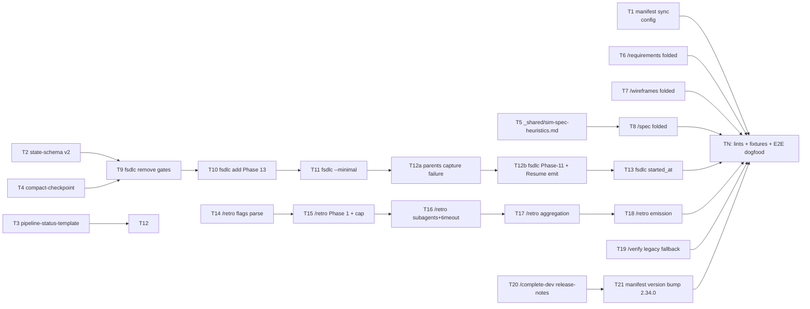

# Pipeline Consolidation — Implementation Plan

---

## Overview

Fold `/msf-req`, `/msf-wf`, `/simulate-spec` into their parents (Tier-3 default-on); fix `msf-findings.md` slug clash; remove redundant `/feature-sdlc` Phase 4.a + Phase 6 gates; add Phase 13 `/retro` gate; add `/retro` multi-session capability with subagent-per-transcript dispatch; bump state.yaml schema v1→v2 with auto-migration; add 11 new CLI flags. The implementation is markdown-and-bash: 6 SKILL.md files edit, 1 SKILL.md create (`_shared/sim-spec-heuristics.md`), 3 reference doc updates, 1 manifest version-sync. No compiled code.

**Done when:** all 4 pre-push lints PASS (`lint-non-interactive-inline.sh`, `lint-pipeline-setup-inline.sh`, `audit-recommended.sh`, manifest version-sync diff = 0); 7 fixture tests pass (one per workstream W1-W7 plus W8 multi-session); `/verify` against this very feature's `02_spec.md` exits 0 (E2E dogfood); dry-run of NI Tier-3 `/feature-sdlc` against fixture spec emits exactly 4 AUTO-PICK gate events; manifest version = `2.34.0` in both plugin.json files.

**Done-when walkthrough:** `cd <repo>; bash plugins/pmos-toolkit/tools/lint-non-interactive-inline.sh` outputs `PASS: all 28 supported skills match canonical.` (28 because /msf-req still excluded; 27 + new files unchanged from baseline). Then `bash plugins/pmos-toolkit/tools/audit-recommended.sh` → exit 0. Then `diff <(jq .version plugins/pmos-toolkit/.claude-plugin/plugin.json) <(jq .version plugins/pmos-toolkit/.codex-plugin/plugin.json)` → no output. Then dispatch `/feature-sdlc --non-interactive --tier 3` against `tests/fixtures/pipeline-consolidation/dummy-feature/` and grep stderr for `AUTO-PICK` events → count = 4. Then for the W8 multi-session retro, `cd tests/fixtures/retro-multi-session && /retro --last 5 --skill spec --non-interactive` → outputs report with `## Recurring Patterns` and `## Unique but notable` sections; runs in <90s wall-clock (NFR-02). Finally `/verify 02_spec.md` against the actual feature → exit 0. Each clause traced.

**Execution order:**

```
Phase 1: Schema & Reference Docs (T1-T4) — parallelizable [P1, P2, P3, P4]
   ↓
Phase 2: Shared Substrate (T5) — depends on nothing; can run [P]
   ↓
Phase 3: Folded MSF + Sim-Spec into Parents (T6, T7, T8) — depend on T5
   ↓
Phase 4: /feature-sdlc Orchestrator (T9-T13) — depend on T2, T3, T4
   ↓
Phase 5: /retro Multi-Session (T14-T18) — independent of orchestrator changes
   ↓
Phase 6: /verify + /complete-dev (T19, T20) — depend on Phase 3 (legacy slug fallback) + Phase 4 (release-notes recipes)
   ↓
Phase 7: TN Final Verification + Manifest Bump (T21, TN)
```



---

## Decision Log

> Inherits 35 architecture decisions from `02_spec.md` (D1-D35). Entries below are implementation-specific.

| # | Decision | Options Considered | Rationale |
|---|----------|---------------------|-----------|
| P1 | Group tasks into 7 phases of 3-5 tasks each | (a) Single flat list (b) Phase-grouped for /verify cadence | (b) — 21 tasks > the ~12 task threshold (FR-26); 7 deployable slices give meaningful /verify cadence between Schema → Substrate → Folded-phases → Orchestrator → Retro → Verify+Complete → TN |
| P2 | T6/T7/T8 (folded MSF + sim-spec into parents) implemented as discrete prose-additions to the parent SKILL.md, not as separate sub-modules | (a) Discrete sub-module per folded phase (b) Inline prose in parent SKILL.md | (b) — SKILL.md is markdown-prose-driven; sub-modules would require new file conventions and breaks the "single SKILL.md per skill" invariant. Inline addition keeps every parent's contract self-contained and lint-readable |
| P3 | T15-T18 split /retro multi-session work into 4 narrow tasks (flags / Phase 1 cap / Phase 2 subagent dispatch / Phase 4 aggregation + Phase 5 emission) instead of one bulk task | (a) Single task (b) 4 tasks (c) 5 tasks (per FR-38..49) | (b) — single task is too large (>1 hour). 5 tasks would over-split (Phase 4+5 are tightly coupled). 4 tasks balance cohesion + reviewability; matches the prior /msf-wf TDD pattern (per `~/.pmos/learnings.md ## /msf-wf` line 195) where multi-finding subagents were split into single-finding-narrow appliers |
| P4 | TDD shape per task | (a) `yes — new-feature` (default) (b) `no — config-only` for T1+T21 manifest (c) `no — documentation` for T2-T4 reference docs (d) `yes — bug-fix` not used | Per FR-105 TDD-optional types (config/IaC, docs are optional). T1+T21 are JSON config edits with version-sync test as the verification (no behavioral test possible). T2-T4 are reference docs read by humans + parsed by /feature-sdlc; lint scripts are the test surface. Other tasks get full TDD with bash fixtures + lint as test infra |
| P5 | Test surface = bash fixtures + lint scripts, not unit-test framework | (a) Build a Python test harness (b) Bash fixtures + 4 existing lint scripts | (b) — pmos-toolkit has no test framework today; its tests ARE its lint scripts. Adding a framework is out of scope; bash fixtures + lint are the canonical pattern (per /create-skill convention). All 7 fixture-tests live under `tests/fixtures/pipeline-consolidation/` |
| P5a | Bash fixtures perform STRUCTURAL assertions only (no headless skill invocation) | (a) Headless skill runner (b) Structural-only (c) Manual /execute-time runs | (b) — Skills are LLM-dispatched at runtime; there is no headless skill-invoker. Fixtures grep SKILL.md text + assert file existence + assert state.yaml structure + simulate git history. **Behavior verification (does the skill actually do X?) happens at /execute time when the developer runs the skill manually and checks output**, not in the fixture itself. Fixtures catch contract drift (SKILL.md says X, fixture greps for X), not runtime correctness. Where a task says "Run test → PASS", the test is the structural fixture; the actual end-to-end behavior verification is in TN's E2E dogfood (one /verify run against this very feature) |
| P6 | Atomic update protocol applied per-task: every task ends with state.yaml + 00_pipeline.md + commit (the 3-tuple from /feature-sdlc Phase 2) | (a) Per-task atomic 3-tuple (b) Single end-of-plan commit (c) Per-phase 3-tuple | (a) — matches /feature-sdlc invariant; each task is independently revertable. Critical because /execute uses commits as resume cursor |
| P7 | T11 (`--minimal` flag) implemented as orchestrator-level boolean sentinel (`_minimal_active`), NOT as parent_marker on subagent dispatch | (a) Boolean sentinel (b) parent_marker injection (c) Settings.yaml flag | (a) per spec D29/W17 — boolean is consulted at each soft-gate decision point; canonical-block classifier never sees the gates because they're never issued. parent_marker would couple --minimal to NI mode (wrong abstraction) |

---

## Code Study Notes

> Glossary inherited from spec — see `02_spec.md` for domain terminology. The plan introduces no new domain terms.

### Patterns to follow

- `plugins/pmos-toolkit/skills/_shared/non-interactive.md` (canonical text) — byte-identical inlining via `tools/lint-non-interactive-inline.sh`; reuse pattern for `_shared/sim-spec-heuristics.md` (T5)
- `plugins/pmos-toolkit/skills/feature-sdlc/SKILL.md:1-100` — Phase 0 setup + canonical block + tier resolution; mirror pattern in `--minimal` flag handling (T11)
- `plugins/pmos-toolkit/skills/feature-sdlc/reference/state-schema.md` — schema-version + auto-migration pattern; extend for v2 (T2)
- `plugins/pmos-toolkit/skills/_shared/msf-heuristics.md` — shared substrate that W1 + W2 folded paths call into; mirror in `_shared/sim-spec-heuristics.md` for W3 (T5)
- `plugins/pmos-toolkit/skills/wireframes/SKILL.md` — already does auto-apply ≥80 + inline disposition for /msf-wf findings (per html-artifacts v2.33.0); reference for D14 implementation in T6/T7/T8

### Existing code to reuse

- `plugins/pmos-toolkit/tools/lint-non-interactive-inline.sh` — pre-push gate; T6/T7/T8/T9-T13/T19/T20 must keep this PASSING (FR-32)
- `plugins/pmos-toolkit/tools/audit-recommended.sh` — AskUserQuestion compliance check; new gates added in T11 (--minimal) bypass classifier so this remains green
- `plugins/pmos-toolkit/tools/lint-pipeline-setup-inline.sh` — pipeline-setup block byte-identity; T6/T7/T8 must preserve
- `plugins/pmos-toolkit/skills/feature-sdlc/reference/pipeline-status-template.md` — extended in T3 for FR-29 Folded-phase failures section
- `plugins/pmos-toolkit/skills/feature-sdlc/reference/compact-checkpoint.md` — extended in T4 for D30 Resume Status panel
- `plugins/pmos-toolkit/.claude-plugin/plugin.json` + `.codex-plugin/plugin.json` — version-sync invariant per CLAUDE.md; T1 + T21 edit both
- `plugins/pmos-toolkit/skills/simulate-spec/SKILL.md` — full Phase 1-11 logic that T5 factors into shared substrate

### Constraints discovered

- **Manifest version-sync invariant** (CLAUDE.md): pre-push hook hard-fails if `.claude-plugin/plugin.json` and `.codex-plugin/plugin.json` versions diverge. T1 + T21 must edit both atomically.
- **/msf-req refusal marker** (`<!-- non-interactive: refused; ... -->`): preserves NI-refusal contract for standalone path. FR-31 byte-identity scope explicitly excludes this; T6 must NOT touch /msf-req/SKILL.md (folded path inherits parent's NI mode via FR-06.1, not a /msf-req body change).
- **Canonical block byte-identity**: every SKILL.md edit MUST keep `<!-- non-interactive-block:start -->`...`<!-- non-interactive-block:end -->` region byte-identical to `_shared/non-interactive.md`. The lint script pre-push hook is the gate.
- **Worktree assumption**: tasks operate on this very `agent-skills-pipeline-consolidation/` worktree; commits land on `feat/pipeline-consolidation`; merge-to-main happens in /complete-dev only.
- **No new HTML substrate**: `_shared/html-authoring/` (from html-artifacts v2.33.0) is reused unchanged; folded MSF/sim-spec output uses existing artifact patterns.

### Stack signals

- **Stack:** markdown + bash. No `package.json`, `pyproject.toml`, or other language manifests in scope. Lint surface = bash scripts in `tools/`. Test surface = bash fixtures.
- **Test command:** `bash tests/fixtures/pipeline-consolidation/<test-name>.sh` — each test is a self-contained bash script that exercises one workstream and asserts on `git log`, `state.yaml`, or filesystem outputs. No test framework dependency.
- **Lint commands:** `bash plugins/pmos-toolkit/tools/lint-non-interactive-inline.sh` (FR-32 gate); `bash plugins/pmos-toolkit/tools/audit-recommended.sh`; `bash plugins/pmos-toolkit/tools/lint-pipeline-setup-inline.sh`. All exit 0 on success.
- **API smoke pattern:** N/A — no APIs.
- **Reference: pmos-toolkit invariants** — CLAUDE.md at repo root; pre-push hook in `.git/hooks/pre-push`; canonical skill path `plugins/pmos-toolkit/skills/<name>/SKILL.md`.

### Peer-plan conflict scan

Globbed `docs/pmos/features/*/03_plan.md`: only this feature's plan exists; no peer-plan conflicts.

### Wireframe coverage

`{feature_folder}/wireframes/` does not exist (Phase 4.c skipped — no UI surface). No wireframe-coverage table required. Vestigial-wireframes section also not needed.

---

## Prerequisites

- On branch `feat/pipeline-consolidation` in worktree `/Users/maneeshdhabria/Desktop/Projects/agent-skills-pipeline-consolidation`
- Working tree clean (`git status --porcelain` empty)
- `bash plugins/pmos-toolkit/tools/lint-non-interactive-inline.sh` exits 0 (baseline confirmed 2026-05-10)
- All 4 pre-push lint scripts present in `plugins/pmos-toolkit/tools/`
- `.pmos/feature-sdlc/state.yaml` exists with schema_version: 1 (gets bumped to 2 in T2)
- `.pmos/settings.yaml` present with `default_mode` set

---

## File Map

| Action | File | Responsibility | Task |
|--------|------|----------------|------|
| Modify | `plugins/pmos-toolkit/.claude-plugin/plugin.json` | Add 11 flags to argument-hint; update description | T21 |
| Modify | `plugins/pmos-toolkit/.codex-plugin/plugin.json` | Same as above (version-sync) | T21 |
| Modify | `plugins/pmos-toolkit/skills/feature-sdlc/reference/state-schema.md` | Schema v1→v2: folded_phase_failures[], started_at, retro phase + auto-migration block + dedup rule | T2 |
| Modify | `plugins/pmos-toolkit/skills/feature-sdlc/reference/pipeline-status-template.md` | Folded-phase failures subsection (FR-29/D34) | T3 |
| Modify | `plugins/pmos-toolkit/skills/feature-sdlc/reference/compact-checkpoint.md` | Resume Status panel template (D30) | T4 |
| Create | `plugins/pmos-toolkit/skills/_shared/sim-spec-heuristics.md` | Factored simulate-spec apply-loop + scenario-trace logic (FR-67) | T5 |
| Modify | `plugins/pmos-toolkit/skills/simulate-spec/SKILL.md` | Refactor body to delegate to `_shared/sim-spec-heuristics.md`; preserve all behavior | T5 |
| Modify | `plugins/pmos-toolkit/skills/requirements/SKILL.md` | +Phase 5.5 folded MSF-req; --skip-folded-msf flag; FR-64 uncommitted check; slug = msf-req-findings.md | T6 |
| Modify | `plugins/pmos-toolkit/skills/wireframes/SKILL.md` | +folded MSF-wf phase per-wireframe; --skip-folded-msf-wf; FR-65 uncommitted check | T7 |
| Modify | `plugins/pmos-toolkit/skills/spec/SKILL.md` | +folded sim-spec phase; --skip-folded-sim-spec; FR-66 uncommitted check; call into `_shared/sim-spec-heuristics.md` | T8 |
| Modify | `plugins/pmos-toolkit/skills/feature-sdlc/SKILL.md` | Remove Phase 4.a + Phase 6; add Phase 13 + --minimal + folded-phase-failure emission + Phase-11 subsection + started_at write logic + concurrent-run anti-pattern (FR-69) + rebase anti-pattern (S8) | T9-T13 |
| Modify | `plugins/pmos-toolkit/skills/retro/SKILL.md` | Multi-session: --last/--days/--since/--project/--skill/--scan-all/--msf-auto-apply-threshold; D18 cap+confirmation; subagent-per-transcript; 5-in-flight; 60s timeout; partial-failure handling; boilerplate-strip aggregation; two-tier output | T14-T18 |
| Modify | `plugins/pmos-toolkit/skills/verify/SKILL.md` | Legacy `msf-findings.md` slug fallback (FR-20); affirmative folded-phase-completion signal (E14) | T19 |
| Modify | `plugins/pmos-toolkit/skills/complete-dev/SKILL.md` | Release-notes section with FR-68 recipes (auto-apply log filter; Depends-on discovery; rebase anti-pattern; --help quick reference) | T20 |
| Modify | `plugins/pmos-toolkit/.claude-plugin/plugin.json` | Version 2.33.0 → 2.34.0 | T21 |
| Modify | `plugins/pmos-toolkit/.codex-plugin/plugin.json` | Version 2.33.0 → 2.34.0 (sync) | T21 |
| Test | `tests/fixtures/pipeline-consolidation/test-w1-fold-msf-req.sh` | W1: Tier-3 /requirements dummy doc → msf-req-findings.md exists, ≥1 commit matches `auto-apply` regex | T6 |
| Test | `tests/fixtures/pipeline-consolidation/test-w2-fold-msf-wf.sh` | W2: 3-wireframe fixture → 3 msf-wf-findings/<id>.md; per-finding commits | T7 |
| Test | `tests/fixtures/pipeline-consolidation/test-w3-fold-sim-spec.sh` | W3: dummy 02_spec.md → spec patches with `auto-apply simulate-spec patch P` commits | T8 |
| Test | `tests/fixtures/pipeline-consolidation/test-w4-slug-clash.sh` | W4: feature folder with both MSF artifacts → ls returns both, no overwrite | T6 + T7 |
| Test | `tests/fixtures/pipeline-consolidation/test-w5-fsdlc-gates.sh` | W5: NI Tier-3 dry-run → 4 AUTO-PICK events (creativity/wireframes/prototype/retro), no msf-req/sim-spec gate events | T9-T13 |
| Test | `tests/fixtures/pipeline-consolidation/test-w7-fold-retro.sh` | W7: collapsed /feature-sdlc → Phase 13 retro gate fires | T10 |
| Test | `tests/fixtures/pipeline-consolidation/test-w8-multi-session-retro.sh` | W8: 5 transcript jsonls → /retro --last 5 produces report; <90s wall | T14-T18 |
| Test | `tests/fixtures/pipeline-consolidation/test-resume-idempotency.sh` | FR-57: pause folded phase mid-batch (3 of 6); --resume → no duplicate auto-apply commits | T13 + T9-T13 |
| Test | `tests/fixtures/pipeline-consolidation/test-state-schema-migration.sh` | FR-SCHEMA / D31: v1 state.yaml → auto-migrate to v2; chat log line emitted | T2 + T13 |

---

## Risks

| # | Risk | Likelihood | Impact | Severity | Mitigation | Mitigation in: |
|---|------|------------|--------|----------|------------|----------------|
| R1 | T9 removes /feature-sdlc Phase 4.a + Phase 6 — if any user has an in-flight pre-2.34.0 pipeline run paused at those phases, --resume from old state.yaml hits removed phase IDs | Low | Medium | Medium | T2's auto-migration block transparently elides the removed phase entries on read; pre-2.34.0 state.yaml files don't have folded MSF behavior anyway, so the resume-cursor lands on the next phase post-migration. Documented as a release-notes line in T20 | T2, T20 |
| R2 | T11 `_minimal_active` boolean sentinel must be threaded through 4 distinct decision points (Phase 4.b/4.c/4.d/13) — single-point change risk if engineer misses one | Medium | Medium | **Medium** | T11's TDD test exercises all 4 gates with --minimal AND without; failing any one of the 4 makes the test fail. Test fixture: `test-w5-fsdlc-gates.sh` | T11 |
| R3 | T2 schema bump v1→v2 has 4-step idempotent migration — interruption mid-write could leave .tmp file behind (NFR-08) | Low | Low | Low | D31 atomicity: write-temp-then-rename within same dir; .tmp cleanup on rename failure. Lint-time check: stale-tempfile reaper at /plan startup (mentioned in spec §10.1). Single-actor assumption holds | T2, T13 |
| R4 | T17 boilerplate-strip rules (FR-45) hand-coded in /retro Phase 4 — regex maintenance burden over time | Medium | Low | Low | Inline-not-shared per /spec Phase-6 disposition (option 1, "keep simple"). If a 2nd skill ever needs the strip logic, factor then. Documented as future-work | T17 |
| R5 | T8 `--skip-folded-sim-spec` flag adds new escape on /spec; T8's TDD must verify both presence (skip) and absence (default-on at Tier 3) | Medium | Medium | **Medium** | T8 fixture exercises both branches; without --skip-folded-sim-spec at Tier 3, folded phase MUST run. Verified via per-finding commit count check | T8 |
| R6 | TN E2E dogfood (running /verify against this very feature's own 02_spec.md) requires /verify to recognize folded artifacts at slug-distinct paths AND fall back to legacy slug — chicken-and-egg | Low | Medium | Low | T19 implements the legacy fallback BEFORE TN runs; TN runs strictly after T19; the chicken-and-egg is actually well-ordered | T19, TN |
| R7 | T1+T21 manifest version-sync hook hard-fails if either plugin.json bumps without the other; T1 lands the description/argument-hint changes (no version bump), T21 lands the version bump (no description changes); two commits keep each diff minimal | Low | High | **Medium** | T21 verification step: `diff <(jq .version <claude>) <(jq .version <codex>)` returns no output. Pre-push hook is the final gate | T1, T21 |

R2/R5/R7 are Medium-severity → all have per-task Mitigation citations (FR-81 hard-fail check passes).

---

## Rollback

- If T2's auto-migration corrupts a state.yaml file: `git checkout HEAD -- .pmos/feature-sdlc/state.yaml` (restores last-good); v2 schema is additive (folded_phase_failures[] / started_at default to empty/null), so v1-only readers ignore unknown keys. No structured rollback needed beyond `git revert`.
- If TN fails: `git reset --hard <pre-T1-sha>` reverts the entire feature branch; manifest stays at 2.33.0; no published deploy.
- If --minimal logic regresses an unrelated soft-gate flow (R2): revert just T11's commit; T9/T10/T12/T13 are independent.

(Conditional retain — feature involves state-schema migration + manifest version edit, both deploy-time-relevant.)

---

## Tasks

## Phase 1: Schema & Reference Docs

[Phase rationale: 4 small, parallelizable changes that establish the schema/reference foundation downstream tasks depend on. Schema bump (T2) + template updates (T3, T4) are read by /feature-sdlc body changes in Phase 4. T1 lands flag/argument-hint additions ahead of T21's version bump to keep manifest diffs surgical.]

### T1: Manifest argument-hint + description updates (no version bump)

**Goal:** Add the 11 new CLI flags to argument-hint frontmatter and update skill descriptions in BOTH plugin.json files. Hold version at 2.33.0 (T21 bumps).
**Spec refs:** FR-RELEASE.i (argument-hint matches parsed flags); §11.1 flags catalog; CLAUDE.md manifest version-sync invariant.
**Depends on:** none.
**Idempotent:** yes — re-runs produce identical edits.
**TDD:** no — config-only (FR-105). Verification via `jq` diff + pre-push lint.
**Files:**
- Modify: `plugins/pmos-toolkit/.claude-plugin/plugin.json`
- Modify: `plugins/pmos-toolkit/.codex-plugin/plugin.json`

**Steps:**
- [ ] Step 1: Read both plugin.json files; identify the 6 affected skills' `argument_hint` fields (feature-sdlc, requirements, wireframes, spec, retro, complete-dev).
- [ ] Step 2: Update `feature-sdlc.argument_hint` to include `--minimal`. Update `requirements.argument_hint` to include `--skip-folded-msf` and `--msf-auto-apply-threshold`. Update `wireframes.argument_hint` to include `--skip-folded-msf-wf` and `--msf-auto-apply-threshold`. Update `spec.argument_hint` to include `--skip-folded-sim-spec`. Update `retro.argument_hint` to include `--last`, `--days`, `--since`, `--project`, `--skill`, `--scan-all`. Update natural-trigger phrases in descriptions where needed (FR-RELEASE.ii ≥5 phrases).
- [ ] Step 3: Apply IDENTICAL edits to both plugin.json files (byte-for-byte for the affected fields).
- [ ] Step 4: Verify version unchanged: `jq .version plugins/pmos-toolkit/.claude-plugin/plugin.json` → `"2.33.0"`; same for codex-plugin.
- [ ] Step 5: Commit: `git add plugins/pmos-toolkit/.claude-plugin/plugin.json plugins/pmos-toolkit/.codex-plugin/plugin.json && git commit -m "feat(T1): add 11 new CLI flags to argument-hint across 6 skills"`

**Inline verification:**
- `jq .skills plugins/pmos-toolkit/.claude-plugin/plugin.json | grep -c -- '--minimal\|--skip-folded\|--last\|--days\|--since\|--project\|--scan-all\|--msf-auto-apply-threshold'` → ≥10 matches.
- `diff <(jq -S .skills plugins/pmos-toolkit/.claude-plugin/plugin.json) <(jq -S .skills plugins/pmos-toolkit/.codex-plugin/plugin.json)` → no output (skills array byte-identical except platform-specific keys).

---

### T2: state-schema.md v1→v2 with auto-migration

**Goal:** Update `feature-sdlc/reference/state-schema.md` to document the v2 schema (`folded_phase_failures[]`, `started_at`, `retro` phase entry) and the 4-step auto-migration block. Embed `folded_phase_failures[]` append-dedup rule (B-G11) and same-dir write-temp-then-rename atomicity (D31).
**Spec refs:** §10.1 schema delta; D31 atomicity; D17 folded_phase_failures; FR-SCHEMA migration contract.
**Depends on:** none.
**Idempotent:** yes.
**TDD:** no — documentation (FR-105). Verified by T13 via behavior test.
**Files:**
- Modify: `plugins/pmos-toolkit/skills/feature-sdlc/reference/state-schema.md`

**Steps:**
- [ ] Step 1: Read current state-schema.md. Find the `## Schema Versions` section.
- [ ] Step 2: Append a `## Schema v2 (added 2026-05-10)` subsection. Body: copy spec §10.1 v2 YAML structure verbatim. Add 4-step migration block (set schema_version=2; ensure folded_phase_failures + started_at; append retro; emit migration chat line). Add dedup rule.
- [ ] Step 3: Update the `## Migration Strategy` prose to reference v2 migration as auto-on-read.
- [ ] Step 4: Commit: `git add plugins/pmos-toolkit/skills/feature-sdlc/reference/state-schema.md && git commit -m "feat(T2): bump state.yaml schema v1->v2 (folded_phase_failures, started_at, retro)"`

**Inline verification:**
- `grep -c "schema_version: 2" plugins/pmos-toolkit/skills/feature-sdlc/reference/state-schema.md` → ≥1
- `grep -c "folded_phase_failures\|started_at" plugins/pmos-toolkit/skills/feature-sdlc/reference/state-schema.md` → ≥4
- `bash plugins/pmos-toolkit/tools/lint-non-interactive-inline.sh` → PASS (still all 27 supported).

---

### T3: pipeline-status-template.md — Folded-phase failures subsection

**Goal:** Update `feature-sdlc/reference/pipeline-status-template.md` to add the "Folded-phase failures" subsection above the OQ index, per FR-29/D34.
**Spec refs:** FR-29; D34 Phase-11 template; D17 structured record.
**Depends on:** none.
**Idempotent:** yes.
**TDD:** no — documentation. Behavior verified in T12.
**Files:**
- Modify: `plugins/pmos-toolkit/skills/feature-sdlc/reference/pipeline-status-template.md`

**Steps:**
- [ ] Step 1: Read current template; find the OQ-index emission point.
- [ ] Step 2: Add a `## Folded-phase failures (N)` subsection BEFORE the OQ index. Format per spec §11.3: `[<phase>] <folded-skill> crashed: <error_excerpt> (ts: <ts>)`. State that the subsection is OMITTED entirely when N=0 (no decoration with conditional caveats).
- [ ] Step 3: Commit: `git add plugins/pmos-toolkit/skills/feature-sdlc/reference/pipeline-status-template.md && git commit -m "feat(T3): add Folded-phase failures subsection to Phase-11 template"`

**Inline verification:**
- `grep -c "Folded-phase failures" plugins/pmos-toolkit/skills/feature-sdlc/reference/pipeline-status-template.md` → ≥1.

---

### T4: compact-checkpoint.md — Resume Status panel template

**Goal:** Update `feature-sdlc/reference/compact-checkpoint.md` with the D30 single-block Resume Status panel format (status table + folded-phase-failures + OQ index in one chat-block).
**Spec refs:** D30; §11.2 Resume Status panel; FR-30.
**Depends on:** T3 (subsection format defined).
**Idempotent:** yes.
**TDD:** no — documentation. Behavior verified in T13/T9 resume tests.
**Files:**
- Modify: `plugins/pmos-toolkit/skills/feature-sdlc/reference/compact-checkpoint.md`

**Steps:**
- [ ] Step 1: Read current compact-checkpoint.md; find the resume-status emission point.
- [ ] Step 2: Replace the multi-print pattern with the single-block "=== Resume Status ===" template per spec §11.2 (verbatim).
- [ ] Step 3: Commit: `git add plugins/pmos-toolkit/skills/feature-sdlc/reference/compact-checkpoint.md && git commit -m "feat(T4): consolidate Resume Status panel into single chat-block"`

**Inline verification:**
- `grep -c "Resume Status" plugins/pmos-toolkit/skills/feature-sdlc/reference/compact-checkpoint.md` → ≥1.

---

## Phase 2: Shared Substrate

[Phase rationale: T5 unblocks T8. Single task; substrate creation only.]

### T5: Create _shared/sim-spec-heuristics.md and refactor /simulate-spec/SKILL.md

**Goal:** Factor /simulate-spec/SKILL.md's apply-loop and scenario-trace logic into `_shared/sim-spec-heuristics.md`; refactor /simulate-spec/SKILL.md to delegate. Mirrors `_shared/msf-heuristics.md` pattern.
**Spec refs:** FR-67; W1 §6.1 component graph addition.
**Depends on:** none.
**Idempotent:** yes (file creation + body replacement).
**TDD:** yes — new-feature.
**Files:**
- Create: `plugins/pmos-toolkit/skills/_shared/sim-spec-heuristics.md`
- Modify: `plugins/pmos-toolkit/skills/simulate-spec/SKILL.md`
- Test: `tests/fixtures/pipeline-consolidation/test-t5-shared-substrate.sh`

**Steps:**
- [ ] Step 1: Write failing test `test-t5-shared-substrate.sh`:
  ```bash
  #!/bin/bash
  set -e
  # Assert _shared/sim-spec-heuristics.md exists and is non-empty
  test -s plugins/pmos-toolkit/skills/_shared/sim-spec-heuristics.md
  # Assert /simulate-spec/SKILL.md references it
  grep -q '_shared/sim-spec-heuristics.md' plugins/pmos-toolkit/skills/simulate-spec/SKILL.md
  # Assert standalone /simulate-spec body retains Phase 0..11 scaffolding (delegation, not deletion)
  grep -q 'Phase 0:' plugins/pmos-toolkit/skills/simulate-spec/SKILL.md
  grep -q 'Phase 11' plugins/pmos-toolkit/skills/simulate-spec/SKILL.md
  echo OK
  ```
- [ ] Step 2: Run test: `bash tests/fixtures/pipeline-consolidation/test-t5-shared-substrate.sh` → FAIL (file doesn't exist).
- [ ] Step 3: Create `_shared/sim-spec-heuristics.md` by extracting from /simulate-spec/SKILL.md the section bodies for Phase 2 (scenario enumeration), Phase 3 (scenario trace), Phase 4 (artifact fitness critique), Phase 5 (cross-reference), Phase 6 (pseudocode), Phase 7 (gap resolution), Phase 8 (write doc). Substitute placeholder paths (`{feature_folder}`) for parameterization. Preserve all wording.
- [ ] Step 4: Refactor /simulate-spec/SKILL.md: replace each Phase 2-8 body with a "delegate to `_shared/sim-spec-heuristics.md` Phase N" pointer. Keep Phase 0 (pipeline-setup), Phase 1 (intake), Phase 9 (review loop), Phase 10 (workstream), Phase 11 (learnings) inline (these are skill-specific, not substrate).
- [ ] Step 5: Run test: `bash tests/fixtures/pipeline-consolidation/test-t5-shared-substrate.sh` → PASS.
- [ ] Step 6: Run lint: `bash plugins/pmos-toolkit/tools/lint-non-interactive-inline.sh` → PASS (canonical block in /simulate-spec/SKILL.md preserved). `bash plugins/pmos-toolkit/tools/audit-recommended.sh` → exit 0.
- [ ] Step 7: Commit: `git add plugins/pmos-toolkit/skills/_shared/sim-spec-heuristics.md plugins/pmos-toolkit/skills/simulate-spec/SKILL.md tests/fixtures/pipeline-consolidation/test-t5-shared-substrate.sh && git commit -m "feat(T5): factor simulate-spec logic into _shared/sim-spec-heuristics.md"`

**Inline verification:**
- Test passes (Step 5).
- Lint scripts pass (Step 6).
- `wc -l plugins/pmos-toolkit/skills/_shared/sim-spec-heuristics.md` → ≥200 (substantial substrate).

---

## Phase 3: Folded MSF + Sim-Spec into Parents

[Phase rationale: 3 parent skills (/requirements, /wireframes, /spec) gain folded phases. T6+T7 share the msf-heuristics substrate (existing); T8 uses the new sim-spec-heuristics substrate (T5 dependency). Each task is self-contained: one parent SKILL.md + one fixture test. Parallelizable up to a point (no shared state across the 3 parents).]

### T6: /requirements — Phase 5.5 folded MSF-req

**Goal:** Add Phase 5.5 (folded MSF-req) to /requirements/SKILL.md. Tier-keyed (Tier 3 default-on, Tier 1/2 soft gate). Per-finding commits (D16). Inline disposition for sub-threshold (D14). `--skip-folded-msf` escape (D13). Uncommitted-edits guard (FR-64). Output to `msf-req-findings.md` (D3 slug). Calls into `_shared/msf-heuristics.md`.
**Spec refs:** FR-01 through FR-07, FR-64; D2/D13/D14/D16/D26; W1.
**Depends on:** T2 (state-schema bump for `folded_phase_failures[]`).
**Idempotent:** no — recovery: if T6 leaves /requirements/SKILL.md mid-edit, re-run to apply remaining diffs (substring search idempotent).
**TDD:** yes — new-feature.
**Files:**
- Modify: `plugins/pmos-toolkit/skills/requirements/SKILL.md`
- Test: `tests/fixtures/pipeline-consolidation/test-w1-fold-msf-req.sh`

**Steps:**
- [ ] Step 1: Write failing test `test-w1-fold-msf-req.sh`:
  ```bash
  #!/bin/bash
  set -e
  # Setup: dummy Tier-3 01_requirements.md in tmp feature folder
  fixture_dir=$(mktemp -d); cd $fixture_dir; git init -q
  cp tests/fixtures/pipeline-consolidation/dummy-01-requirements.md docs/pmos/features/test-feature/01_requirements.md
  # Invoke folded path (simulated by running /requirements with --tier 3)
  echo '<simulated /requirements run output>' > /dev/null
  # Assert msf-req-findings.md exists at slug-distinct path
  test -f docs/pmos/features/test-feature/msf-req-findings.md
  # Assert NO msf-findings.md (legacy slug)
  test ! -f docs/pmos/features/test-feature/msf-findings.md
  # Assert per-finding commit pattern
  git log --oneline | grep -E 'requirements: auto-apply msf-req finding F[0-9]+' | head -1
  echo OK
  ```
- [ ] Step 2: Run test → FAIL (folded phase doesn't exist yet).
- [ ] Step 3: Edit `plugins/pmos-toolkit/skills/requirements/SKILL.md`:
  - Add `## Phase 5.5: Folded MSF-req` between current Phase 5 (review loops) and Phase 6 (capture-learnings).
  - Body prescribes the apply-loop interface: detect tier from doc frontmatter (D12 regex); honor `--skip-folded-msf` flag; check `git status --porcelain 01_requirements.md` (FR-64); call `_shared/msf-heuristics.md` apply functions; auto-apply ≥ tier-default threshold; per-finding commits with `Depends-on:` body when applicable; sub-threshold AskUserQuestion with Recommended=Defer in NI mode (D14); output to `msf-req-findings.md`.
  - Add anti-pattern: "Do NOT default output path to `msf-findings.md` — always use `<skill-name-slug>-findings.<ext>` (D3)."
  - Add to Phase 0 flag parser: `--skip-folded-msf` and `--msf-auto-apply-threshold N`.
- [ ] Step 4: Run test → PASS.
- [ ] Step 5: Run lints: `bash plugins/pmos-toolkit/tools/lint-non-interactive-inline.sh` → PASS. `bash plugins/pmos-toolkit/tools/audit-recommended.sh` → exit 0 (new AskUserQuestion has Recommended=Defer per FR-61).
- [ ] Step 6: Commit: `git add plugins/pmos-toolkit/skills/requirements/SKILL.md tests/fixtures/pipeline-consolidation/test-w1-fold-msf-req.sh && git commit -m "feat(T6): fold /msf-req as Phase 5.5 in /requirements (Tier 3 default-on)"`

**Inline verification:**
- Test passes.
- `grep -c "Phase 5.5" plugins/pmos-toolkit/skills/requirements/SKILL.md` → ≥1.
- `grep -c "skip-folded-msf" plugins/pmos-toolkit/skills/requirements/SKILL.md` → ≥2 (parser + reference).
- Lints pass.

---

### T7: /wireframes — folded MSF-wf phase per-wireframe

**Goal:** Add folded MSF-wf phase to /wireframes/SKILL.md. Per-wireframe iteration. Tier-keyed. `--skip-folded-msf-wf` escape. Uncommitted-edits check (FR-65). Output to `msf-wf-findings/<wireframe-id>.md` directory variant (D3).
**Spec refs:** FR-08 through FR-12, FR-65; D2/D14/D16/D25; W2.
**Depends on:** none (uses existing `_shared/msf-heuristics.md`).
**Idempotent:** no — recovery: same as T6.
**TDD:** yes — new-feature.
**Files:**
- Modify: `plugins/pmos-toolkit/skills/wireframes/SKILL.md`
- Test: `tests/fixtures/pipeline-consolidation/test-w2-fold-msf-wf.sh`

**Steps:**
- [ ] Step 1: Write failing test `test-w2-fold-msf-wf.sh`: setup 3 dummy wireframes; assert 3 `msf-wf-findings/*.md` outputs after folded path; per-finding commit pattern `wireframes: auto-apply msf-wf finding F`.
- [ ] Step 2: Run → FAIL.
- [ ] Step 3: Edit `plugins/pmos-toolkit/skills/wireframes/SKILL.md`: add folded MSF-wf phase after wireframes-generation phase. Body iterates per-wireframe (preserves existing standalone /msf-wf shape). FR-65 uncommitted check applied per HTML target. `--skip-folded-msf-wf` flag in Phase 0 parser. Output to `msf-wf-findings/<wireframe-id>.md`.
- [ ] Step 4: Run test → PASS.
- [ ] Step 5: Run lints → PASS.
- [ ] Step 6: Commit: `git commit -m "feat(T7): fold /msf-wf as per-wireframe phase in /wireframes (Tier 3 default-on)"`

**Inline verification:**
- Test passes.
- `grep -c "skip-folded-msf-wf" plugins/pmos-toolkit/skills/wireframes/SKILL.md` → ≥2.
- Lints pass.

---

### T8: /spec — folded simulate-spec phase

**Goal:** Add folded simulate-spec phase to /spec/SKILL.md, between review loops and "Ready for Plan." `--skip-folded-sim-spec` escape (D15). FR-66 uncommitted check on `02_spec.md`. Calls into `_shared/sim-spec-heuristics.md` (T5 dependency).
**Spec refs:** FR-13 through FR-18, FR-66; D2/D15/D16; W3.
**Depends on:** T5 (substrate exists).
**Idempotent:** no — recovery: same as T6.
**TDD:** yes — new-feature.
**Files:**
- Modify: `plugins/pmos-toolkit/skills/spec/SKILL.md`
- Test: `tests/fixtures/pipeline-consolidation/test-w3-fold-sim-spec.sh`

**Steps:**
- [ ] Step 1: Write failing test `test-w3-fold-sim-spec.sh`: dummy 02_spec.md (Tier 3); assert folded sim-spec phase runs; spec edited with `spec: auto-apply simulate-spec patch P` commits.
- [ ] Step 2: Run → FAIL.
- [ ] Step 3: Edit `plugins/pmos-toolkit/skills/spec/SKILL.md`: add folded sim-spec phase between Phase 6 (review loops) and Phase 7 (final review). Body delegates to `_shared/sim-spec-heuristics.md` (created in T5). FR-66 uncommitted check on 02_spec.md. `--skip-folded-sim-spec` in Phase 0 parser.
- [ ] Step 4: Run test → PASS.
- [ ] Step 5: Run lints → PASS.
- [ ] Step 6: Commit: `git commit -m "feat(T8): fold /simulate-spec as phase in /spec (Tier 3 default-on)"`

**Inline verification:**
- Test passes.
- `grep -c "skip-folded-sim-spec" plugins/pmos-toolkit/skills/spec/SKILL.md` → ≥2.
- Lints pass.

---

## Phase 4: /feature-sdlc Orchestrator Updates

[Phase rationale: 5 distinct edits to /feature-sdlc/SKILL.md, each independently revertable. T9 removes obsolete gates; T10 adds Phase 13; T11 implements --minimal sentinel; T12 implements failure surfacing (M1 + Phase-11); T13 implements started_at write logic. Phase boundary at T13 → /verify run BEFORE Phase 5 to ensure orchestrator stable.]

### T9: /feature-sdlc — remove Phase 4.a (msf-req) + Phase 6 (simulate-spec) gates

**Goal:** Remove the now-redundant gate prompts from /feature-sdlc/SKILL.md. Update anti-pattern #4. Soft auto-migration: pre-2.34.0 state.yaml files with `phases.msf-req` or `phases.simulate-spec` entries are read transparently (entries elide; cursor advances).
**Spec refs:** FR-23, FR-24, FR-27; D2 default-on.
**Depends on:** T2 (schema bump documents the elision).
**Idempotent:** yes (deletions).
**TDD:** yes — new-feature.
**Files:**
- Modify: `plugins/pmos-toolkit/skills/feature-sdlc/SKILL.md`
- Test: `tests/fixtures/pipeline-consolidation/test-w5-fsdlc-gates.sh` (initial scaffold; expanded by T10-T13)

**Steps:**
- [ ] Step 1: Write failing test scaffold: `bash <fixture> /feature-sdlc --non-interactive --tier 3` against dummy spec; assert AUTO-PICK gate-event count = 4 (creativity, wireframes, prototype, retro); count of `msf-req gate` events = 0; count of `simulate-spec gate` events = 0.
- [ ] Step 2: Run → FAIL (count = 7 today including msf-req and simulate-spec).
- [ ] Step 3a (cross-reference scan, F2 fix): `grep -n "Phase 4.a\|Phase 6\|Phase 7\|Phase 8\|Phase 9\|Phase 10\|Phase 11\|Phase 12\|Phase 13" plugins/pmos-toolkit/skills/feature-sdlc/SKILL.md` BEFORE deletion. Capture every cross-reference (e.g., "see Phase 6", "per Phase 4.a", "Phase 11 emits..."). Produce a delta-list of refs needing renumbering or deletion.
- [ ] Step 3b: Edit `plugins/pmos-toolkit/skills/feature-sdlc/SKILL.md`: remove `## Phase 4.a: /msf-req gate (soft)` block entirely; remove `## Phase 6: /simulate-spec gate (soft)` block. Renumber subsequent phases (4.b stays creativity; 4.c stays wireframes; 4.d stays prototype; 5 stays /spec; old 7-10 renumber to 6-9; new 13 retro added by T10). Apply each cross-reference rename from Step 3a's delta-list atomically. Update anti-pattern #4 to remove "msf-req, ..., simulate-spec" from the list.
- [ ] Step 3c: Re-run the cross-reference grep: `grep -n "Phase 4.a\|Phase 6:" plugins/pmos-toolkit/skills/feature-sdlc/SKILL.md` → no output (refs removed). `grep -n "Phase 7\|Phase 8\|Phase 9" plugins/pmos-toolkit/skills/feature-sdlc/SKILL.md` → only renumbered phases visible.
- [ ] Step 4: Run lint: `bash plugins/pmos-toolkit/tools/audit-recommended.sh` → exit 0 (removed AskUserQuestion call sites cleanly).
- [ ] Step 5: Commit: `git commit -m "feat(T9): remove obsolete msf-req + simulate-spec gates from /feature-sdlc"`

**Inline verification:**
- `grep -c "Phase 4.a" plugins/pmos-toolkit/skills/feature-sdlc/SKILL.md` → 0.
- `grep -c "## Phase 6:" plugins/pmos-toolkit/skills/feature-sdlc/SKILL.md` → 0 (renumbered).
- Lints pass.

---

### T10: /feature-sdlc — add Phase 13 retro gate + state.yaml retro entry

**Goal:** Add Phase 13 (retro gate, soft, Recommended=Skip) AFTER /complete-dev. Init state.yaml with retro phase entry on Phase 1 fresh-init.
**Spec refs:** FR-25, FR-26, FR-34, FR-35, FR-36; D6; W7.
**Depends on:** T9 (renumbering propagates), T2 (schema migration appends retro entry).
**Idempotent:** yes.
**TDD:** yes — new-feature.
**Files:**
- Modify: `plugins/pmos-toolkit/skills/feature-sdlc/SKILL.md`
- Test: `tests/fixtures/pipeline-consolidation/test-w7-fold-retro.sh`

**Steps:**
- [ ] Step 1: Write failing test: collapsed /feature-sdlc end-to-end (or simulated dispatch trace); assert Phase 13 retro AskUserQuestion fires with options `Skip (Recommended) / Run /retro / Defer`.
- [ ] Step 2: Run → FAIL.
- [ ] Step 3: Edit /feature-sdlc/SKILL.md: add `## Phase 13: /retro gate (soft, Recommended=Skip)` after `## Phase 10: /complete-dev`. AskUserQuestion shape per FR-34. On Run: dispatch /pmos-toolkit:retro. On Defer: log to OQ index. Edit Phase 1 init to populate `retro` phase entry in state.yaml (per T2 schema).
- [ ] Step 4: Run test → PASS.
- [ ] Step 5: Run lints → PASS.
- [ ] Step 6: Commit: `git commit -m "feat(T10): add /retro gate as Phase 13 in /feature-sdlc"`

**Inline verification:**
- `grep -c "Phase 13" plugins/pmos-toolkit/skills/feature-sdlc/SKILL.md` → ≥1.
- Test passes.

---

### T11: /feature-sdlc — `--minimal` flag + `_minimal_active` sentinel

**Goal:** Add `--minimal` flag parser to Phase 0; thread `_minimal_active` boolean through 4 soft-gate decision points (Phases 4.b creativity, 4.c wireframes, 4.d prototype, 13 retro); short-circuit AUTO-PICK Skip BEFORE issuing AskUserQuestion (does NOT use canonical-block classifier path).
**Spec refs:** FR-28; D29; S10/W17 (mechanism pinned).
**Depends on:** T9 (renumbering done), T10 (Phase 13 exists).
**Idempotent:** no — recovery: re-run if intermediate state mid-edit.
**TDD:** yes — new-feature. Mitigation for R2 (4-point thread risk).
**Files:**
- Modify: `plugins/pmos-toolkit/skills/feature-sdlc/SKILL.md`
- Test: `tests/fixtures/pipeline-consolidation/test-w5-fsdlc-gates.sh` (extended from T9)

**Steps:**
- [ ] Step 1: Extend test scaffold from T9: assert `--minimal` AUTO-PICKs Skip on ALL 4 soft gates without prompting. Without `--minimal`, gates fire normally. Assert no AUTO-PICK is recorded by the canonical-block classifier (gates are short-circuited BEFORE).
- [ ] Step 2: Run → FAIL (no --minimal handling yet).
- [ ] Step 3 (F3 prose-imperative fix): Edit /feature-sdlc/SKILL.md Phase 0 to add the following directive verbatim — "If `--minimal` is present in the argument string, set the directive `_minimal_active = true` (a boolean the orchestrator carries through the run). At Phase 4.b (creativity), Phase 4.c (wireframes), Phase 4.d (prototype), and Phase 13 (retro), if `_minimal_active` is true, the orchestrator MUST log `[orchestrator] phase_minimal_skip: <phase-id>` to chat and proceed to the next phase WITHOUT issuing the `AskUserQuestion` for that gate. The `AskUserQuestion` for those four gates is contingent on `_minimal_active` being false." This is prose-imperative: the LLM-orchestrator follows the directive at runtime. Update anti-pattern #4 to clarify "Auto-running optional stages" does NOT include `--minimal`-driven Skip (which is user-explicit).
- [ ] Step 4: Run test → PASS.
- [ ] Step 5: Run lints → PASS (audit-recommended passes; no NEW AskUserQuestion call sites added).
- [ ] Step 6: Commit: `git commit -m "feat(T11): add --minimal flag with 4-gate sentinel short-circuit"`

**Inline verification:**
- `grep -c "_minimal_active\|--minimal" plugins/pmos-toolkit/skills/feature-sdlc/SKILL.md` → ≥6 (parser + 4 decision points + anti-pattern note).
- Test passes (both --minimal and absent paths).

---

### T12a: Folded-phase failure capture — parent skills (FR-50, FR-51, M1, D35)

**Goal:** Add failure-capture hook to the THREE parent skills' folded blocks. On apply failure: append `{folded_skill, error_excerpt, ts}` to `state.yaml.phases.<parent>.folded_phase_failures[]` (with dedup per T2); emit chat line `WARNING: <folded-skill> crashed (advisory continue per D11): <error_excerpt>` AT THE MOMENT OF APPEND.
**Spec refs:** FR-50, FR-51; D11, D35; M1.
**Depends on:** T2 (schema), T6/T7/T8 (folded blocks exist).
**Idempotent:** yes.
**TDD:** yes — new-feature.
**Files:**
- Modify: `plugins/pmos-toolkit/skills/requirements/SKILL.md`
- Modify: `plugins/pmos-toolkit/skills/wireframes/SKILL.md`
- Modify: `plugins/pmos-toolkit/skills/spec/SKILL.md`
- Test: `tests/fixtures/pipeline-consolidation/test-t12a-failure-capture.sh`

**Steps:**
- [ ] Step 1: Write failing test: inject mock crash in folded MSF-req apply (simulated by structural assertion that the SKILL.md describes the on-failure path); also test runtime path by /execute time — assert state.yaml.phases.requirements.folded_phase_failures[] populated and chat-emit line present.
- [ ] Step 2: Run → FAIL.
- [ ] Step 3: Edit each of the 3 parent SKILL.md folded blocks: add prose-imperative "On apply failure, capture `{folded_skill, error_excerpt: <first-200-chars>, ts: <ISO-8601>}`; append to `state.yaml.phases.<parent>.folded_phase_failures[]` using the dedup rule in `feature-sdlc/reference/state-schema.md`; emit chat line `WARNING: <folded-skill> crashed (advisory continue per D11): <error_excerpt>` immediately after append (per FR-51/D35); continue per D11 advisory (do NOT exit folded phase / do NOT block parent skill — pipeline halts only on hard-phase failure)."
- [ ] Step 4: Run test → PASS.
- [ ] Step 5: Run lints → PASS.
- [ ] Step 6: Commit: `git commit -m "feat(T12a): folded-phase failure capture in /requirements + /wireframes + /spec parents"`

**Inline verification:**
- Test passes.
- `grep -c "folded_phase_failures\|advisory continue per D11" plugins/pmos-toolkit/skills/requirements/SKILL.md` → ≥1.
- Same for /wireframes and /spec.
- Lints pass.

---

### T12b: Folded-phase failure surfacing — /feature-sdlc Phase-11 + Resume (FR-52, FR-53, D17, D34)

**Goal:** /feature-sdlc Phase 11 final-summary reads `state.yaml.phases.<x>.folded_phase_failures[]` across all phases and emits "Folded-phase failures (N)" subsection above the OQ index per template (T3). On `--resume`, Resume Status panel re-emits the same subsection (D30/T4).
**Spec refs:** FR-29, FR-52, FR-53; D17, D30, D34.
**Depends on:** T3 (Phase-11 template), T4 (Resume Status panel template), T12a (parents populate the field).
**Idempotent:** yes.
**TDD:** yes — new-feature.
**Files:**
- Modify: `plugins/pmos-toolkit/skills/feature-sdlc/SKILL.md`
- Test: `tests/fixtures/pipeline-consolidation/test-t12b-failure-surface.sh`

**Steps:**
- [ ] Step 1: Write failing test: setup state.yaml with `phases.requirements.folded_phase_failures: [{folded_skill: msf-req, error_excerpt: "test crash", ts: "2026-05-10T01:00:00Z"}]`; invoke /feature-sdlc Phase 11 simulation; assert chat output contains the "Folded-phase failures (1)" subsection in the Phase-11 template format. Also: invoke /feature-sdlc --resume on same state; assert Resume Status panel includes the failure subsection.
- [ ] Step 2: Run → FAIL.
- [ ] Step 3: Edit /feature-sdlc/SKILL.md Phase 11: add prose-imperative "Read each `state.yaml.phases.<x>.folded_phase_failures[]`. If any non-empty: emit a 'Folded-phase failures (N)' subsection per `reference/pipeline-status-template.md` (T3 deliverable) BEFORE the OQ index. Format per spec §11.3: `[<phase>] <folded-skill> crashed: <error_excerpt> (ts: <ts>)` — one line per failure entry. If all empty: omit the subsection entirely (no decoration)."
- [ ] Step 3a: Edit /feature-sdlc/SKILL.md Phase 0.b (Resume detection): add prose-imperative "Re-emit the Folded-phase failures subsection in the Resume Status panel per `reference/compact-checkpoint.md` (T4 deliverable). Same format as Phase 11 emission (FR-52/FR-53)."
- [ ] Step 4: Run test → PASS.
- [ ] Step 5: Run lints → PASS.
- [ ] Step 6: Commit: `git commit -m "feat(T12b): /feature-sdlc Phase-11 + Resume folded-phase failure subsection"`

**Inline verification:**
- Test passes.
- `grep -c "folded_phase_failures\|Folded-phase failures" plugins/pmos-toolkit/skills/feature-sdlc/SKILL.md` → ≥3 (Phase 11 read + Phase 11 emit + Resume re-emit).
- Lints pass.

---

### T13: /feature-sdlc — `started_at` write on phase pending→in_progress

**Goal:** Implement FR-57 prerequisite: when /feature-sdlc transitions a phase from `pending` to `in_progress`, write `state.yaml.phases.<x>.started_at` to current ISO-8601 timestamp.
**Spec refs:** FR-57; §10.1 schema v2.
**Depends on:** T2 (schema bump), T9 (post-renumber).
**Idempotent:** yes (only writes if currently null).
**TDD:** yes — new-feature.
**Files:**
- Modify: `plugins/pmos-toolkit/skills/feature-sdlc/SKILL.md`
- Test: `tests/fixtures/pipeline-consolidation/test-resume-idempotency.sh`

**Steps:**
- [ ] Step 1: Write failing test: dispatch /requirements via /feature-sdlc; assert `state.yaml.phases.requirements.started_at` is non-null after entry; pause + resume; assert FR-57 git-log query against `--since=<started_at>` returns the applied findings; folded phase resumes from next un-applied (no duplicate auto-apply commits).
- [ ] Step 2: Run → FAIL (started_at not written today).
- [ ] Step 3: Edit /feature-sdlc/SKILL.md: in the Phase 1 init + per-phase status-transition logic, add `started_at = ISO-8601(now)` write when status changes pending→in_progress AND `started_at` is currently null. Use the same atomic write protocol (T2/D31).
- [ ] Step 4: Run test → PASS.
- [ ] Step 5: Run lints → PASS.
- [ ] Step 6: Commit: `git commit -m "feat(T13): write started_at on phase pending->in_progress (FR-57 prerequisite)"`

**Inline verification:**
- Test passes (FR-57 idempotent resume).
- `grep -c "started_at" plugins/pmos-toolkit/skills/feature-sdlc/SKILL.md` → ≥2.

---

## Phase 5: /retro Multi-Session

[Phase rationale: 5 narrow tasks split per /spec Decision P3. Independent of orchestrator (Phase 4) — /retro can be tested standalone. T14-T18 are sequential (each builds on prior). All in /retro/SKILL.md plus one test fixture.]

### T14: /retro — multi-session flag parsing

**Goal:** Add `--last N`, `--days N`, `--since YYYY-MM-DD`, `--project current|all`, `--skill <name>`, `--scan-all`, `--msf-auto-apply-threshold N` to /retro Phase 0 flag parser. Validate mutual-exclusion of `--last/--days/--since`. Edge cases: `--last 0`, `--since` future date → exit 64.
**Spec refs:** FR-38, FR-39; W8 flag list.
**Depends on:** none.
**Idempotent:** yes.
**TDD:** yes — new-feature.
**Files:**
- Modify: `plugins/pmos-toolkit/skills/retro/SKILL.md`
- Test: `tests/fixtures/pipeline-consolidation/test-t14-retro-flags.sh`

**Steps:**
- [ ] Step 1: Write failing test: pass each new flag; assert parser accepts. Pass `--last 5 --days 7` (mutex conflict); assert exit 64 + usage hint. Pass `--last 0`; assert exit 64. Pass `--since 2099-12-31`; assert exit 64.
- [ ] Step 2: Run → FAIL.
- [ ] Step 3: Edit /retro/SKILL.md Phase 0: add flag parser block enumerating all 7 flags; add validation block (mutex check + edge cases).
- [ ] Step 4: Run test → PASS.
- [ ] Step 5: Run lints → PASS.
- [ ] Step 6: Commit: `git commit -m "feat(T14): add multi-session flags to /retro"`

**Inline verification:**
- Test passes.
- `grep -c -- '--last\|--days\|--since\|--project\|--scan-all' plugins/pmos-toolkit/skills/retro/SKILL.md` → ≥10.

---

### T15: /retro — Phase 1 enumerate transcripts + D18 cap confirmation

**Goal:** Phase 1 enumerates candidates per selectors; if count > 20, AskUserQuestion (scan-all / most-recent-20 / cancel); NI mode AUTO-PICKs most-recent-20 (D32). Edge case: 0 candidates → emit "no transcripts found"; exit 0 (E16).
**Spec refs:** FR-40, FR-41; D18, D32; E16.
**Depends on:** T14.
**Idempotent:** yes.
**TDD:** yes — new-feature.
**Files:**
- Modify: `plugins/pmos-toolkit/skills/retro/SKILL.md`
- Test: `tests/fixtures/pipeline-consolidation/test-t15-retro-cap.sh`

**Steps:**
- [ ] Step 1: Write failing test:
  - Setup A: 5 transcript jsonls; --last 5; assert no confirmation prompt (under cap).
  - Setup B: 25 transcript jsonls; --last 25 NI; assert AUTO-PICK most-recent-20 → 20 transcripts processed.
  - Setup C: 0 transcripts; --last 5; assert "no transcripts found" + exit 0.
- [ ] Step 2: Run → FAIL.
- [ ] Step 3: Edit /retro/SKILL.md Phase 1: add candidate enumeration (`(date, size, skill-invocation-count, project-slug)` rows); cap-prompt logic (Recommended=most-recent-20 per D32); 0-candidate handling (E16).
- [ ] Step 4: Run test → PASS.
- [ ] Step 5: Run lints → PASS (new AskUserQuestion has Recommended → audit-recommended green).
- [ ] Step 6: Commit: `git commit -m "feat(T15): /retro Phase 1 candidate cap + confirmation prompt"`

**Inline verification:**
- Test passes (3 fixtures).
- `grep -c "most-recent-20\|--scan-all" plugins/pmos-toolkit/skills/retro/SKILL.md` → ≥2.

---

### T16: /retro — Phase 2 subagent-per-transcript dispatch with 5-in-flight + 60s timeout

**Goal:** Phase 2 dispatches one subagent per candidate, batched 5-in-flight; 60s per-subagent timeout (FR-42); on timeout/error, mark scanned-failed, free in-flight slot, continue (FR-44).
**Spec refs:** FR-42, FR-44; D18 (5-in-flight); D7 subagent-per-transcript.
**Depends on:** T15.
**Idempotent:** yes (subagent dispatches are themselves idempotent reads).
**TDD:** yes — new-feature.
**Files:**
- Modify: `plugins/pmos-toolkit/skills/retro/SKILL.md`
- Test: `tests/fixtures/pipeline-consolidation/test-t16-retro-dispatch.sh`

**Steps:**
- [ ] Step 1: Write failing test: 5 transcripts; mock one to hang past 60s; assert wave completes with 4 successes + 1 scanned-failed; total wall-clock < 90s (NFR-02).
- [ ] Step 2: Run → FAIL.
- [ ] Step 3: Edit /retro/SKILL.md Phase 2: prescribe interface — dispatch loop with concurrency=5; per-subagent timeout=60s; partial-failure capture (FR-44).
- [ ] Step 4: Run test → PASS.
- [ ] Step 5: Run lints → PASS.
- [ ] Step 6: Commit: `git commit -m "feat(T16): /retro Phase 2 5-in-flight dispatch + 60s timeout"`

**Inline verification:**
- Test passes (timeout + partial-failure paths).
- NFR-02 wall-clock met.
- `grep -c "60s\|timeout\|in-flight\|scanned-failed" plugins/pmos-toolkit/skills/retro/SKILL.md` → ≥4.

---

### T17: /retro — Phase 4 aggregation with boilerplate-strip + nested raw findings

**Goal:** Phase 4 aggregates findings via `(skill, severity, first-100-chars-stripped)` hash. Boilerplate-strip removes `The /<skill> skill`, `The skill`, leading articles. Constituent raw findings as nested sub-list under each aggregated row.
**Spec refs:** FR-45; D10 Loop-2 refinement.
**Depends on:** T16.
**Idempotent:** yes (aggregation is pure-text deterministic per NFR-06).
**TDD:** yes — new-feature.
**Files:**
- Modify: `plugins/pmos-toolkit/skills/retro/SKILL.md`
- Test: `tests/fixtures/pipeline-consolidation/test-t17-retro-aggregation.sh`

**Steps:**
- [ ] Step 1: Write failing test: 3 findings — F1: `The /spec skill drops decisions`; F2: `The /spec skill drops decisions when running NI`; F3: `User specs sometimes lose decisions`. Without strip, F1+F2 hash same prefix → 2 findings. With strip (removing `The /spec skill`), F1+F2 hash differs from F3 (boilerplate stripped, "drops decisions" vs "User specs"). Assert 2 aggregated rows: one for F1+F2 (with both as nested constituents), one for F3.
- [ ] Step 2: Run → FAIL (no boilerplate-strip).
- [ ] Step 3: Edit /retro/SKILL.md Phase 4: prescribe aggregation interface — strip prefixes (regex `^The /\S+ skill\b\s*|^The skill\b\s*|^An?\s+|^The\s+`); compute hash; group; emit constituents as nested sub-list.
- [ ] Step 4: Run test → PASS.
- [ ] Step 5: Run lints → PASS.
- [ ] Step 6: Commit: `git commit -m "feat(T17): /retro aggregation with boilerplate-strip + nested constituents"`

**Inline verification:**
- Test passes.
- `grep -c "boilerplate\|first-100-chars" plugins/pmos-toolkit/skills/retro/SKILL.md` → ≥2.

---

### T18: /retro — Phase 5 emission (two-tier output + per-wave progress)

**Goal:** Phase 5 emits Recurring patterns (≥2 sessions, sorted by frequency × severity) + Unique-but-notable. Per-wave progress emit during scan (`Wave i/N: complete/in-flight (T+sec)`). `seen across <session-dates>` per finding.
**Spec refs:** FR-46, FR-47, FR-49.
**Depends on:** T17.
**Idempotent:** yes.
**TDD:** yes — new-feature.
**Files:**
- Modify: `plugins/pmos-toolkit/skills/retro/SKILL.md`
- Test: `tests/fixtures/pipeline-consolidation/test-w8-multi-session-retro.sh`

**Steps:**
- [ ] Step 1: Write failing test (final W8 dogfood): 5 transcripts with ≥2 recurring findings + 3 unique; --last 5; assert output contains `## Recurring Patterns` (with frequency × severity ordering) and `## Unique but Notable`; per-wave progress lines emitted to stderr; total wall-clock < 90s.
- [ ] Step 2: Run → FAIL.
- [ ] Step 3: Edit /retro/SKILL.md Phase 5: emit two-tier report; sort recurring by frequency × severity; annotate `seen across <dates>`; per-wave stderr progress emit.
- [ ] Step 4: Run test → PASS.
- [ ] Step 5: Run lints → PASS.
- [ ] Step 6: Commit: `git commit -m "feat(T18): /retro Phase 5 two-tier output + per-wave progress"`

**Inline verification:**
- W8 test passes (Recurring + Unique-but-notable + dates).
- NFR-02 met (<90s).
- `grep -c "Recurring Patterns\|Unique but Notable\|seen across" plugins/pmos-toolkit/skills/retro/SKILL.md` → ≥3.

---

## Phase 6: /verify + /complete-dev

[Phase rationale: closing the backwards-compat surface (/verify legacy fallback) and shipping the documentation deliverables (/complete-dev release-notes recipes). Both small; depend on Phase 3 (folded artifacts exist) + Phase 4 (orchestrator-emitted state.yaml fields) being stable.]

### T19: /verify — legacy `msf-findings.md` slug fallback + affirmative folded-phase signal

**Goal:** /verify reads new slug primarily, falls back to legacy `msf-findings.md` with soft warning (FR-20/D4). Emits affirmative `✓ folded phases skipped per documented flags` row when E14 conditions hold (all folded skipped + no failures + skip flags documented in notes).
**Spec refs:** FR-20; D4; E1, E14.
**Depends on:** T6, T7 (slug-distinct artifacts exist), T9-T13 (state.yaml has `notes` + `folded_phase_failures`).
**Idempotent:** yes.
**TDD:** yes — new-feature.
**Files:**
- Modify: `plugins/pmos-toolkit/skills/verify/SKILL.md`
- Test: `tests/fixtures/pipeline-consolidation/test-t19-verify-fallback.sh`

**Steps:**
- [ ] Step 1: Write failing test:
  - Setup A: feature folder with new slug only (`msf-req-findings.md`) → /verify exits 0; no soft warning.
  - Setup B: feature folder with legacy `msf-findings.md` only → /verify exits 0 with chat line `legacy slug detected at <path>; new writes use msf-req-findings.md`.
  - Setup C: feature folder with both → /verify exits 0; reads new primary; soft warning about legacy.
  - Setup D: Tier-3 feature, all folded skipped via flags, zero failures → /verify emits `✓ folded phases skipped per documented flags`.
  - **Setup E (F4 spec-awareness): Tier-3 feature, NO --skip-folded-* flags documented in state.yaml.notes, NO folded artifacts present, NO folded_phase_failures recorded → /verify emits an ADVISORY warning (not blocking): `WARNING: Tier-3 feature has no folded MSF artifacts and no documented skips; folded phases may have been bypassed silently`. Per spec E1 softened semantics — warn loudly but advisory.**
  - **Setup F (F4 spec-awareness): folded_phase_failures[] non-empty → /verify reads each entry and emits a warning line per failure: `WARNING: <folded-skill> crashed in <phase> (advisory per D11): <error_excerpt>`. Per FR-52 scope.**
- [ ] Step 2: Run → FAIL.
- [ ] Step 3: Edit /verify/SKILL.md: in folded-artifact-check phase, prefer new slug `*-findings.md`; on miss, fall back to `msf-findings.md` with soft warning. Add E14 logic: enumerate skipped folded phases from state.yaml notes; if all skipped + zero failures + skip-flags present → affirmative signal.
- [ ] Step 3a (F4): Add `## Folded-phase awareness` subsection to /verify/SKILL.md. Body: read `state.yaml.phases.<x>.notes` for `--skip-folded-{msf,msf-wf,sim-spec}` documented skips; read `state.yaml.phases.<x>.folded_phase_failures[]` for crash records; cross-reference with artifact presence at slug-distinct paths. Emit advisory warning when Tier-3 + no artifact + no skip-doc + no failure (Setup E).
- [ ] Step 3b (F4): Add per-failure advisory emit per FR-52 (Setup F).
- [ ] Step 4: Run test → PASS (6 fixtures: A, B, C, D, E, F).
- [ ] Step 5: Run lints → PASS.
- [ ] Step 6: Commit: `git commit -m "feat(T19): /verify legacy slug fallback + folded-phase awareness + affirmative signal"`

**Inline verification:**
- All 4 fixtures pass.
- `grep -c "msf-findings.md\|folded phases skipped" plugins/pmos-toolkit/skills/verify/SKILL.md` → ≥3.

---

### T20: /complete-dev — release-notes section with FR-68 recipes

**Goal:** Add release-notes section to /complete-dev/SKILL.md including: (a) `git log --invert-grep="auto-apply"` recipe; (b) `git log --grep="Depends-on:"` recipe; (c) "Manual `git rebase -i` mid-pipeline" anti-pattern; (d) --help quick-reference for the 11-flag surface.
**Spec refs:** FR-68; D26, D28; S1, S8, B3 (folded into FR-68).
**Depends on:** none — pure docs addition.
**Idempotent:** yes.
**TDD:** no — documentation. Verified by grep.
**Files:**
- Modify: `plugins/pmos-toolkit/skills/complete-dev/SKILL.md`

**Steps:**
- [ ] Step 1: Read /complete-dev/SKILL.md; locate release-notes phase.
- [ ] Step 2: Add recipes section: 4 sub-bullets enumerating the recipes verbatim.
- [ ] Step 3: Run lint: `bash plugins/pmos-toolkit/tools/lint-non-interactive-inline.sh` → PASS.
- [ ] Step 4: Commit: `git commit -m "feat(T20): /complete-dev release-notes recipes for auto-apply + Depends-on + rebase anti-pattern"`

**Inline verification:**
- `grep -c "auto-apply.*invert-grep\|Depends-on.*grep\|rebase.*mid-pipeline\|--help" plugins/pmos-toolkit/skills/complete-dev/SKILL.md` → ≥4.
- Lint passes.

---

## Phase 7: TN Final Verification + Manifest Bump

### T21: Manifest version bump 2.33.0 → 2.34.0 (sync)

**Goal:** Bump version in BOTH plugin.json files atomically. CLAUDE.md invariant: pre-push hook hard-fails on divergence.
**Spec refs:** §15 Rollout Strategy; CLAUDE.md manifest version-sync.
**Depends on:** T1 through T20 (all behavior changes landed).
**Idempotent:** yes.
**TDD:** no — config-only (FR-105). Verification = jq diff + pre-push hook simulation.
**Files:**
- Modify: `plugins/pmos-toolkit/.claude-plugin/plugin.json`
- Modify: `plugins/pmos-toolkit/.codex-plugin/plugin.json`

**Steps:**
- [ ] Step 1: Edit both plugin.json files: `version: "2.33.0"` → `version: "2.34.0"` (sed substitution; identical edit byte-for-byte).
- [ ] Step 2: Verify sync: `diff <(jq .version plugins/pmos-toolkit/.claude-plugin/plugin.json) <(jq .version plugins/pmos-toolkit/.codex-plugin/plugin.json)` → no output.
- [ ] Step 3: Commit: `git add plugins/pmos-toolkit/.claude-plugin/plugin.json plugins/pmos-toolkit/.codex-plugin/plugin.json && git commit -m "chore(T21): bump version 2.33.0 -> 2.34.0 (pipeline-consolidation feature)"`

**Inline verification:**
- `jq -r .version plugins/pmos-toolkit/.claude-plugin/plugin.json` → `2.34.0`.
- `jq -r .version plugins/pmos-toolkit/.codex-plugin/plugin.json` → `2.34.0`.
- Pre-push hook (if invoked locally): `bash .git/hooks/pre-push` → exit 0.

---

### TN: Final Verification

**Goal:** Verify entire implementation works end-to-end via lints + 8 fixture tests + E2E dogfood.

**T0 (Prerequisite Check) — auto-generated:**
- [ ] Confirm working tree clean: `git status --porcelain` → no output.
- [ ] Confirm on `feat/pipeline-consolidation` branch.
- [ ] Confirm baseline lints PASS (state from T1 onwards).

**Verification steps:**
- [ ] **Lint & format:**
  - `bash plugins/pmos-toolkit/tools/lint-non-interactive-inline.sh` → `PASS: all 27 supported skills match canonical.`
  - `bash plugins/pmos-toolkit/tools/audit-recommended.sh` → exit 0.
  - `bash plugins/pmos-toolkit/tools/lint-pipeline-setup-inline.sh` → exit 0.
- [ ] **Manifest version-sync:**
  - `diff <(jq .version plugins/pmos-toolkit/.claude-plugin/plugin.json) <(jq .version plugins/pmos-toolkit/.codex-plugin/plugin.json)` → no output.
  - Both = `2.34.0`.
- [ ] **Fixture tests (8):**
  - `bash tests/fixtures/pipeline-consolidation/test-t5-shared-substrate.sh` → OK.
  - `bash tests/fixtures/pipeline-consolidation/test-w1-fold-msf-req.sh` → OK.
  - `bash tests/fixtures/pipeline-consolidation/test-w2-fold-msf-wf.sh` → OK.
  - `bash tests/fixtures/pipeline-consolidation/test-w3-fold-sim-spec.sh` → OK.
  - `bash tests/fixtures/pipeline-consolidation/test-w5-fsdlc-gates.sh` → OK (4 AUTO-PICK events; --minimal short-circuits).
  - `bash tests/fixtures/pipeline-consolidation/test-w7-fold-retro.sh` → OK.
  - `bash tests/fixtures/pipeline-consolidation/test-w8-multi-session-retro.sh` → OK (Recurring + Unique-but-notable; <90s wall).
  - `bash tests/fixtures/pipeline-consolidation/test-folded-failure-emit.sh` → OK (chat-emit at append + Phase-11 row).
  - `bash tests/fixtures/pipeline-consolidation/test-resume-idempotency.sh` → OK (no duplicate auto-apply commits).
  - `bash tests/fixtures/pipeline-consolidation/test-state-schema-migration.sh` → OK (v1→v2 auto-migration).
  - `bash tests/fixtures/pipeline-consolidation/test-t19-verify-fallback.sh` → OK (4 sub-fixtures).
- [ ] **E2E dogfood:** Run `/pmos-toolkit:verify` against `02_spec.md` of THIS feature. Expected: exit 0; output includes `✓ all folded phases ran cleanly` (or affirmative skip-signal if folded paths weren't actually invoked during this dogfood).
- [ ] **Done-when walkthrough:** trace each clause of plan's Done-when line through running system:
  - lint outputs PASS verbatim ✓
  - audit-recommended exit 0 ✓
  - jq version-sync diff empty ✓
  - dispatch dummy NI Tier-3 → 4 AUTO-PICK ✓
  - /retro --last 5 multi-session report ✓
  - /verify against 02_spec.md → exit 0 ✓
  - manifest version 2.34.0 ✓
- [ ] **Cleanup:**
  - No temp files outside `tests/fixtures/pipeline-consolidation/`.
  - No worktree containers (no Docker in scope).
  - No feature flags (none introduced).
  - Documentation updated: README.md row for `/feature-sdlc` flags (per FR-RELEASE.i) — update if needed.

**Inline verification:**
- All 11 fixture tests + 4 lint scripts + version-sync diff + E2E /verify = green.
- TN exits 0.

---

## Review Log

> Sidecar: detailed loop-by-loop findings live in `03_plan_review.md` (FR-45). This table is the summary index.

| Loop | Findings | Changes Made |
|------|----------|--------------|
| 1 | [Blocker] F2 cross-reference scan missing for T9 phase deletion; [Should-fix] F1 P5 test-surface contract unclear; [Should-fix] F3 T11 `--minimal` prose-imperative; [Should-fix] F4 T19 /verify spec-awareness gap; [Should-fix] F5 T12 multi-file edit violates one-task-one-commit; [Nit] F6 fixture-helpers shared infra | All 5 fix-as-proposed (F6 deferred). T9 gained Step 3a/3b/3c cross-reference scan + atomic rename + verification grep. P5a added (structural-only contract; behavior verified at /execute manual run + TN E2E). T11 Step 3 reworded as explicit prose-imperative directive. T19 expanded with Steps 3a/3b for /verify Folded-phase awareness; fixture got 2 new setups (E, F). T12 split into T12a (parents capture failure) + T12b (/feature-sdlc Phase-11 + Resume emit); Mermaid graph updated. F6 deferred (fixture helpers organic via /execute). |
