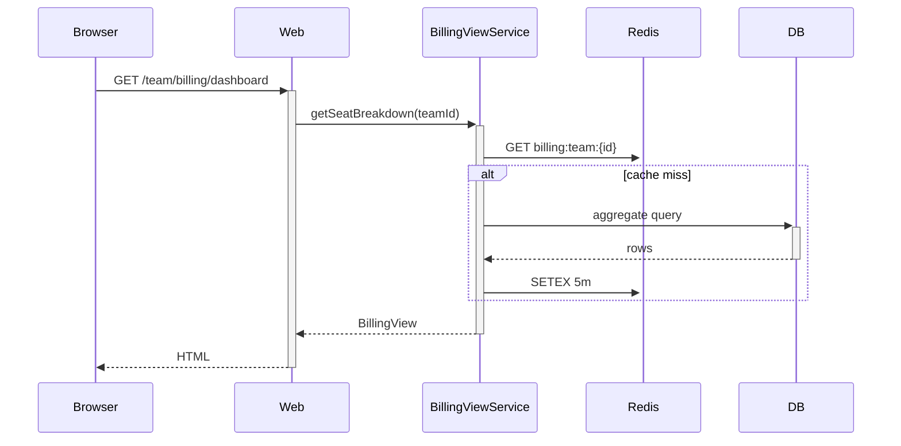

# Team Billing Dashboard — Spec {#team-billing-dashboard-spec}

---

## 1. Problem Statement {#problem-statement}

Team admins currently cannot see how their seat allocation breaks down by member or by project. Support tickets asking "which user is using what" have grown to 8% of inbound volume. Primary success metric: 60% reduction in seat-allocation tickets within 60 days of launch.

---

## 2. Goals {#goals}

| # | Goal | Success Metric |
|---|------|---------------|
| G1 | Self-serve view of seat usage by member | 60% reduction in seat-allocation support tickets in 60 days |
| G2 | Per-project billing breakdown | Adoption: ≥40% of teams view the dashboard monthly |
| G3 | Settings panel for billing contacts | ≥80% of teams populate a billing contact within 30 days |

---

## 3. Non-Goals {#non-goals}

- We will not introduce a new billing API surface — read-only views over the existing billing service.
- No invoicing / PDF export in v1 — follow-up scope.
- No team-creation flow changes in this scope.

---

## 4. Decision Log {#decision-log}

| # | Decision | Options Considered | Rationale |
|---|----------|-------------------|-----------|
| D1 | Server-side rendering with progressive enhancement | (a) SSR + JS, (b) full SPA, (c) SSR-only | (a) keeps first-paint fast; SPA's bundle cost is unjustified for 2 screens |
| D2 | Cache billing aggregates for 5 minutes | (a) live, (b) 5-min cache, (c) hourly | (b) absorbs the read load without making numbers feel stale to admins |
| D3 | Authorize via existing `team:admin` role | (a) reuse `team:admin`, (b) new `billing:read` permission | (a) ships v1 without a permission migration; (b) is a follow-up if scope grows |

---

## 5. User Personas & Journeys {#user-personas-and-journeys}

### 5.1 Team Admin (primary) {#team-admin-primary}

Context: typically the customer's IT or finance lead. Visits billing infrequently (monthly) so the UI must be self-explanatory.

### 5.2 User Journey: Seat-allocation review {#user-journey-seat-allocation-review}

Admin lands on the dashboard, scans the seat-by-member table, drills into a member to see project assignments, optionally clicks "Settings" to update the billing contact.

---

## 6. System Design {#system-design}

### 6.1 Architecture Overview {#architecture-overview}

Two new SSR routes (`/team/billing/dashboard`, `/team/billing/settings`) backed by a new `BillingViewService` that aggregates over `seats`, `projects`, and `members` tables. Aggregate cache lives in Redis.

### 6.2 Sequence Diagrams {#sequence-diagrams}



---

## 7. Functional Requirements {#functional-requirements}

### 7.1 Dashboard route {#dashboard-route}

| ID | Requirement |
|----|-------------|
| FR-01 | `/team/billing/dashboard` renders the seat-by-member table; see `wireframes/01_dashboard.html` for layout |
| FR-02 | Each row shows member name, role, seat type, project assignments count |
| FR-03 | Pagination at 50 rows per page; URL-driven (`?page=2`) |

### 7.2 Settings route {#settings-route}

| ID | Requirement |
|----|-------------|
| FR-04 | `/team/billing/settings` renders the billing-contact form; see `wireframes/02_settings.html` for layout |
| FR-05 | Form persists `billing_contact_email` and `billing_contact_name` on the `teams` row |
| FR-06 | Email field validates RFC 5322; non-conforming values reject with inline error |

### 7.3 Authorization {#authorization}

| ID | Requirement |
|----|-------------|
| FR-07 | Both routes require `team:admin` role; non-admins receive 403 with the existing forbidden page |
| FR-08 | Audit-log every successful view of the dashboard (`event = billing.dashboard.view`, payload includes team_id and viewer_id) |

---

## 8. Non-Functional Requirements {#non-functional-requirements}

| ID | Requirement |
|----|-------------|
| NFR-01 | Dashboard p95 render time < 800ms with cache warm |
| NFR-02 | Settings save round-trip p95 < 600ms |
| NFR-03 | Cache TTL 5 minutes; cache miss adds ≤ 200ms over warm-cache |

---

## 9. API Changes {#api-changes}

No public API changes. Internal RPC `BillingViewService.getSeatBreakdown(teamId, page)` returns:

```json
{
  "members": [{"id": "u_1", "name": "...", "role": "admin", "seat_type": "premium", "projects": 3}],
  "page": {"current": 1, "size": 50, "total": 187}
}
```

Errors: `{"error": {"code": "team_not_found"}}` (404), `{"error": {"code": "forbidden"}}` (403).

---

## 10. DB Schema {#db-schema}

```sql
ALTER TABLE teams
  ADD COLUMN billing_contact_email TEXT,
  ADD COLUMN billing_contact_name TEXT;

CREATE INDEX idx_seats_team_id_member_id ON seats(team_id, member_id);
```

Migration order: alter teams (additive, online), backfill leaves columns NULL, index creation `CONCURRENTLY` to avoid lock.

---

## 11. Frontend Design {#frontend-design}

Component hierarchy (see `wireframes/01_dashboard.html` and `wireframes/02_settings.html` for layout reference):

- `<BillingDashboard>` — wraps the table; SSR-rendered with progressive enhancement on row hover.
- `<MemberRow>` — single row; accepts `member` props.
- `<BillingSettingsForm>` — form on the settings route; client-side validation enhances SSR-rendered base form.

State: server-rendered; client-only state limited to form-control validation messages.

Interactions: row hover reveals "View Projects" button (no-JS fallback: row links directly to `/team/members/<id>/projects`).

---

## 12. Edge Cases {#edge-cases}

| # | Scenario | Condition | Expected Behavior |
|---|----------|-----------|-------------------|
| E1 | Team with 0 members | New team with seats=0 | Render empty-state copy, not a blank table |
| E2 | Cache stampede | 100 concurrent requests cache miss | Single-flight aggregate query; remaining requests block on the in-flight result |
| E3 | Forbidden viewer | non-admin hits `/team/billing/dashboard` | 403 forbidden page |
| E4 | Stale data after invite | New member added <5min ago | Member appears within 5min (cache TTL) |

---

## 13. Open Questions {#open-questions}

(none)

---

## 14. Verification Plan {#verification-plan}

- Integration test: seed 5 members, render dashboard, assert all 5 rows appear in HTML.
- Integration test: hit settings route as non-admin, assert 403.
- Cache test: warm cache, time second request < first - 100ms.
- Run: `pytest tests/billing/ -v` and `npm run test -- billing`.

---

## 15. Rollout Strategy {#rollout-strategy}

Feature flag `billing_dashboard_v1` defaults off. Enable for internal admins first, then 10% of paying teams, then 100% over 5 days. Rollback: flip flag off — routes 404 for non-allowlisted teams.

---

## 16. Research Sources {#research-sources}

| Source | Type | Key Takeaway |
|--------|------|-------------|
| `BillingService.go:142` | Existing code | Existing aggregate query is per-member; reuse it |
| `wireframes/01_dashboard.html` | UI reference | Layout for the dashboard table |
| `wireframes/02_settings.html` | UI reference | Layout for the settings form |
